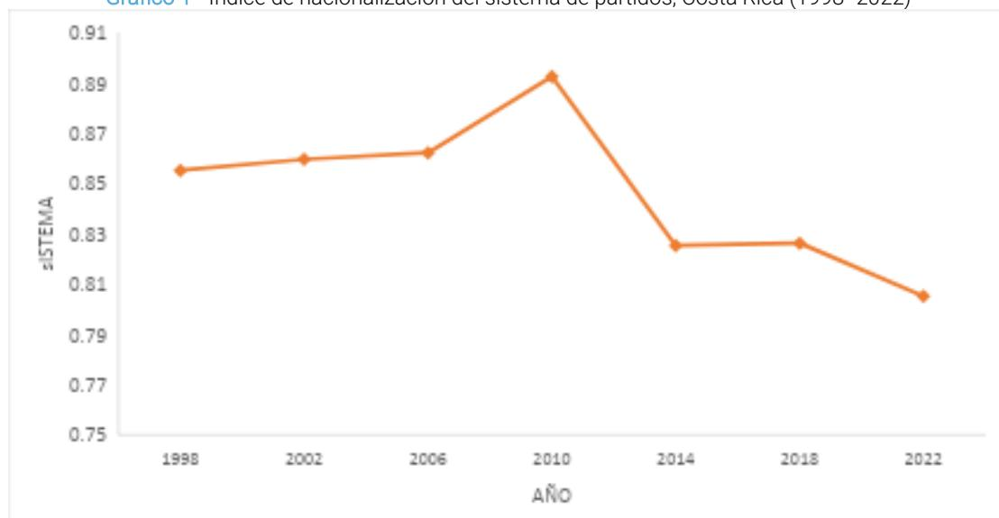
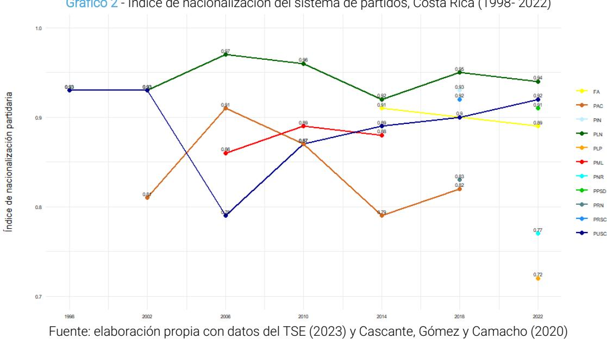
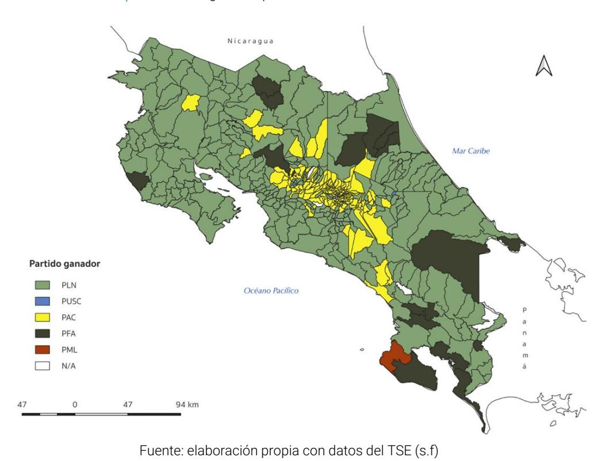
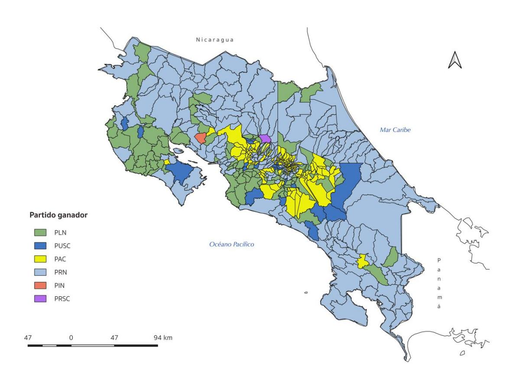
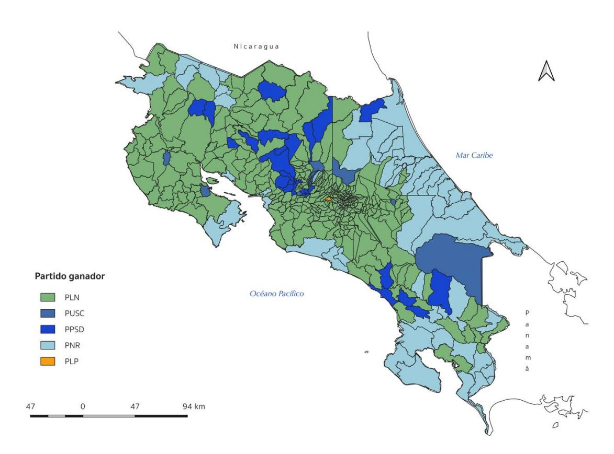

# PARTIDOS CON O SIN BASE TERRITORIAL EN COSTA RICA: ANÁLISIS DE LA DISTRIBUCIÓN GEOGRÁFICA DE LOS APOYOS PARTIDARIOS 1998 AL 2022[1](#page-0-0)

**Sharon Camacho Sánche[z](#page-0-1)**2

Universidad de Costa Rica (UCR) San Pedro, Costa Rica

**Resumen:** Este articulo realiza un análisis de las bases territoriales de los partidos políticos en Costa Rica utilizando el índice de nacionalización del sistema de partidos y de cartografía electoral para las últimas tres elecciones nacionales (2014, 2018 y 2022). El trabajo confirma que la nacionalización de los partidos políticos sigue una tendencia a la baja y que estas agrupaciones están enfrentando limitaciones para constituirse como estructuras partidarias consistentes y consolidar sus bases territoriales. No obstante, la dinámica volátil en los apoyos partidarios hace que el territorio y los pesos electorales sean elementos cruciales en el desenlace de los resultados electorales.

**Palabras clave:** base territorial, territorio, elecciones, partidos políticos, nacionalización.

#### **PARTIES WITH AND WITHOUT A TERRITORIAL BASE IN COSTA RICA: ANALYSIS OF THE GEOGRAPHIC DISTRIBUTION OF PARTY SUPPORT 1998 TO 2022**

**Abstract:** This article analyzes the territorial bases of political parties in Costa Rica using the nationalization index of the party system and electoral mapping from the last three national elections (2014, 2018, and 2022). The study confirms that the nationalization of political parties is on a downward trend and that these groups are struggling to establish as consistent party structures and consolidate their territorial bases. Nevertheless, the volatile dynamics of party support make territory and electoral weights some of the most important elements in the outcome of electoral results.

**Keywords**: territorial base, territory, elections, political parties, nationalization.

#### **PARTIDOS COM OU SEM BASE TERRITORIAL NA COSTA RICA: ANÁLISE DA DISTRIBUIÇÃO GEOGRÁFICA DOS APOIOS PARTIDÁRIOS DE 1998 A 2022**

**Resumo:** Este artigo realiza uma análise das bases territoriais dos partidos políticos na Costa Rica, utilizando o índice de nacionalização do sistema partidário e a cartografia eleitoral para as três últimas eleições nacionais (2014, 2018 e 2022). O estudo confirma que a nacionalização dos partidos políticos segue uma tendência de queda e que essas agremiações enfrentam dificuldades para se estabelecer como estruturas partidárias consistentes e consolidar suas bases territoriais. No entanto, a dinâmica volátil dos apoios partidários torna o território e os pesos eleitorais elementos cruciais para o desfecho dos resultados eleitorais.

**Palavras-chave:** base territorial, território, eleições, partidos políticos, nacionalização.

#### Introducción

En Costa Rica, el sistema de partidos ha experimentado un proceso de transformación al pasar de un sistema bipartidista a uno multipartidista, derivado de la alineación de fuerzas históricas y la entrada de nuevas opciones político partidarias (Barragán & Chavarría, 2023). Este proceso se materializó en la elección del 2002, tras lo cual el sistema de partidos costarricense ha estado en un proceso de reconfiguración que aún persiste (Barragán & Chavarría, 2023). Estos cambios también se han reflejado en el éxito territorial de algunos partidos políticos, modificando los mapas electorales conocidos hasta inicios de los años 2000 en el país.

Durante el periodo bipartidista, en las décadas de 1980 y 1990 Costa Rica se caracterizó por índices de nacionalización altos, es decir, partidos que obtenían votos en todo el territorio nacional con porcentajes equiparables entre todas sus provincia[s](#page-1-0)3 (Cascante, Gómez y Camacho 2020). El Partido Liberación Nacional (PLN) y el Partido Unidad Social Cristiana (PUSC) alcanzaban apoyos distribuidos en todo el país con índices de 0,9. Sin embargo, a partir del 2002 (primera vez que hubo balotaje en Costa Rica), el mapa electoral empezó a fragmentarse debido a la aparición de fuerzas políticas como el Partido Acción Ciudadana (PAC), el Partido Movimiento Libertario (PML) y el Partido Frente Amplio (PFA), cuyos índices de nacionalización en pocas ocasiones han alcanzado valores de 0,9.

En las elecciones de 2014 y 2018 se observaron contrastes importantes, con la especialización de algunas agrupaciones políticas en regiones con características particulares, según el índice de nacionalización (Cascante, Gómez y Camacho 2020). Por ejemplo, el PAC se concentró especialmente en cantones de la provincia San José, en el centro del país. En contraste, otros partidos que ganaron fuerza en las elecciones presidenciales del 2018, como Restauración Nacional (PRN), se afianzaron en las zonas costeras y fronterizas, desplazando a partidos más de corte "histórico", como el PLN, que tuvo que competir en las periferias del país con las demás agrupaciones políticas (Camacho, 2021).

Dada la importancia del territorio en los resultados electorales, el éxito de partidos como el PAC o el PRN en el 2014 y el 2018 evidenció que en Costa Rica se puede ganar una elección nacional, o pasar a una segunda ronda, con el apoyo exclusivo del Gran Área Metropolitana (GAM) —en el caso del PAC— o de la periferia costera y fronteriza —en el caso del PRN— (Cascante, Gómez y Camacho 2020). Por lo tanto, este trabajo propone una actualización a los estudios sobre la nacionalización del sistema de partidos en Costa Rica para la elección del 2022, con el interés de analizar los reajustes y el cambio en los patrones espaciales del voto, como una forma de observar la capacidad de las estructuras partidarias para penetrar, establecer y consolidar bases de apoyo en el territorio.

Este artículo se base en el cálculo del índice de nacionalización del sistema de partidos de Jones y Mainwaring (2003) para la elección presidencial del 2022, tomando como referencia el trabajo de Cascante, Gómez y Camacho (2020), que calculó el índice de 1998 al 2018. Además, utiliza cartografía electoral como una herramienta para una comprensión más amplia del rol del territorio en la política costarricense. Se hace énfasis en las generalidades de las bases territoriales de los partidos políticos en Costa Rica, un aspecto que ha adquirido mayor relevancia en los procesos y resultados electorales, desde la perspectiva del efecto compositivo en geografía electoral (Azevedo, 2023).

De acuerdo con lo anterior, el argumento que se desarrolla a lo largo del artículo plantea que, en Costa Rica, debido a la fragmentación partidaria, las estructuras político-partidarias se están especializando o localizando cada vez más, sobre todo aprovechando las brechas territoriales, el

3 La división político-administrativa de Costa Rica se hace en 7 provincias, 84 cantones y 847 distritos.

desgaste de las élites políticas y descontento generalizado de la población. Sin embargo, no están logrando sostener esas bases territoriales en el tiempo. De esta manera, el índice de nacionalización y el análisis de cartografía electoral evidencian que, en el país, los últimos procesos electorales se han desarrollado con partidos políticos que tienen bases territoriales poco o nada estables en el tiempo y el espacio. A pesar de esto, el trabajo demuestra que el territorio es un elemento con un peso fundamental en los resultados electorales, además de plantear un reto a futuro para profundizar en la comprensión de estos fenómenos a nivel local y regional, desde la comprensión del efecto contextual (Azevedo, 2023).

### Contexto de la elección presidencial del 2022

Costa Rica, a partir de la elección del 2002, experimentó una serie de transformaciones en su sistema de partidos. Fue la primera elección en la que ningún partido político obtuvo más del 40% necesario para ganar en primera ronda, y fueron a balotaje el PLN y el PUSC. Además, después de esta contienda, la competencia partidaria se mostró más fragmentada, sobre todo por el surgimiento de terceras fuerzas que fueron escisiones del PLN y el PUSC (partidos históricos y que dominaron el periodo bipartidista) como el PAC y el ML, respectivamente, pero también el FA y el Partido Accesibilidad Sin Exclusión (PASE) (Cascante, 2016). La aparición de nuevas fuerzas, sobre todo, se explica por el descontento de la población debido a la profundización de clientelismos y corrupción (Cascante, 2016), motivos que se han mantenido hasta el presente.

El proceso de fragmentación del sistema de partidos ha continuado en aumento. Para el 2014 y 2018, compitieron 13 partidos políticos, y como se mencionó en el segmento anterior, para el 2022 este número llegó a 25. Sobre este comportamiento, a partir del 2002, los indicadores del sistema de partidos evidencian el cambio en el escenario partidista del país a través del incremento progresivo del NEP, la mayor fragmentación de la competencia, disminución en la concentración de votos de los partidos más votados, el aumento de la competitividad y la volatilidad electoral agregada (Cascante, 2016, p. 103).

Por su parte, la elección nacional del 2022 fue la cuarta vez en la que el país tuvo que recurrir a una segunda vuelta electoral para elegir la presidencia (también en el 2002, 2014 y 2018). Además, el número de partidos que compitieron en esta contienda constituyó el mayor número de candidaturas desde las elecciones del 1930; 25 personas disputaron el puesto de presidente o presidenta de la República de Costa Rica (OPNA 2022). Sobre este aspecto, de acuerdo con el Centro de Investigación y Estudios Políticos (CIEP) de la Universidad de Costa Rica, la elección del 2022 se caracterizó por una importante dificultad para decidir el voto (CIEP 2021; CIEP 2022).

Los amplios márgenes de indecisión se reflejaron en una tardía decisión del voto como comportamiento característico de los electorados costarricenses (Pignataro 2017; CIEP 2021, 2022). Además, el ambiente de incertidumbre de cara a la primera ronda se manifestaba a través de reducidas diferencias porcentuales en la intención de voto hacia los partidos en las encuestas de opinión sociopolítica (CIEP 2021, 2022). De acuerdo con Treminio (2022), en este contexto de amplia oferta partidaria e indecisión, las agrupaciones políticas (en su mayoría nuevas y desarticuladas) no lograron profundizar en sus ideas ni tampoco diferenciarse, lo que introdujo más dificultades para que los y las votantes decidieran su voto.

Respecto a los resultados electorales, según el cómputo de votos del Tribunal Supremo de Elecciones (TSE), sólo seis partidos alcanzaron más de un 1% de los votos: Liberación Nacional (23.7%), Progreso Social Democrático (16. 8%), Nueva República (14.9%), Liberal Progresista (12.4%), Unidad Social Cristiana (12.4%) y Frente Amplio (8.7%). Los otros 19 partidos sumaron el 7.5% de votos recibidos en esta contienda.

En cuanto a la participación electoral, la elección del 2022 experimentó una disminución respecto a las elecciones del 2014 y 2018. Los porcentajes en estos comicios fueron del 68% y 65%, respectivamente, mientras que en 2022 la participación fue del 60%. No obstante, el patrón espacial de participación no mostró cambios en la tendencia que ha prevalecido en los últimos períodos electorales, en los que las provincias predominantemente urbanas cómo San José (63.3 %), Alajuela (62.6 %), Heredia (66.1 %) y Cartago (66.6 %) registraron mayor participación, mientras que las zonas rurales, costeras y fronterizas como Guanacaste (52.5 %), Puntarenas (49.3 %) y Limón (12.4 %) participaron en menor medida.

### Consideraciones teórico-metodológicas

En Costa Rica, el sistema de partidos había tenido un comportamiento de competencia bipolar y estable que definió el período bipartidista (Barragán & Chavarría, 2023). De acuerdo con Cascante (2016), en ese momento, la competencia de los partidos era hasta cierto punto, predecible. Además, los mapas electorales reflejaban este comportamiento con distribuciones de los apoyos partidarios con patrones bastante estables en todo el territorio nacional. A partir de 1998 estos patrones de distribución del voto han experimentado cambios importantes. Principalmente se trata de partidos que obtienen mayorías de apoyo en regiones diferentes de un periodo electoral a otro (Camacho, 2021). Esto asociado al proceso de fragmentación en la competencia partidaria, la volatilidad electoral y el abstencionismo (Cascante 2016).

Es importante tener en cuenta que, por sistema de partidos, nos referimos al número de partidos que, en un sistema presidencialista como el costarricense, tienen efectos importantes en la dinámica y relaciones entre el legislativo y el presidente o presidenta (Mainwaring & Shugart, 1997). De acuerdo con estos autores, y en términos de esta discusión, la presencia de un gran número de partidos tiende a ser problemática, ya que el o la presidenta tendrá dificultades para llegar a acuerdos o lograr la aprobación de leyes (Mainwaring y Shugart, 1997).

Además, siguiendo a Sartori (2005), el número de partidos es una medida que aproxima la comprensión de qué tan fragmentado o no está el poder político. Este autor plantea que, solo con saber el número de partidos, se puede tener una idea del número de interacciones que pueden existir en un sistema político (Sartori, 2005). De esta manera, este trabajo se concentra en comprender, a grandes rasgos, cómo las características del sistema de partidos pueden relacionarse con los comportamientos territoriales de las agrupaciones políticas a través del índice de la conceptualización de partidos políticos de Luna et al (2020), del índice de nacionalización de Jones y Mainwaring (2003), y de una lectura empírica sobre la penetración, el establecimiento y consolidación de las bases de apoyo de los partidos en el territorio costarricense.

De manera que, en primer lugar, este trabajo incorpora una perspectiva del efecto compositivo en la geografía electoral (Azevedo, 2023). Es decir, la discusión que se presenta se basa en un índice que utiliza una lógica espacial y cartografía para detectar patrones territoriales en la elección presidencial del 2022 en Costa Rica. De acuerdo con Azevedo (2023) este enfoque tiene como fin proponer algunas hipótesis del comportamiento de las bases territoriales de los partidos políticos en el país y que estas sirvan como insumo para futuros trabajos en geografía electoral.

La propuesta de conceptualización de partidos políticos de Luna et al (2020) plantea que para que un vehículo electoral se pueda considerar partido político en términos de representación democrática, debe de cumplir dos condiciones fundamentales: una coordinación horizontal de actores políticos ambiciosos y una agregación vertical de intereses. La coordinación horizontal se refiere a la coherencia entre campañas y ciclos electorales por parte de sus líderes. Asimismo, deben tener la capacidad de agregación vertical entre la ciudadanía a la élite política, y de la élite política a la ciudadanía (Luna et al 2020). De esta manera, sobre la perspectiva territorial que plantea este trabajo, se busca establecer una relación entre el rol que tienen los partidos políticos en la movilización e intermediación de las demandas e intereses colectivos, tanto en tiempo electoral como entre periodos no electorales, con las capacidades y oportunidades de construir y establecer vínculos de confianza que les posibilitarían a las agrupaciones políticas consolidarse en el territorio.

La coherencia en la oferta y estructura partidaria son parte de las condiciones que los autores proponen para la conformación de los partidos políticos. La coordinación multinivel (coordinación horizontal), por ejemplo, es un elemento fundamental debido a que le permite tanto establecer su agenda a nivel nacional, en el legislativo, como introducirse en el territorio a través de los gobiernos locales. Es decir, las acciones coordinadas multinivel le permitirían mantener los apoyos electorales (Luna et al 2020).

Estas condiciones hacen que la coordinación horizontal y agregación de intereses verticales sean funcionales a la idea de representación democrática (Luna et al 2020). De lo contrario, el problema se refleja cuando, por ejemplo, existe un vehículo electoral que logra su coordinación política, pero no tiene en cuenta las preferencias sociales; es decir, sistemas políticos en los que la competencia entre partidos es estable, pero la visión de los y las ciudadanas no es tomada en cuenta (Luna et al 2020). En este sentido, al desgastarse las figuras de los partidos políticos, que, en el caso de Costa Rica, son sistemáticamente las instituciones peor evaluadas en las encuestas de opinión pública (CIEP, 2022; 2023, 2024) y con una simpatía partidaria cada vez más acotada[4](#page-4-0) (CIEP, 2024), se pueden trazar algunas hipótesis sobre apoyos efímeros y personalistas, con limitaciones para establecer vínculos con la población y, por tanto, con el territorio.

De esta manera, los partidos políticos con una estructura vertical y horizontal consolidada responderían a un amplio alcance territorial, así como a la competencia partidaria en mejores condiciones. Esto también correspondería a un sistema de partidos y partidos políticos nacionalizados, al tener un apoyo distribuido y no concentrado territorialmente. Además, en un sistema de partidos, es necesaria la oferta partidaria estable para que estas estructuras puedan tener raíces más o menos consolidadas en la sociedad, y adquirir un reconocimiento de su importancia más allá de sus liderazgos (Cascante, 2016).

En términos propios del índice de nacionalización planteado por Jones y Mainwaring (2003), se puede medir la distribución espacial de los apoyos a los partidos políticos en las diferentes unidades político-administrativas que componen al país; para el caso de Costa Rica, las provincias. El índice, aunque únicamente se centra en los votos como indicador de la homogeneidad o heterogeneidad espacial del partido, permite establecer relaciones o puntos de partida importantes para el análisis territorial.

Un índice cercano a 1 indica que un partido o que los partidos obtuvieron cantidades proporcionales de votos en todas las unidades político-administrativas, lo que para Jones y Mainwaring (2003) refleja estabilidad en el sistema democrático nacional (lo contrario sucede si el índice se acerca más al 0) (Jones y Mainwaring 2003; Alfaro, 2010). De esta forma, la premisa sería que la nacionalización es positiva para la democracia debido a que reduce las posibilidades de prácticas clientelares y corruptas que suelen ocurrir en la política local (Jones y Mainwaring, 2003).

4 En noviembre del 2014 solo el 15% de la población costarricense afirmó tener simpatía con un partido político (CIEP, 2024).

Si las agrupaciones políticas pierden o no logran bases territoriales distribuidas en todo el país, tienden a concentrarse espacialmente en regiones con diferentes pesos electorales (debido a la densidad del electorado), lo que tiene efectos importantes en términos de representación y legitimidad política.

Con el objetivo de actualizar el trabajo desarrollado por Cascante, Gómez y Camacho (2020), esta investigación retoma la metodología para el cálculo del índice de nacionalización para la elección presidencial 2022. La base de este análisis es la distribución de los apoyos partidarios mayores al 5 % de los votos obtenidos en las siete provincias de Costa Rica. Para este trabajo se analizan los resultados electorales desde 1998 hasta el 2022 para las elecciones presidenciales[5](#page-5-0) .

El cálculo, según Jones y Mainwaring (2003) utiliza la resta de 1 del Coeficiente de Gini, que en un primer momento, recoge la distribución por provincia del peso electoral de cada uno de los partidos con más del 5% de los votos. Luego se agregan los resultados para calcular el índice del sistema de partidos a partir de la siguiente formula:

Gi = ( nΣXiYi+1 )-( nΣXi+1Ti ) 1=1

Los datos utilizados tanto para el cálculo del índice como para la cartografía corresponden a los resultados electorales o los cómputos de votos oficiales del Tribunal Supremo de Elecciones de Costa Rica. En este sentido, se crearon mapas temáticos en los que se estableció una clasificación según el partido político que obtuvo la mayoría de los votos en cada distrito administrativo. La cartografía sigue un estándar de color para cada partido político en las tres elecciones que se representan.

La decisión de la escala temporal de los mapas responde en primer lugar a que los datos de nacionalización a partir del 2014 muestran una leve tendencia a la baja, aunque, para futuros trabajos, retroceder en el tiempo podría aportar de forma significativa. Respecto a la escala espacial, se utiliza el distrito administrativo y no la provincia (que es la escala del índice) porque es la unidad políticoadministrativa mínima de la que se poseen datos electorales, lo que permite observar la distribución geográfica de los apoyos partidarios dentro de las provincias y profundizar en las ideas que sugieren los índices de nacionalización.

Se debe tener en cuenta que el índice muestra la distribución territorial de los apoyos en las provincias del país en términos de la homogeneidad o heterogeneidad, sin considerar el porcentaje de votos (si es mayor o menor respecto a otros partidos políticos). Mientras que la cartografía tiene como base el partido que obtuvo mayoría absoluta de los votos en cada uno de los distritos. En este caso, la representación cartográfica por provincia aportaría poco a la discusión por la generalización de los datos y sesgos producidos por los pesos de los electorados en ciertos cantones.

De manera que la cartografía muestra el partido ganador en cada distrito administrativo, pero no se consideran las diferencias entre los primeros, segundos o terceros lugares en la cantidad de votos obtenidos. Más bien, se presentan los resultados por distrito administrativo con el fin de establecer una reflexión complementaria a lo que el índice de nacionalización revela a escala provincial.

5Los datos del índice de 1998 a 2018 fueron calculados por Cascante, Gómez y Camacho (2020) y actualizados por la autora para la elección presidencial 2022.

## Nacionalización del sistema de partidos

El comportamiento del sistema de partidos en Costa Rica ha estado configurado por una relativa estabilidad en términos de la nacionalización, como se mencionó en la introducción de este trabajo, en parte determinada por la bipolaridad que caracterizó al país en los años ochenta y noventa, cuando se experimentó la época bipartidista. Los apoyos que recibían el PLN y el PUSC se distribuían de forma heterogénea en el territorio nacional, lo que, hasta el 2010, mantuvo el índice de sistema de partidos por encima de 0,85 (Cascante, Gómez y Camacho, 2020). En la Tabla 1 se puede observar que, desde el periodo bipartidista hasta la entrada de terceras fuerzas políticas en la competencia partidaria (a partir del 2002 con el PAC), el índice se mantuvo relativamente alto y sin cambios importantes.

Tabla 1 - Índice de nacionalización del sistema de partidos Costa Rica (1998- 2022)

| Año  | Sistema |
|------|---------|
| 1998 | 0,86    |
| 2002 | 0,86    |
| 2006 | 0,86    |
| 2010 | 0,89    |
| 2014 | 0,83    |
| 2018 | 0,83    |
| 2022 | 0,81    |

Fuente: elaboración propia con datos del TSE (2023) y Cascante, Gómez y Camacho (2020)

Sin embargo, a partir del 2014 se marca una disminución en el índice de nacionalización. Este cambio coincide con el triunfo de un partido que no era ni el PLN ni el PUSC (los partidos históricos que dominaron el bipartidismo costarricense) y con las segundas rondas que se consolidaron en las elecciones del 2014, 2018 y 2022, como se puede ver en el Gráfico 1. Por otro lado, la reducción del índice de nacionalización entre 2018 y 2022 debe interpretarse en el contexto de la elección del 2022, que fue descrita al inicio de este artículo. Es decir, se trató de una amplia oferta partidaria con problemas para diferenciar sus ideas y propuestas (Treminio 2022) y un conocido descontento de la población hacia los partidos que habían ocupado el Poder Ejecutivo en los últimos periodos electorales (PLN y PUSC) (CIEP 2021; 2022).

Gráfico 1 - Índice de nacionalización del sistema de partidos, Costa Rica (1998- 2022)

Fuente: elaboración propia con datos del TSE (2023) y Cascante, Gómez y Camacho (2020)

Según Cascante, Gómez y Camacho (2020) la disminución de los niveles de nacionalización a partir del 2010 se debe al surgimiento de nuevas formaciones políticas que no poseían las mismas características de arraigo territorial que otros partidos, como el PLN. El Gráfico 2 evidencia que, en términos de alcance territorial, el PLN es un partido que ha mantenido su presencia histórica, es decir, obtiene apoyo electoral en todo el país. Sin embargo, en cuanto a la cantidad de votos, no ha logrado sostener sus apoyos: en el 2014 fue a segunda ronda con el PAC, pero no logró la presidencia. En el 2018 no accedió a segunda ronda, y en 2022 el PLN pasó a segunda ronda con el PPSD, pero no ganó la presidencia[6](#page-7-0) .

Por su parte, el PUSC, otro de los partidos denominados "históricos", ha tenido un comportamiento particular, ya que ha fluctuado en su presencia en el territorio. Por ejemplo, en las elecciones de 1998 y 2002, tuvo una amplia distribución geográfica con índices 0, 93 para ambas contiendas. Sin embargo, en las elecciones siguientes, su índice disminuyó, sobre todo en la elección del 2006, 2010 y 2014. Posteriormente, hacia el 2018 y en la última elección del 2022, recuperó su respaldo en las distintas provincias del país. Llama la atención que en el 2006 la disminución del índice del PUSC coincide con el aumento en el puntaje del PAC (Cascante, Gómez y Camacho 2020), lo que sugiere que hubo una disputa de votos hacia entre el PAC y el PUSC, debido a que en estas elecciones ambos partidos tuvieron una tendencia a concentrarse en zonas principalmente urbanas (Cascante, Gómez y Camacho 2020; Camacho 2021). Ver Gráfico 2.

Ahora bien, además del PLN y el PUSC, de los partidos que entraron en el cálculo del índice de nacionalización para las últimas dos elecciones, se destaca que el Partido Frente Amplio (PFA), que, después de no haber obtenido más de 5% de votos en la elección del 2018 (razón por la que no se incorporó en este cálculo ni en el del 2006 y 20107 [\)](#page-7-1), en 2022 obtuvo un valor relativamente alto en el índice de nacionalización (0,89). Sin embargo, este partido no superó el puntaje obtenido en el 2014

6En la elección del 2014 pasaron a segunda ronda el PAC con 20,1% de los votos y el PLN con 19, 9% y en la segunda ronda la diferencia de votos fue del 30,8% del PAC sobre el PLN. En el 2018, pasaron a segunda el PAC y el PRN, el PLN quedó en tercer lugar con el 12,18% de los votos. Y en el 2022 el PLN pasó a segunda ronda con el PPSD, con el 16, 32% y el 10,04% respectivamente, en la segunda ronda el PPSD ganó la presidencia con el 29.59% de los votos y el PLN quedó en segundo lugar con el 26.4%.

7 El Partido Frente Amplio (PFA) se fundó en el año 2004.

(0, 91), es decir, no ha logrado posicionarse en el territorio como ocurrió en la primera ronda de la elección presidencial del 2014.

Para la elección del 2022, únicamente la agrupación que accedió al ejecutivo, Progreso Social Democrático (PPSD), obtuvo un índice superior a 0,9. Es decir, este partido tuvo una distribución heterogénea en todas las provincias, aunque, a diferencia del PLN y el PUSC, fue una agrupación que compitió por primera vez en esa elección. Lo contrario sucedió con otros partidos que competían por primera vez en la contienda nacional del 2022, como el Partido Nueva República (PNR) y el Partido Liberal Progresista (PLP). Estos partidos obtuvieron valores en el índice de nacionalización inferiores a 0,80. El PLP, como se verá en la segunda sección de este artículo, fue un partido con éxito electoral principalmente en el centro del país, lo que explica, de alguna manera, el valor obtenido en la nacionalización.

A su vez, el PRN tuvo en el 2018 un índice de nacionalización bajo debido a su voto principalmente periférico (0,83), y en 2022 el índice del PNR fue de 0,77 por las mismas razones. La relación entre estos partidos tiene que ver con el hecho de que el PNR es una escisión del PRN y fue fundado por su líder y candidato presidencial Fabricio Alvarado. De manera que, aunque se entiende que son agrupaciones distintas, ambas mantuvieron una base territorial concentrada en la periferia de Costa Rica, que hacia 2022 experimentó una suerte de contracción.

Por otra parte, como se observa en el Gráfico 2, en Costa Rica los partidos no han seguido una tendencia particular a lo largo de las siete elecciones estudiadas. Cada uno de estos partidos tiene un comportamiento distinto, con variaciones entre un periodo electoral y el siguiente. Además, la elección del 2022 tiene la particularidad de seguir la tendencia general de disminución del índice debido a la aparición de nuevas fuerzas políticas que han concentrado sus apoyos en regiones particulares, como fue en caso del PLP y PNR.

Gráfico 2 - Índice de nacionalización del sistema de partidos, Costa Rica (1998- 2022)

## Partidos con o sin base territorial: elecciones del 2014, 2018 y 2022

Las condiciones que Luna et al (2020) proponen para considerar un vehículo electoral como partido político en términos de representación democrática son puntos clave para establecer las formas en que se construyen las bases territoriales de estas agrupaciones. Por ejemplo, una estructura coherente en su organización e ideología se supone que tendría mayor facilidad para vincularse en el territorio y establecer la agregación vertical de intereses, de manera que se le facilitaría también sostener el respaldo territorial una vez que este haya sido alcanzado en una elección.

No obstante, para el caso de Costa Rica, de acuerdo con Gómez, Aguilar y Chacón (2022) ningún respaldo partidario territorial se ha mantenido por más de dos elecciones consecutivas. Este fenómeno se observa en todos los partidos políticos que han competido, desde históricos como el PLN y PUSC, hasta los que han ingresado en las últimas dos décadas como el PAC o el PNR. Por su parte, si se observan los mapas de las últimas tres elecciones, se videncia que los partidos políticos tienen dificultades para sostener los apoyos recibidos en ciertas regiones entre elecciones. Asimismo, en términos de la nacionalización del sistema de partidos, se observa la dificultad para conseguir porcentajes de votos similares en todo el territorio nacional.

Ahora bien, en Costa Rica la organización territorial de los resultados electorales se había estructurado a partir de un patrón de centro-periferia, sobre todo en las elecciones del 2014 y 2018, debido a la tendencia histórica del PAC a concentrarse en el centro del país (Cascante, Gómez y Camacho 2020; Camacho 2021). Sin embargo, en la elección del 2022, el mapa de los apoyos partidarios se reestructura y solo el PNR mantiene el apoyo recibido en la provincia Limón. Para ejemplificar esto, se puede observar en el Mapa 1 de la elección del 2014, que el PLN contó con un respaldo territorial en la periferia del país, el PAC se concentró en el GAM[8](#page-9-0) y al PFA estuvo localizado en distritos periféricos, fronterizos y costeros. Este comportamiento también se reflejó en los datos de nacionalización de partidos como el PAC, PUSC y PML, así como en la disminución del índice del sistema de partidos a nivel nacional.

Mapa 1 - Partido ganador por distrito, elección nacional 2014

8Sin embargo, la dirección de cambio en la segunda ronda electoral, que se disputó entre el PLN y el PAC, reveló un vuelco mayoritario hacia el PAC en segunda ronda en la mayoría de los distritos del país (Camacho 2021).

En el 2018 el cambio más evidente en el patrón espacial del voto lo experimentó el PLN, como se puede ver en el Mapa 2, este partido no sostuvo el apoyo que había recibido en 2014 en las zonas rurales. Por su parte, el PAC experimentó una contracción en la cantidad de distritos en los que ganó el primer lugar en el centro del país respecto a la elección anterior. Esto se debió, sobre todo, al protagonismo del PRN en la periferia y algunos distritos del GAM. Sin embargo, al contrarrestar estos patrones con el índice de nacionalización por partido político, tanto el PLN como el PAC tuvieron un rango de distribución en el territorio mayor que el del PRN. Mientras tanto, el PUSC, que obtuvo mayoría de votos en distritos principalmente rurales, experimentó un aumento en el índice de 2014 al 2018, además de ganar más distritos, logró obtener votos de manera consistente en todo el territorio nacional.

Mapa 2 - Partido ganador por distrito, elección nacional 2018

Fuente: elaboración propia con datos del TSE (s.f)

Para el caso de la elección del 2022, el Mapa 3 identifica el alcance de los tres partidos más nacionalizados sobre el territorio nacional (PLN, PUSC y PSD). Es decir, estos partidos, además de conseguir votos en porcentajes homogéneos en todas las provincias del país, también obtuvieron mayorías de votos en los distritos. El PLN tuvo éxito electoral en todo el país a excepción de la provincia Limón y algunos distritos de cantones de la región sur como Pérez Zeledón, Osa, Buenos

Aires y Golfito (en estos cantones el primer lugar lo obtuvo Nueva República). Por su parte, el PUSC ganó distritos periféricos y el PPSD, principalmente en la región occidente del país. De los partidos incluidos en el índice de nacionalización de 2022, solo el PFA no ganó ningún distrito.

En cuanto al fenómeno del PNR y el PRN, si se analiza lo mencionado en párrafos anteriores, la disminución en su alcance territorial se evidencia en los mapas de 2018 y 2022 (Mapas 2 y 3). Estos mapas permiten observar que la reducción en el alcance territorial del PNR se debe principalmente a que continúa siendo una agrupación que obtiene apoyo específicamente en la provincia Limón, y que, además, no consiguió el apoyo del resto de la periferia como lo hizo en la elección del 2018.

Mapa 3 - Partido ganador por distrito, elección nacional 2022

Fuente: elaboración propia con datos del TSE (2023)

También sobre la elección del 2022 y respecto a los distritos en los que cada agrupación tuvo la mayoría de los votos, la Tabla 3 muestra como el PLN ganó aproximadamente el 80% de los distritos del país (381 de 487), siendo el partido que consiguió más votos en la primera vuelta electoral. De manera que, de acuerdo con Gómez, Aguilar y Chacón (2022), la elección del 2022 se caracterizó por el dominio de un único partido político, a pesar de las condiciones coyunturales (compitieron 25 candidaturas a la presidencia). El PPSD, partido oficialista, tuvo apoyo mayoritario en un 7% de los distritos (33 de 487), y con esto se aseguró pasar a segunda vuelta. Mientras tanto, el partido que quedó en tercer lugar en la primera ronda del balotaje, el PNR, ganó el 13% de los distritos.

Con base en estos datos, se evidencia que el partido que quedó fuera de la segunda ronda ganó el doble de distritos que el que quedó en segundo lugar. No obstante, la diferencia de votos entre el PPSD y el PNR fue de 2%. Esta diferencia se debe a que en los distritos y cantones en los que el PPSD tuvo mayor éxito poseen mayor peso electoral (son más populosos) que en los que ganó el PNR (Gómez, Aguilar y Chacón, 2022).

Tabla 3 - Cantidad de distritos ganados por partido, elección nacional 2022

Fuente: elaboración propia con datos del TSE (2023)

Lo que se observa en estos resultados es que, de los partidos políticos que compitieron por primera vez en el 2022, solo el oficialista PPSD logró una distribución más equitativa en todas las provincias del país. Mientras tanto, otros partidos como el PLP o NR fueron partidos exitosos electoralmente, pero concentrados territorialmente. Además, es importante tener en cuenta que, en las elecciones municipales, que se llevaron a cabo dos años después de las nacionales, es decir, en 2024, los partidos localizados, o menos nacionalizados tuvieron un apoyo reducido en los gobiernos locales, mientras que los más nacionalizados, como el PLN y el PUSC9 [,](#page-12-0) tuvieron mayor alcance territorial en estos comicios[10](#page-12-1) .

En esta línea, la coherencia en la oferta y estructura partidaria es parte de las condiciones que Luna et al (2020) proponen para la conformación de los partidos políticos. De manera que, la coordinación multinivel (coordinación horizontal) es un elemento fundamental, porque permite a las organizaciones partidarias establecer una agenda a nivel nacional, en el legislativo, a la vez que introducirse en el territorio a través de los gobiernos locales. Es decir, las acciones coordinadas multinivel les permitirían mantener los apoyos electorales (Luna et al 2020). Entonces, la relación que se puede establecer es que, como se ha visto en los índices de nacionalización y espacialidad de los resultados electorales del 2022, en un contexto de amplia oferta partidaria, los vehículos electorales han tenido un comportamiento especializado o localizado, lo que podría estar limitando las posibilidades de construir vínculos con el territorio.

De esta manera partidos políticos con una estructura vertical y horizontal consolidada responderían a un amplio alcance territorial, así como a la competencia partidaria en mejores condiciones. Eso también correspondería a un sistema de partidos y partidos políticos nacionalizados al tener un apoyo distribuido y no concentrado territorialmente. Además, en un sistema de partidos es necesaria la oferta partidaria estable para que estas estructuras puedan tener raíces más o menos consolidadas en la sociedad y, así, adquirir un reconocimiento de su importancia más allá de sus liderazgos (Cascante, 2016). Por su parte, siguiendo a Luna et al (2020) y a Jones y Mainwaring (2003), en términos de representación democrática, la estabilidad del sistema de partidos y la

9En las elecciones municipales del 2024 el PLP ganó 3 alcaldías de 84, NR ganó 2, el FA 1, PPSD ganó 2. Mientras que PLN ganó 29 alcaldías (34,5%) y el PUSC 20 alcaldías (23,8%), este partido ganó 5 alcaldías más respecto al periodo municipal anterior del 2020 - 2024.

10 Sin embargo, el PLN tuvo una disminución significativa en el número de alcaldías que obtuvo, pasó de tener 43 alcaldías en el periodo 2020- 2024 a 29 en el 2024- 2028.

conceptualización de los partidos políticos están relacionadas con la posibilidad de rendición de cuentas y con la prevención de la creación de concentraciones territoriales de poder que fomenten escenarios de corrupción.

La coordinación horizontal y agregación de intereses verticales son funcionales a la idea de representación democrática (Luna et al 2020). De lo contrario, el problema se refleja cuando, por ejemplo, existe un vehículo electoral que logra su coordinación política, pero no tiene en cuenta las preferencias sociales: en sistemas políticos donde la competencia entre partidos es estable pero la visión de los y las ciudadanas no es tomada en cuenta (Luna et al 2020). En este sentido, al desgastarse las figuras de los partidos políticos, que, en el caso de Costa Rica, son sistemáticamente las instituciones peor evaluadas en las encuestas de opinión pública (CIEP, 2023; 2024) y con una simpatía partidaria cada vez más acotada, se pueden trazar algunas hipótesis para comprender los datos aquí presentados.

La debilidad de los partidos políticos para conformar bases territoriales estables en tiempo y espacio podría ser un elemento que limita la participación política y electoral de la ciudadanía costarricense, así como el desarrollo político y social en virtud de las necesidades e intereses de la población, en detrimento de la representación política y democrática. Así también, este escenario facilita el camino para el fortalecimiento de apoyos efímeros al calor de la campaña electoral, y profundiza el malestar, el descontento y la distancia con la política manifestados por la ciudadanía con los procesos electorales y las desgastadas élites (Beltrán 2020, Camacho 2021).

## Conclusión

Este artículo ha realizado un acercamiento al comportamiento general de las bases territoriales de los partidos políticos en Costa Rica, desde la perspectiva de la nacionalización del sistema de partidos y sobre un análisis descriptivo de cartografía electoral de las últimas tres elecciones presidenciales. Una de las principales conclusiones a las que llega este trabajo es que los procesos electorales en el país se están llevando a cabo sin bases territoriales fuertes, o más bien, con procesos electorales que tienen vínculos débiles e inestables entre las personas y las agrupaciones políticas con las que se relacionan. Esto no del todo nuevo, debido a los bajos porcentajes de simpatía partidaria, la volatilidad y disminución de la participación electoral de los últimos comicios.

El análisis general de los patrones territoriales que se ha presentado resalta la necesidad de estudiar la geografía electoral con mayor profundidad, sobre todo, como ha sido propuesto por Beltrán (2021) para desarrollar estudios sobre el comportamiento de lo político-electoral y partidario dirigido a comprender los "cómos" y "porques". Es importante tener en cuenta las implicaciones territoriales que tienen los cambios en el sistema de partidos y lo que significa para la democracia costarricense continuar celebrando procesos electorales con agrupaciones políticas sin un ancla territorial. De manera, también se demuestra la necesidad de ampliar los estudios en geografía electoral como un efecto contextual, es decir, análisis en los que el espacio geográfico sea considerado como un factor explicativo del voto (Azevedo, 2023)

Las relaciones que se hicieron en este trabajo sobre la distribución homogénea o no del apoyo recibido por los partidos políticos y los pesos de esos apoyos en los diferentes distritos del país evidencia la complejidad de las transformaciones que ha venido experimentando el sistema político costarricense. Así como los matices y contrastes territoriales que esto puede significar. Un ejemplo claro es el comportamiento observado en el PLN que se caracteriza por ser un partido con niveles importantes de desconfianza por parte de la ciudadanía costarricense (CIEP, 2022), pero que su índice de nacionalización se mantiene alto porque continúa consiguiendo un respaldo territorial homogéneo en las primeras rondas. Sin embargo, no ha logrado sostener ese respaldo en las segundas vueltas.

Los resultados presentados confirman que el peso del territorio es cada vez más importante y decisivo en la forma en cómo se resuelven los resultados electorales en Costa Rica. Como bien ha señalado Cascante, Gómez y Camacho (2020), no es necesario ser un partido nacionalizado y respaldado en todo el territorio nacional o con una base territorial sólida para quedarse con el ejecutivo en el país. Se puede observar que los resultados y procesos electorales pueden experimentar cambios importantes si se movilizan y ganan territorios densamente poblados.

La inestabilidad, incertidumbre y volatilidad que han caracterizado las campañas y elecciones presidenciales en Costa Rica en las últimas contiendas introduce mayor complejidad a este fenómeno, ya que se observan partidos con tendencias a concentrarse en algunas regiones, pero sin lograr sostener ese apoyo en el tiempo. De acuerdo con la afirmación de Gómez, Aguilar y Chacón (2022) y la discusión hasta aquí planteada, la última elección presidencial en Costa Rica confirma que los partidos políticos, incluídos los históricos, no tienen bases de apoyo electoral consistentes en espacio y tiempo.

Como se ha mencionado, es fundamental que un partido político no sólo tenga coherencia entre su cúpula política, su orientación ideológica y organización base, sino también debe tener coherencia entre sus diferentes niveles territoriales (si se trata de un partido nacional) para establecer vínculos con actores formales e informales de la sociedad civil (Luna et al 2020). Además, los autores mencionan la necesidad de mantener esta dinámica entre periodos electorales, así que. Bajo esta lógica, tanto las agrupaciones políticas que han surgido en los últimos años, como los denominados partidos históricos pueden estar experimentando complicaciones en estos aspectos para constituirse como estructuras partidarias consistentes y consolidar sus bases territoriales. Otra forma de verlo sería que estas limitaciones en los partidos políticos están contribuyendo a que sus bases territoriales se erosionen y vuelvan inestables.

Para finalizar, es evidente que, aunque los partidos políticos tengan bases territoriales débiles e inestables, esto no quiere decir que el territorio pierda peso en el proceso electoral. Al contrario, en una Costa Rica cada vez más desigual, con brechas territoriales que se ensanchan y con el fortalecimiento de liderazgos personalistas (CIEP, 2024) es cada vez más imperante observar el territorio desde diferentes escalas geográficas y perspectivas para comprender tales fenómenos complejos.

#### Referencias

- Alfaro, Ronald. (2010). Explaining Party Nationalization in New Democracies: Central America (1980- 2010). (Tesis de maestría). Columbia University. New York, USA. Azevedo, D. (2023). The need for electoral geography: The possibilities in the field. Geousp, 27(2), 1-
- 25. https://doi.org/doi: https://doi.org/10.11606/issn.2179- 0892.geousp.2023.204649.en. Barragán, M., & Chavarría, E. (2023). Del bipartidismo a la fragmentación extrema: La atomización del sistema de partidos en Costa Rica. Revista Mexicana de Análisis Político y Administración Pública, XII(24), 59-100. Mainwaring, S., & Shugart, M. (1997). Presidentialism and Democracy m Latín America. Cambridge University Press. Sartori, G. (2005). Partidos y Sistemas de Partidos Marco Para Un Análisis (2da ed.). Alianza Editorial, S.A. Beltrán, Vannesa. 2021. «(Des) vinculaciones vecinales con la política nacional: un análisis exploratorio de los casos de Jacó y Cahuita». En Laura Álvarez (Ed.). Imaginarios, subjetividades y democracia Estudios sobre el proceso electoral del 2018 en Costa Rica. pp. 177- 200. San José, Universidad de Costa Rica. Camacho, Sharon. 2021. «Volatilidad electoral rural en Costa Rica: el caso del distrito Cariari en las elecciones presidenciales del 2014 y 2018». Revista Reflexiones 102 (1): 1-27. DOI 10.15517/rr.v102i1.47630 Cascante, María José. Gómez, Steffan. y Camacho, Sharon. (2020). Perspectivas territoriales de la competencia partidista. En Alfaro, R. y Alpízar, F. (Eds.) Elecciones 2018 en Costa Rica: retrato de una democracia amenazada. San José., Costa Rica.: CONARE - PEN, 48- 66. Cascante, María José, y Camacho Sharon. 2019. «El sistema de partidos en los cantones: análisis de la distribución territorial de los apoyos (1953-2016)». Revista de derecho electoral, segundo semestre (28): 195- 216. DOI10.35242/RDE\_2019\_28\_11. Cascante, María. José. (2016). Costa Rica. Los cambios en el sistema de partidos costarricense: viejos y nuevos actores en la competencia electoral. En Freidenberg, F. Ed. "Los sistemas de partidos en América Latina 1978-2015". México D.F.: INEUNAM. Centro de Investigación y Estudios Políticos (CIEP). 2024. «Informe encuesta de opinión sociopolítica septiembre 2024». Universidad de Costa Rica. Centro de Investigación y Estudios Políticos (CIEP). 2024. «Informe encuesta de opinión sociopolítica noviembre 2024». Universidad de Costa Rica. Centro de Investigación y Estudios Políticos (CIEP). 2023. «Informe encuesta de opinión sociopolítica abril 2023». Universidad de Costa Rica. Centro de Investigación y Estudios Políticos (CIEP). 2021a. «Informe encuesta de opinión sociopolítica octubre 2021». Universidad de Costa Rica. Centro de Investigación y Estudios Políticos (CIEP). 2021b. «Informe encuesta de opinión sociopolítica noviembre 2021». Universidad de Costa Rica. Centro de Investigación y Estudios Políticos (CIEP). 2021c. «Informe encuesta de opinión sociopolítica diciembre 2021». Universidad de Costa Rica. Centro de Investigación y Estudios Políticos (CIEP). 2022. «Informe encuesta de opinión sociopolítica febrero 2022». Universidad de Costa Rica.

Gómez, Steffan; Aguilar, Camila y Chacón Daniela. (2022). Elecciones 2022 e identidades políticas en Costa Rica. Investigación de Base para el Informe Estado de la Nación en Desarrollo Humano Sostenible 2022 (no. 28) San José, C.R.: CONARE - PEN, 2022. Jones, Mark y Mainwaring, Scott. (2003). The nationalization of parties and party systems: an empirical measure an application to the Americas. Party Politics, IV(2): 139-166. Luna, Juan Pablo; Piñeiro Rafael; Rosenblatt, Fernando y Vommaro, Gabriel. (2020). «Political parties, diminished subtypes, and democracy». Party Politics: 1-14. Observatorio de la Política Nacional. (2022). Elecciones del 6 de febrero de 2022. Dossier electoral. Universidad de Costa Rica. Pignataro, Adrián. (2017). «Momento de decisión del voto en la era del desalineamiento: el caso de Costa Rica en 2014», Política y Gobierno, XXIV (2). Sonnleitner, Willibald. 2013. «Explorando las dimensiones territoriales del comportamiento político: reflexiones teórico metodológicas sobre la geografía electoral, la cartografía exploratoria y los enfoques espaciales del voto». Revista Estudios Sociológicos, XXX1: 97- 142. Treminio, Ilka. (2022). Elecciones presidenciales y legislativas Costa Rica 2022. Análisis Carolina, Cooperación Española: Costa Rica. Tribunal Supremo de Elecciones. (s.f). Estadísticas electorales: cómputos de votos elecciones presidenciales 2022. Costa Rica