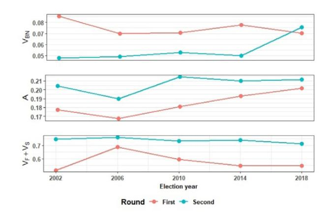
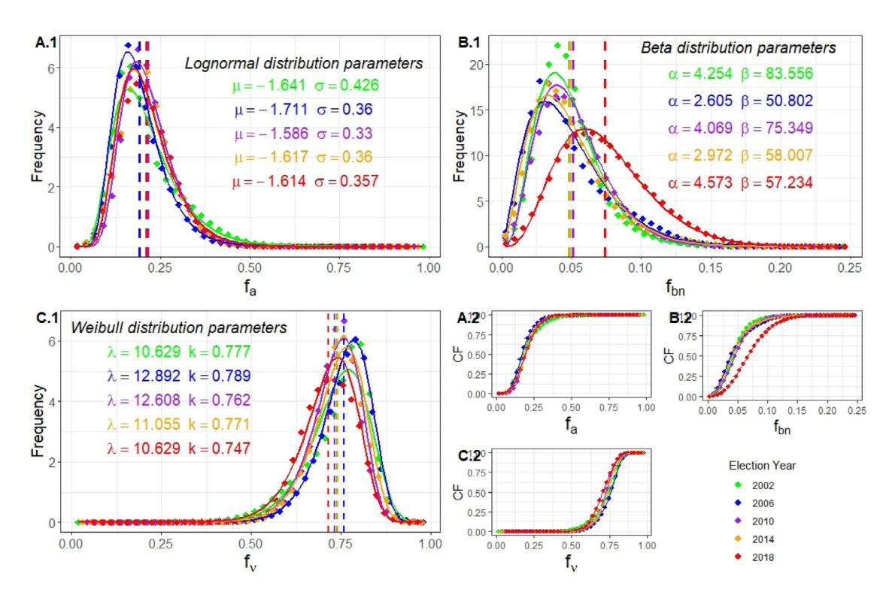
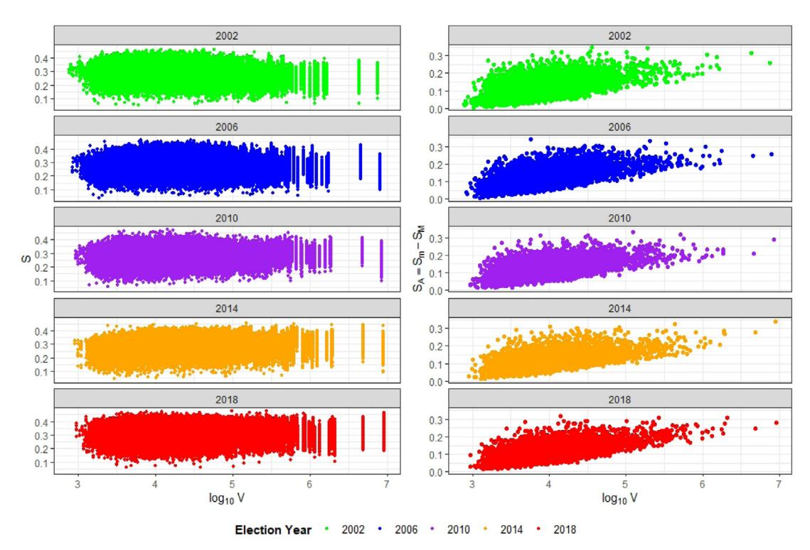
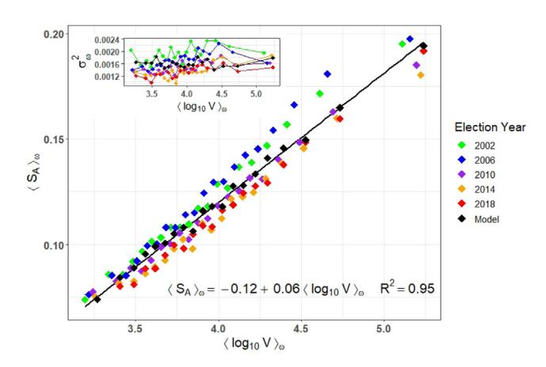
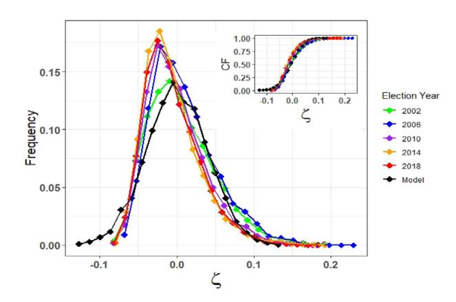
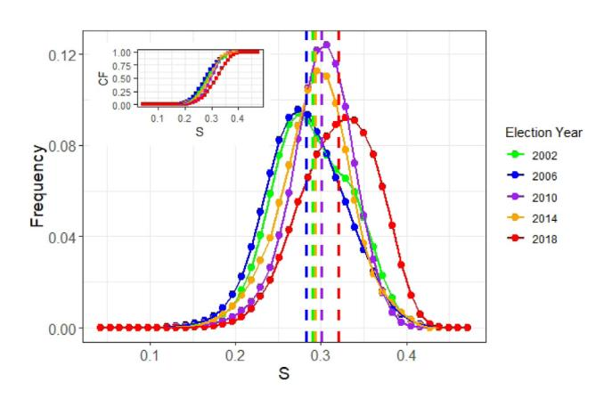

# Electorate involvement disorder: Universal relationship between the amplitude and electorate size in second round of Brazilian Presidential Election

M. Cardoso [a](#page-0-0),[∗](#page-0-1) , L.M.C. Silva [a](#page-0-0),[b](#page-0-2) , R.R. Neli [a](#page-0-0) , W.E. Souza [a](#page-0-0)

a *Programa de Pós-graduação em Inovações Tecnológicas, Universidade Tecnológica Federal do Paraná, 87301 - 899, Campo Mourão - Paraná, Brazil*

b *Instituto Federal do Paraná, 86730-000, Astorga-Paraná, Brazil*

#### a r t i c l e i n f o

#### *Article history:*

Received 4 February 2021

Received in revised form 24 November 2021

Available online 17 December 2021

#### *Keywords:*

Brazilian presidential election

Entropy concept

Electorate involvement disorder amplitude Generalized logarithmic model

#### a b s t r a c t

The voter's opinion is not expressed exclusively in the vote for one of the candidates, it may be implicit among abstentions or invalid votes, which are blank and null votes. In this study, we investigated the electorate participation in second rounds of Brazilian presidential elections, by consider the list, per ballot box, of the proportions of the three possible ''forms of voter participation'' in the election result: abstaining from voting, voting blank or null, or voting for one of the candidates, which called here of the electorate involvement. We used the entropy concept of Statistical Mechanics relating these proportions as a measure of the ''disorder'' of the electoral involvement. We found a generalized logarithmic model, parameter free, for the entropy amplitude per city as a function of the electorate size, showing that the range of the electorate involvement disorder is maintained over all election years and tends to grow more slowly in the

larger electorates.

© 2021 Elsevier B.V. All rights reserved.

# **1. Introduction**

Finding regularities in social phenomena has become the focus of many current studies, since social behavior tends to show patterns when observed on a large scale. In this direction, the studies [\[1](#page-7-0)–[5\]](#page-7-1) found scaling relationship between population size and urban indicators, such as crimes, suicides, COVID-19 attack rate, and depression rates. Identifying and modeling collective behavior can provide a qualitative analysis of the factors that lead to such patterns and, as a result, contribute to city planning. In democratic societies, electoral processes represent social phenomena of great involvement and interest for their agents, given that their future depends on the results of these processes. In view of the importance of electoral phenomena and the large availability of digitized data in the last decades, from the point of view of complex systems and using statistical tools, several studies have emerged aimed at finding patterns for voter behavior in the different phases of the electoral process. Some of these analyses are aimed at investigating vote distributions. In initial studies, the articles [\[6](#page-7-2)[,7\]](#page-7-3) observed a scale-invariant power law behavior with an exponent approximately 1 for the distribution of votes among candidates in proportional Brazilian elections assuming that the success of the candidates is determined by a multiplicative process, however the power law adjusts only the central part of the distribution. For the same data, the article [[8\]](#page-8-0) proposes a Generalized Zipf Law adjusting to the entire length of the distribution.

∗ Corresponding author.

*E-mail address:* [magdacm@utfpr.edu.br](mailto:magdacm@utfpr.edu.br) (M. Cardoso).

The works [[9](#page-8-1)[–11\]](#page-8-2) reproduced the observed behavior of the vote distributions presented in [\[6](#page-7-2)[,7](#page-7-3)] by using models of opinion dynamics. The power law pattern was also captured in party affiliation and candidacy processes in elections for mayor and councilor in Brazil, with the exponents for each position presenting a hierarchy in which the greatest exponent is associated with the most influential position, the results are shown in [[12](#page-8-3)[,13\]](#page-8-4). The same behavior emerges in the relationship between voters and candidate numbers in Brazilian municipal elections [\[14\]](#page-8-5), presenting a marked disadvantage for the candidacy of women for mayors. Relationship between turnout and votes in presidential elections in the United States were modeled in [[15](#page-8-6)], through universal scaling curves depending on a single parameter only. And yet, votes versus campaign expenditure showed power law relations in a study of proportional Brazilian elections [\[16\]](#page-8-7) reporting that the cost of voting is higher for candidates who received more votes.

When the size of the party is taken into account, [\[17](#page-8-8)] it shows that the distribution of votes in elections for three countries went well fitted by the log-normal model, however [[18\]](#page-8-9) shows that the same procedure for Brazilian elections presents exponential distributions. Still taking into account the size of the parties [[19](#page-8-10)], it analyzes proportional elections in 15 countries confirming the universality of behavior for a group of 5 nations with similar electoral rules. Another behavior observed in studies of electoral data is the phenomenon of polarization of votes between two candidates in elections for a single seat, the study in [\[20\]](#page-8-11) indicates that Brazilian elections for mayor in 2004 had votes polarized between two candidates, some studies [[21–](#page-8-12)[23\]](#page-8-13) spend effort to explain and model the emergence of this phenomenon using different mechanisms.

In democratic societies, electoral processes are procedures for making the choice of their representatives a free and fair mechanism. However, these processes also cause distrust in some societies for different reasons. In some countries, despite preaching a democratic system, there is forged authoritarianism. Therefore, studies on electoral systems go beyond the interest in the dynamics of opinion, as the works that proposed to investigate irregularities in the voting process. In [\[24\]](#page-8-14), evidence of irregularities in Russian elections were detected through an analysis of the correlation between turnout and winner votes. With similar procedures and building a parametric model that quantifies fraudulent mechanisms, [\[25\]](#page-8-15) investigated elections in 11 countries, identifying fraud in a Ugandan election and reinforcing for Russian elections. Complementing these studies, [[26](#page-8-16)] presented a method to test how much the result of an election shows evidence of electoral fraud, identifying traces of fraud in elections in Russia, Venezuela and Uganda.

Many studies have focused on analyzing votes for candidates in order to identify patterns in voter choice, however voters unhappy with candidate options to vote may express their dissatisfaction by abstaining or voiding their vote. In this context, a study of French election results, [[27](#page-8-17)], shows that the turnout rate across cities has a stable distribution over time and declines logarithmically with the distance between cities, [\[28](#page-8-18)] generalizes and reproduces this result for 11 countries through a decision model. Using data from these same countries, [\[29\]](#page-8-19) proposes a statistical study of electoral involvement by calculating the entropy of the proportions of abstentions, blank and null votes, and valid votes, which was named entropy of civic involvement of the electorate.

In Brazil, according to [\[30\]](#page-8-20), to cast a blank ballot means the voter expresses no preference for any of the candidates, before the Constitution of the Federative Republic of Brazil of 1988, the blank vote was considered valid and was counted for the winner candidate, so voting blank was a manifestation of dissatisfaction, but agreement with the majority's option. As from the 1988 Constitution [[31](#page-8-21)], which says: ''*the candidate who obtains the majority of valid votes, excluding blanks and nulls*'' is elected, blank votes are no longer valid votes. In the Brazilian electoral system, elections are held entirely through electronic ballot boxes and these shows for the voter the blank vote as an option, a white button written with blank, to vote blank, it is necessary to press the ''blank'' button and, then the button confirms, so it is unlikely that a blank vote would represent a voter error. The null vote is an expression used when the voter appears to vote, but wishes to annul his/her vote, inserting a number that does not correspond to any of the voting options or, in the case of voting on paper ballot, makes some type of marking that makes it impossible the identification of the vote in any candidate or political party, and is not counted for any candidate, political party or coalition [[32](#page-8-22)]. Thus, since 1988, blanks and nulls are calculated only as statistics for the elections. However, these numbers can represent a very significant phenomenon, the voter's dissatisfaction with candidates' options and not only the voter's mistakes. The abstention rate, on the other hand, refers to the percentage of registered voters, but who did not appear to vote [[33](#page-8-23)], so it could also represent a way of expressing dissatisfaction, however for Brazil this would be somewhat probable given that the Brazilian electoral system establishes that voting is compulsory for voters between 18 and 70 years old, and no-shows to vote, without just cause, punishes the voter with monetary fines [[33](#page-8-23)].

In this study we investigated the electorate involvement, which we consider here, as the list of the proportions of the three possible forms of voter participation in the election result (abstention, blank or null vote, and valid vote), by using data from the second rounds of Brazilian presidential elections. First, we performed an analysis of the proportional distributions that comprise electorate involvement, separately, where it was possible to observe indicative of manifestations of voter dissatisfaction. In order to obtain the main result of our work, we introduced a measure of the ''disorder'' of electorate involvement through the concept of entropy used in Statistical Mechanics and Information Theory, relating the proportions of abstention, blank or null vote, and valid vote, per ballot box. We obtained a general and parameter-free model for the relationship between the amplitude of the electorate involvement disorder and the electorate size per city. Despite this, we observed that the disorder in ballot boxes was ''more intense'' in 2018.

**Fig. 1. Total proportions of the data in both election rounds.** The panel above shows the total proportions of blank and null votes, *VBN* , abstentions, *A*, and votes cast for the first two candidates *VF* +*VS* , in relation of the number of registered voters in the whole country, for each of the two rounds of the five Brazilian presidential elections present in our database.

# **2. Presentation of database**

This study analyzed electoral data that made it possible to investigate the involvement of the electorate in the second rounds of Brazilian presidential elections. The data used in this analysis was obtained from the electoral data repository, a raw compilation of data referring to the Brazilian elections, available on the website of the Brazilian Electoral Supreme Court [\[34\]](#page-8-24). Our database comprises data from the second rounds of five Brazilian presidential elections held in the years 2002, 2006, 2010, 2014 and 2018. The data has been filtered by numbers of registered voters (apt), abstentions, valid votes (sum of votes cast for the two candidates) and blank and null votes, counted by ballot box. In Brazil, elections take place every four years, even years, and in the case of executive powers, mayor (only for cities with a minimum number of 200,000 voters), governors and president, elections are held in two rounds, if there is no candidate who reaches 50% of the valid votes plus 1 in the first round. The aim of this institute is to ensure the sovereign will of the voters. We chose to analyze the data from the second rounds of the Brazilian presidential elections by comparing the total proportions of blank and null votes, abstentions, and votes casted for the first two candidates, identified by *VBN* , *A* and *VF* + *VS* , in this order, with the number of registered voters in the whole country, in each of the two rounds of the five elections in our database, as shown in [Fig.](#page-2-0) [1.](#page-2-0) We can see that the *A* and *VF* + *VS* proportions follow a pattern in the five elections, both are higher in the second round compared to the first round. However, for the *VBN* proportion we identified an anomalous phenomenon in the 2018 election: it is the only one that presents a higher proportion of blank and null votes in the second round. This fact inspired us to better understand the voter's behavior at the polls at this phase of the electoral process. And we used only 5 years of election due to the completeness of the data available being only from 2002.

[Table](#page-3-0) [1](#page-3-0) provides an overview of data in second rounds, obtained from the websites [[34\]](#page-8-24) and (Brazilian Institute of Geography and Statistics) [[35](#page-8-25)], for each year analyzed, already allowing some observations on the behavior of the electorate. In 2006, there was the lowest abstention rate, 19.3%, and also the lowest proportion of blank and null votes, 6.0%, in relation to turnout, presenting, among all election years, the highest effective participation of the electorate, which may suggest that voters were more enthusiastic about candidate options. Despite the compulsory vote, the abstention rate is approximately 21% over the five years of elections studied here. We verified that voters living abroad represent less than 1% and voters over 60 years represent more than 30% of total abstentions. This fact that occurred in the years 2014 and 2018 according to data availability. Although voting is mandatory in Brazil, it is not very difficult for voters outside their electoral domicile, even if they are living in the country, to justify their absence, because the justification process is simple and free. And in elections for President of the Republic, the voter has the possibility to vote in transit, this type of voting exists only in special ballot boxes, installed in the capitals of the States [\[36\]](#page-8-26). A remarkable observation can be seen in 2018, the proportion of blanks and nulls is 9.4%, it relatively higher than in other years, indicating a phenomenon of voters' dissatisfaction with both candidate options in the second round.

# **3. Statistical analysis**

Voter ''dissatisfaction'' with the available candidate options can be expressed through abstentions or blank and null votes, however more enlightened and politically interested voters choose to express themselves by voting blank or voiding their votes. Especially in Brazil, where voting is compulsory, voter dissatisfaction is unlikely to be manifested through abstentions, as refraining from voting is subject to a fine, without a legitimate cause. Thus, this phenomenon of dissatisfaction is more probably expressed among blank and null votes. In light of this, we focused on better understanding the electorate involvement in the second rounds of Brazilian presidential elections, by using data from five elections held

**Table 1**

*Total data values per year of election:* The table above lists the total numbers referring to the Brazilian presidential elections in 2002, 2006, 2010, 2014, 2018. The columns show: estimated population — *Population*, number of ballot boxes — *Ballot box*, number of eligible to vote (registered voters in the ballot box) — *Eligible*, percentage of voters who did not appear to vote — *% Abstention*, percentage of valid votes in relation to eligible to vote — *% VVE* and in relation to turnout — *% VVT* , percentage of blank plus null votes in relation to eligible to vote — *% VBNE* and in relation to turnout — *% VBNT* .

| Year | Population  | Ballot box | Eligible    | % Abstention | % VVE | % VVT | % VBNE | % VBNT |
|------|-------------|------------|-------------|--------------|-------|-------|--------|--------|
| 2002 | 178,499,255 | 320,122    | 115,174,456 | 21.2         | 93.8  | 94.0  | 6.0    | 6.2    |
| 2006 | 187,061,610 | 360,875    | 125,795,016 | 19.3         | 94.8  | 93.9  | 6.0    | 6.0    |
| 2010 | 194,890,682 | 398,986    | 135,493,224 | 21.6         | 93.4  | 92.4  | 6.7    | 6.5    |
| 2014 | 202,768,562 | 427,734    | 142,445,761 | 21.2         | 93.8  | 93.6  | 6.3    | 6.1    |
| 2018 | 208,494,900 | 453,372    | 146,754,108 | 21.1         | 90.6  | 90.4  | 9.6    | 9.4    |

**Fig. 2. Proportion distributions representing the three possible forms of voter involvement in the polls**: the graphs in **A.1**, **B.1** and **C.1** show the dots representing the heights of the histograms of the variables: fraction of abstentions — *fa*, fraction of blank and null votes — *fbn* and fraction of valid votes — *f*v , per ballot box, respectively, by using all data in 40 windows, for the 5 years of presidential elections of the database, according to the legend. The curves, with the same dot color, are the adjustments by the Lognormal, Beta and Weibull distributions, their parameters are shown, also related to the color of the dots, in the inset of the respective graphics. The vertical dashed lines represent the averages of the variables. The graphics in **A.2**, **B.2** and **C.2** show the cumulative frequencies for distributions of the figures **A.1**, **B.1** and **C.1**, respectively.

in the years 2002, 2006, 2010, 2014 and 2018. Firstly, we investigated how the possible forms of voter participation: abstention, blank or null vote, or choosing one of the candidates, are distributed at the polls in each election of our database. For that, we started representing by *e* the variable number of registered voters in the ballot box, and we built the frequency distributions of the variables: fraction of abstentions, *fa* = *a*/*e*, where *a* represents the number of abstentions, fraction of blank and null votes, *fbn* = *bn*/*e*, in which *bn* is the number of blank votes plus null votes, fraction of valid votes, *f*v = v/*e*, where v is the number of valid votes (represents the sum of votes for the two candidates), in each ballot box for a given database election. Therefore, it is mandatory to have *a* + *bn* + v = *e*. We aggregated blanks and nulls together as both are counted as invalid in the current Brazilian electoral system. These fractions represent the three possible forms of voter involvement in the election result. [Fig.](#page-3-1) [2](#page-3-1) illustrates the distributions of relative frequency and cumulative frequency of the three variables, *fa*, *fbn* and *f*v, in 40 windows.

The variable *fa* presents similar distributions over the election years, as can be seen in [Fig.](#page-3-1) [2](#page-3-1) A.1, which is reinforced by the cumulative distributions, shown in [Fig.](#page-3-1) [2](#page-3-1) A.2. In addition, they can be adjusted by Log-normal distributions [\[37\]](#page-8-27), with different parameters for each year, but close between the years. This result was verified using the Kolmogorov–Smirnov test [\[38](#page-8-28)[,39\]](#page-8-29) for samples of size 1000, composed of samples per state, proportional to the size of the state, for which we obtained the test statistics satisfying the thresholds for this configuration (≤ *D* = 0.04 and ≥ *p* − *value* = 0.05) and

for an acceptance of the adjustment with a significance level of α = 0.05. We used this procedure because of the large database, as the number of ballot boxes is greater than 300 thousand in all election years, thus affecting the accuracy in the calculation of statistics. The proximity between the distributions was expected, given the compulsory voting system. The frequency distributions of the variable *fbn*, shown in [Fig.](#page-3-1) [2](#page-3-1) B.1, are distributions close to the Beta distribution [[39](#page-8-29)[,40\]](#page-8-30) in all years, with different parameters over the years, the result went checked with the same procedure used for variable *fa*, however they are not close to each other. Note that the average is noticeably higher in 2018, the rate of blanks and nulls per ballot box is concentrated around 7, 5% (with a variance of the order 10−3 ), compared to other election years the concentration is around 5% (with a variance of the order 10−4 ), indicating greater voter rejection by the two candidates in the last election. This fact can also be seen in the cumulative distributions, [Fig.](#page-3-1) [2-](#page-3-1)B.2 and in the total percentage, around 3% higher than in the others years, shown in [Table](#page-3-0) [1](#page-3-0). This suggests a manifestation of the voter ''dissatisfaction'' phenomenon with the configuration of available candidates for the second round. [Fig.](#page-3-1) [2-](#page-3-1)C.1 shows the frequency distributions for the variable *f*v, the best fit for them is the Weibull distribution [[37](#page-8-27)[,41\]](#page-8-31), however applying the same procedure used for the variables *fa* and *fbn*, the statistics obtained do not allow to accept the adjustments, despite being close to the acceptance thresholds. However, it was possible to verify using the Kolmogorov–Smirnov test for the frequency distributions in the 40 windows, the proximity between them in the years 2002 and 2006, for which the winning candidate was Luiz Inácio Lula da Silva, and also between in the years 2010 and 2014, when the winner was Dilma Rousseff, and comparing any other two distributions, there are no proximity. This suggests that the winning candidate models the distribution of valid votes.

So far, we have analyzed each form of electorate involvement separately and we found that each of them has a form of stable distribution over time. At this point, we asked ourselves: are there configurations of electorate involvement that we could consider the most or the least ordered? And how could we measure this ''order''? To answer these questions, we imagined the electorate involvement collectively, as a thermodynamic system, and in a similar way to that used in Statistical Mechanics, we used the concept of entropy between the proportions *fa*, *fbn* and *f*v as a measure of the disorder of electorate involvement. An analogous procedure was used in [\[29\]](#page-8-19), in which the authors detected a peak close to a common value for the most populous cities. In classical statistical mechanics, the perspective of statistical entropy was introduced in 1870 by the physicist Ludwig Boltzmann [[42](#page-8-32)]. In [\[43\]](#page-8-33), the Boltzmann–Gibbs entropy is established, which measures the degree of irreversibility, or ''disorder'', of a given system, or measures the chance of a particle system returning to its original state when disturbed. In the area of Information Theory, the concept of entropy was originally introduced by Claude Shannon [\[44\]](#page-8-34), as a way of measuring the average degree of ''uncertainty'' of information sources, which allows quantifying the present information that flows through the system. A presentation of the different interpretations of the concept of entropy in Information Theory is given in [\[45,](#page-8-35)[46](#page-8-36)].

In the context of this work, we associate to each list (*fa*, *fbn*, *f*v) of proportions, which represents a configuration of the electoral involvement in a given ballot box, the entropy *S* as a measure of disorder of the electoral involvement, which will be calculated by the equation

*S* (fa, *fbn*, *f*v) = −*f*v*log*10 (*f*v) − *falog*10 (*fa*) − *fbnlog*10 (*fbn*). (1)

We call *S* in this study the disorder of electorate involvement. Note that the variables must satisfy the probability conservation *fa* + *fbn* + *f*v = 1. In a similar way, to the entropy in Statistical Mechanics, we consider that, as the value of *S* grows, increase the disorder of the electorate involvement in the ballot box. Maximizing the entropy *S*, the maximum point occurs for *fa* = *fbn* = *f*v = 1/3 and the maximum value is *S* = *log*10 (3) = 0.477. The [Fig.](#page-5-0) [3](#page-5-0) -*Right panel* shows the graph of the spread of the entropy value *S* by ballot box versus the total number of voters *V* in the city where the ballot box belongs, in base 10 logarithm. Observing the data for each election year, there seems to be a conservation in the amplitude data over the years in relation to the size of the electorate. We then calculated the entropy amplitude, *SA* = *SM* − *Sm*, in each city in Brazil, with *SM* being the maximum entropy and *Sm* being the minimum entropy in the city. We constructed the graph of the variable *SA* versus *log*10*V* that presents a linear trend underlying the fluctuations, as can be seen in [Fig.](#page-5-0) [3](#page-5-0) -*Left panel*. To capture the trend observed in the spread, we calculated the average values of the variable *log*10*V*, in 20 ω windows, containing the same number of cities, which we denote by ⟨*log*10*V*⟩, then we calculate the mean values of the entropy amplitude, represented by ⟨*SA*⟩, for the corresponding values in the windows. The result of the procedure is shown in [Fig.](#page-5-1) [4,](#page-5-1) in the upper-left inset can also be seen the graph of variance σ 2 of *SA* per window ω, as a function of ⟨*log*10*V*⟩. As can be observed, the variances overall years are approximately constant, which makes it consistent to interpret the behavior of the data through the average behavior.

The average behavior of the amplitude of the disorder of electorate involvement as a function of the average values of the variable *log*10*V* confirms the observed linear trend in the scatter plot, the linear fit via the least squares method, also shows together with the average values in [Fig.](#page-5-1) [4](#page-5-1). The equation and the coefficient of determination for the fit are displayed in the bottom-right inset of the same figure. The model is unique for all years of election and has a robust fit, since that the coefficient of determination is close to 1 (*R* 2 = 0.95).

The result of this analysis, allow us to write a robust generalized model for the average value of the amplitude of the electorate involvement disorder as a function of the mean value of the logarithm of electorate size, in each ω window, for the 5 elections studied here

⟨*SA*⟩ω = 0.06*log*100.01 + 0.06 ⟨*log*10*V*⟩ω , (2)

**Fig. 3. Right panel: Electorate involvement disorder per ballot box:** Each dot on the graphs represents the relationship between the entropy value of electorate involvement, *S* (which named here electorate involvement disorder), which is calculated by Eq. [\(1\)](#page-4-0) for the list (*fa*, *fbn*, *f*v ) in each ballot box, and the variable *log*10*V*, where *V* is the number of voters in the city where the ballot box belongs. **Left panel**: **Electorate involvement disorder amplitude per city:** The dots represent the entropy amplitude, *SA* = *SM* − *Sm* (where *SM* is the maximum entropy and *Sm* the minimum entropy in each city) versus the variable *log*10*V*, in which *V* is the total number of voters in the respective city. In both graphs for the 5 elections of the database, as shows the legend.

**Fig. 4. Linear fit for the average values of the electorate involvement disorder amplitude.** The diamond dots represent the mean values of the variable *SA* (electorate involvement disorder amplitude per city), denoted by ⟨*SA*⟩ω, in 20 ω windows of the variable *log*10*V* with the same city numbers (*V* number of registered voters per city), versus the mean values, ⟨*log*10*V*⟩ω, in ω. The black line represents the single linear fit, by using the least squares method, for all the years of election studied here, the equation of the line and the coefficient of determination are shown in the lower inset. Graph at the top inset shows the variance σ 2 ω of *SA* in the 20 ω windows as a function of ⟨*log*10*V*⟩. The black diamond dots represent the average values in the same 20 ω windows for the data simulated by the model (4).

where *V* represents the electorate per city. We also calculate the fluctuations around the linear model ([2\)](#page-4-1), by

ς (*V*) = *SA* − 0, 06*log*100.01*V*. (3)

**Fig. 5. Frequency distributions of the fluctuations of the electorate involvement disorder amplitude**: The dots represent the frequency of the ς fluctuation of the *SA* entropy amplitude around the linear model, calculated by [\(3\)](#page-5-2), in 20 equally spaced windows, for each election year and for the model ([4](#page-6-0)), according to the colors shown in the legend. And the insertion shows the cumulative frequencies for the same windows.

**Fig. 6. Frequency distributions of the electorate involvement disorder per ballot box.** The dots represent the frequencies of entropy *S* per ballot box in 40 equally spaced windows, for each election year. The cumulative frequencies, for the same windows, are shown in the inset, denoted by CF.

The frequency distributions of the variable ς in the 20 ω window for which the model was obtained are shown in [Fig.](#page-6-1) [5.](#page-6-1) We suppose that the distributions of ς are approximately Gaussian and we insert a stochastic noise into the model [\(2](#page-4-1)), rewriting the approximate model as

*SA* ≈ 0.06*log*10*V*ξ (*V*), (4)

where ς (*V*) = 0.06*log*10ξ (*V*) /0.01. In order to assess the veracity of the model, we calculated *SA* assuming ς a Gaussian noise with mean, µ = 0 and standard deviation σ = 0.04, taken approximately as the mean of the means and the mean of the standard deviations of the fluctuations over the 5 elections. The mean values for the data simulated by the model [\(4](#page-6-0)) in the ω windows are the black dots shown in [Fig.](#page-5-1) [4](#page-5-1) and the frequency distributions of the fluctuations of the model are illustrated in [Fig.](#page-6-1) [5](#page-6-1).

Other procedures were carried out in the search for regularities involving the variable *S*, such as, for example, the graph of the averages, the maximum values and the minimums by electorate's windows, however it was not possible to confirm a behavior clearly. And then, as a last check, we calculated the frequency distributions of *S*, in 40 equally spaced windows, available in [Fig.](#page-6-2) [6](#page-6-2). Unlike the amplitude of entropy per city, *SA*, which is universal for all the elections analyzed, the distributions of entropy *S* is similar only for the years when the winning candidate was the same, in 2002 and 2006 and in 2010 and 2014, the proximity between distributions in those years was verified via the Kolmogorov Smirnov test for frequencies in the 40 windows. As with valid votes, the ''disorder'' at the ballot box seems to be modeled by the winning candidate. In turn, 2018, the distribution is shifted to the right, showing that in that year the involvement of the electorate was more disordered when compared to the other years.

### **4. Results and conclusions**

Our analysis has allowed us to improve the understanding regard the involvement of the electorate in the polls in the second rounds of Brazilian presidential elections. The frequency distributions of the fractions of the possible forms of voter involvement: abstention — *fa*, blank or null vote — *fbn*, and valid vote — *f*v, shown in [Fig.](#page-3-1) [2](#page-3-1), presented stable forms over the years close to the standard, Log-normal, Beta and Weibull distributions, respectively. Since the frequency distributions of abstentions showed a similarity along all years, as was expected due to compulsory voting in Brazil. Nevertheless, the distributions of blank and null votes suggest a dissatisfaction phenomenon in 2018, with the average and the total proportion, [Table](#page-3-0) [1](#page-3-0), around 3% higher, when compared to the other election years analyzed. This anomalous phenomenon can also be observed in [Fig.](#page-2-0) [1,](#page-2-0) this one shows that in the first four years of elections the voters tend to choose one of the two candidates in the second round, reducing the proportion of white and null votes compared to the first round. In 2018, however, the reverse effect occurs. A future study could investigate the factors that intensify to polarization in the second round. In this context, the study [[47](#page-8-37)] developed a mathematical framework able capturing the evolution of polarization in the Democratic and Republican-leaning segments of the U.S., suggesting that the political polarization is mainly driven by strong political/cultural initiatives in the Democratic party. The frequency distributions of valid votes are similar in years in which the winning candidate is the same, suggesting that the winning candidate models the distribution of valid votes.

We introduced in this work a measure of disorder, *S*, of the electorate involvement expressed in the polls, by consider for the 5 elections in our database, the list of proportions (*fa*, *fbn*, *f*v), representing the configuration of electorate involvement per ballot box, obtained by the Eq. [\(1\)](#page-4-0). And then, we calculated the amplitude *SA* of *S*, in each Brazilian city, as a measure of the variation of the electorate involvement disorder per city. We analyzed the average behavior of *SA*, through the electorate's 20 ω windows. The result of the procedure, which can be seen in [Fig.](#page-5-1) [4](#page-5-1) allowed us to obtain our main achievement, a general logarithmic model, free of parameters, for the five elections, Eq. [\(3](#page-5-2)), relating the electorate involvement disorder amplitude, *SA*, and the size of the electorate, *V*, per city, for the five elections in our database. The model remains valid even when a notable phenomenon of electorate dissatisfaction occurs, as in 2018, [Fig.](#page-3-1) [2](#page-3-1) B.1. And yet, the logarithmic growth indicates that, proportionally, the order has larger variation in populations of smaller electorates. To complete our investigations, we analyzed the frequency distributions of *S*, [Fig.](#page-6-2) [6](#page-6-2), where we can see that, despite the variation in the order of electorate involvement per city being maintained over all the years studied, the distribution in 2018 had the highest concentration of ballot boxes with higher entropy when comparing to the other four elections, which shows that the disorder was greater this year.

# **CRediT authorship contribution statement**

**M. Cardoso:** Conceptualization, Methodology, Software, Validation, Formal analysis, Investigation, Computing resources, Data Curation, Writing - original draft, Writing - review editing. **L.M.C. Silva:** Conceptualization, Methodology, Software, Investigation, Computing resources, Data Curation, Writing - original draft. **R.R. Neli:** Conceptualization, Methodology, Software, Computing resources. **W.E. Souza:** Conceptualization, Formal analysis, Computing resources.

# **Declaration of competing interest**

The authors declare that they have no known competing financial interests or personal relationships that could have appeared to influence the work reported in this paper.

#### **Acknowledgment**

All authors have reviewed and approved the latest version of the manuscript.

#### **References**

[1] L.G.A. Alves, H.V. Ribeiro, R.S. Mendes, Scaling laws in the dynamics of crime growth rate, Physica A 392 (2013) 2672–2679, [http://dx.doi.org/](http://dx.doi.org/10.1016/j.physa.2013.02.002) [10.1016/j.physa.2013.02.002](http://dx.doi.org/10.1016/j.physa.2013.02.002). [2] L.G.A. Alves, H.V. Ribeiro, E.K. Lenzi, R.S. Mendes, Empirical analysis on the connection between power-law distributions and allometries for urban indicators, Physica A 409 (2014) 175–182, <http://dx.doi.org/10.1016/j.physa.2014.04.046>. [3] H.P.M. Melo, A.A. Moreira, E. Batista, H.A. Makse, J.S. Andrade Jr., Statistical signs of social influence on suicides, Sci. Rep. 4 (2014) 06239, [http://dx.doi.org/10.1038/srep06239.](http://dx.doi.org/10.1038/srep06239) [4] A.J. Stier, M.G. Berman, L.M.A. Bettencourt, COVID-19 attack rate increases with city size, MedRxiv (2020) [http://dx.doi.org/10.1101/2020.03.22.](http://dx.doi.org/10.1101/2020.03.22.20041004) [20041004](http://dx.doi.org/10.1101/2020.03.22.20041004). [5] A.J. Stiera, K.E. Schertza, N.W. Rim, C.C. Inigueza, B.B. Lahey, L.M.A. Bettencourtd, M.G. Berman, Evidence and theory for lower rates of depression in larger US urban areas, Proc. Natl. Acad. Sci. USA 118 (2021) e2022472118, <http://dx.doi.org/10.1073/pnas.2022472118>. [6] R.N. Costa Filho, M.P. Almeida, J.S. Andrade, J.E. Moreira, Scaling behavior in a proportional voting process, Phys. Rev. E 60 (1999) 1067–1068, [http://dx.doi.org/10.1103/PhysRevE.60.1067.](http://dx.doi.org/10.1103/PhysRevE.60.1067) [7] R.N. Costa Filho, M.P. Almeida, Brazilian elections: voting for a scaling democracy, Physica A 322 (2003) 698–700, [http://dx.doi.org/10.1016/](http://dx.doi.org/10.1016/S0378-4371(02)01823-X) [S0378-4371\(02\)01823-X](http://dx.doi.org/10.1016/S0378-4371(02)01823-X).

[8] M.L. Lyra, U.M.S. Costa, R.N. Costa Filho, J.S. Andrade, Generalized zipf's law in proportional voting processes, Europhys. Lett. 62 (2003) 131–137, [http://iopscience.iop.org/0295-5075/62/1/131.](http://iopscience.iop.org/0295-5075/62/1/131) [9] A.T. Bernardes, D. Stauffer, J. Kertész, Election results and the sznajd model on barabási network, Eur. Phys. J. B 25 (2002) 123–127, [https://link.springer.com/article/10.1140%2Fe10051-002-0013-y.](https://link.springer.com/article/10.1140%2Fe10051-002-0013-y) [10] M.C. González, A.O. Sousa, H.J. Herrmann, Opinion formation on a deterministic pseudo-fractal network, Internat. J. Modern Phys. C 16 (2004) 45–57, [http://dx.doi.org/10.1142/S0129183104005577.](http://dx.doi.org/10.1142/S0129183104005577) [11] G. Travieso, L.F. Costa, Spread of opinions and proportional voting, Phys. Rev. E 74 (2006) 036112, <http://dx.doi.org/10.1103/PhysRevE.74.036112>. [12] M.C. Mantovani, H.V. Ribeiro, M.V. Moro, S. Picole, R.S. Mendes, Scaling laws and universality in the choice of election candidates, Europhys. Lett. 96 (2011) 48001, [https://iopscience.iop.org/article/10.1209/0295-5075/96/48001.](https://iopscience.iop.org/article/10.1209/0295-5075/96/48001) [13] M.C. Mantovani, H.V. Ribeiro, E.K. Lenzi, R.S. Mendes, Engagement in the electoral processes: scaling laws and the role of the politics position, Phys. Rev. E 88 (2013) 024802, [http://dx.doi.org/10.1103/PhysRevE.88.024802.](http://dx.doi.org/10.1103/PhysRevE.88.024802) [14] M. Cardoso, R.S. Mendes, J.T.S. Souza, H.V. Ribeiro, Gender difference in caditature processes for brasilian elections, Physica A 537 (2020) 122525, [http://dx.doi.org/10.1016/j.physa.2019.122525.](http://dx.doi.org/10.1016/j.physa.2019.122525) [15] E. Bokányi, Z. Szállázi, G. Vattay, Universal scaling laws in metro area election results, PloS ONE 13 (2018) e0192913, [http://dx.doi.org/10.1371/](http://dx.doi.org/10.1371/journal.pone.0192913) [journal.pone.0192913.](http://dx.doi.org/10.1371/journal.pone.0192913) [16] H.P.M. Melo, S.D.S. Reis, A.A. Moreira, H.A. Makse, J.S. Andrade Jr., The price of a vote: Diseconomy in proportional elections, PLoS One 13 (2018) e0201654, [http://dx.doi.org/10.1371/journal.pone.0201654](http://dx.doi.org/10.1371/journal. pone.0201654). [17] S. Fortunado, C. Castellano, Scaling and universality in proportional elections, Phys. Rev. Lett. 99 (2007) 138701, [http://dx.doi.org/10.1103/](http://dx.doi.org/10.1103/PhysRevLett.99.138701) [PhysRevLett.99.138701.](http://dx.doi.org/10.1103/PhysRevLett.99.138701) [18] L.E. Araripe, R.N. Costa Filho, Role of parties in the vote distribution of proportional elections, Physica A 388 (2009) 4167–4170, [http:](http://dx.doi.org/10.1016/j.physa.2009.06.023) [//dx.doi.org/10.1016/j.physa.2009.06.023.](http://dx.doi.org/10.1016/j.physa.2009.06.023) [19] A. Chatterjee, M. Mitrovic, S. Fortunato, Universality in voting behavior: An empirical analysis, Sci. Rep. 3 (2013) 1049, [http://dx.doi.org/10.](http://dx.doi.org/10.1038/srep01049) [1038/srep01049.](http://dx.doi.org/10.1038/srep01049) [20] L.E. Araripe, R.N. Costa Filho, H.J. Herrmann, J.S. Andrade Jr., Plurality voting: The statistical laws of democracy in Brazil, Internat. J. Modern Phys. C 12 (2006) 1809–1813, [http://dx.doi.org/10.1142/S0129183106010200.](http://dx.doi.org/10.1142/S0129183106010200) [21] N.A.M. Araújo, J.S. Andrade Jr., H.J. Herrmann, Tactical voting in plurality elections, PLoS One 13 (2018) e0201654, [http://dx.doi.org/10.1371/](http://dx.doi.org/10.1371/journal.pone.0012446) [journal.pone.0012446.](http://dx.doi.org/10.1371/journal.pone.0012446) [22] F. Vazquez, N. Saintier, J.P. Pinasco, Role of voting intention in public opinion, Phys. Rev. E 101 (2020) 012101, [http://dx.doi.org/10.1103/](http://dx.doi.org/10.1103/PhysRevE.101.012101) [PhysRevE.101.012101,](http://dx.doi.org/10.1103/PhysRevE.101.012101) (1–13). [23] A.F. Siegenfeld, Y. Bar-Yam, Negative representation and instability in democratic elections, Nat. Phys. 16 (2020) 186–190, [http://dx.doi.org/10.](http://dx.doi.org/10.1038/s41567-019- 0739-6) [1038/s41567-019-0739-6.](http://dx.doi.org/10.1038/s41567-019- 0739-6) [24] D. Kobak, S. Shpilkin, M.S. Pshenichnikov, Statistical anomalies in 2011–2012 Russian elections revealed by 2D correlation analysis, [arXiv:](http://arxiv.org/abs/1205.0741v2) [1205.0741v2](http://arxiv.org/abs/1205.0741v2) [physics.soc-ph]. [25] P. Klimek, Y. Yegorov, R. Hanel, S. Thurner, Statistical detection of systematic election irregularities, Proc. Natl. Acad. Sci. USA 109 (2012) 16469–16473, <http://dx.doi.org/10.1073/pnas.1210722109>. [26] R. Jimenez, M. Hidalgo, P. Klimek, Testing for voter rigging in small polling stations, Sci. Adv. 3 (2017) e1602363, [http://dx.doi.org/10.1126/](http://dx.doi.org/10.1126/sciadv.1602363) [sciadv.1602363](http://dx.doi.org/10.1126/sciadv.1602363). [27] C. Borghesi, J.P. Bouchaud, Spatial correlations in vote statistics: A diffusive field model for decision-making, Eur. Phys. J. B 75 (2010) 395–404, <http://dx.doi.org/10.1140/epjb/e2010-00151-1>. [28] C. Borghesi, J.-C. Raynal, J.-P. Bouchaud, Election turnout statistics in many countries: similarities, differences, and a diffusive field model for decision-making, PLoS One 7 (2012) e36289, <http://dx.doi.org/10.1371/journal.pone.0036289>. [29] C. Borghesi, J. Chiche, J.-P. Nadal, Between order and disorder: a 'weak law' on recent electoral behavior among urban voters, PLoS One 7 (2012) e39916, <http://dx.doi.org/10.1371/journal.pone.0039916>. [30] [VOTO em branco, in: Maria Helena DINIZ \(Ed.\), DicionáRio Jurídico, Saraiva, São Paulo, 1998, p. 760, V.4.](http://refhub.elsevier.com/S0378-4371(21)00961-4/sb30) [31] [BRASIL, \[Constituição \(1988\)\]. Constituição da República federativa do brasil de 1988. Brasília, DF: Presidência de República, \[2016\], 2020,](http://refhub.elsevier.com/S0378-4371(21)00961-4/sb31) [Available in:. Accessed on Sep 9, 2020.](http://refhub.elsevier.com/S0378-4371(21)00961-4/sb31) [32] [VOTO nulo, in: Saïd Farhat \(Ed.\), Dicionário Parlamentar e Político, Melhoramentos; Fundação Peirópolis, São Paulo, 1996.](http://refhub.elsevier.com/S0378-4371(21)00961-4/sb32) [33] [http://www.tse.jus.br/eleitor/glossario/termos- iniciados-com-a-letra-a.](http://www.tse.jus.br/eleitor/glossario/termos-iniciados-com-a-letra-a) [34] [http://www.tse.gov.br.](http://www.tse.gov.br) [35] <https://www.ibge.gov.br/estatisticas/sociais/populacao.html>. [36] BRASIL, Lei n◦ [4.737 de 15 de julho de 1965, in: BRASIL \(Ed.\), Tribunal Superior Eleitoral. Código Eleitoral Anotado E Legislação Complementar.](http://refhub.elsevier.com/S0378-4371(21)00961-4/sb36) [Edição Especial, Revista e Atualizada, a Partir Do Texto da 8. Edição de 2008. Brasília: Tribunal Superior Eleitoral, Secretaria de Gestão da](http://refhub.elsevier.com/S0378-4371(21)00961-4/sb36) [Informação, 2009, p. 113, Art. 233-a.](http://refhub.elsevier.com/S0378-4371(21)00961-4/sb36) [37] [N.L. Johnson, S. Kotz, N. Balakrishnan, Continuous Univariate Distributions \(Chapter 14: Lognormal Distributions, Chapter 21: Weibull](http://refhub.elsevier.com/S0378-4371(21)00961-4/sb37) [Distributions\), 2Ed., A Wiley-Interscience V1, ISBN: 978-0-471-58495-7, 1994.](http://refhub.elsevier.com/S0378-4371(21)00961-4/sb37) [38] [A. Kolmogorov, Sulla determinazione empirica di una legge di distribuzione. 4, 1933, pp. 83–91.](http://refhub.elsevier.com/S0378-4371(21)00961-4/sb38) [39] N. Smirnov, Table for estimating the goodness of fit of empirical distributions, Ann. Math. Stat. 2 (1948) 279–281, [http://dx.doi.org/10.1214/](http://dx.doi.org/10.1214/aoms/1177730256) [aoms/1177730256.](http://dx.doi.org/10.1214/aoms/1177730256) [40] [N.L. Johnson, S. Kotz, N. Balakrishnan, Continuous Univariate Distributions \(Chapter 25: Beta Distributions\), 2Ed., Wiley-Interscience V2, ISBN:](http://refhub.elsevier.com/S0378-4371(21)00961-4/sb40) [978-0-471-58494-0, 1995.](http://refhub.elsevier.com/S0378-4371(21)00961-4/sb40) [41] [M.R. Fréchet, Sur la Loi de Probabilité de L'écart Maximum, Annales de la Société Polonaise de Mathématique, Cracovie, Vol. 6, 1927, pp.](http://refhub.elsevier.com/S0378-4371(21)00961-4/sb41) [93–116.](http://refhub.elsevier.com/S0378-4371(21)00961-4/sb41) [42] [Ludwig Boltzmann, \(1896, 1898\). Vorlesungen über gastheorie: 2 Volumes - Leipzig 1895/98 UB: O 5262-6. English version: Lectures on gas](http://refhub.elsevier.com/S0378-4371(21)00961-4/sb42) [theory, in: Translation of Stephen G. Brush \(1964\), Dover, Berkeley, ISBN: 0-486-68455-5, 1995, New York.](http://refhub.elsevier.com/S0378-4371(21)00961-4/sb42) [43] [E.T. Jaynes, Gibbs vs Boltzmann entropies, Amer. J. Phys. 33 \(1965\) 391-8.](http://refhub.elsevier.com/S0378-4371(21)00961-4/sb43) [44] C.E. Shannon, A mathematical theory of communication. Bell system, Tech. J. 27 (1948) 379–423, [http://dx.doi.org/10.1002/j.1538-7305.](http://dx.doi.org/10.1002/j.1538-7305.1948.tb01338.x) [1948.tb01338.x](http://dx.doi.org/10.1002/j.1538-7305.1948.tb01338.x), as reprinted in The Mathematical Theory of Communication, C. E. Shannon and W. Weaver, University of Illinois Press, Champaign-Urbana (1963). [45] D.P. Feldman, A brief tutorial on: Information theory, excess entropy and statistical complexity, 2020, Available: [http://hornacek.coa.edu/dave/](http://hornacek.coa.edu/dave/Tutorial/index.html) [Tutorial/index.html](http://hornacek.coa.edu/dave/Tutorial/index.html) Accessed 2020 Sep 16. [46] [T.M. Cover, J.A. Thomas, Elements of Information Theory, John Wiley & Sons, Inc., 1991.](http://refhub.elsevier.com/S0378-4371(21)00961-4/sb46) [47] [L. Böttcher, H. Gersbach, The great divide: drivers of polarization in the US public, EPJ Data Sci. 32 \(2020\) 4292.](http://refhub.elsevier.com/S0378-4371(21)00961-4/sb47)