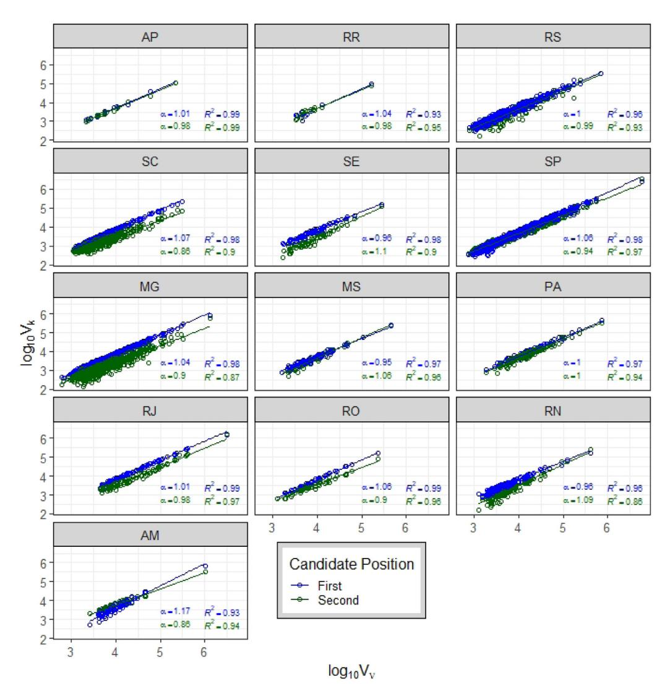
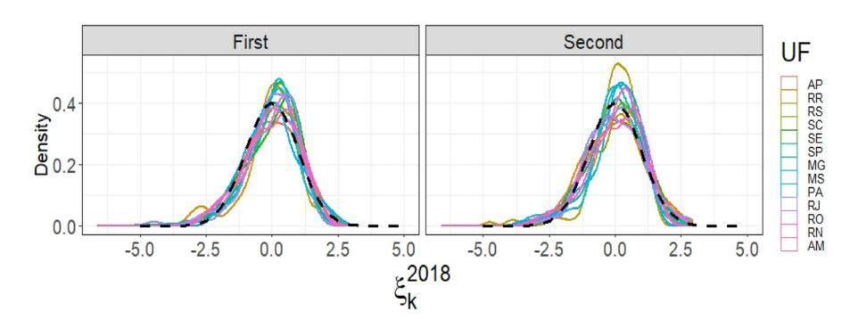
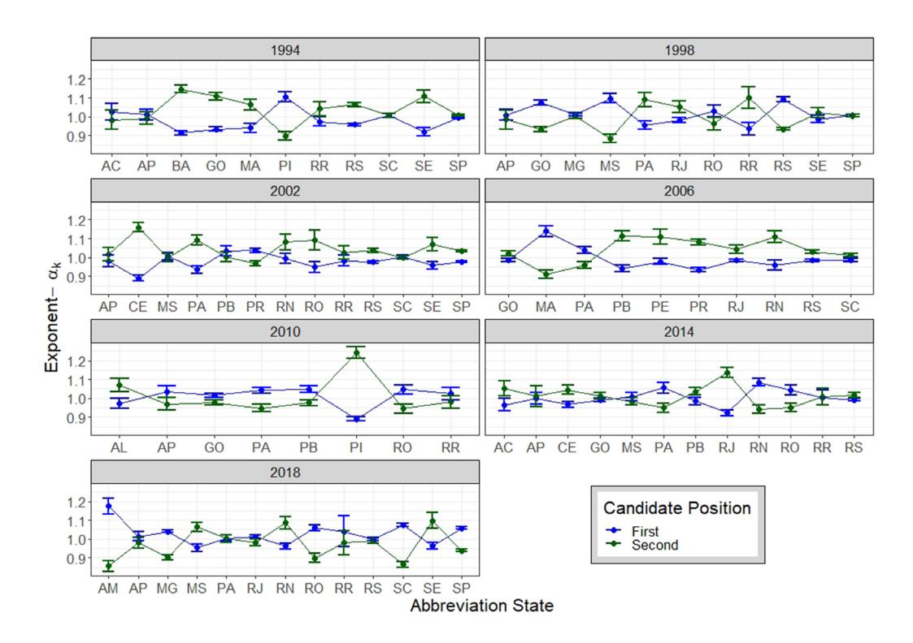
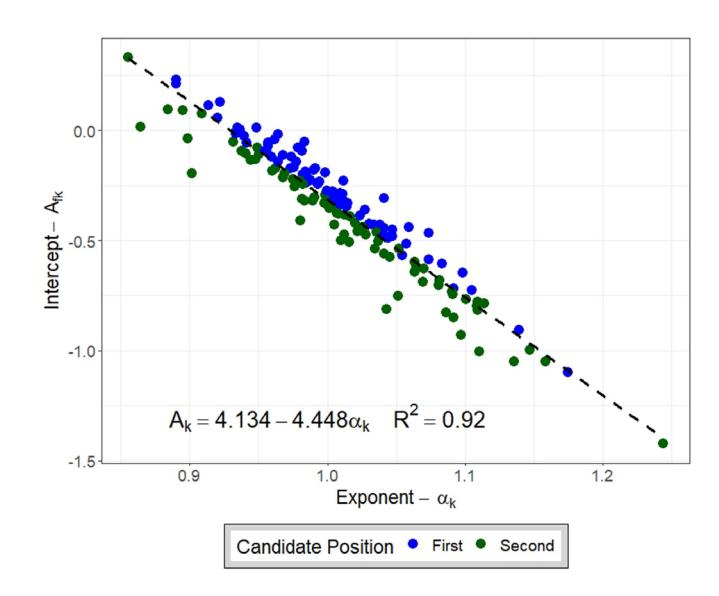
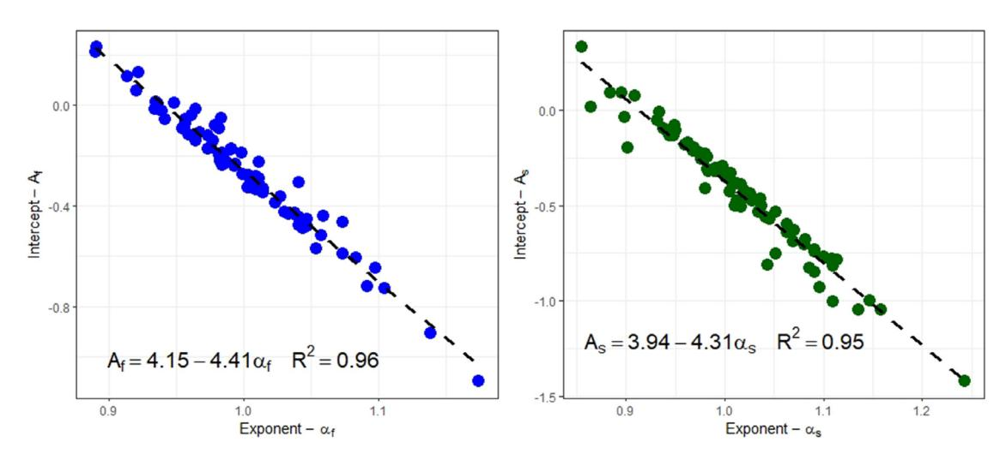
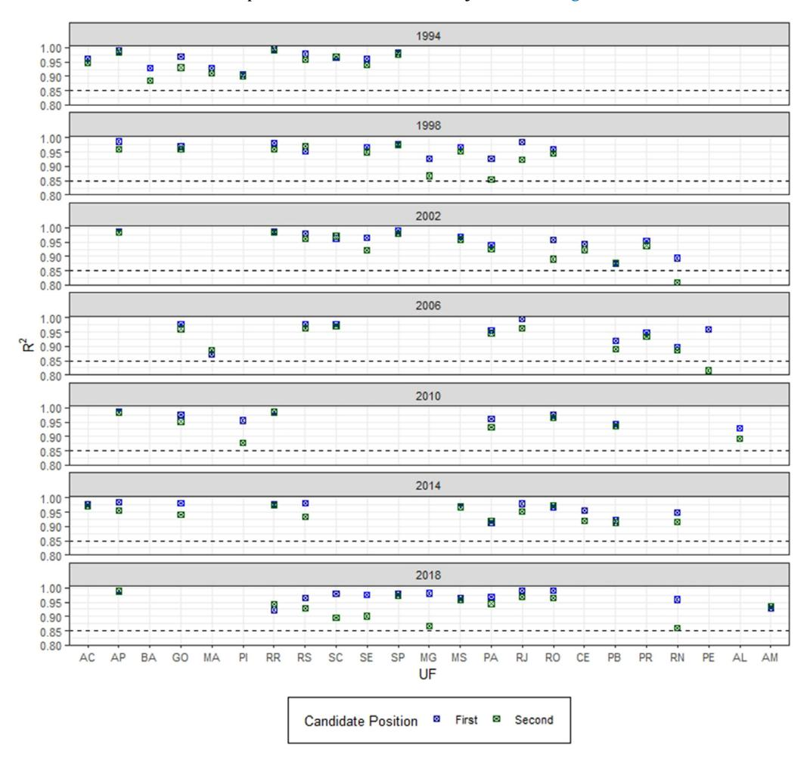
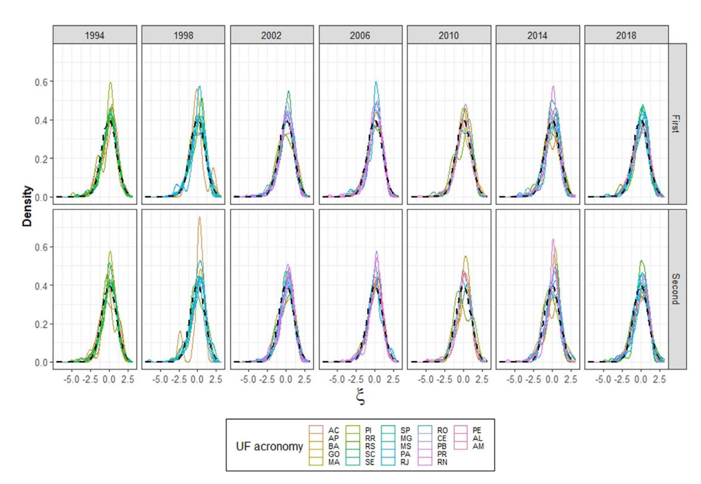
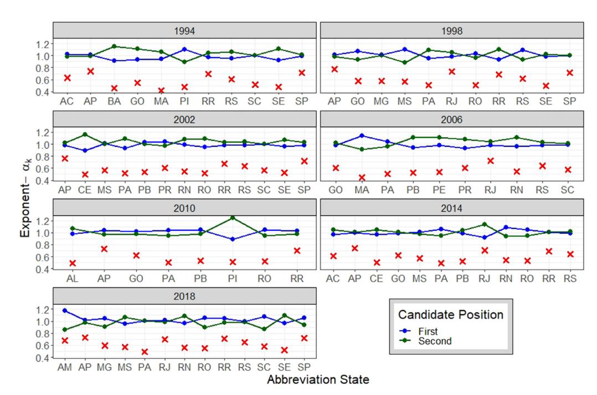

# Scaling laws from Brazilian state election results point out that, the candidate's chance to win increases by investing more campaign efforts in smaller electorates

M. Cardoso [∗](#page-0-0) , J.T.G. Souza, R.R. Neli, W.E. Souza

*Programa de Pós-graduação em Inovações Tecnológicas, Universidade Tecnológica Federal do Paraná, 87301 - 899, Campo Mourão, Paraná, Brazil*

### a r t i c l e i n f o

### *Article history:*

Received 11 June 2022

Received in revised form 23 January 2023

Available online 23 March 2023

#### *Keywords:*

Election results

Scaling laws

Probability conservation

#### a b s t r a c t

Scaling law behaviors have been emerging from many large-scale social phenomena, particularly from the different stages of an electoral process. We analyze here, the results from 78 second rounds of Brazilian elections for state governors and, we identified scale law relationships between valid votes and votes cast for each candidate. Furthermore, we verified a consistent linear trend for the relationship between the parameters of each adjustment. This result, together with the probability conservation over valid votes, made it possible for us to write the relationship between votes as a robust universal scale law model depending on a single parameter. A remarkable result provided by the model is that candidates who dedicate more campaign efforts in cities with smaller electorate have a greater chance of success.

© 2023 Elsevier B.V. All rights reserved.

# **1. Introduction**

Understanding how cities evolve requires investigating their urban phenomena dynamics. In this context, investigations of the relationship between urban phenomena and the size of cities have been increasingly an academic issue due to the high growth of cities. In this direction, tools and concepts of statistical physics have made it possible to model the behavior of these systems, since they can often be treated in an analogous way to a thermodynamic system. The scale law pattern, as in thermodynamic, is largely emerging from social systems, such as in the study [[1\]](#page-9-0) that verified that the logarithmic growth rate of religious groups is well described by a Laplace distribution, and their fluctuations decay with size as a power law. The study [[2\]](#page-9-1) has pointed out that cities are complex systems for which their size and shape follow well-defined scaling laws that result from intense competition for space. The article [[3](#page-9-2)] used data from three nations to derive the conditional probability of the number of homicides per year given the city population size, verifying that scaling laws emerge as their expectation values. In the same direction, [\[4\]](#page-9-3) found that logarithmic homicide growth rates presented scale-invariant behavior for data of Brazilian cities, and [\[5](#page-9-4)] showed sublinear scaling behavior between the number of suicides and city population for all the cities in Brazil and US counties. The studies [[6–](#page-9-5)[12](#page-9-6)] also found a scaling relationship between population size and several urban factors, such as diversity of economic activities, total wages, super creative employment, walking speed, and COVID-19 attack rate. Depression cases scale sublinearly with city size, this model predicts lower depression rates in larger cities in the US, this result is presented in the article [\[13\]](#page-9-7). The scaling law model is also used to express the size of national assemblies in terms of the population size and its

∗ Corresponding author.

*E-mail address:* [magdacm@utfpr.edu.br](mailto:magdacm@utfpr.edu.br) (M. Cardoso).

degree of social mobilization in [\[14\]](#page-9-8), it is known as the famous cube-root, but a revisitation of this work [[15](#page-9-9)] reveals basic conceptual problems that fatally undermine its conclusions. Human mobility is modeled in the study [[16](#page-9-10)] by scaling law that captures the temporal and spatial spectrum of population movement across different geographies, cultures, and levels of development.

In democratic societies, electoral processes represent urban phenomena that are determinants for the evolution of cities. In light of this, researchers have directed efforts to finding patterns in the different steps that make up these processes. In particular, many electoral processes have been presented scale law behaviors, enabling us to interpret the dynamics of these systems. In this context, initially, the articles [\[17,](#page-9-11)[18](#page-9-12)] showed that the central part of the distribution of votes among candidates for the Brazilian elections follows a power law with an exponent close to one. Next, the study [\[19\]](#page-9-13) modeled the same data through a generalized Zipf's law, adjusting the whole length of the distribution. The articles [\[20](#page-9-14)– [22\]](#page-10-0) reproduced the power law behavior found in the works cited above by using opinion dynamic models. However, when taking into account the size party in proportional elections, [\[23](#page-10-1)] showed that the distributions of the number of votes received by candidates for three different countries are well adjusted by a lognormal distribution. Performing the same procedure, [\[24\]](#page-10-2) investigated Brazilian and the Finnish election results, checking that the first follows an exponential while the second a log-normal distribution. Extending the last two investigations, [[25](#page-10-3)] analyzed election datasets of 15 countries finding the lognormal behavior for a group of five nations. An increasingly frequent phenomenon in elections is the polarization of voter opinions, [[26](#page-10-4)] indicated that the votes, in Brazilian mayor elections in 2004, tend to polarize between two candidates, [\[27\]](#page-10-5) introduced a model that become possible to explain the polarization of votes between two candidates observed for different elections in the US, Canada, and Brazil, [\[28\]](#page-10-6) introduced a model for the dynamics of voting intention in a scenario that has to choose between two candidates. The study [[29\]](#page-10-7) suggested that in the presence of low voter turnout, increasing polarization of the electorate can drive elections through a transition from a stable to an unstable regime. The work [\[30\]](#page-10-8) developed a framework that captures the evolution of polarization leaning between the Democratic and Republican, pointing out that the main is driven by strong political/cultural initiatives in the Democratic party. Another important phenomenon investigated in election results is fraud indicative, [[31](#page-10-9)[,32\]](#page-10-10) developed a statistical test to quantify the extent to which the outcome of a particular election display traces of voter rigging, and both reported irregularities from Russian election data. In an approximate context, researchers propose a statistical study through the concept of entropy of the proportions of abstentions, blank and null votes, and votes given to candidates, in the ballot box. the article [[33\]](#page-10-11) found, for data from 11 countries, that the distribution of this entropy seems to have a sharp peak near a common value. By using the same statistical approach, the work [[34](#page-10-12)], verified for data from the 5 Brazilian presidential elections, that the entropy amplitude, per city, between the three ratios, remains constant. In a previous phase of the elections, the works [\[35,](#page-10-13)[36](#page-10-14)] analyzed candidature processes for Brazilian municipal elections, and found that the relationships between the number of candidates and electorate size per city are modeled by scale laws, where the exponents follow a hierarchy in which the smallest of them is related to the most relevant position. Then, [\[37\]](#page-10-15) found, for the same data, separate per gender, the same behavior, and detected a significant disadvantage for the women occurring in Mayoral elections. Another issue in electoral processes is explained by [[38](#page-10-16)], for Brazilian elections, scaling relation between the number of votes and campaign expenditure showed that top candidates spend more money per vote than the less successful candidates. Presidential election results of the USA held in the 1948 − 2016 showed universal scaling curves depending on a single parameter for the relationship between votes cast for Republicans and Democrats and voter turnout in [[39](#page-10-17)]. In a scenario of only two candidates, similar to the previous work, in this study, we investigate the results of the second round of elections for governors in the federal states of Brazil. And also similarly, we have found a scale law model depending on a single parameter in which the exponents for the two candidates are always close to 1, and when one of the candidates presents a superlinear scale, the other has a sublinear scale. This result made it possible to observe that the one who wins the election loses in the largest electorates in more than 60% of the elections, indicating that he is more likely to win the election by investing more campaign efforts in the smallest electorates.

# **2. Data presentation**

In Brazil, general elections for executive positions (mayors, state governors, and president) are held every four years, in even years. The Brazilian electoral system determines that, for the three executive powers, except for mayors of cities with fewer than 200,000 inhabitants, if the first place has not reached an absolute majority of votes (50% + 1) in the first round, excluding white and null votes, a second-round is held between the two most voted candidates, established by the 1988 Constitution [[40](#page-10-18)]. In this work, we focused on understanding the voting dynamics in elections for governors of Brazilian states. Looking for a simple model, we chose to carry out the investigations in a scenario of only two political parties, analogously [\[39\]](#page-10-17). Our database has been composed of 78 second-rounds of five election years for state governors of Brazil, that took place in the period 1994 − 2018. The number of states in each election year where the second-round is held is shown in [Table](#page-2-0) [1.](#page-2-0) This data set comprises all second-round elections for governors held in Brazil, the data is available on the Electoral Superior Court website [[41](#page-10-19)]. The Brazilian territory is divided into 27 federative units, 26 states, and a federal district, the [Table](#page-9-15) [A.1](#page-9-15) in the Supplementary Results section provides a current overview of the Brazilian states, including name, abbreviation, the number of municipalities, population, and electorate for each one of them, data available in [\[41,](#page-10-19)[42](#page-10-20)]. In the following results, we will identify the states by their abbreviations.

**Table 1**

Table of the number of states where there were second rounds of elections for state governors in Brazil, in each election year that makes up our database.

### **3. Data analysis**

Initially, we investigate how the numbers of votes cast for each of the two candidates are related to the number of valid votes, in each city in the state where the election took place, in the 78 second-round elections that make up the database described in the previous section. From the raw data, we extract the variables: votes for first place candidates, *Vf* , votes for second place candidates *Vs* and valid votes *V*ν = *Vf* + *Vs* , in each city in the state where held the election second rounds. We constructed the graphs of the variables *Vf* and *Vs* versus *V*ν , taking its logarithm in base 10, where we will denote *log*10 = *log* for simplicity, the result of the procedure is shown in [Fig.](#page-3-0) [1](#page-3-0) for the year 2018. We chose to show the results from this year because it is the most current, however, the data dispersions for both candidates in all states, and all election years, have presented a linear trend underlying the fluctuations, to confirm this trend we took the linear fits where the coefficients were estimated via the least squares-method. The α slopes and the *R* 2 determination coefficients for the fits have been inserted in [Fig.](#page-3-0) [1](#page-3-0). The same result is verified for all election years in our database, the determination coefficients for all 156 adjustments (referring to the two candidates in the 78 elections) can be seen in [Fig.](#page-7-0) [A.6](#page-7-0) in the supplementary results section. We can see that all the 156 adjustments are consistent; because they all have presented a coefficient of determination *R* 2 ≥ 0.8. What allows us to consider the linear model

*logVk* = *Ak i* + α*k i logV*ν + ξ*k i* , (1)

for *i* = 1, . . . , 78, representing each election in database and *k* = *f* , *s* where *f* denotes the first and *s* the second place candidates, making a total of 156 linear fits. *A i k* and α *i k* represent the model constants and ξ *i k* the fluctuations around the fit. To reinforce the consistency of the adjustments obtained for our data, we calculated the ξ *k* fluctuations by the equation

ξ*k i* = *logVk* − *Ak i* − α*k i logV*ν (2)

and then we built their normalized probability densities, which are shown in [Fig.](#page-3-1) [2](#page-3-1) for the data presented in [Fig.](#page-3-0) [1,](#page-3-0) which refer to the 2018 election. The left panel shows the data for the first and the right for the second place, we can observe a pattern close to the standard normal distribution, which has been represented by the black dashed curve. The fluctuation distributions were calculated for all 156 fits and can be seen in [Fig.](#page-8-0) [A.7](#page-8-0) in the supplementary results, note that the general behavior is approximately normal.

Given this, we can consider the scale law model relating votes for one of the candidates and valid votes through the equation

*Vk* = *ak i V*ν α*k i* ζ*k i* . (3)

Since the indices *k* and *i* are the same as the linear model [\(1](#page-2-1)), with *Ak i* = *logak i* and ζ*k i* = *log*ξ*k i* , so that ξ*k i* is a Gaussian noise with mean µ = 0 and standard deviation σ = 1. This shows a general rule, a universal scale law, that relates the valid vote numbers to the number of votes received by each of the two candidates, in each city in the state, and for every election in our database.

Some interesting results were identified from the scale law model, as can be seen when we provide the exponents of each adjustment in each election year in [Fig.](#page-4-0) [3.](#page-4-0) Note that the exponents for both candidates are very close to one and when one candidate has a superlinear scale, the other candidate has a sublinear scale, this is a consequence of the conservation of probability between the numbers of votes cast for the two candidates, we will check these results later. A third result, which we believe to be the main one observed in this analysis and can also be seen in [Fig.](#page-4-0) [3,](#page-4-0) is the verification that the second place presents more cases of superlinearity than the first place. To confirm this result, we apply the Kolmogorov– Smirnov test to compare the exponents obtained by the two candidates in each election. We verify that for the 78 elections, it is impossible to confirm a significant difference between the exponents. However, for a subgroup of 55 elections for which |α*f* − α*s* | > 0.04, representing 70% of them, we obtained the statistic *D* = 0.25 and the *p* − v*alue* = 0.05, with a α = 0.05 confidence level, confirming a significant difference between the exponents. Among which 23 (42%, ) presented α*s* < α*f* and for 32 (58%) α*s* > α*f* . In detail, we can conclude that from the 78 elections investigated here, 23 of them showed α*s* ≈ α*f* ≈ 1, representing (29.5%), also in 23 α*s* < α*f* , (29.5%), and in the 32, (41%), elections remaining α*s* > α*f* . And we also calculated Pearson's correlation coefficient, which showed a strong negative correlation between the 78 pairs of exponents, such as ρ = −0.93. The result favors the second place in the largest electorates in four election years, in 1994, 2002, 2006, and 2014, which does not occur in just two election years, in 1998, and 2018. Therefore, the first place gains his advantage over the second, most of the time, in the smallest electorates, if we take into account the totality of the data. This result suggests that the candidate has a greater chance of winning when he invests more campaign efforts in smaller electorates.

**Fig. 1.** Scatterplots and Linear Fits - 2018 Elections. The panel above shows the graphs in the 13 states where there was a second round for governor elections in 2018 in Brazil. We constructed the relationship *logV*ν versus *logVk*, where, *V*ν represents the number of valid votes and *Vk* denotes, for *k* = *f* and *k* = *s*, the votes cast for first and second-place candidates, respectively, in each city in the state where the second round took place. The points and the straight line in blue represent the data and adjustments of the most voted candidates (governor-elected) and the data in green represent the data of the second place candidate. The slopes and coefficients of determination of the adjustments are in the inset of the graphs with the respective colors of the candidates.

**Fig. 2.** Probability densities of the fluctuation around the linear fits for the 2018 data. The graphs above present the probability densities of the fluctuations around the linear fits shown in [Fig.](#page-3-0) [1](#page-3-0), calculated by Eq. [\(2](#page-2-2)). The graph on the left shows the fluctuations for the data from the first place candidate and the one on the right for the second place candidate. The curve for each state is associated with a color according to the legend.

**Fig. 3.** Exponents of first and second-place candidates. The figure above shows the slopes of the linear fits versus the abbreviations of states where the second round elections took place, for all the election years (1994, 1998, 2002, 2006, 2010, 2014, and 2018) in our data set. The blue dots represent the winning candidate and the green dots the second-place candidate. The error bars are the standard error for the exponents from the linear fits.

We verified the relationship between the parameters of the linear fits, plotting on a single graph the points representing the slopes α*k i* versus *Ak i* intercepts for all the 78 elections and for the two candidates, the procedure can be seen in [Fig.](#page-5-0) [4.](#page-5-0) A clear linear trend emerges from the relationship between the parameters, the black line representing the fit by using the least-squares method, its equation and the coefficient of determination are available in the figure inset. The coefficient of determination, *R* 2 = 0.92, provides a consistent fit.

Considering the linear model relating the parameters obtained above

*Ak i* = 4.134 − 4.448α*k i* , (4)

for all elections adjusted in this work, *i* = 1, . . . , 78, for each of the two candidates, *k* = *f* , *s*, and substituting it in the scale law model ([3](#page-2-3)), we obtain the equation depending on a single parameter

*Vk* = 104.134−4.448α*k i V*ν α*k i* ζ*k i* . (5)

We can rewrite the above model in a more simplified way as

*Vk* = 1 2 *C* ⋆ ( *V*ν *C* ⋆ )α*k i* ζ*k i* , (6)

since we took *C* ⋆ = 104.448 = 28,054, thus we obtained a model depending only on the α*k i* parameter. Note that, if *V*ν = *C* ⋆ occurs, it implies *Vf* ≈ *Vs* .

If we consider the scale law model ([3\)](#page-2-3) separately for each of the candidates, we would have even more robust models, as can be seen in [Fig.](#page-5-1) [5](#page-5-1), which shows *R* 2 = 0.96 and *R* 2 = 0.95 for first and second place, respectively. However, the generalized model allows us to verify some results observed in the procedures above, in addition to providing us with a more refined result.

**Fig. 4.** Relationship between parameters of linear adjustments. The graph above shows the relationship between the parameters of the 156 linear fits (in the 78 elections for the two candidates) described in the analysis above. We build the relationship between the slopes, α*k*, and the intercepts, *Ak*, with the blue points and *k* = *f* representing the first place candidate and the green points and *k* = *s*, the second place candidate. The black dashed line is the linear fit for the dispersion, its equation and its coefficient of determination are provided in the inset of the figure.

**Fig. 5.** Relationship between the parameters of the linear adjustments, separated by candidate. The panel above shows the same procedure as in [Fig.](#page-5-0) [4](#page-5-0), but for the data of the two candidates in separate graphs, the graph on the right shows the data of the first place candidate and the one on the left shows the data of the second place candidate.

Noting that, the votes cast for the two candidates must satisfy the probability relationship

*Vf V*ν + *Vs V*ν = 1. (7)

Replacing in the above relation the power law model [\(6](#page-4-1)) for the votes of each of the two candidates and averaging over all cities per election follows the relationship

1 2 ⟨(*V*ν *C* ⋆ )α*f* −1 ⟩ + 1 2 ⟨(*V*ν *C* ⋆ )α*s*−1 ⟩ = 1, (8)

since the model noise is approximately Gaussian with a mean of 0. In the above relationship, we verify that, when the exponent of one of the candidates is less than 1, the exponent of the other must necessarily be greater than 1.

As a last procedure in our analyses, let us check now the relation α*k i* +α*s i* = 2. By considering the scale law model [\(6\)](#page-4-1), the conservation of probability ([7](#page-5-2)) can be written in the form

( *V*ν *C* ⋆ )α*f* −1 + ( *V*ν *C* ⋆ )α*s*−1 = 2. (9)

Fixing a *V*ν ̸= *C* ⋆ and since α*f* and α*s* are close to 1, we can expand both the left-hand parts in Taylor series

1 + (α*f* − 1)*log* ( *V*ν *C* ⋆ ) + (α*f* − 1)2 2! [ *log* ( *V*ν *C* ⋆ )]2 + · · · 1 + (α*s* − 1)*log* ( *V*ν *C* ⋆ ) + (α*s* − 1)2 2! [ *log* ( *V*ν *C* ⋆ )]2 + · · · = 2. (10)

Then we consider the first order approximation, which provides the equation for all *V*ν over all cities where the election took place and *V*ν ̸= *C* ⋆

(α*f* + α*s* − 2)*log* ( *V*ν *C* ⋆ ) = 0, (11)

confirming the observed result.

# **4. Results and conclusions**

The analyzes carried out in this study showed a generalized pattern of behavior in all elections for governors of Brazilian states that took place through the second round. We achieved a scale law model ([6\)](#page-4-1) depending on a single parameter adjusting the voting dynamics per city and for both candidates in the 78 elections that make up our database. This result allows us to make a qualitative analysis of the data, suggesting an association of the results with the commitment of the candidates in their electoral campaigns. We observe that the exponents are very close to 1 for the two candidates, that is, the votes for both grow almost proportionally to the size of the electorate. Furthermore, we saw that when the scale of one of them is superlinear, that of the other is sublinear, it was an expected result. An important result observed about the exponents of the scale laws is the significant difference between α*f* and α*s* in 70% of the elections, verified via the Kolmogorov Smirnov test. So that, for the set of all 78 elections, there are three situations: 29.5% with the two exponents very close to 1, 29.5% has the highest exponent for the first candidate and 41% the highest exponent for the second place. Therefore α*f* ≤ 1 in 70.5 of the election. From the three observed situations, the most likely is the third (α*f* < 1), the winning candidate gained his advantage over the second-placed candidate, in the smallest electorates. This result suggests that the candidate is more likely to win the election when he devotes more campaign efforts to cities with fewer voters. The finding would be expected if most voters have been living in cities with fewer electorates. However, can be seen in [Fig.](#page-8-1) [A.8](#page-8-1) that, in all election years and in all states, 10% of the cities with the largest electorate comprise around 50% of the voters in the state. Take, for example, the state of Rio de Janeiro, which presents the highest exponent for second place in three of the four second-rounds that took place there, and it is a state with more than 50% of voters concentrated in the %10 largest electorates. This suggests that voters in bigger cities are more difficult to win over. Our study can contribute considerably to the electoral campaign of a candidate who becomes aware of this discovery.

In this work, our analyzes were restricted to the votes given to the two candidates, even though blank and null votes represent a considerable proportion of the total votes in the election for state governors in Brazil, around 10%, which are ''disregarded'' by the electoral system. However, this expressive fraction of voters might be dissatisfied with the available candidate options. Thus, a future investigation would be interesting to better understand the dynamics of these votes.

# **CRediT authorship contribution statement**

**M. Cardoso:** Conceptualization, Methodology, Software, Validation, Formal analysis, Investigation, Computing resources, Data curation, Writing – original draft, Writing – review & editing. **J.T.G. Souza:** Conceptualization, Methodology, Software, Investigation, Computing resources, Data curation, Writing – original draft. **R.R. Neli:** Conceptualization, Methodology, Software, Computing resources. **W.E. Souza:** Conceptualization, Formal analysis, Computing resources, Writing – review & editing.

The authors declare that they have no known competing financial interests or personal relationships that could have appeared to influence the work reported in this paper.

### **Data availability**

Data will be made available on request.

# **Acknowledgment**

All authors approved the version of the manuscript to be published.

# **Appendix. Supplementary results**

In this section, we present some of the analysis procedures that allowed us to observe the results for the totality of the data studied in this work. We provide in [Table](#page-9-15) [A.1](#page-9-15) the abbreviations of the names, the numbers of cities, the population size, and the electorate size of each Brazilian state in 2021. And also, two figures showing that the 156 linear fits obtained in Section [3](#page-2-4) are indeed consistent. The [Fig.](#page-7-0) [A.6](#page-7-0) provides the coefficients of determination, and [Fig.](#page-8-0) [A.7](#page-8-0) displays the probability densities of the fluctuations around these adjustments. Ending our work, we insert [Fig.](#page-8-1) [A.8](#page-8-1) shows the proportion of voters in the 10% largest electorate in the state where the election took place, along with the exponents of the adjustments of the first and second-placed candidates, as already shown in [Fig.](#page-4-0) [3](#page-4-0).

**Fig. A.6.** Determining coefficients for linear adjustments. The panel above presents the graphs of the determination coefficients, *R* , for the linear fits obtained in Section [3](#page-2-4) versus the abbreviation of the state where the second-round election took place, for each election year in our country. data set. The colors blue and green represent the first and the second place, respectively, according to the legend.

**Fig. A.7.** Probability densities of the fluctuation around the linear fits for all election years in our database. The graphs above presents the probability densities of the fluctuations around the linear fits obtained in Section [3](#page-2-4), for the 78 second-round elections in our database, calculated by Eq. [\(2\)](#page-2-2). The graphics on the top row of the panel show the fluctuations for the data from the first place candidate and the ones on the bottom row for the second place candidate. The curve for each state is associated with a color according to the legend.

**Fig. A.8.** Proportion of voters in the 10% largest electorates in the state. The above panel shows the same results presented in [Fig.](#page-4-0) [3](#page-4-0) together with the proportion of voters in the 10% largest electorates in the state where the second round of the election took place represented by the times sign in red.

**Table A.1**

The columns in the table above provide, for each state in Brazil, its: names, abbreviations, number of cities, population, and electorate size, in the year 2021.

| State               | Abbreviation | Number of cities | Population  | Electorate  |
|---------------------|--------------|------------------|-------------|-------------|
| Acre                | AC           | 22               | 906,876     | 553,818     |
| Alagoas             | AL           | 102              | 3,365,351   | 2,229,040   |
| Amapá               | AP           | 16               | 877,613     | 520,234     |
| Amazonas            | AM           | 62               | 4,269,995   | 2,438,867   |
| Bahia               | BA           | 417              | 14,985,284  | 10,177,373  |
| Ceará               | CE           | 184              | 9,240,580   | 6,245,105   |
| Espírito Santo      | ES           | 78               | 4,108,508   | 2,794,009   |
| Goiás               | GO           | 246              | 7,206,589   | 4,658,599   |
| Maranhão            | MA           | 217              | 7,153,262   | 4,529,359   |
| Mato Grosso         | MT           | 141              | 3,567,234   | 2,232,115   |
| Mato Grosso do Sul  | MS           | 79               | 2,839,188   | 1,847,442   |
| Minas Gerais        | MG           | 853              | 2,839,188   | 15,368,826  |
| Pará                | PA           | 144              | 8,777,124   | 5,539,9574  |
| Paraíba             | PB           | 223              | 4,059,905   | 2,971,251   |
| Paraná              | PR           | 399              | 11,597,484  | 8,051,967   |
| Pernambuco          | PE           | 184              | 9,674,793   | 6,608,228   |
| Piauí               | PI           | 224              | 3,289,290   | 2,462,130   |
| Rio de Janeiro      | RJ           | 92               | 17,463,349  | 12,466,013  |
| Rio Grande do Norte | RN           | 167              | 3,560,903   | 2,450,385   |
| Rio Grande do Sul   | RS           | 497              | 11,466,630  | 8,385,336   |
| Rondônia            | RO           | 52               | 1,815,278   | 1,165,420   |
| Roraima             | RR           | 15               | 652,713     | 344,811     |
| Santa Catarina      | SC           | 295              | 7,338,473   | 5,127,961   |
| São Paulo           | SP           | 645              | 46,649,132  | 31,871,934  |
| Sergipe             | SE           | 75               | 2,338,474   | 1,612,796   |
| Tocantins           | TO           | 139              | 1,607,363   | 1,037,077   |
| Distrito Federal    | DF           |                  | 3,094,325   | 2,106,052   |
| Total               |              | 5568             | 213,317,639 | 145,796,105 |

# **References**

[1] S. Picoli, R.S. Mendes, Universal features in the growth dynamics of religious activities, Phys. Rev. E 77 (3) (2008) 036105, [http://dx.doi.org/10.](http://dx.doi.org/10.1103/PhysRevE.77.036105) [1103/PhysRevE.77.036105](http://dx.doi.org/10.1103/PhysRevE.77.036105). [2] M. Batty, The size, scale, and shape of cities, Science 319 (2008) 769–771, <http://dx.doi.org/10.1126/science.1151419>. [3] A.G. Lievano, H. Youn, L.M.A. Bettencourt, The statistics of urban scaling and their connection to Zipf's law, PLoS One 7 (7) (2012) e40393, <http://dx.doi.org/10.1371/journal.pone.0040393>. [4] L.G.A. Alves, H.V. Ribeiro, R.S. Mendes, Scaling laws in the dynamics of crime growth rate, Physica A 392 (11) (2013) 2672–2679, [http:](http://dx.doi.org/10.1016/j.physa.2013.02.002) [//dx.doi.org/10.1016/j.physa.2013.02.002.](http://dx.doi.org/10.1016/j.physa.2013.02.002) [5] H.P.M. Melo, A.A. Moreira1, E. Batista, H.A. Makse, J. J. S. Andrade, Statistical signs of social influence on suicides, Sci. Rep. 4 (06239) (2014) [http://dx.doi.org/10.1038/srep06239.](http://dx.doi.org/10.1038/srep06239) [6] L.M.A. Bettencourt, J. Lobo, D. Helbing, C. Kühnert, G.B. West, Growth, innovation, scaling, and the pace of life in cities, Proc. Natl. Acad. Sci. USA 104 (17) (2007) 7301–7306, [http://dx.doi.org/10.1073/pnas.0610172104.](http://dx.doi.org/10.1073/pnas.0610172104) [7] S. Arbesman, J.M. Kleinberg, S.H. Strogatz, Superlinear scaling for innovation in cities, Phys. Rev. E 79 (1) (2009) 016115, [http://dx.doi.org/10.](http://dx.doi.org/10.1103/PhysRevE.79.016115) [1103/PhysRevE.79.016115](http://dx.doi.org/10.1103/PhysRevE.79.016115). [8] L.M.A. Bettencourt, G.B. West, A unified theory of urban living, Nature 467 (2010) 912–913, [http://dx.doi.org/10.1038/467912a.](http://dx.doi.org/10.1038/467912a) [9] J. Lobo, L.M.A. Bettencourt, D. Strumsky, G.B. West, Urban scaling and the production function for cities, PLoS One 8 (3) (2013) e58407, <http://dx.doi.org/10.1371/journal.pone.0058407>. [10] L.G.A. Alves, H.V. Ribeiro, E.K. Lenzi, R.S. Mendes, Empirical analysis on the connection between power-law distributions and allometries for urban indicators, Physica A 409 (2014) 175–182, <http://dx.doi.org/10.1016/j.physa.2014.04.046>. [11] H. Youn, L.M.A. Bettencourt, J. Lobo, D. Strumsky, H. Samanieg, G.B. West, Scaling and universality in urban economic diversification, J. R. Soc. Interface 13 (20150937) (2016) 114(1–7), [http://dx.doi.org/10.1098/rsif.2015.0937.](http://dx.doi.org/10.1098/rsif.2015.0937) [12] A.J. Stier, M.G. Berman, L.M.A. Bettencourt, COVID-19 attack rate increases with city size, 2020, MedRxiv. [http://dx.doi.org/10.1101/2020.03.22.](http://dx.doi.org/10.1101/2020.03.22.20041004) [20041004](http://dx.doi.org/10.1101/2020.03.22.20041004). [13] A.J. Stiera, N.W.R. K. E. Schertza, B.B.L. C. C. Inigueza, L.M.A. Bettencourtd, M.G. Berman, Evidence and theory for lower rates of depression in larger US urban areas, Proc. Natl. Acad. Sci. USA 118 (31) (2021) e2022472118, [http://dx.doi.org/10.1073/pnas.2022472118.](http://dx.doi.org/10.1073/pnas.2022472118) [14] R. Taagepera, The size of national assemblies, Soc. Sci. Res. 1 (4) (1972) 385–401, [http://dx.doi.org/10.1016/0049-089X\(72\)90084-1](http://dx.doi.org/10.1016/0049-089X(72)90084-1). [15] G. Margaritondo, Size of national assemblies: The classic derivation of the cube-root law is conceptually flawed, Front. Phys. 8 (2021) 614596, [http://dx.doi.org/10.3389/fphy.2020.614596.](http://dx.doi.org/10.3389/fphy.2020.614596) [16] M. Schläpfer, L. Dong, K. O'Keeffe, P. Santi, M. Szell, H. Salat, S. Anklesaria, M. Vazifeh, C. Ratti1, G.B. West, The universal visitation law of human mobility, Nature 593 (7860) (2021) 522–527, <http://dx.doi.org/10.1038/s41586-021-03480-9>. [17] R.C. Filho, M. Almeida, J. Andrade, J. Moreira, Scaling behavior in a proportional voting process, Phys. Rev. E 60 (1) (1999) 1067–1068, [http://dx.doi.org/10.1103/PhysRevE.60.1067.](http://dx.doi.org/10.1103/PhysRevE.60.1067) [18] R.C. Filho, M. Almeida, Brazilian elections: voting for a scaling democracy, Physica A 322 (2003) 698–700, [http://dx.doi.org/10.1016/S0378-](http://dx.doi.org/10.1016/S0378-4371(02)01823-X) [4371\(02\)01823-X](http://dx.doi.org/10.1016/S0378-4371(02)01823-X). [19] M.L. Lyra, U.M.S. Costa, R.N.C. Filho, J.S.A. Jr., Generalized Zipf's law in proportional voting processes, Europhys. Lett. 3262 (1) (2003) 131, [http://dx.doi.org/10.1209/epl/i2003-00371-6.](http://dx.doi.org/10.1209/epl/i2003-00371-6) [20] A. Bernardes, D. Stauffer, J. Kertész, Election results and the Sznajd model on Barabási network, Eur. Phys. J. B 25 (2002) 123–127, <http://dx.doi.org/10.1140/e10051-002-0013-y>.

- [21] M. González, A. Sousa, H. Herrmann, Opinion formation on a deterministic pseudo-fractal network, Int. J. Moder. Phys. C 15 (01) (2004) 45–57, [http://dx.doi.org/10.1142/s0129183104005577.](http://dx.doi.org/10.1142/s0129183104005577) [22] G. Travieso, L. Costa, Spread of opinions and proportional voting, Phys. Rev. E 74 (3) (2006) 036112, [http://dx.doi.org/10.1103/PhysRevE.74.](http://dx.doi.org/10.1103/PhysRevE.74.036112) [036112.](http://dx.doi.org/10.1103/PhysRevE.74.036112) [23] S. Fortunato, C. Castellano, Scaling and universality in proportional elections, Phys. Rev. Lett. 99 (13) (2007) 138701, [http://dx.doi.org/10.1103/](http://dx.doi.org/10.1103/PhysRevLett.99.138701) [PhysRevLett.99.138701.](http://dx.doi.org/10.1103/PhysRevLett.99.138701) [24] L. Araripe, R.C. Filho, Role of parties in the vote distribution of proportional elections, Physica A 388 (19) (2009) 4167–4170, [http://dx.doi.org/](http://dx.doi.org/10.1016/j.physa.2009.06.023) [10.1016/j.physa.2009.06.023](http://dx.doi.org/10.1016/j.physa.2009.06.023). [25] A. Chatterjee, M. Mitrovic, S. Fortunato, Universality in voting behavior: an empirical analysis, Sci. Rep. 3 (1) (2013) 1049, [http://dx.doi.org/10.](http://dx.doi.org/10.1038/srep01049) [1038/srep01049.](http://dx.doi.org/10.1038/srep01049) [26] L. Araripe, R. Filho, H. Herrmann, J.A. Jr., Plurality voting: the statistical laws of democracy in Brazil, Int. J. Mod. Phys. C 17 (12) (2006) 1809–1813, [http://dx.doi.org/10.1142/s0129183106010200.](http://dx.doi.org/10.1142/s0129183106010200) [27] N.A.M. Araújo, J.S.A. Jr., H.J. Herrmann, Tactical voting in plurality elections, PLoS One 5 (9) (2010) e12446, [http://dx.doi.org/10.1371/journal.](http://dx.doi.org/10.1371/journal.pone.0012446) [pone.0012446](http://dx.doi.org/10.1371/journal.pone.0012446). [28] F. Vazquez, N. Saintier, J. Pinasco, Role of voting intention in public opinion polarization, Phys. Rev. E 101 (1) (2020) 012101, [http:](http://dx.doi.org/10.1103/PhysRevE.101.012101) [//dx.doi.org/10.1103/PhysRevE.101.012101.](http://dx.doi.org/10.1103/PhysRevE.101.012101) [29] A. Siegenfeld, Y. Bar-Yam, Negative representation and instability in democratic elections, Nat. Phys. 16 (2) (2020) 186–190, [http://dx.doi.org/](http://dx.doi.org/10.1038/s41567-019-0739-6) [10.1038/s41567-019-0739-6](http://dx.doi.org/10.1038/s41567-019-0739-6). [30] L. Böttcher, H. Gersbach, The great divide: drivers of polarization in the US public, EPJ Data Sci. 9 (32) (2020) 4292, [http://dx.doi.org/10.1140/](http://dx.doi.org/10.1140/epjds/s13688-020-00249-4) [epjds/s13688-020-00249-4.](http://dx.doi.org/10.1140/epjds/s13688-020-00249-4) [31] P. Klimek, Y. Yegorov, R. Hanel, S. Thurner, Statistical detection of systematic election irregularities, Proc. Natl. Acad. Sci. USA 109 (41) (2012) 16469–16473, <http://dx.doi.org/10.1073/pnas.1210722109>. [32] R. Jimenez, M. Hidalgo, P. Klimek, Testing for voter rigging in small polling stations, Sci. Adv. 3 (6) (2017) e1602363, [http://dx.doi.org/10.1126/](http://dx.doi.org/10.1126/sciadv.1602363) [sciadv.1602363](http://dx.doi.org/10.1126/sciadv.1602363). [33] C. Borghesi, J. Chiche, J. Nadal, Between order and disorder: A 'weak law' on recent electoral behavior among urban voters? PLoS One 7 (7) (2012) e39916, <http://dx.doi.org/10.1371/journal.pone.0039916>. [34] M. Cardoso, L. Silva, R. Neli, W. Souza, Electorate involvement disorder: Universal relationship between the amplitude and electorate size in second round of Brazilian Presidential Election, Physica A 591 (2022) 126778, [http://dx.doi.org/10.1016/j.physa.2021.126778.](http://dx.doi.org/10.1016/j.physa.2021.126778) [35] M. Mantovani, H. Ribeiro, M. Moro, S. Picole, R. Mendes, Scaling laws and universality in the choice of election candidates, Europhys. Lett. 96
- (4) (2011) 48001, [http://dx.doi.org/10.1209/0295-5075/96/48001.](http://dx.doi.org/10.1209/0295-5075/96/48001) [36] M. Mantovani, H. Ribeiro, R.M. E.K. Lenzi, Engagement in the electoral processes: scaling laws and the role of the politics position, Phys. Rev. E 88 (2) (2013) 024802, <http://dx.doi.org/10.1103/PhysRevE.88.024802>. [37] M. Cardoso, R. Mendes, J. Souza, H. Ribeiro, Gender difference in candidature processes for Brazilian elections, Phys. Rev. E 537 (2020) 122525, <http://dx.doi.org/10.1016/j.physa.2019.122525>. [38] H.P.M. Melo, S.D.S. Reis, A.A. Moreira, H.A. Makse, J.S.A. Jr., The price of a vote: Diseconomy in proportional elections, PLoS One 13 (8) (2018) e0201654, <http://dx.doi.org/10.1371/journal.pone.0201654>. [39] E. Bokányi, Z. Szállási, G. Vattay, Universal scaling laws in metro area election results, PLoS One 13 (2) (2018) e0192913, [http://dx.doi.org/10.](http://dx.doi.org/10.1371/journal.pone.0192913) [1371/journal.pone.0192913](http://dx.doi.org/10.1371/journal.pone.0192913). [40] BRASIL. [Constituição (1988)]. Constituição da República Federativa do Brasil de 1988. Brasília, DF: Presidência da República, 2016, [https:](https://www2.senado.leg.br/bdsf/bitstream/handle/id/518231/CF88_Livro_EC91_2016.pdf) [//www2.senado.leg.br/bdsf/bitstream/handle/id/518231/CF88\\_Livro\\_EC91\\_2016.pdf](https://www2.senado.leg.br/bdsf/bitstream/handle/id/518231/CF88_Livro_EC91_2016.pdf). (Accessed 27 October 2021). [41] Tribunal superior eleitoral, 2021, <https://www.tse.jus.br/>. (Accessed 27 October 2021). [42] Instituto Brasileiro de Geografia e Estatística, 2021, [https://ftp.ibge.gov.br/Estimativas\\_de\\_Populacao/Estimativas\\_2021/estimativa\\_dou\\_2021.pdf](https://ftp.ibge.gov.br/Estimativas_de_Populacao/Estimativas_2021/estimativa_dou_2021.pdf). (Accessed 03 November 2021).