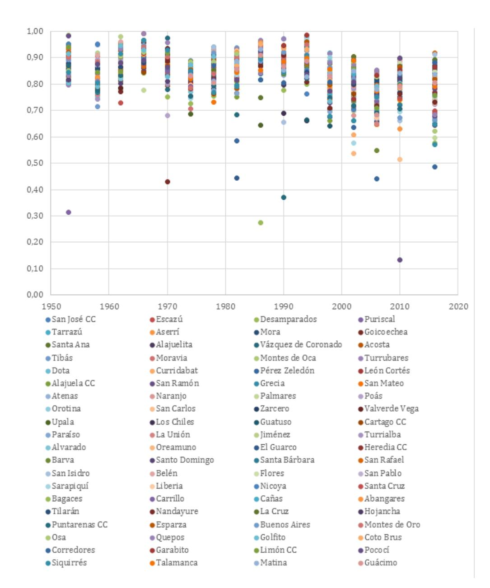
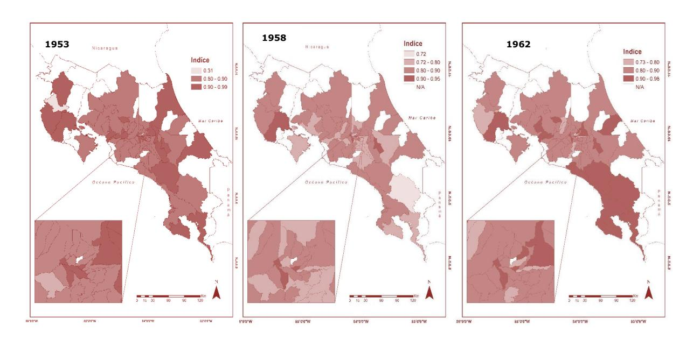
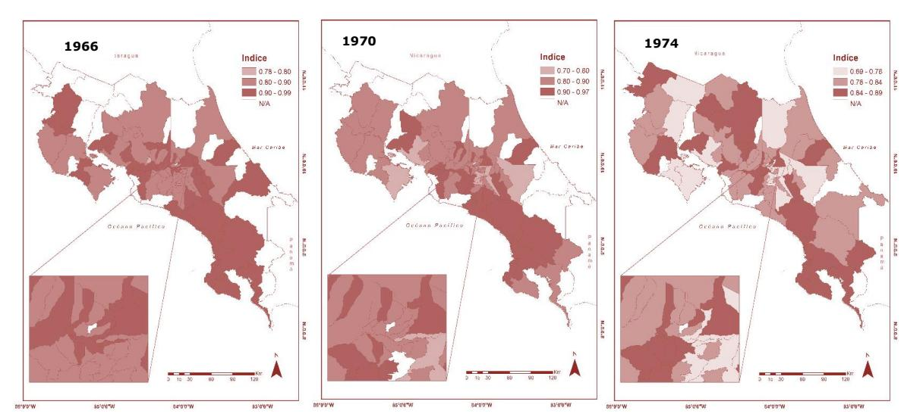
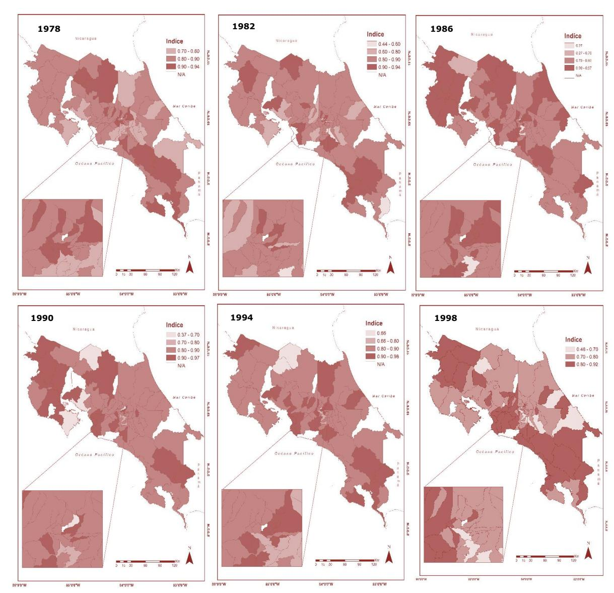
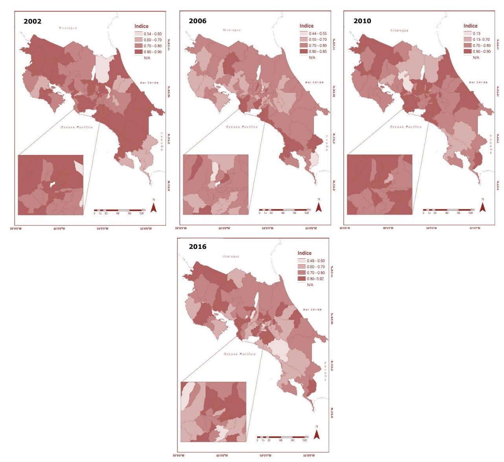
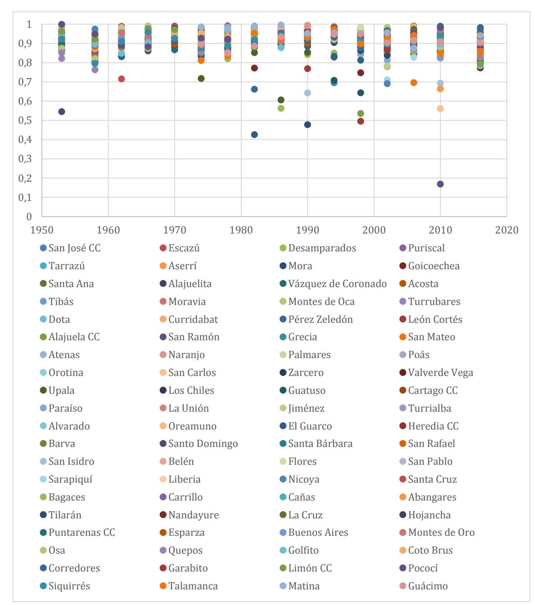
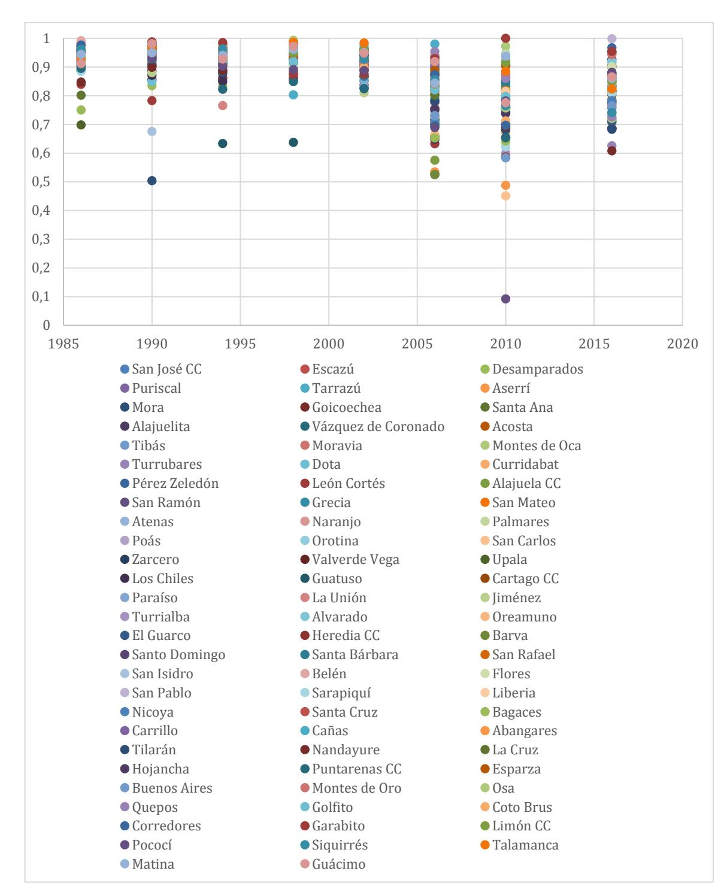
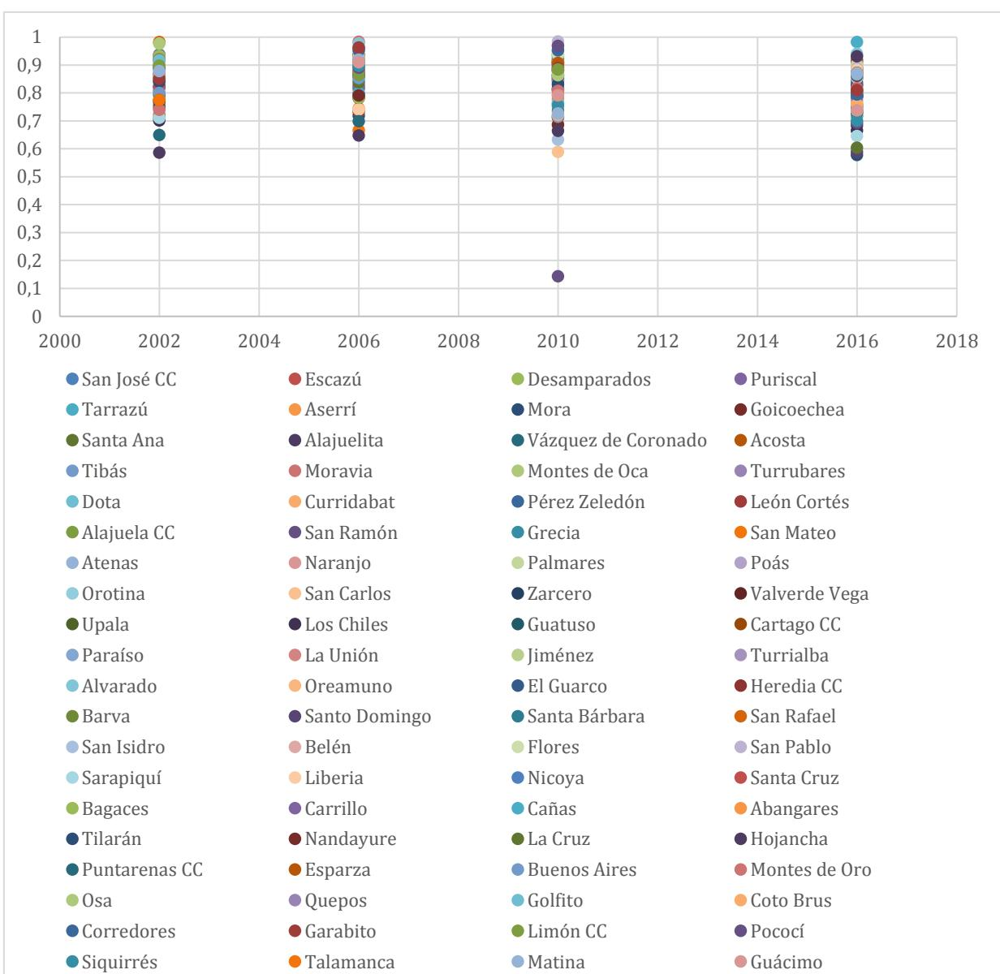

# El sistema de partidos en los cantones: análisis de la distribución territorial de los apoyos (1953-2016)\*

María José Cascante\*\* Sharon Camacho Sánchez\*\*\*

**DOI 10.35242/RDE\_2019\_28\_11**

**Nota del Consejo Editorial**

**Recepción:** 15 de mayo de 2019

**Revisión, corrección y aprobación:** 11 de junio de 2019.

**Resumen:** Por medio de un análisis del voto por territorio desde el año 1953, enfocado en el sistema de partidos, el artículo examina la fortaleza o debilidad del respaldo electoral municipal y la relación entre el apoyo obtenido, con los partidos políticos que han llegado a la presidencia; con el objetivo de hacer un examen del comportamiento de estos partidos políticos a nivel de las unidades territoriales y conocer el grado de homogeneidad territorial de los apoyos, a través de una comparación de los patrones de comportamiento entre los municipios, así como en el tiempo.

**Palabras clave**: Sistema de partidos políticos / Elecciones municipales / Fragmentación electoral / Comportamiento electoral.

**Abstract:** The article examines the strength or weakness of the municipal electoral support and the relation between the support attained and the political parties that have achieved the presidency. The article examines the vote per territory since 1953, focused on the party system with the aim of analyzing the behavior of these political parties at the territorial unit level and also with the aim of knowing the extent of territorial homogeneity of the support by means of a comparison of the behavioral patterns among municipalities and throughout time.

**Key Words:** Political party system / Municipal elections / Electoral fragmentation / Electoral behavior.

 \* Este artículo se realizó con datos electorales del Tribunal Supremo de Elecciones (TSE) de Costa Rica y con el apoyo de las asistentes de investigación Rebeca Solano, Karla Acuña, Camila Rodríguez, Sara Blanco, Wendy León, Natasha Mejía, Yoselin Solano, Mariana Castro y María Fernanda Durán.

\*\* Costarricense, politóloga, correo [mariajosecascante@gmail.com.](mailto:mariajosecascante@gmail.com) Licenciada en Ciencias Políticas por la Universidad de Costa Rica. Máster en Estudios Latinoamericanos y doctora en Estado de Derecho y Gobernanza Global por la Universidad de Salamanca. Profesora de la Escuela de Ciencias Políticas, investigadora y subdirectora del Centro de Investigación y Estudios Políticos y directora del Doctorado en Gobierno y Políticas Públicas de la Universidad de Costa Rica.

\*\*\* Costarricense, geógrafa, correo [sharon.macamacho@gmail.com.](mailto:sharon.macamacho@gmail.com) Estudiante de licenciatura en Geografía en la Universidad de Costa Rica.

### **1. INTRODUCCIÓN**

Costa Rica se había caracterizado desde 1953 por tener un sistema de partidos políticos a nivel nacional con una competencia bipolar y estable, que luego se consolidó en un bipartidismo (Rovira, 2007; Hernández, 2001). A partir de 1998 y hasta la actualidad, se ha experimentado un aumento de la fragmentación de la competencia, la competitividad, la volatilidad electoral agregada y el abstencionismo (Cascante, 2016). A raíz de estos cambios es importante preguntarse si el comportamiento electoral de las municipalidades responde a las mismas lógicas que elecciones las nacionales; esto es relevante para el estudio de la participación, especialmente desde que las elecciones municipales se realizan de manera separada de las nacionales, lo que afecta aún más el abstencionismo de los votantes en dichas elecciones.

Con miras a analizar el sistema de partidos desde la perspectiva de la fortaleza o debilidad del respaldo electoral municipal y la relación que esto tiene con la participación, se busca conocer el grado de homogeneidad territorial de los apoyos, a través de una comparación de los patrones de comportamiento entre los municipios, así como en el tiempo. Este tipo de estudios se ha hecho a nivel de sistema de partidos nacional (nacionalización de los partidos), pero no de unidades subnacionales territoriales -como los cantones-, por lo que se trata de un análisis exploratorio que busca conocer la dinámica del sistema de partidos en la unidad territorial base de organización política de Costa Rica: el municipio (Jones y Mainwaring, 2003; Leiras, 2009 y Alfaro, 2010)1 .

Una distribución homogénea de los apoyos del sistema de partidos local es un reflejo de la estabilidad de la democracia local, ya que la mayoría de los partidos que compiten por puestos en el concejo municipal obtendría un porcentaje similar a lo largo de los distritos del territorio, mientras que un puntaje menor en el índice implica concentración de votos en distritos específicos; es decir, una distribución heterogénea de los apoyos, lo que puede significar descuido de algunos distritos o movilizaciones clientelares de los votos, incluso mayores niveles de abstencionismo o una participación desigual de las y los votantes del cantón. Esto puede ser una indicación de baja calidad de la democracia local, especialmente cuando se mezcla con bajos niveles de participación electoral.

 1 Se entiende como sistema de partidos a la interacción regular y recurrente entre partidos en un escenario dado (Wolinetz, 2006, p. 51).

Para el presente artículo, el análisis estará enfocado en el sistema de partidos y su relación con los partidos políticos que han llegado a la presidencia del país (Partido Liberación Nacional-PLN, el Partido Unidad Social Cristina-PUSC y el Partido Acción Ciudadana-PAC). Con el objetivo de hacer un esfuerzo de análisis del comportamiento de estos partidos políticos en las unidades territoriales, pero con el conocimiento de que un artículo de esta naturaleza no puede ser exhaustivo.

Para la construcción del índice se utilizaron datos de los cantones del país, que cuentan con dos o más unidades territoriales menores (distritos2) y para todos los partidos políticos que recibieron más de un 5% de votos en las elecciones para los concejos municipales de 1953 a 2016, como se ha realizado en otras investigaciones de nacionalización3 . La utilización de este índice permite observar cómo el apoyo a lo largo del territorio puede variar, y así contribuir a identificar la dinámica de la competencia local, a partir de los resultados electorales para las elecciones de los concejos municipales. En el entendido de que el apoyo a los partidos políticos en competencia y la dinámica de esta competencia pueden variar a lo largo del territorio y del tiempo.

Una vez calculado el índice, se procedió a clasificar los resultados encontrados. En esta clasificación no se siguió la propuesta de Jones y Mainwaring (2003), debido a las particularidades de participación electoral local. Los mapas temáticos representan a través de la degradación de tonos en grises la forma en que se distribuyen los apoyos en el espacio geográfico, en este caso específico, en cada municipalidad. De manera que se puede observar el patrón geográfico del índice a escala cantonal para todo el país, lo que permite identificar cantones con comportamientos interesantes según su distribución. Debido a que el índice tiene valores mínimos y máximos que varían considerablemente entre cada año, no se pudo establecer clases específicas bajo un método estadístico para crear mapas con una clasificación estándar, por lo que dependiendo de los rangos del índice para cada año, se establecieron tres o cuatro clases manuales tratando de que estas tuvieran un patrón general que pueda ser comparable.

 2 Si el cálculo se realiza en un cantón de distrito electoral único el resultado será 1, ya que no hay variación territorial.

3 Vale la pena aclarar que se ha aplicado el mismo cálculo en todos los cantones costarricenses que cumplen con este requisito; no obstante, no todos los cantones tienen la misma cantidad de distritos. Es decir, hay una variabilidad de las unidades territoriales que son la base del cálculo del índice. Adicionalmente, tampoco en todos los cantones compiten los mismos partidos.

Esta categorización de los resultados permite una visualización adecuada a través de mapas de análisis presentes en la tercera sección, para conocer con mayor detalle el componente dinámico del índice, en relación no solo con el resultado individual por cantón en cada elección, sino con el patrón geográfico de su alrededor y a nivel país. Luego, se hace un análisis de los resultados del índice para los partidos seleccionados. Finalmente, se presentan las conclusiones y los hallazgos más importantes, donde resalta que en los índices de la distribución geográfica de los apoyos del sistema de partidos es posible identificar dinámicas cambiantes espaciales y temporales, así como la disminución del índice a partir de la elección de 1998.

## **2. DISCUSIÓN TEÓRICA**

Los estudios comparados sobre América Latina se enfocan en la nacionalización del sistema de partidos y los partidos políticos4 y el impacto que esto tiene sobre las políticas públicas o la calidad de la democracia (Jones y Mainwaring, 2003; Leiras, 2009 y Alfaro, 2010). Esta línea de investigación tiene como premisa que la nacionalización es beneficiosa para la democratización, al reducir el clientelismo y la corrupción de la política local. Jones y Mainwaring (2003) lo corroboran al analizar el impacto que tiene la estructura y organización de los partidos políticos y los sistemas de partidos y cómo esto refleja una parte importante de las dinámicas de la competición partidaria. Con respecto a Centroamérica, Alfaro (2010) también analiza los distintos factores que explican la nacionalización de los partidos y Cascante (2011, p. 46) brinda una comparación entre este índice y el de congruencia para los casos de Costa Rica y Nicaragua, determinando que en general el comportamiento de los apoyos en el territorio tiende a ser constante, con el aporte de este artículo se busca conocer si esto se da también a nivel municipal.

La perspectiva teórica que sostiene la aplicación de este índice a nivel local es la misma de la nacionalización, a pesar de las diferencias en el nivel de análisis. Un sistema de partidos cantonal con alto puntaje en el índice puede ser ventajoso para la legitimidad de la democracia local, ya que los partidos políticos logran tener lealtades o apoyos a lo largo de todo el territorio (Jones y Mainwaring, 2003); es decir, en cada uno de los distritos, mientras más alto

 4 La formación de sistemas de partidos nacionalizados ha sido estudiada de manera extensiva a nivel nacional (Schattschneider, 1960; Strokes, 1970; Sundquist, 1970; Chhibber y Kollman, 2004 y Caramani, 2004), especialmente en los Estados Unidos, pero también en Europa occidental.

es el resultado del índice, más homogénea es la distribución del voto en el territorio. Esto les permite a los partidos una relación más cercana con el electorado, mejores procesos de rendición de cuentas, etc. Además, una distribución territorial estable de los apoyos en los cantones (alto puntaje en el índice) que debería ir acompañada de una participación política también estable.

Todo esto concuerda con lo establecido por Alfaro (2010, p. 3), debido a que la nacionalización determina el "comportamiento de los partidos, las prioridades gubernamentales y la consolidación de la democracia" (Alfaro, 2010, p. 3). Y así, cuando los partidos políticos reciben una distribución uniforme de los apoyos en el territorio serán más capaces de agregar las demandas sociales en el ejercicio gubernamental y de implementar políticas con un espectro social más amplio, a diferencia de los apoyos a los partidos que se encuentran localizados o con una distribución heterogénea, que pueden ser prisioneros de iniciativas parroquiales para atraer votos y esto se verá reflejado en un índice de la distribución territorial de los apoyos en el sistema de partidos bajo.

Para el cálculo del índice de distribución territorial de los apoyos se utiliza la resta de 1 del Coeficiente de Gini, para cada partido político en competencia y, posteriormente, se agregan -teniendo en cuenta el peso electoral- para calcular el índice del sistema de partidos; es decir, el índice se compone de dos elementos: la distribución de los apoyos de los partidos políticos y del sistema de partidos, utilizando la siguiente fórmula:

Gi = (n∑XiYi+1)-( n∑Xi+1Ti) 1=1

Mientras más se acerque el índice a 1 (alto), más homogéneos son los resultados electorales del partido político o del sistema de partidos. Con el objetivo concreto de analizar la distribución del voto en el territorio se utilizará el índice propuesto por Jones y Mainwaring (2003), adaptando la interpretación de los resultados a nivel de cada cantón costarricense.

Como se estableció anteriormente, la agregación del índice de nacionalización de los partidos políticos determina en qué medida un sistema de partidos se encuentra más o menos nacionalizado. Con esto se pretende profundizar en análisis territoriales que no sigan lógicas del centro a la periferia, sino sobre los distintos electorados que caracterizan actualmente la sociedad

costarricense5 . Este análisis es importante debido a que brinda información sobre una cantidad relevante de unidades territoriales de un mismo país a través del tiempo, lo que permite conocer con mayor detalle la dinámica de la competencia local del país, así mismo, debido a la utilización de este índice también es posible que se realicen comparaciones con otros países, cuando la información esté disponible.

Aunque es posible calcular la distribución de los apoyos en el territorio, tanto de las elecciones para alcaldes como para concejos municipales, se seleccionaron estas últimas, en línea con la propuesta de Jones y Mainwaring (2003, p. 9), de que las arenas de competencia para elecciones ejecutivas tienden a puntear más alto en el índice -debido a la importancia que tienen los ejecutivos en los sistemas presidencialistas-; en cambio, en la lucha por el concejo municipal es más probable determinar con mayor precisión la distribución real de los apoyos de los partidos, más allá de los liderazgos personalistas que se pueden desarrollar en la contienda por las alcaldías, lo que se analizará en detalle en la siguiente sección.

## **3. DISTRIBUCIÓN DE LOS APOYOS EN LOS CANTONES COSTARRICENSES**

Esta sección se dedica a presentar la información de los resultados del índice, con miras a conocer las relaciones dinámicas que tienen los partidos políticos con el voto en el territorio, específicamente para la elección de los concejos municipales desde 1953. A partir del 2002 se separan las elecciones municipales de las nacionales, aunque es hasta el 2016 que se realizan a mitad del periodo y se incluye en el mismo proceso la elección de los regidores, en este momento se vuelve evidente que al separar dichos comicios las elecciones municipales se ven afectadas por un alto nivel de abstencionismo. En la tabla 1 se resume la información más importante con respecto a las características institucionales en que se producen dichas elecciones y los promedios del índice de distribución territorial de los apoyos; en esta se muestra una disminución del promedio en las elecciones de 1998, momento político que -como se ha señalado antes- ha marcado el tipo de competencia electoral que actualmente vive Costa Rica y que ha sido estudiado principalmente a nivel nacional. A partir de 1998 el promedio del índice se mantienen en los 0,7.

 5 Siguiendo la lógica de Pignataro y Cascante (2018) de que los electores costarricenses son diversos y las decisiones con respecto al voto son múltiples.

## Tabla 1

*Calendario electoral, cantones, promedio de abstencionismo y promedio del índice de distribución territorial de los apoyos en Costa Rica, 1953-2016*

*Nota:* Construcción con base en datos del TSE.

\* Se incluye entre paréntesis el abstencionismo para las elecciones de alcaldes, vicealcaldes, intendentes, síndicos, concejales y 32 concejales municipales de distrito.

A continuación, en la figura 1 se presentan los índices de la distribución territorial de los apoyos para el sistema de partidos en las elecciones de concejos municipales entre 1953 y 2016. Se observa que en general el índice se comporta como en oleadas de cambio donde los cantones se movilizan hacia mayores o menores posiciones, el movimiento más drástico a partir de 1998 queda claramente plasmado en la figura 1. La mayoría de los cantones tienen índices que se ubican en los niveles altos de clasificación de 1953 a 1994 entre 0,8 y 0,9 y luego de 1998 entre 0,7 y 0,9.

*Figura 1.* Distribución territorial de los apoyos, 1953-2018.

A continuación, se analizarán los resultados de los cálculos del índice para las elecciones de concejos municipales de las 16 elecciones que se producen entre 1953 a 2016 a través del análisis de cartografía temática, para observar con mayor detenimiento los comportamientos específicos que se han desarrollado de manera simultánea con las etapas del desarrollo del sistema de partidos costarricense y continuar con las explicaciones de esos comportamientos desde una visión dinámica de la competencia.

### **3.1. DISTRIBUCIÓN DE LOS APOYOS ENTRE 1953 Y 1998**

Esta primera etapa está compuesta por las primeras elecciones luego del establecimiento de la Segunda República hasta 1994. Una de las características principales de este periodo es el surgimiento del PLN en 1951, generándose así, a partir de ese momento, una competencia bipolar entre el PLN y coaliciones en constante cambio como oposición, además de la "existencia de algunos partidos minoritarios de carácter nacional o provincial que a pesar de obtener alguna representación a nivel de la Asamblea Legislativa o de las Municipalidades, no alteran en lo fundamental, el predominio del PLN y de la otra agrupación mayoritaria" (Hernández, 1998, p. 7). A partir de ese momento se definen características centrales del sistema de partidos costarricense, que van a mantenerse casi constantes hasta 1998.

Con respecto a la competencia electoral, en primer lugar, el periodo de 1953 a 1962 se trata de una etapa de consolidación del sistema de partidos, como bien lo señala Hernández (1998). En la figura 1 se puede ver que la mayoría de los cantones para la elección de 1953 tienen índices entre 0,8 y 0,9 a excepción del cantón Carrillo en Guanacaste con un índice muy bajo de 0,3. Es decir, los partidos políticos lograron conseguir votos de manera homogénea en los distritos que conforman cada cantón. Sin embargo, los cantones con índices altos de 0,9 se localizan principalmente fuera de la región central del país, por ejemplo: cantones Limón, Pococí, Golfito, Pérez Zeledón, Atenas, Liberia, entre otros. En la región central se pueden mencionar cantones como San José, Escazú, Vázquez de Coronado, Tibás, Moravia, entre otros.

Según lo anterior, es interesante cómo aquellos cantones con índices de 0,9 tienden a agruparse, es decir, pueden observarse pequeños conglomerados de dos o tres cantones con este comportamiento dentro del núcleo de cantones con índices de 0,8.

Para la elección de 1958, como se observa en la figura 1, son menos los cantones con índice de 0,9 si se compara con 1953. Además, de los cinco cantones con índice de 0,9 sólo dos de ellos, Nicoya en la provincia Guanacaste y Jiménez en la provincia Cartago, se ubican en la periferia del país o bien, son cantones rurales. Los demás: Belén, Escazú y Tibás se concentran en el centro del país. Por otro lado, la mayor parte de los cantones tienen niveles de clasificación media, específicamente en valores de 0,8, lo que indica que la distribución del apoyo en el territorio por parte de los partidos fue uniforme.

Sobresalen casos de cantones con índices entre 0,7 y 0,8 que tienden a concentrarse en sitios periféricos del centro del país. Para el caso de la elección municipal de 1962, se puede ver cómo se mantiene el patrón observado desde 1953 con altos índices de distribución de los apoyos, ver figura 2. Particularmente, sobresalen los cantones Quepos, Osa, Golfito, Pérez Zeledón y Buenos Aires al sur del país al formar un conglomerado de cantones con índices de 0,9.

Si se comparan los datos de la distribución de los apoyos del sistema de partidos con los obtenidos por el PLN, se observa un patrón similar, al ser un partido que inicia su participación en la política electoral con un apoyo relativamente homogéneo en el territorio.

*Figura 2*. Distribución geográfica del índice para la elección municipal de 1953 a 19626 . Blanco y Camacho (2018).

Los siguientes años muestran un comportamiento similar; no obstante, se observa en la distribución de los apoyos ciertas diferencias con la etapa inicial, esto porque se da una transición de un mapa más homogéneo en 1966 a otros

 6 Las primeras series de mapas nos muestran que el número de cantones que existía en este periodo era mucho menor que el actual, por lo que la distribución geográfica era distinta, y por esa razón se observa una gran cantidad de cantones señalados como "no aplica", en este momento Costa Rica tenía entre 65 y 68 cantones (figura 1).

más dinámicos. Cuestión interesante, ya que es a partir de 1974 cuando se lleva a cabo el aumento del número de cantones en el país: pasan a ser 77. La figura 3 incluye la serie de mapas de este periodo.

Como se mencionó anteriormente, la elección del año 1966 muestra la tendencia de una distribución homogénea de los apoyos hacia los partidos políticos, con índices principalmente entre 0,8 y 0,9. En el mapa de 1966, en la figura 3 se destaca la relación de cercanía entre cantones con un mismo comportamiento (índice de 0,9), como es el caso de los cantones Jiménez, Paraíso, Alvarado, Cartago y Vázquez de Coronado, así como Alajuela, Atenas, San Mateo, Montes de Oro, entre otros.

Para 1970 continúa la tendencia de niveles altos de distribución de los apoyos, así como el conglomerado de cantones con índices de 0,9 al sur del país. No obstante, llama la atención que se empieza a dinamizar el centro del país al mostrar relaciones interesantes entre cantones con índices bajos y altos.

El índice para los cantones en la elección de 1974 resulta interesante debido a que muestra mayor variedad de relaciones entre los valores de este. En primer lugar, en el mapa de 1974 de la figura 3 se puede ver cómo aparecen más cantones con índice bajos, o bien, se empieza a observar cómo en ciertos cantones las condiciones de competencia partidaria van cambiando. De manera que, aunque la tendencia a agruparse según el índice que obtuvo cada cantón se sigue observando, se puede ver mayor dinamismo con respecto a las relaciones entre grupos de cantones con alta distribución del apoyo. Este año se caracteriza porque ningún cantón obtiene un índice de 0,9.

*Figura 3.* Distribución geográfica del índice para la elección municipal de 1966 a 1974. Blanco y Camacho (2018).

Al analizar los siguientes años, posteriores a 1974, se debe tener en cuenta que este es el periodo del bipartidismo costarricense. Esta etapa se caracteriza por la consolidación del PUSC en 1983, como la segunda fuerza política mayoritaria y con capacidad de disputarle el gobierno nacional y local al PLN. A esto se suma que los partidos minoritarios se vuelven irrelevantes en relación con su peso político, precisamente por la acumulación de caudal electoral que tienen estos dos partidos políticos (Hernández, 1998, p. 9), esto es fundamental porque se impone un modelo de competencia bipartidista y de alternancia en el ejecutivo, que se vuelve característico de la política costarricense (Cascante, 2016a) y que ha permeado los análisis sobre nuestro sistema político. Con respecto al ordenamiento geográfico del país, la distribución de los cantones es la misma que tenemos hasta la actualidad7 .

A pesar de que es la etapa fuerte del bipartidismo costarricense a nivel nacional, la distribución territorial de los apoyos muestra poca diferencia con respecto a la dinámica que se pudo observar en los años anteriores, ya que se mantiene una distribución geográfica homogénea de índices entre 0,8 y 0,9. Esto conlleva pensar que cada cantón y cada votación parecieran regirse por dinámicas propias de la competencia en el territorio para elegir a sus representantes ante el concejo municipal.

Este período se caracteriza porque empieza a notarse una disminución en los valores de distribución de los apoyos, específicamente en las elecciones de 1982 y 1986, ver figura 4, en que 1998 es el año que marca el inicio de un nuevo periodo en el que el índice no alcanza valores entre 0,9 y 1. Para esta elección el valor máximo fue de 0,92, e igualmente se siguen observando agrupaciones de cantones vecinos con comportamientos similares.

 7 A partir del 2017 se suma el cantón número 82: Río Cuarto de la provincia de Alajuela.

*Figura 4*. Distribución geográfica del índice para la elección municipal de 1978, 1982, 1986, 1990, 1994 y 1998. Blanco y Camacho (2018).

## **3.2. DISTRIBUCIÓN DE LOS APOYOS ENTRE 2002-2016**

La etapa más reciente del sistema de partidos costarricense también coincide con la presencia de resultados de índice altos, pero no tan altos como en los periodos anteriores (0,8 en su mayoría) en la distribución territorial de los apoyos. No obstante, cada año muestra dinámicas distintas en la distribución de relaciones entre cantones con índices altos y medios. Por ejemplo, en el

mapa de 2002 en la figura 5 se observa cómo en la zona norte y sur del país es donde se concentra la mayor cantidad de cantones con índices entre 0,8 y 0,9 rodeados a su vez de cantones con niveles de distribución de apoyo más bajos.

La elección de 2006 llama la atención por ser la que muestra menor cantidad de cantones con índice de 0,8 en este periodo. En total solo dieciséis cantones superan este valor, además, como se ve en el mapa de 2006 en la figura 4, se ubican principalmente en lo que se conoce como resto del país o cantones periféricos. Por otra parte, es evidente cómo en este año los índices medios están ampliamente distribuidos en todo el país y los bajos tienden a agruparse al norte del país en Guanacaste y algunos cantones de Cartago.

Las dos últimas elecciones muestran mayor presencia de cantones con distribución homogénea de los apoyos hacia los partidos en todos sus distritos, al presentar índices de 0,8, y se observa para 2016 el surgimiento de más cantones con valores del índice entre 0,6 y 0,7. Sin embargo, el comportamiento dominante es de cantones con índices de 0,7 en todo el país.

Aunque no se observan mayores cambios en la distribución geográfica del país, esta etapa sí coincide con cambios importantes en la competencia a nivel nacional, especialmente el surgimiento de partidos políticos nuevos que retan a los liderazgos del bipartidismo y aumento del abstencionismo (Rovira, 2001 y 2007; Seligson, 2001; Hernández, 2001; Sánchez, 2003 y 2007 y Cascante, 2016a); en la última elección municipal (2016), como se mencionó, se observa el aumento de índices con valores bajos, esto resulta interesante, ya que esta es la primera elección a mitad de periodo en que se elige de manera conjunta y separada por dos años a todas las autoridades municipales y el alto abstencionismo de las elecciones municipales afecta también la elección de los concejos municipales8 , en este sentido esta elección y estos datos de la distribución territorial de los apoyos se diferencia de todas las anteriores.

 8 Aunque ya se elegían de manera separada (por dos meses) algunas autoridades municipales desde el 2002.

*Figura 5.* Distribución geográfica del índice para la elección municipal de 2002, 2006, 2010 y 2016. Blanco y Camacho (2018).

### **4. DISTRIBUCIÓN DE LOS APOYOS EN LOS CANTONES COSTARRICENSES PARA LOS PARTIDOS POLÍTICOS**

Se han seleccionado, para retratar la distribución de los apoyos en los cantones costarricenses, los tres partidos políticos que han llegado al poder ejecutivo del país, con miras a complementar el análisis del sistema de partidos realizado en la sección anterior.

En primer lugar, en la figura 6 se observa la distribución de los apoyos que recibe el PLN. Este es el único partido que recibe el 5% de los votos en todos los cantones en todo el periodo de estudio, por lo que su análisis es de sumo interés.

*Figura 6.* Distribución territorial de los apoyos del PLN, 1953-2018.

El PLN es el partido que ha tenido una distribución territorial de los apoyos más uniforme, a lo largo de su consolidación en el sistema de partidos, esto se mantuvo durante el bipartidismo y en la actualidad. Se observa, inclusive, que en la última elección el comportamiento del PLN es más uniforme entre los cantones que en elecciones anteriores, aglutinando la mayoría de los indicadores en niveles altos y medios del índice.

En este sentido, es importante señalar que estos datos vienen a corroborar análisis realizados anteriormente sobre el tema de nacionalización (Caramani, 2004 y Cascante, 2011); y es que esta no necesariamente se ve afectada, aunque se produzcan otros cambios en el sistema de partidos como los que ha tenido la competencia partidista costarricense desde 1998.

El PUSC como partido político compite por primera vez en las elecciones de 1986, su presencia adicionalmente abre el periodo del bipartidismo costarricense. Ligado a esto, en estas primeras cinco elecciones el PUSC presentaba índices en su mayoría altos y medios, llegando a su punto más compacto en el 2002 con índices mayores a 0,8 en todos los cantones del país. A partir de 20069 se evidencia una mayor dispersión e incluso cantones en los que no se alcanza el 5% de los votos.

 9 Puede ser consecuencia de los escándalos de corrupción que en 2004 afectaron a dos expresidentes pertenecientes al PUSC. Tanto Miguel Ángel Rodríguez (por el caso ICE-Alcatel), como Rafael Ángel Rodríguez (por el caso CCSS-Fischel) fueron acusados y condenados.

*Figura 7.* Distribución territorial de los apoyos del PUSC, 1986-2018.

Es precisamente en la elección de 2002 en la que irrumpe el PAC como actor importante de la competencia partidista. La característica principal del comportamiento del índice para el PAC es que es menos cohesionado en su comportamiento, manteniendo valores altos, medios y bajos a lo largo de su participación política en las elecciones por los concejos municipales.

*Figura 8.* Distribución territorial de los apoyos del PAC, 2002-2018.

### **5. CONCLUSIONES**

A lo largo de este capítulo se ha logrado describir de manera detallada la distribución de los apoyos en el territorio de 1953 a 2016 para las elecciones de concejos municipales, desde una perspectiva de análisis que busca conocer la relación del comportamiento de la competencia local con la nacional. La primera conclusión que se extrae es que la distribución territorial de los apoyos para elecciones de concejos municipales en Costa Rica, desde 1953, muestra variaciones que asemejan los cambios del sistema de partidos a nivel nacional, especialmente, el descenso en los resultados del índice a partir de 1998.

Además, la distribución geográfica de los apoyos que se puede ver a lo largo del tiempo en las series de mapas muestra cómo no ha habido un patrón especifico del índice. Es decir, la dinámica de cada cantón ha variado de elección a elección; sin embargo, es importante tener en cuenta que los índices se han mantenido en valores medios y altos sin cambios extremos. En cada elección los niveles de apoyo varían entre zonas periféricas y centrales, rurales y urbanas, y en algunos casos los mapas muestran una heterogeneidad interesante en la distribución de los resultados.

Se evidenció cómo a pesar de no haber una tendencia de distribución geográfica, en la mayoría de elecciones los cantones cercanos se agrupan con índices muy similares entre sí. Y el cambio más importante que se observa en los mapas es el descenso en el apoyo otorgado a los partidos a partir de 1998 donde el color más fuerte pasa a representar los rangos de 0,8, datos similares a los recogidos por los promedios.

Al analizar los datos específicos de los resultados del índice que presentan algunos partidos políticos seleccionados se encuentran evidencias interesantes. En el caso del PLN el cambio más importante no es una disminución de los altos valores en la distribución territorial de los apoyos, sino una mayor dispersión de los resultados en cantones específicos a partir de 1982. El PLN continúa siendo hasta ahora el partido que recibe una distribución territorial de los apoyos más homogénea de Costa Rica, en promedio los índices son mayores de 0,8 en todo el periodo de estudio.

Los resultados del PUSC muestran dos periodos claramente definidos. Entre 1986 y 2002 los resultados electorales contribuyen a la composición de un índice altamente homogeneizado, con resultados mayores a 0,8 en su mayoría. A partir de 2006 los resultados varían y el índice obtiene mayor amplitud en sus resultados que pasan a ser mayores de 0,6.

El PAC, por su parte, no presenta una gran variación en las cuatro elecciones en las que ha participado en la lucha por la obtención de puestos en los concejos municipales. La distribución de los apoyos en los diferentes cantones no es tan homogénea, por lo que obtiene resultados mayores de 0,6.

### **REFERENCIAS BIBLIOGRÁFICAS**

- Alfaro, R. (2019a). Resultados electorales municipales más recientes. Artículo entregado para la publicación. Alfaro, R. (2019b). Participación en las elecciones municipales. Artículo entregado para la publicación. Alfaro, R. (2010). *Explaining Party Nationalization in New Democracies: Central America (1980-2010)*. (Tesis de maestría). Columbia University. New York, USA. Blanco, S. y Camacho, S. (2018). *Mapas temáticos con base en las bases de datos de distribución territorial de los apoyos*. San José, C.R.: CIEP. Caramani, D. (2004). *The Nationalization of Politics. The Formation of National Electorates and Party Systems in Western Europe*. Cambridge, Cambridge: University Press. Cascante, M. (2016a). Costa Rica. Los cambios en el sistema de partidos costarricense: viejos y nuevos actores en la competencia electoral. En Freidenberg,
- F. (Ed.), *Los sistemas de partidos en América Latina 1978-2015,* pp. 79-110. México D.F.: INE-UNAM. Cascante, M. (Jul.-Dic., 2016b). Elecciones municipales 2016 datos para el análisis del sistema de partidos multinivel. *Revista de Derecho Electoral*, (22), 79-110. Recuperado de http://www.tse.go.cr/revista/revista.htm. Cascante, M. (2011). *Análisis de la competencia electoral en sistemas unitarios. Los casos de Costa Rica y Nicaragua*. Alemania: EAE Business School Chhibber, P. y Kollman, K. (2004). *The Formation of National Party System. Federalism and Party Competition in Canada, Great Britain, India and the United States*. New Jersey: Princeton University Press. Hernández, G. (2001). Tendencias electorales y sistema de partidos en Costa Rica 1986- 1998. En Rovira, J. (Ed.), *Desafíos políticos de la Costa Rica actual,* pp. 255-275*.* San José, Editorial UCR.

- Jones, M. y Mainwaring, S. (2003). The nationalization of parties and party systems: an empirical measure an application to the Americas. *Party Politics,* 9(2), 139-166. Leiras, M. (11-14 de jun., 2009). *Los procesos de descentralización y la nacionalización de los sistemas de partidos en América Latina*. Ponencia presentada en el Congreso de Latin American Studies Association, Río de Janeiro. Programa Estado de la Nación (2014). *Estado de la nación*. Recuperado de https://www.estadonacion.or.cr/20/assets/cap-5-estado-nacion-20-2014-baja.pdf Pignataro, A. y Cascante, M. (2018). *Los electorados de la democracia costarricense: Percepciones ciudadanas y participación en torno a las elecciones nacionales de 2014*. San José: IFED-CIEP. Rovira, J. (2007). El sistema de partidos en devenir. En Rovira, J. (Ed.), *Desafíos políticos de la Costa Rica actual*, pp. 109-136. San José: Editorial UCR. Rovira, J. (2001). ¿Se debilita el bipartidismo? En Rovira, J. (Ed.), *La democracia de Costa Rica ante el siglo XXI*, pp. 195-232. San José: Editorial UCR. Sánchez, F. (2003). Cambio en la dinámica electoral en Costa Rica: un caso de desalineamiento. *América Latina Hoy Revista de Ciencias Sociales*, (35), 115-146. Sánchez, F. (2007). *Partidos políticos, elecciones y lealtades partidarias en Costa Rica*. Salamanca: Ediciones Universidad de Salamanca. Schattschneider, E. (1960). *The Semi-Sovereign People*. New York: Holt, Rinehart and Winston. Seligson, M. (2001). ¿Problemas el paraíso? La erosión en el apoyo al sistema político y centroamericanización de Costa Rica 1978-1999. En Rovira, J. (Ed.), *La democracia de Costa Rica ante el siglo XXI*, 87-120. San José: Editorial UCR. Strokes, D. (1967). Parties and the Nationalization of Electoral Forces. En Chamber,
- W. y Burham, W. (Eds.), *The American Party Systems*: Stages of Political Development. New York: Oxford University Press. Sundquist, J. (1970). *Dynamics of the Party Systems: Aligment and Realigment of Political Parties in the United States.* Washington D.C.: The Brooking Institution. Wolinetz, S. (2006). Party Systems and Party Systems Types. En Katz, R. y Crotty,
  - W. (Eds.), *Handbook of Party Politics*. London: Sage Publications.