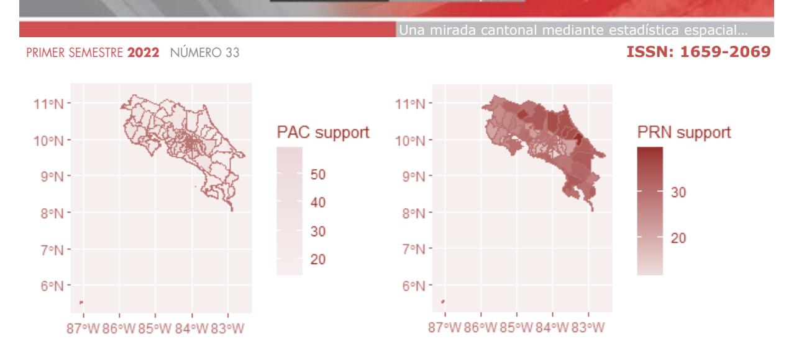

# Una mirada cantonal mediante estadística espacial al efecto del desarrollo humano sobre el apoyo electoral en la segunda ronda de la elección presidencial de 2018

Elías Chavarría Mora\*

**[https://doi.org/10.35242/RDE\\_2022\\_22\\_33\\_5](https://doi.org/10.35242/RDE_2022_22_33_5)**

**Nota del Consejo Editorial**

**Recepción:** 25 de octubre de 2021.

**Revisión, corrección y aprobación:** 14 de enero de 2022.

**Resumen:** ¿Cómo podemos pensar este efecto geográfico sobre la distribución de apoyos electorales en la segunda ronda de las elecciones presidenciales del 2018? Si bien es claro que existió aglomeración geográfica en el apoyo a los dos partidos que participaron en el balotaje, es importante estudiar las causas y la naturaleza de esa aglomeración. A partir de los resultados electorales, el índice de desarrollo humano y polígonos de información geográfica a nivel cantonal, se utiliza un modelo de autorregresión espacial y un modelo de X retrasada espacialmente; los dos modelos de regresión espacial fueron tomados de la literatura econométrica para responder esta pregunta. Los resultados indican que existen diferencias en la naturaleza de la aglomeración entre el apoyo al Partido Acción Ciudadana y el Partido Restauración Nacional, no solo en la dirección del efecto del índice de desarrollo humano, sino también en la naturaleza de la difusión del efecto.

**Palabras clave**: Participación política / Balotaje / Elecciones presidenciales / Distribución de electores / Geografía electoral / Desarrollo humano.

**Abstract:** How can we see this geographic effect on the distribution of electoral support in the runoff of the 2018 presidential elections? Although it is clear that there was geographic agglomeration in the support of the two parties that participated in the runoff, it is important to study the causes for this agglomeration as well as its nature. Utilizing electoral results, the index of human development and geographic information polygons at a county level. A model of spatial self-regression is utilized, and also a model of spatial-delay X, two models taken from econometric literature to explore these questions. The results indicate that there are differences in the nature of the agglomeration between the Partido Acción Ciudadana (PAC) and Partido Restauración Nacional (PRN) not just in terms of the direction of the effect of the human development index but also in terms of the dissemination of the effect.

**Key Words:** Political participation / Runoff / Presidential elections / Distribution of voters / Electoral geography / Human development.

\* Costarricense, politólogo, correo [elc117@pitt.edu.](mailto:elc117@pitt.edu) Maestría en Ciencia Política por la Universidad de Pittsburgh, Estados Unidos; licenciatura en Ciencias Políticas por la Universidad de Costa Rica. Estudiante de doctorado en la Universidad de Pittsburgh. Investiga sobre política comparada y comportamiento político. ORCID: 0000-0001-6424-3915.

### **1. INTRODUCCIÓN**

Las elecciones presidenciales del 2018 en Costa Rica han sido consideradas como atípicas y de gran importancia para el futuro del país, por lo que han dado paso a sendas investigaciones sobre el proceso electoral y sus resultados (Alfaro y Alpízar, 2020; Rodríguez et al., 2019; Rojas y Treminio, 2019 y Siles, 2020). Por tercera vez en la historia reciente del país, ninguno de los partidos que competían obtuvo suficientes votos para poder obtener la silla presidencial en la primera ronda, por lo cual los dos más votados pasaron a un balotaje el primero de abril. Estos dos partidos fueron el centro-izquierdista Partido Acción Ciudadana (PAC) y el Partido Restauración Nacional (PRN), conservador y con cercanías al neopentecostalismo religioso. El PRN ha sido, además, descrito por expertos como un partido con cercanías al populismo y la derecha radical (Pignataro y Treminio, 2019 y Siles et al., 2021), precisamente uno de los motivos por los cuales se le ha dado tanta atención a la elección.

Un importante ángulo de análisis terminó siendo el peso del factor geográfico sobre los resultados de la elección. El porqué de esto resulta evidente al ver en un mapa el apoyo obtenido por cada partido en la segunda ronda, como se muestra en la figura 1. En general, se nota que las áreas con mayor desarrollo económico en el centro del país mostraron una tendencia por apoyar al PAC; mientras que las áreas con menor desarrollo en la periferia mostraron un mayor apoyo por el PRN, en especial en las regiones al norte y este del país. ¿Cómo podemos pensar este efecto geográfico sobre la distribución de apoyos electorales en la segunda ronda de las elecciones presidenciales de 2018?

*Figura 1*. Apoyo electoral a nivel de cantón para PAC y PRN para la segunda ronda de la elección presidencial, 2018. Elaborado con datos del TSE y polígonos de GADM.

# **2. EL ELEMENTO GEOGRÁFICO**

La distribución espacial tiene un efecto en las opiniones y comportamiento político dada la influencia contextual de vivir en una comunidad, la potencia de difusión de esa influencia, las limitaciones geográficas al movimiento e incluso el desarrollo de identidades sociales (Cho y Gimpel, 2012). Entre los estudios que se han abocado a esclarecer cómo el factor geográfico ha impactado resultados electorales en Costa Rica, se ha observado que tanto en el 2014 como en el 2018 clivajes de tipo cultural, procesos de desnacionalización de los partidos políticos y factores socioeconómicos han repercutido en la distribución geográfica del voto (Cascante et al., 2020). La densidad de templos cristianos no católicos a nivel cantonal resulta también una variable relevante y sumamente innovadora para explicar el aglutinamiento territorial de apoyo a Restauración Nacional en la elección del 2018 (Rodríguez et al., 2019).

El nivel de desarrollo económico parece tener un efecto en la distribución geográfica de apoyo a los partidos políticos en la segunda ronda de las elecciones del 2018. El índice de desarrollo humano puede verse como una medida más amplia, puesto que suma al ingreso medio por cantón otras variables importantes de estatus socioeconómico tales como el nivel educativo medio por cantón, así como la calidad de vida, también claro, tomando el promedio cantonal.

A partir de lo previamente expuesto, considero el índice de desarrollo humano como una variable explicativa para el nivel de apoyo electoral

para cada uno de los partidos que compitieron en la segunda ronda. La hipótesis es que un nivel más alto de desarrollo humano se correlacione con un nivel más alto de apoyo por el PAC (��1), mientras que un nivel más bajo de desarrollo humano se correlacione con un mayor apoyo al PRN (��2). Exploraré esta relación a nivel de cantón, utilizando la distribución geográfica que existía antes del 20 de abril del 2018, pues es la que correspondía a la fecha de la elección; es decir, cuando el país contaba con 81 cantones, a diferencia de los 82 actuales.

## **3. DATOS**

Para probar la relación entre el índice de desarrollo humano y el apoyo electoral para cada partido, se creó una base de datos a partir de diferentes fuentes. Primeramente, uso los datos oficiales de resultados electorales del Tribunal Supremo de Elecciones (s. f.), los cuales están desagregados hasta el tercer nivel administrativo e incluyen el número total de votantes registrados por unidad geográfica, el número de votos que obtuvo cada partido, el número de votos nulos y el número de votos en blanco. Para los datos de desarrollo humano, utilizo el Atlas de Desarrollo Humano Cantonal del Programa de la Naciones Unidas para el Desarrollo (s. f.).

La variable dependiente es el porcentaje de votos obtenidos por cada partido en la segunda ronda de las elecciones en cada cantón, mientras que la variable independiente es el desarrollo humano a nivel cantonal. En cuanto a la información geográfica necesaria para el análisis, uso los *shapefiles*1 con los datos geográficos de Costa Rica en su segundo nivel administrativo, obtenidos del sitio web de *Database of Global Administrative Areas* (GADM).

## **4. MÉTODOS**

Aunque el aglutinamiento espacial en el apoyo por cada partido es relativamente claro con solo ver los mapas de la figura 1, es preferible probar la relación mediante el índice estadístico I de Moran2 . Para

1 Formato de representación vectorial desarrollado por *Enviromental Systems Research Institute* [\(ESRI\)](http://www.esri.com/). Consta de un número variable de archivos, en los que se almacena digitalmente la localización de los elementos geográficos

2 Medida de autocorrelación espacial desarrollada por [Patrick Alfred Pierce Moran.](https://es.wikipedia.org/w/index.php?title=Patrick_Alfred_Pierce_Moran&action=edit&redlink=1) La autocorrelación espacial se caracteriza por la correlación de una señal entre otras regiones en el espacio.

calcularlo, creé una matriz de pesos espaciales con el lenguaje de programación R3 utilizando la función poly2nb del paquete *spdep*4y los *shapefiles* de GADM.

Con respecto al apoyo electoral al PAC, el I de Moran es 0.59, con un peso espacial (p) menor que 0.05. Esto indica que la hipótesis nula, es decir, que los datos están distribuidos al azar en el espacio, debe de rechazarse. Esto significa que hay presencia de agrupamiento espacial. Con respecto al PRN, el I de Moran es 0.41 con un valor de *p* también menor que 0.05, también apunta que se debe rechazar la hipótesis nula. Por tanto, el porcentaje de apoyo a nivel cantonal para ambos partidos muestra agrupamiento espacial que es de esperarse considerando que se está viendo el porcentaje de apoyo para dos partidos.

Para escoger el modelo de regresión adecuado, pruebo si el agrupamiento está en los observables o en los inobservables, o si existe interdependencia en los resultados o es necesario un modelo de dos fuentes. Con esto me refiero a saber si el agrupamiento es en variables explicativas incluidas en el modelo o en variables explicativas excluidas y, por tanto, su efecto queda atrapado por el término de error.

Para esto, uso una prueba de multiplicadores de Lagrange tanto para el retraso de un periodo (*lag*) de la variable explicativa como para el término de error. La tabla 1 muestra los resultados, dado que hay una diferencia entre los resultados normales y la versión robusta de las pruebas, es preferible enfocarse en las pruebas de multiplicadores de Lagrange robustas para escoger el modelo.

Para el apoyo electoral al PAC, mientras la prueba del multiplicador de Lagrange del error rechaza la hipótesis nula, la prueba del multiplicador de Lagrange del *lag* falla en rechazar la hipótesis nula. Esto sugiere que existe interdependencia del resultado, es decir, que el agrupamiento está en la variable dependiente, lo que indica la necesidad de usar un modelo de autorregresión espacial (*spatial autoregression*, SAR). Por su parte, con respecto al apoyo electoral del PRN, ambas pruebas robustas fallan en rechazar la hipótesis nula, lo cual sugiere que el agrupamiento se

3 El lenguaje de programación R se utiliza para el análisis de datos, manipulación de datos, gráficos, computación estadística y análisis estadístico. En resumen, el lenguaje R ayuda a analizar conjuntos de datos más allá del análisis básico de archivos de Excel

4 El paquete *spdep* proporciona una colección de funciones para crear objetos de matriz de pesos espaciales. Por otro lado, la función poly2nb del programa crea una lista de vecinos basada en regiones con límites contiguos, que comparte uno o más puntos de límite.

encuentra en los observables, es decir en la variable independiente, por tanto, utilizo un modelo de X retrasada espacialmente (spatially lagged X, SLX).

Tabla 1

*Pruebas de multiplicadores de Lagrange5*

*Nota:* Los asteriscos indican el nivel de significancia: 0 = \*\*\*, 0.001=\*\*

## **5. RESULTADOS**

La tabla 2 incluye los resultados el modelo SAR para el porcentaje de voto del PAC, mientras que la tabla 3 tiene los resultados del modelo SLX para los votos del PRN. Para propósitos de la interpretación, es importante recordar que la variable independiente es el índice de desarrollo humano a nivel cantonal, mientras que la variable dependiente es el porcentaje de votos válidos recibido por cada partido en la segunda ronda, también a nivel cantonal. Para facilitar la interpretación, recodifiqué el IDH de un número continuo entre 0 y 1 a un porcentaje.

Dado que el modelo SAR confunde los efectos directos e indirectos, los descompongo. El efecto directo, que corresponde al efecto de la unidad espacial en las circundantes es de 0.89, mientras que el efecto indirecto es de 2.26, correspondiente al efecto de derrame que la unidad espacial tiene a través de otras unidades. Como indica la tabla 2, el IDH tiene un efecto positivo tanto directo como indirecto en el porcentaje de votos obtenido por el PAC. Nótese, además, que el efecto indirecto es más

5 LM se refiere a la prueba del multiplicador de Lagrange, donde los subíndices indican si la prueba es con respecto a la variable explicativa retrasada un periodo (λ) o al error (ρ).

grande. Con respecto al PRN, el modelo de la tabla 3 indica que el IDH tiene un efecto negativo sobre el porcentaje de votación del PRN. Ambos resultados son consistentes con la hipótesis.

Tabla 2

*Efecto del IDH sobre el apoyo electoral del PAC a nivel cantonal, 2018 (modelo SAR)*

| Variable                          | Modelo SAR |
|-----------------------------------|------------|
| IDH                               | 0.73       |
| Constante                         | -49.62     |
| Observaciones                     | 81         |
| Rho                               | 0.76866    |
| Log likelihood                    | -276.02    |
| Criterio de información de Akaike | 560.05     |

Tabla 3

*Efecto del IDH sobre el apoyo electoral del PRN a nivel cantonal, 2018 (modelo SLX)*

| Variable            | Modelo SLX |
|---------------------|------------|
| IDH                 | -0.4358*** |
| IDH (lag)           | -0.0000027 |
| Constante           | 60.22***   |
| Observaciones       | 81         |
| R-cuadrado ajustado | 0.113      |

*Nota:* Los asteriscos indican el nivel de significancia: 0 = \*\*\*

### **6. DISCUSIÓN**

El carácter reñido y atípico de las elecciones del 2018 en Costa Rica las hacen de particular interés para su estudio. Es posible observar de forma clara una correlación entre el factor geográfico y la distribución del voto en la segunda ronda, donde el nivel de desarrollo socioeconómico parece tener un efecto sobre el porcentaje de apoyo a cada partido.

Si bien la aglomeración espacial es clara, es importante considerar primeramente las causas de esta aglomeración, como el ya mencionado nivel de desarrollo socioeconómico, así como variables culturales (el clivaje entre progresistas y conservadores), institucionales (la desnacionalización del sistema de partidos) y de capital social y vida asociativa (presencia de templos cristianos no católicos). Primeramente, es importante buscar establecer inferencia causal más allá de correlación y, además, considerar la estructura de la relación tomando en cuenta la naturaleza de interrelación de los datos geográficos: no solo se rompen los supuestos de homocedasticidad e independencia entre las observaciones, sino que también se debe buscar modelar el proceso de difusión del efecto geográfico.

A fin de lograr un acercamiento a este tipo de análisis, utilizo el índice de desarrollo humano como una primera variable útil para estudiar estas dinámicas a nivel cantonal. Los resultados de los modelos de estadística espacial utilizados son consistentes con las expectativas planteadas en mis hipótesis: un nivel más alto de desarrollo humano a nivel cantonal indica un mayor apoyo al PAC, mientras que un nivel más bajo de desarrollo humano indica más apoyo al PRN en ese cantón.

Para el caso del PAC, no solo se puede ver un efecto del IDH que aumenta el apoyo por el partido en los alrededores inmediatos del cantón, sino que también se puede observar un efecto de derrame, donde un nivel alto de índice de desarrollo humano en un cantón afecta a los cantones a su alrededor de forma tal que crece el apoyo por el PAC en estos y, a su vez, afecta los cantones que colindan con los que colindan con el primer cantón. En otras palabras, la diferencia entre el efecto del IDH en el apoyo a cada partido es de una difusión global para el PAC, mientras que únicamente local para el PRN.

De continuarse notando el tipo de aglutinamiento espacial en el apoyo electoral que se observó en la elección del 2018, una ruta de investigación valiosa sería aplicar modelos de estadística espacial, como los utilizados

en este artículo, para modelar los efectos de difusión de las variables explicativas de dicho aglutinamiento; tomando además en cuenta la inclusión de otras variables relevantes, como las culturales, institucionales y asociativas mencionadas en la revisión de literatura. Desde esta misma lógica, puede resultar fructífera la creación de nuevas bases de datos que incluyan otras variables relevantes desagregadas a nivel cantonal e incluso distrital.

### **REFERENCIAS BIBLIOGRÁFICAS**

Alfaro, R. y Alpízar, F. (Eds.). (2020). *Elecciones 2018 en Costa Rica : retrato de una democracia amenazada*. San José, C.R.: CONARE-PEN. Cascante, M. J., Gómez, S. y Camacho, S. (2020). Perspectivas territoriales de la competencia partidista. En R. Alfaro Redondo y F. Alpízar Rodríguez (Eds.), *Elecciones 2018 en Costa Rica : retrato de una democracia amenazada* (pp. 48-66). San José, C.R.: CONARE-PEN. Cho, W. y Gimpel, J. G. (2012). Geographic information systems and the spatial dimensions of American politics. *Annual Review of Political Science*, (15), 443-460. Recuperado de https://doi.org/10.1146/annurev-polisci-031710- 112215 Database of Global Administrative Areas (GADM) (s. f.). *GADM data version 3.6.* Recuperado de https://gadm.org/download\_country\_v3.html Pignataro, A. y Treminio, I. (2019). Reto económico, valores y religión en las elecciones nacionales de Costa Rica 2018. *Revista de Ciencia Política (Santiago)*, *39*(2), 239–263. Recuperado de https://doi.org/10.4067/s0718- 090x2019000200239 Programa de la Naciones Unidas para el Desarrollo (s. f.). *Atlas de Desarrollo Humano Cantonal.* Recuperado de https://www.cr.undp.org/content/costarica/es/home/atlas-de-desarrollohumano-cantonal.html Rodríguez, F., Herrero, F., y Chacón, W. (2019). *Anatomía de una fractura. Desintegración social y elecciones del 2018 en Costa Rica*. San José, C.R.: FLACSO. Rojas, M. y Treminio, I. (Eds.). (2019). *Tiempos de travesía. Análisis de las elecciones del 2018 en Costa Rica*. San José, C.R.: FLACSO. Siles, I. (Ed.). (2020). *Democracia en Digital: Facebook, Comunicación y Política en Costa Rica*. San José, C.R.: Universidad de Costa Rica. Centro de

Elías Chavarría Mora

Investigación en Comunicación.

Siles, I. y otros (2021). Populism, Religion, and Social Media in Central America. *International Journal of Press/Politics*. 26(1), 210-235. Recuperado de https://doi.org/10.1177/19401612211032884

Tribunal Supremo de Elecciones de Costa Rica (s.f.). *Estadísticas de Procesos Electorales.* Recuperado de https://www.consulta.tse.go.cr/estadisticas\_elecciones.htm