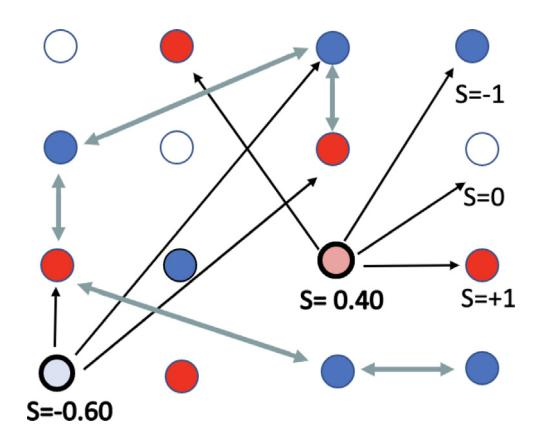
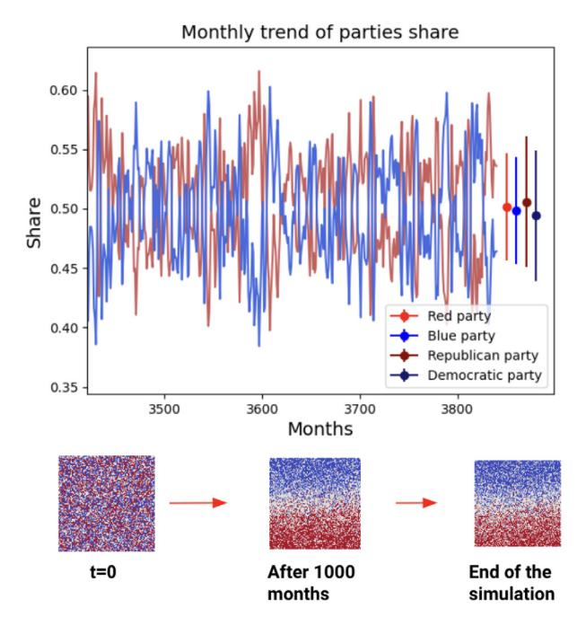
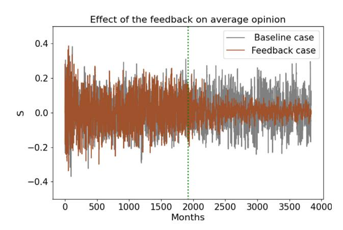
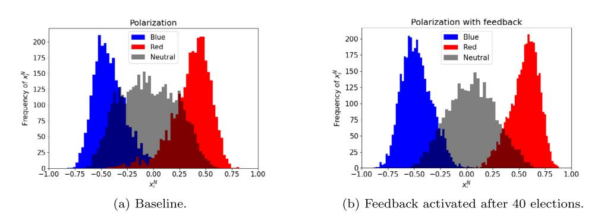

# Media preference increases polarization in an agent-based election model

Andrea Di Benedetto [a](#page-0-0),[b](#page-0-1),[∗](#page-0-2) , Claudia E. Wieners [a](#page-0-0),[b](#page-0-1) , Henk A. Dijkstra [a](#page-0-0),[b](#page-0-1) , Henk T.C. Stoof [c](#page-0-3),[b](#page-0-1)

a *Institute for Marine and Atmospheric research Utrecht, Department of Physics, Utrecht University, Utrecht, The Netherlands*

b *Centre for Complex Systems Studies, Utrecht University, Utrecht, The Netherlands*

*Institute for Theoretical Physics, Utrecht University, Utrecht, The Netherlands*

#### a r t i c l e i n f o

#### *Article history:*

Received 16 July 2022

Received in revised form 16 June 2023

Available online 4 July 2023

#### *Keywords:*

Complex systems

Polarization

Collective behavior

Quantitative social science

Agent based models

#### a b s t r a c t

Western societies have become more polarized over the last decades which forms a threat to their democracies. It is therefore important to understand the detailed mechanisms behind this polarization in the framework of opinion dynamics. Recent work has emphasized the role of the people's interactions with (mass) media in driving polarization, in particular through the formation of echo chambers. Here, we study how these echo chambers emerge from the collective behavior of people within a social network in the presence of media. For this, we use a new agent-based model of the election dynamics in a two-party system. In this model, media are highly connected and influential nodes, which are randomly located in the network and have the role of spreading external influence (e.g. information on the state of the economy) throughout the population. The model, with properly tuned parameters can reproduce the overall properties of US election results, together with the representation of numerous details, such as the portion of non-voters. Echo chambers emerge in this model through a mediapreference feedback, when voters preferentially surround themselves with media that have their political opinion. In this way, the model provides valuable information on how polarization arises through collective behavior of people and media.

© 2023 The Author(s). Published by Elsevier B.V. This is an open access article under the CC

BY license ([http://creativecommons.org/licenses/by/4.0/\)](http://creativecommons.org/licenses/by/4.0/).

# **1. Polarization as emergent behavior**

The science of opinion dynamics, which addresses how people express, share and change opinions, has gained increasing interest over the last decades. It has important applications in governance and politics, in particular in elections at all levels, from local to national [\[1](#page-8-0)]. One of the interesting phenomena in opinion dynamics is the appearance of ideological political polarization, where groups of people have sharply divided opinions or beliefs [[2\]](#page-8-1). Such polarization has increased in the US and Europe since the 1970s. For example, the overall share of Americans who express consistently conservative or consistently liberal opinions has doubled (from 10% to 21%) over the period 1984–2014 [\[3](#page-8-2)].

Several explanations for this increased polarization have been proposed. McCarthy et al. [\[4](#page-8-3)] suggest it is caused by big societal impacts due to inequality and immigration, or even globalization, and blame political institutions for not handling such impacts adequately. Another potential cause is an increasingly disjoint use of and trust in media, leading to echo

∗ Correspondence to: Institute for Marine and Atmospheric Research (IMAU), Utrecht University, Princetonplein 5, 3584 CC Utrecht, The Netherlands.

*E-mail address:* [a.dibenedetto@uu.nl](mailto:a.dibenedetto@uu.nl) (A. Di Benedetto).

**Fig. 1.** Sketch of voters (circles with thin edges) and media (circles with thick edges) with different opinions (*Sk*) that interact with their neighbors. Voters influence each other's opinion (bi-directional arrows) while media influence voters but are not influenced by them (unidirectional arrows).

chamber formation. In the US, social media have been shown to influence political views of voters [\[5](#page-8-4)], and Republicans and Democrats to access and trust different media sources [\[6\]](#page-8-5). People are increasingly surrounding themselves with media and other people that have a similar opinion to their own, thus causing the formation of echo chambers [[7–](#page-8-6)[9](#page-9-0)]. Cinelli et al. [[10](#page-9-1)] recently showed that aggregation of users in homophilic clusters dominates online interactions on Facebook and Twitter. In such echo chambers, the opinion, political leaning, or belief of users about a topic gets reinforced due to repeated interactions with peers or sources having similar tendencies and attitudes. For example, it has been estimated that before the 2020 elections in the US, around 20% of voters turned only to media sources of their own political view [\[6\]](#page-8-5).

Large-scale surveys to obtain information on opinion formation [\[11,](#page-9-2)[5](#page-8-4)] are obviously crucial to determine the precise mechanisms of polarization. On the other hand, computational social science has also provided many quantitative tools to study these mechanisms [\[1\]](#page-8-0). This field closely connects with the science of adaptive complex systems, which has gained much interest from people in physics, computer science and mathematics. Galesic and Stein [\[12\]](#page-9-3) provide an overview of statistical physics based models of belief dynamics and demonstrate that such models contain predictive value for real-world situations.

While many models of opinion dynamics have been proposed, most of the focus has been on the role of the social network and on the decision-making processes [\[13–](#page-9-4)[16](#page-9-5)[,9](#page-9-0),[12,](#page-9-3)[17](#page-9-6)]. Also, the co-evolution of the network and the decision making was recently addressed [\[18\]](#page-9-7) to study the effect of link-recommendation algorithms on social media on echochamber formation. In the current paper, we extend this class of models to include the explicit external influence of media on the opinion formation of people. In this way, the emergence of echo chambers and its influence on opinion formation can be studied from the micro-scale interactions of people with each other and with the media. We focus on a 2-party case as the simplest system where polarization can occur and consider the presidential elections in the US as our main example.

#### **2. Methodology**

# *2.1. The population*

Presidential elections in the US occur quadrennially and indirectly, in which citizens who are registered to vote in their own state cast ballots for members of the Electoral College. Historically, since 1852, only two parties have been in power, the Democrats and the Republicans. Thus the US can be approximated as the simplest possible election system, i.e., a two-party system, with parties here called ''Blue'' and ''Red''.

The population is modeled as *N* nodes on a scale-free [[19](#page-9-8)] network (see Methods, [Appendix](#page-5-0) [A](#page-5-0)). Nodes that are linked are referred to as ''neighbors'' and can exchange opinions, as illustrated in [Fig.](#page-1-0) [1](#page-1-0). There are two types of nodes, i.e., voters and media,[1](#page-1-1) and the network structure remains fixed throughout the simulation.

Each voter *k* has an opinion *Sk* ∈ {−1, 0, 1}, where −1 and 1 describe an intention to vote for the Blue or Red party, respectively, while 0 describes an intention not to vote. Initially, voters are randomly assigned an opinion such that 1/3 of the *NV* voters consists of Blue voters, Red voters, and Nonvoters. The initial average opinion ⟨*S*⟩ = ∑ *k*∈*V Sk*/*NV* is thus zero. Media (total number *NM* ) do not contribute to the vote. They have a far higher number of connections and can influence more people than voters, but are not influenced by their neighbors. Their opinion is a real number in the interval [−1, 1].

1 For linguistic consistency, we use the same pronoun for voters and media throughout, randomly picked to be ''he'' for voters and ''she'' for media

#### *2.2. Updating the voting intention*

Every day, 100 voters are randomly selected to update their opinion, meaning that on average each voter will update his opinion every 100 days. When selected, the voter will consult his neighbors *nk*, where the set *nk* can include fellow voters and media. The neighbors' average opinion is given by

*hk*(*t*) = ∑ *l*∈*nk WlSl*(*t*) ∑ *l*∈*nk Wl* , (1)

where *Wl* is the authority or weight of the node *l*. We use *Wl* = 0.1 for *l* ∈ *V* (voters) and *Wl* = 1 for *l* ∈ *M* (media) This means that a voter gives 10 times as much weight to the opinion of a medium than to that of a fellow voter.

A voter *k* switches opinion if the neighbor's average opinion *hk* exceeds certain thresholds (see [Table](#page-7-0) [E.2\)](#page-7-0). The thresholds fluctuate slightly depending on the average opinion, favoring the party which currently has the minority. This stabilizing feedback is needed to keep the model from reaching a state where one party has a persisting overwhelming majority (see [Appendix](#page-7-1) [E\)](#page-7-1). There is no direct observational support for this feedback process. However, at least in the US, it is obvious that both major parties have had similar shares of supporters for decades, suggesting that some stabilizing processes must be at work to prevent large persistent majorities.

Each simulation covers 320 years of 360 days; elections take place every four years.

# *2.3. Media and the external influence on opinion*

Different models in the literature described media as meta-nodes that can reach different portions of populations [\[20,](#page-9-9) [21\]](#page-9-10). In our model, they are treated as special nodes in the network that compete (with a different authority) with the other neighbors in changing the opinion of a certain voter. Each medium has her own prescribed interval of opinion which mimics the observation that media can have political leanings. These intervals are randomly assigned during initialization. Media are not influenced by voters but by external factors, such as the economy, and different media react roughly in unison to external influences, but fluctuate with their own amplitude around their own long-term average opinion. These fluctuations are contained in heterogeneous intervals randomly assigned at the beginning. For updating the media's opinion (see Methods, [Appendix](#page-7-2) [D\)](#page-7-2), we used the Fair equation [\[22\]](#page-9-11) (see Methods, [Appendix](#page-6-0) [C\)](#page-6-0). In this way, our model combines process-focused agent-based modeling with empirical work on how external factors, such as economic performance, influence elections.

In our default settings with *N* = 10,000, each medium is connected on average to 2000 voters, and there are 60 media. This is in line with observations [\[6\]](#page-8-5) suggesting that on average, voters trust around 14 media sources. As we show in the sensitivity analysis (Supplementary Figs. S3–4), the chosen combination of the number of media, number of connections per medium, and relative authority of media w.r.t. voters leads to realistic fluctuations of the average opinion. A lower influence of media relative to fellow voters (e.g. lower number of media or higher relative authority of voters) leads to persistent majorities for one party, while a higher influence of media causes the average opinion to fluctuate wildly with external influence. Such a phase transition is common in similar models [\[19](#page-9-8),[23,](#page-9-12)[24](#page-9-13)]. An extensive analysis of the different regimes of the model is shown in the Supplementary Material (Fig. S7).

#### *2.4. Criteria for model validation*

To tune the parameters in the model, we aimed to reproduce four main features of US historical elections: The standard deviation of the average opinion defined above, the average number of consecutive victories per party, the number of nonvoters, and the fact that no party has gained a persistent majority (absence of consensus).

Historical data from US presidential elections show that it is highly unlikely to see a party's share reach higher than 60%, as it only happened in a few elections; the standard deviation of party shares is about 0.05. The observed typical number of consecutive party victories in US presidential elections from 1948 is two [\[25\]](#page-9-14), which might be influenced by the 22nd amendment which stipulates that presidents may only serve 2 terms. As regards the shares of voters and nonvoters, (34%) of the US population identify as Independents, 33% identify as Democrats and 29% identify as Republicans [[7\]](#page-8-6), though in actual presidential elections, the share of nonvoters has been between 46% and 34% since 2000, so about 40% of nonvoters seems a reasonable estimate.

#### **3. Results**

To demonstrate the effect of media selection on voter opinion and eventually on polarization, we consider two cases: a baseline case where voters cannot switch their media, and a case where they prefer media they agree with.

**Fig. 2.** The time series represent simulated monthly party voter shares during the last election cycles of the simulation. The dots and error bars denote the mean and standard deviation of the modeled voter shares of the Red and Blue party after spinup, as well as the observed shares of the Republican and Democrat parties since 1948 (dark red and dark blue). Below, are snapshots of the spatial distribution of voter opinions, namely the initial condition, after 1000 months (roughly 21 elections), and the final state.

#### *3.1. The baseline*

From the initial state, the model first undergoes strong fluctuations in the average opinion. It takes about 10 election cycles to reach a dynamic equilibrium in which the statistical properties of the model do not change anymore. The reason is that the initial, randomly assigned opinions of voters often do not agree with their neighbors, leading to mutual persuasion and frequent opinion switches. However, the agreement with neighboring voters and media increases, reaching a statistical stationary state (see snapshots in [Fig.](#page-3-0) [2](#page-3-0)). We measure agreement among voter neighbors by determining the fraction of voter-voter pairs who have the same opinion (''voter-voter clustering, defined in Methods [Appendix](#page-6-1) [B\)](#page-6-1). Clustering must be compared to the reference value, which would be obtained if the same number of Red and Blue voters and nonvoters were randomly distributed over the network. If actual clustering exceeds the reference value this indicates segregation.

Increased clustering diminishes the voters' sensitivity to the external influence, because a voter who agrees well with his fellow voter neighbors receives a strong signal from them, reducing the relative importance of the media input. After spinup, the fluctuations of vote shares agree with the observed amplitudes in shares of the US Republican and Democratic parties since 1948 [\(Fig.](#page-3-0) [2\)](#page-3-0). The modeled average opinion shows an average number of consecutive mandates per party of around 2 (see supplementary Fig. S.2), which fits observations [[25](#page-9-14)]. This baseline is tuned such that we avoid consensus and power-locking, achieve a realistic proportion of non-voters (about 40%), and achieve a realistic standard deviation of opinion S (about 0.1). This follows from the choice of reproducing the U.S. elections. Different scenarios could be modeled by selecting different combinations of parameters, whose role is extensively discussed in the Supplementary Material.

#### *3.2. Preferential treatment of media*

We next model the tendency to avoid listening to media with ideas different from one's own. To this end, we introduce a feedback by which voters can surround themselves with media that have a similar political opinion. When a voter disagrees with a medium with whom he is connected, he can drop her and instead adopt another medium (see Methods, [Appendix](#page-8-7) [F\)](#page-8-7). The feedback is switched on only after 40 election cycles, i.e., after the system reached statistical equilibrium.

As shown in [Fig.](#page-4-0) [3](#page-4-0), the media-selection feedback greatly reduces the fluctuations in average opinion. This is consistent with a drop in the probability to switch opinion between elections, from 15 to 6% ([Table](#page-4-1) [1\)](#page-4-1).

The reason is that voters can now break contact with media they disagree with, thereby isolating themselves from deviating opinions and reinforcing their current stance. The voter-voter clustering increases as well, because the feedback makes it less likely that media induce voters to change their opinion away from that of their voter neighbors.

**Fig. 3.** Average opinion of the entire population in time for the baseline and feedback cases. The feedback is activated after 40 elections i.e. around 2000 months and indicated by the green dotted line.

**Fig. 4.** Histograms of the average opinion *x i* of the neighbors of a voter *i* for the baseline (left) and feedback case (right). The blue (red, black) curve depicts the distribution of *x* for Blue voters (Red voters, nonvoters), i.e. a frequency of 180 for *x i* = 0.5 in the Blue curve means that 180 Blue voters have neighbors with an average opinion of 0.5.

**Table 1** Main measures on the behavior of the model.

Main model properties (defined in the Methods) for the baseline and feedback case. The values are averaged across the final 10 election cycles of the simulation. In parenthesis is the ''reference'' value of *C V* (see main text).

Following previous studies in opinion dynamics [\[9](#page-9-0)[,10\]](#page-9-1), we define the existence of echo chambers by analyzing the distribution of the average opinion of neighbors *x N* (see [Appendix](#page-6-1) [B](#page-6-1)).

*i* Similarly to [[10](#page-9-1)], we find that voters with a non-neutral opinion tend to have neighbors who on average support the same opinion ([Fig.](#page-4-2) [4](#page-4-2)). For example, a Blue voter has more Blue than Red neighbors, so collectively the neighbors of a Blue voter (opinion = −1) have a negative average opinion. As opposed to Cinelli, we have a distinct third group, namely non-voters, whose neighbors typically have a collective average opinion near zero. This behavior is observed both in the baseline and the feedback case, but in the latter, the overlap between the three curves is reduced, consistent with stronger clustering and stronger segregation. The strong relationship between a voter's opinion and his neighbors' opinion indicates the existence of distinct communities, resembling observations in several real social media networks [\[10,](#page-9-1)[26](#page-9-15)[,27\]](#page-9-16).

Based on this result, we conclude that the possibility of voters to choose their favorite media sources on the basis of political agreement can lead to increased segregation (opinion clustering) and polarization. A reduced willingness to change political opinion appears due to the emergence of echo-chambers.

#### **4. Conclusion and discussion**

Motivated by a study on media polarization [[6\]](#page-8-5), we studied the effects of media preference on political polarization using an agent-based model of opinion dynamics. This model captures many features as in previous studies, such as a social network structure and a decision-making process [\[12\]](#page-9-3), but its new features are the presence of media nodes and the interactions between voters and the media. In this way, we can also include the effect of external influences, such as the state of the economy, on the decision-making process. This structure makes it easily applicable to describe collective behavior under a specific influence, not necessarily linked to the political aspect.

In the supplementary material (Figs. S2–S5), the sensitivity of the model results to the relative influence of media and voters and to the thresholds for opinion switching is investigated. With properly tuned parameters our model can reproduce overall properties of US election results [\[28\]](#page-9-17), in particular, the standard deviation of the average opinion, the fraction of non-voters, the typical number of consecutive mandates secured by a party, and the absence of consensus. Therefore we consider the model fit for purpose for carrying out model experiments on the emergence of echo chambers [\[10\]](#page-9-1) and political polarization [\[2](#page-8-1)].

Already in the baseline case, where the media choice of voters is fixed and opinion formation is mostly governed by the local interactions between voters and media outlets, the voter population tends to be more clustered than based on a random distribution. When the media feedback is activated, voters tend to pick media that share their own political opinion, echo chambers emerge (high voter-voter clustering), and the probability to switch opinion is reduced by a factor of around 2. With an equilibrium state where on average 63% of any voter's neighbors have the same opinion, the opinion distribution shows the typical U-shaped distribution, the typical topology of a polarized social network. This clearly shows that the media feedback leads to strong polarization, in agreement with available results from field studies [\[6,](#page-8-5)[10](#page-9-1)].

The aim of this study was to extend an idealized well-understood framework like the Ising model and generate a realistic emerging output, ready to be used in more extended modeling frameworks. The resulting high complexity of the model is the cause of the lack of analytical results at this moment and is left for future work. Another potential research avenue is coupling our model to other models, for example (agent-based) Integrated Assessment Models (IAMs, [\[29\]](#page-9-18)) used to investigate economic aspects of climate policy. In such a coupled model, the election model could determine the intensity of climate policy (assuming different parties favor different policies), and the economic impact of climate policy. Climate-induced damages could then feed back into voter's decision by influencing economic performance in the Fair equation (which currently is treated as a random external input).

Here we focused on a two-party system but this could be generalized to a many-party spectrum, with more possible opinions such as ''far-blue, moderate blue, center, moderate red, far-red'' and different thresholds for the interactions. Future (extended) versions of the model could help explain behavior seen in field studies. For example, one could investigate whether exposure to opposing views increases polarization [\[5\]](#page-8-4) or not [\[30\]](#page-9-19).

#### **CRediT authorship contribution statement**

**Andrea Di Benedetto:** Conceptualization, Investigation, Formal analysis, Writing – review & editing. **Claudia E. Wieners:** Conceptualization, Investigation, Formal analysis, Writing – review & editing. **Henk A. Dijkstra:** Conceptualization, Writing – review & editing. **Henk T.C. Stoof:** Writing – review & editing.

#### **Declaration of competing interest**

The authors declare that they have no known competing financial interests or personal relationships that could have appeared to influence the work reported in this paper.

#### **Data availability**

The data that support the findings of this study are openly available and accessible from the references.

#### **Appendix A. Generation of the network**

We start from an Ising-like opinion formation model [\[19\]](#page-9-8) where the voter population is described as a 2D network of *N* = *L* × *L* nodes. Each node is identified by a coordinate (*i*, *j*) in the network that remains fixed and it is connected to its neighbors by edges. In order to make connections more heterogeneous, interpersonal interactions follow a hierarchical structure, with two different levels. From the unconnected network, connections are first formed over all the nodes until the connectivity *cij* is equal to the maximum connectivity *Cij* or until the network is saturated. It is assumed that the network of social connections is scale-free.

So-called first-level connections are created by iterating over all nodes and their neighbors depending on the distance, by following the distance probability rule given by

*P*(*l*) ∼ 1 1 + exp [(*l* − *a*)]/*b* + 0.001 *L* − 1 *L* (A.1)

where *l* = √ *l* 2 1 + *l* 2 2 is the distance between the nodes (*i*, *j*) and (*m*, *n*) = (*i*, *j*) + (*l*1, *l*2) and *l*1, *l*2 are two independent random variables; the sign is generated with probability 0.5.

The voter population is then divided into local groups of *NG* = *LG* × *LG* where *a* = *LG* and *b* = *LG*/4. Subsequently, after the formation of a connection between two nodes (*i*, *j*) and (*m*, *n*), second level connections are formed between (*m*, *n*) and all the nodes of (*i*, *j*), with probability *pc* . This algorithm leads to a hierarchical structure of interactions [\[31\]](#page-9-20). The number of edges to a node will be always in between the interval (*cmin*, *cmax*) in order to have the desired degree distribution. The degree distribution of the network has been chosen as scale free, where the probability of having *c* individuals has the form *P*(*C*) ∼ *c* γ , with *c* ∈ (*cmin*, *cmax*) and γ = 3.

We considered a total number of nodes equal to *N* = 100 × 100 = 10,000, local groups of 20 elements, and (*cmin*, *cmax*) = (18, 54) for all the different simulations. Each medium has a fixed interval [*Smin*, *Smax*] of opinion. One third of the media will have *Smin* ∈ [−1, 0] and *Smax* ∈ [0, 0.5], one third with *Smin* ∈ [−0.5, 0] and *Smax* ∈ [0, 1] and the final third with *Smin* ∈ [−1, 0] and *Smax* ∈ [0, 1]. Opinions are initially randomly assigned within these intervals. For more details about the topology of the network and sensitivity to the parameters, please refer to [\[19\]](#page-9-8).

#### **Appendix B. Relevant measures**

In order to observe how polarization and echo chambers evolve, we analyzed four different measures:

- *Average opinion* defined as

*S* = 1 *NV* ∑ *k*∈*V Sk* (B.1)

where *NV* is the total number of voters and *Sk* is their individual opinion. It is used to describe how the collective opinion of the population evolves.

- The voters' *Probability to change opinion* when asked to update it is defined as

*P* = 1 *NV* 1 *T* ∑ *k*∈v*oters t*∑0+*T t*=*t*0 *p t k* , (B.2)

where the sampling interval is taken to be the interval between elections *T* = 4 years, and *p k* = 1 if the voter *k* has changed his opinion at time *t* and zero otherwise. We used this quantity to describe the state of polarization of a certain scenario. A low value indicates a small number of changes in the opinions of the agents and therefore, can be associated with a polarized population.

- *Average opinion of neighbors*,

*x N i* = 1 *ni* ∑ *j*∈N*i Sj*, (B.3)

where *x N i* is the average opinion of the neighbors *j* (with opinion *Sj*) of the voter *i*. N*i* represents the set of these neighbors and *ni* their amount.

- *Voter-voter opinion clustering*,

*c V i* = 1 *n V i* ∑ *j*∈N*V Cij*, (B.4)

where *c V i* is the voter-voter clustering of the voter *i*. N *V i* represents the set of the neighbors of *i* who are voters and *n V i* their amount. *Cij* = 1 if *Si* = *Sj* and 0 otherwise. In the paper, we mention its average across all voters *C V* = *NV* ∑*NV i*=1 *c V i* .

#### **Appendix C. The Fair equation**

The model consists of an equation [[22](#page-9-11)], aimed at predicting the results of the 1980 US elections starting from the state of the economy. This simple model has been updated over the years and is based on four principles [\[32\]](#page-9-21):

- The incumbent elections are affected by the state of the economy
- Since voters prefer to change, parties in office for two or more consecutive terms have a disadvantage
- The Republican Party is slightly preferred more than the Democratic one
- There is an advantage for incumbent presidents

**Table E.2**

Table on the transition thresholds of average opinion. Here the values *Tk*→*l* describe the thresholds from the intention *k* to *l*. The baseline values of

This translates into the equation [[33](#page-9-22)[,34](#page-9-23)]:

*Vd* = 48.06 + 0.673 × *G* × *I* − 0.721 × *P* × *I* + 0.792*Z* × *I* + 2.25 × *DPER* − 3.76 × *DUR* + 0.21 × *I* + 3.25 × *WAR*, (C.1)

where *Vd* is the democratic share of valid votes, *G*, *P* and *Z* are the real economical indicators, *DPER* describes the benefit due to a candidate's second term and *DUR* the fact that people get tired of a party in power after two consecutive terms. *I* = 1 if there is a Democratic presidential incumbent at the time of the election and *I* = −1 if there is a Republican presidential incumbent.

# **Appendix D. The external influence**

In the original Fair model, the external influence is described as a set of parameters in ([C.1](#page-7-3)). Here the external influence acts through the media, and we use Fair's equation to model how media change their opinion. As opposed to Fair, we do not add a bias term and ignore wars and DPER since we do not have presidential candidates but only parties. Therefore, we consider the *DUR* and the economic terms. Considering that the opinion of a medium is between −1 and +1, all the parameters of the Fair equation have been normalized by dividing them by a factor of 10.

The economic terms *G*, *P*, and *Z* are summarized into a single term *E* ∗ *I* where *E* is a random number in [−0.22, 0.22] (note that the sum of the weights of *G*, *P*, and *Z* is 0.22). *I* is −1 (+1) when the Blue (Red) party is in power; this way, a good economic performance (> 0) favors the incumbent party. Every week, the opinion of every medium *k* is updated according to

*Sk* ← *Sk* + *I* × *E*. (D.1)

The second term *DUR* represents the ''boredom'' of people against the ruling party. Analogously as in the Fair equation, *DUR* will be 0 if either party has been in power for one term, 1(−1) if the Blue (Red) party has been in power for two consecutive terms, ±1.25 for three consecutive terms, ±1.5 for four consecutive terms, and so on.

The update term is then

*Sk* ← *Sk* + 0.376 × *DUR*. (D.2)

Thus, the scheme of external influence follows:

- Every day we sample a random value *E* from a normal distribution in the interval [−0.22, +0.22] to the opinion of media
- After each election, add a new term depending on DUR.

Of course, every time a new term is added to a media's opinion, the new value has to be contained in the corresponding interval (*Smin*, *Smax*) defined initially. If the new *Sk* results bigger (smaller) than *Smax*(*Smin*), then *Sk* = *Smax* (*Sk* = *Smin*).

# **Appendix E. Transition thresholds**

Each voter switches opinion if the neighbor's average opinion *hk* exceeds certain thresholds shown in [Table](#page-7-0) [E.2.](#page-7-0) As shown in Section S4 of the supplementary material, the model requires a stabilizing feedback to avoid ending up with a consensus (nearly all voters support one party) or power lock-in (one party winning nearly all elections, even without getting nearly all votes).

The stabilizing feedback works by making it harder to leave and easier to join the party which is currently the minority and harder to join the current majority party. For example, if *S* > 0 (Red party has the majority), then

*T* ∗ *R*→*N* = *T R*→*N* , *T* ∗ *B*→*N* = *T* 0 *B*→*N* + α ∗ *S*, *T* ∗ *N*→*R* = *T* 0 *N*→*R* + α ∗ *S*, (E.1)

*T* ∗ *N*→*B* = *T* 0 *N*→*B* − α ∗ *S*, *Tk* = min(*T* ∗ *k* , 0.5), *Tk* = max(*T* ∗ *k* , 0), *k* ∈ {*R* → *N*, *B* → *N*, *N* → *B*, *N* → *R*}

For *S* < 0, we have

*TB*→*N* = *T* 0 *B*→*N* , *TN*→*R* = *T* 0 *N*→*R* + α ∗ *S*, *TR*→*N* = *T* 0 *R*→*N* − α ∗ *S* (E.2) *TN*→*B* = *T* 0 *N*→*B* − α ∗ *S*, *Tk* = min(*T* ∗ *k* , 0.5), *Tk* = max(*T* ∗ *k* , 0), *k* ∈ {*R* → *N*, *B* → *N*, *N* → *B*, *N* → *R*}

The parameters were tuned such as to (1) avoid consensus and power-locking, (2) achieve a realistic proportion of nonvoters (about 40%), (3) achieve a realistic standard deviation of opinion *S* (about 0.1). Sensitivity studies are performed in supplementary sections S2–S5. The resulting parameter values are: *T* 0 *R*→*N* = *T* 0 *B*→*N* = 0, *T* 0 *N*→*R* = *T* 0 *N*→*B* = 0.18, and α = 0.5.

#### **Appendix F. The media feedback**

This feedback represents a voter who prefers to surround himself with media having an opinion not too distant from his own. The strength of this feedback mechanism is given by the parameter β ≤ 1. For clarity, the algorithm for a blue-party voter is implemented as follows:

#### **Algorithm 1** The media feedback.

1: **if** k is a blue party voter, i.e. *Sk* = −1 **then** 2: **for** all media *l* currently connected to *k* **do** 3: Generate random number p in (0, 1) 4: **if** *Sl* > 0 and *p* < β **then** 5: Find a medium *m* not yet connected to *k* 6: **if** *Sm* ≤ 0 **then** 7: Remove the edge between *k* and *l* 8: Create edge between *k* and *m* 9: **end if** 10: **end if** 11: **end for** 12: **end if**

The case of a red party voter (with *Sk* = 1) is analogous. For a non voter, a medium will be removed if |*Sm*| > 0.1 and replaced with another one in this neutral interval of opinion. The feedback is only activated after an equilibration period of 40 elections.

#### **Appendix G. Supplementary data**

Supplementary material related to this article can be found online at <https://doi.org/10.1016/j.physa.2023.129014>.

#### **References**

[1] [Antonio F. Peralta, János Kertész, Gerardo Iñiguez, Opinion dynamics in social networks: From models to data, 2022, ArXiv.](http://refhub.elsevier.com/S0378-4371(23)00569-1/sb1) [2] Emily Kubin, Christian von Sikorski, The role of (social) media in political polarization: A systematic review, Ann. Int. Commun. Assoc. 45 (3) (2021) 188–206, [http://dx.doi.org/10.1080/23808985.2021.1976070.](http://dx.doi.org/10.1080/23808985.2021.1976070) [3] [Pew Research Center, Political Polarization in the American Public, 2014.](http://refhub.elsevier.com/S0378-4371(23)00569-1/sb3) [4] [McCarty, Nolan, Keith T. Poole, Howard Rosenthal, Polarized America: The Dance of Ideology and Unequal Riches, MIT Press, Cambridge, MA,](http://refhub.elsevier.com/S0378-4371(23)00569-1/sb4) [2006.](http://refhub.elsevier.com/S0378-4371(23)00569-1/sb4) [5] Christopher A. Bail, et al., Exposure to opposing views on social media can increase political polarization, Proc. Natl. Acad. Sci. USA 115 (2018) 9216–9221, [http://dx.doi.org/10.1073/pnas.1804840115.](http://dx.doi.org/10.1073/pnas.1804840115) [6] [Pew Research Center, U.S. Media Polarization and the 2020 Election: A Nation Divided, 2020.](http://refhub.elsevier.com/S0378-4371(23)00569-1/sb6) [7] R.K. Garrett, Echo chambers online?: Politically motivated selective exposure among internet news users, Comput. Mediat. Commun. 14 (2009) 265–285, [http://dx.doi.org/10.1111/j.1083-6101.2009.01440.x.](http://dx.doi.org/10.1111/j.1083-6101.2009.01440.x) [8] K. Garimella, G. De Francisci Morales, A. Gionis, M. Mathioudakis, Political discourse on social media: Echo chambers, gatekeepers, and the price of bipartisanship, in: Proceedings of the 2018 World Wide Web Conference, 2018, pp. 913–922, [http://dx.doi.org/10.1145/3178876.3186139.](http://dx.doi.org/10.1145/3178876.3186139)

- [9] W. Cota, S.C. Ferreira, R. Pastor-Satorras, M. Starnini, Quantifying echo chamber effects in information spreading over political communication networks, EPJ Data Sci. 8 (2019) <http://dx.doi.org/10.1140/epjds/s13688-019-0213-9>. [10] Matteo Cinelli, Gianmarco De Francisci Morales, Alessandro Galeazzi, Walter Quattrociocchi, Michele Starnini, The echo chamber effect on social media, Proc. Natl. Acad. Sci. USA 118 (2021) [http://dx.doi.org/10.1073/pnas.2023301118.](http://dx.doi.org/10.1073/pnas.2023301118) [11] Dan Braha, Marcus A.M. de Aguiar, Voting contagion: Modeling and analysis of a century of U.S. presidential elections, PLoS ONE 12 (5) (2017) <http://dx.doi.org/10.1371/journal.pone.0177970>. [12] Mirta Galesic, D.L. Stein, Statistical physics models of belief dynamics: Theory and empirical tests, Physica A 519 (2019) 275–294, [http:](http://dx.doi.org/10.1016/j.physa.2018.12.011) [//dx.doi.org/10.1016/j.physa.2018.12.011.](http://dx.doi.org/10.1016/j.physa.2018.12.011) [13] Claudio Castellano, Daniele Vilone, Alessandro Vespignani, Incomplete ordering of the voter model on small-world networks, Europhys. Lett. 63 (2003) <http://dx.doi.org/10.1209/epl/i2003-00490-0>. [14] V. Sood, S. Redner, Voter model on heterogeneous graphs, Phys. Rev. Lett. 94 (2005) <http://dx.doi.org/10.1103/PhysRevLett.94.178701>. [15] Krzysztof Suchecki, Vćtor M. Eguíluz, Maxi San Miguel, Voter model dynamics in complex networks: Role of dimensionality, disorder, and degree distribution, Phys. Rev. E 72 (2005) <http://dx.doi.org/10.1103/PhysRevE.72.036132>. [16] [A. Sîrbu, V. Loreto, V.D.P. Servedio, F. Tria, Opinion Dynamics: Models, Extensions and External Effects, Participatory Sensing, Opinions and](http://refhub.elsevier.com/S0378-4371(23)00569-1/sb16) [Collective Awareness. Understanding Complex Systems, Springer, Cham, 2016, pp. 363–401.](http://refhub.elsevier.com/S0378-4371(23)00569-1/sb16) [17] Sidney Redner, Reality-inspired voter models: A mini-review, C. R. Phys. 20 (2019) 275–292, <http://dx.doi.org/10.1016/j.crhy.2019.05.004>. [18] F.P. Santos, Y. Lelkes, S.A. Levin, Link recommendation algorithms and dynamics of polarization in online social networks, Proc. Natl. Acad. Sci. USA 118 (50) (2021) [http://dx.doi.org/10.1073/pnas.2102141118.](http://dx.doi.org/10.1073/pnas.2102141118) [19] A. Grabowski, R.A. Kosincki., Ising-based model of opinion formation in a complex network of interpersonal interactions, Physica A 361 (2006) 651–664, <http://dx.doi.org/10.1016/j.physa.2005.06.102>. [20] J.C. González-Avella, M.G. Cosenza, V.M. Eguíluz, M. San Miguel, Spontaneous ordering against an external field in non-equilibrium systems, New J. Phys. 12 (2010) <http://dx.doi.org/10.1088/1367-2630/12/1/013010>. [21] M. Pineda, G.M. Buendía, Mass media and heterogeneous bounds of confidence in continuous opinion dynamics, Physica A 420 (2015) 73–84, <http://dx.doi.org/10.1016/j.physa.2014.10.089>. [22] Ray C. Fair, The effect of economic events on votes for president, Rev. Econ. Stat. 60 (1978) 159–173, [http://dx.doi.org/10.2307/1924969.](http://dx.doi.org/10.2307/1924969) [23] Holme Petter, M.E.J. Newman, Nonequilibrium phase transition in the coevolution of networks and opinions, Phys. Rev. E 74 (2006) 056108, <http://dx.doi.org/10.1103/PhysRevE.74.056108>. [24] P. Törnberg, C. Andersson, K. Lindgren, S. Banisch, Modeling the emergence of affective polarization in the social media society, PLoS ONE 16
- (10) (2021) E0258259, [http://dx.doi.org/10.1371/journal.pone.0258259.](http://dx.doi.org/10.1371/journal.pone.0258259) [25] Atlas of U.S. Presidential elections, 2021, <https://uselectionatlas.org/>. (Accessed April 2021). [26] F. Baumann, P. Lorenz-Spreen, I.M. Sokolov, M. Starnini, Modeling echo chambers and polarization dynamics in social networks, Phys. Rev. Lett. 124 (2020) [http://dx.doi.org/10.1103/PhysRevLett.124.048301.](http://dx.doi.org/10.1103/PhysRevLett.124.048301) [27] Ł.G. Gajewski, J. Sienkiewicz, J.A. Hołyst, Transitions between polarization and radicalization in a temporal bilayer echo-chamber model, Phys. Rev. E 105 (2022) [http://dx.doi.org/10.1103/PhysRevE.105.024125.](http://dx.doi.org/10.1103/PhysRevE.105.024125) [28] [Pew Research Center, Political Independents, Who They Are, What They Think, 2019.](http://refhub.elsevier.com/S0378-4371(23)00569-1/sb28) [29] Hadi Dowlatabad, Integrated assessment models of climate change: An incomplete overview, Energy Policy 23 (1995) 289–296, [http://dx.doi.](http://dx.doi.org/10.1016/0301-4215(95)90155-Z) [org/10.1016/0301-4215\(95\)90155-Z.](http://dx.doi.org/10.1016/0301-4215(95)90155-Z) [30] A.J. Berinsky, Measuring public opinion with surveys, Annu. Rev. Political Sci. 20 (2017) 309–329, [http://dx.doi.org/10.1146/annurev-polisci-](http://dx.doi.org/10.1146/annurev-polisci-101513-113724)[101513-113724.](http://dx.doi.org/10.1146/annurev-polisci-101513-113724) [31] A. Grabowski, R.A. Kosinski, Epidemic spreading in a hierarchical social network, Phys. Rev. E 70 (2004) [http://dx.doi.org/10.1103/PhysRevE.70.](http://dx.doi.org/10.1103/PhysRevE.70.031908) [031908.](http://dx.doi.org/10.1103/PhysRevE.70.031908) [32] Fair's presidential vote equation, 2021, <https://pollyvote.com/en/components/models/retrospective/fundamentals-only-models/fair-model/>. (Accessed April 2021). [33] [R.C. Fair, Presidential and congressional vote-share equations, Am. J. Political Sci. 53 \(1\) \(2009\) 55–72.](http://refhub.elsevier.com/S0378-4371(23)00569-1/sb33) [34] Vote-share equations: November 2018 update, 2021, <https://fairmodel.econ.yale.edu/vote2020/index2.htm>. (Accessed April 2021).