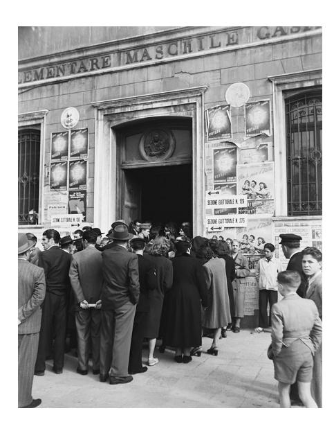

This work suggests that collisional charging may ultimately be the solution to both the bouncing and fragmentation problems that plague theoretical attempts to assemble the centimetre-sized aggregates needed, in turn, to assemble planets. But this is not quite the end of the story. Future work will have to clarify whether collisional charging can operate efficiently at astrophysical densities or if other charging mechanisms might be at

play. Nevertheless, together with decades of laboratory astrophysics and simulation work designed to overcome other barriers to planet formation, collisional charging may provide a missing piece of the puzzle in our understanding of planet assembly. ❐

### Katherine Follette

*Amherst College, Amherst, MA, USA. e-mail: [kfollette@amherst.edu](mailto:kfollette@amherst.edu)*

Published online: 9 December 2019 <https://doi.org/10.1038/s41567-019-0741-z>

### References

- 1. Haisch, K. E., Lada, E. A. & Lada, C. J. *Astrophys. J.* **553**, L153–L156 (2001).
- 2. Batalha, N. *Proc. Natl Acad. Sci. USA* **111**, 12647–12654 (2014).
- 3. Chiang, E. & Youdin, A. N. *Annu. Rev. Earth Planet. Sci.* **38**, 493–522 (2010).
- 4. Steinpilz, T. et al. *Nat. Phys*. [https://doi.org/10.1038/s41567-019-](https://doi.org/10.1038/s41567-019-0728-9) [0728-9](https://doi.org/10.1038/s41567-019-0728-9) (2019).
- 5. Youdin, A. N. & Goodman, J. *Astrophys. J.* **620**, 459–469 (2005).
- 6. Lambrechts, M. & Johansen, A. *Astron. Astrophys.* **544**, A32 (2012).

## COMPLEX SYSTEMS

# From ferromagnets to electoral instability

An electoral model predicts that polarized and alienated voters lead to unstable elections, like phase transitions in an Ising model. Such physics-inspired models may help political scientists devise electoral reforms to quench instability.

# Soren Jordan

Along-stated goal of political science is to explain — and possibly predict — electoral behaviour and election outcomes. A tradition in that field has been the use of rational choice theory: attempting to define the utility of different actions — a measure of the quantitative value an individual assigns to possible outcomes of an action — and making predictions for individual behaviour under the assumption of utility maximization. Statistical physics and complexity science have a long tradition of constructing models for understanding emergent collective effects, and could thus be of help in exploring the relationship between individual choices and collective electoral behaviour. In a delightful crossover between disciplines, writing in *Nature Physics* Alexander Siegenfeld and Yaneer Bar-Yam have now introduced an electoral model that yields two conceptual developments — negative representation and electoral instability1 . In this model, the presence of alienation and polarization among voters leads to an unstable electoral behaviour that is reminiscent of phase transitions in a ferromagnet described by the mean-field Ising model.

The authors first conceptualize negative representation: as a potential voter moves increasingly to the left (or right) of all electoral choices, abstention becomes an increasingly attractive alternative to the candidates because it provides the

same utility as voting for an unattractive candidate. The perverse outcome of the voter's abstention is that it runs the risk of helping the other side win. That is to say, in presence of negative representation "the election outcome is inversely sensitive to changes in those opinions."

Second, and relatedly, the authors conceptualize electoral instability: the very idea that these (often small) movements in voter opinion can cause large swings in election outcomes. Both concepts are exceptionally relevant, given that the increasing polarization of the American political system (and others worldwide) is moving a large proportion of voters to the left or right of the field of candidates2,3 .

Siegenfeld and Bar-Yam's model sheds new light on how sluggish concepts like partisanship4 can still yield variability in high-level outcomes. Moreover, the model offers a heuristic for anticipating how future electoral changes might affect election outcomes. In particular, as polarization among voters increases and stability decreases, nuances in voter identification laws5 , elite attempts to mobilize voters6 , complications in voter registration, increases in voter wait time and information campaigns through social media, among other factors, deserve our attention as they can swing the outcome to one side or the other, and in an unstable way.

Alongside their model, the authors have introduced a functional that maps citizen opinions to electoral outcomes. This is a new contribution over the stalled social choice literature, which traditionally relies on a framework based on candidate positioning. In that literature, the utility function that connects voters to candidate positions is usually modelled by a quadratic loss function in a unidimensional space. This

Credit: Archivio Cameraphoto Epoche / Hulton Archive / Getty

leads to the classic median voter theorem7 : candidates converge to the preference of the median voter, as this position maximizes the expected votes for the candidate while simultaneously making voters choose indifferently between the candidates. The challenge has then been to model politics in a multidimensional space as multidimensional equilibria derived from candidate positions disappear without additional assumptions like probabilistic voting.

This is a problem, as there are usually at least two dimensions of voter preferences, at least in American politics. A first dimension is defined by preferences on government intervention in the economy, which more generally captures the left–right dimension of ideology in the polarized period. The second dimension captures civil rights in the 1960s and other social issues in the present day8 . But by focusing on the functional that maps citizen opinions on electoral outcomes, rather than candidate positions, Siegenfeld and Bar-Yam's model can generalize to multiple dimensions as well as relax the assumption of concave voter preferences.

The other major contribution of this work is to the literature on alienation. Alienated individuals to the left (or the right) of the field of candidates become less attracted to the set of electoral choices. This results in abstention, as the voter prefers no action (a costless non-vote) to voting for an unattractive choice. In their model, the authors show that from abstention due to alienation follows electoral instability providing evidence of the concrete impact of alienation beyond the sort of normative democratic argument about the importance of full participation.

However, extreme voters are not the only ones who can theoretically be alienated. Faced with very polarized candidates, voters between the candidates might also become alienated. Future models should explore the effects of alienation among these centrist voters between candidates. This would help resolve whether a polarized system can be 'repaired' by the introduction of more moderate candidates who could theoretically mobilize alienated centrist voters to participate, or, conversely, whether appealing to a base is too strong of an incentive

to candidates — especially as empirical evidence is mixed: "moderate candidates do possess an electoral advantage, but this advantage may depend heavily on turnoutbased mechanisms"9 .

The authors' model suggests other interesting pathways for future research. The first is the rather bold implication that increases in turnout will help to ameliorate some of the instability observed in the model by reducing negative representation. But is this fair to the real world, where habitual voters10 are much more likely to be informed and interested in politics?

Put differently, even if we mobilize alienated abstainers (which is empirically unlikely), the model makes strong assumptions about the (perfect) information they would have about their own opinions, the locations of candidates, and the shape of their utility function. Would imperfect information lead to more instability among individuals in the centre? Can we adapt the model to provide differential levels of information to voters, given their left–right or multidimensional positions? These information-based extensions become even more interesting if we allow for feedback across elections, whereby voters increase or decrease in their likelihood of abstaining based on the previous election's representation. This feedback could also help explain why voters move incrementally in the small ways that generate the very instability the model predicts.

An even more important extension would capture utility outside of proximity, as voters that are polarized on the basis of partisan identification may prefer one candidate or another often not on the basis of opinions defined by a strictly policybased utility. A leading cause of this is negative partisanship: voters align against an opposition party, rather than with a party. Evidence suggests the emergence of negative partisanship in the American electorate11, which might motivate formerly extreme voters to still participate, not on the basis of ideology, but on resentment towards the other side. This participation is usually uniform, as negative partisanship has led to an increase in party loyalty and straightticket voting12.

A final potential extension is to explicitly model electoral reforms. The authors note that given the "inherent effect of the twoparty system, electoral reforms" might reduce instability, explicitly mentioning instant-runoff voting and approval voting. However, any such reform would need to contend with the current partisan system. When party leaders, rather than the institutions that elect them, are in charge of candidate selection, leadership tends to reach for ideologically extreme candidates and overestimate their electoral competitiveness13. Electoral reforms like the top-two primary face the obstacle of, well, voters, who often do not even know a reform has been instituted and vote for the incumbent or their own partisan14.

Of course, the innovation of the model and its promise is that we can a priori model these reforms and their effects, leading us to a better understanding of the anticipated changes. ❐

## Soren Jordan

*Department of Political Science, Auburn University, Auburn, AL, USA. e-mail: [scj0014@auburn.edu](mailto:scj0014@auburn.edu)*

Published online: 13 January 2020 <https://doi.org/10.1038/s41567-019-0761-8>

#### References

- 1. Siegenfeld, A. F. & Bar-Yam, Y. *Nat. Phys*. [https://doi.org/10.1038/](https://doi.org/10.1038/s41567-019-0739-6) [s41567-019-0739-6](https://doi.org/10.1038/s41567-019-0739-6) (2020).
- 2. Wood, B. D. & Jordan, S. *Party Polarization in America: The War Over Two Social Contracts* (Cambridge Univ. Press, 2017).
- 3. Abramowitz, A. I. & Saunders, K. L. *J. Politics* **70**, 542–555 (2008).
- 4. MacKuen, M. B., Erikson, R. S. & Stimson, J. A. *Am. Political Sci. Rev.* **83**, 1125–1142 (1989).
- 5. Grimmer, J., Hersh, E., Meredith, M., Mummolo, J. & Nall, C.
  - *J. Politics* **80**, 1045–1051 (2018).
- 6. Kalla, J. L. & Broockman, D. E. *Am. Political Sci. Rev.* **112**, 148–166 (2018).
- 7. Downs, A. *An Economic Theory of Democracy* (Harpers and Row, 1957).
- 8. Poole, K. T. & Rosenthal, H. L. *Ideology and Congress* (Oxford Univ. Press, 2007).
- 9. Hall, A. B. & Thompson, D. M. *Am. Political Sci. Rev.* **112**, 509–524 (2018).
- 10. Plutzer, E. *Am. Political Sci. Rev.* **96**, 41–56 (2002).
- 11. Abramowitz, A. I. & Webster, S. W. *Adv. Political Psychol.* **39**, 119–135 (2018).
- 12. Webster, S. W. *Am. Behav. Sci.* **62**, 127–145 (2018).
- 13. Broockman, D. E., Carnes, N., Crowder-Meyer, M. & Skovron, C. *Br. J. Political Sci*. <https://doi.org/10.1017/S0007123419000309> (2019).
- 14. Ahler, D. J., Citrin, J. & Lenz, G. S. *Legislative Stud. Q.* **41**, 237–268 (2016).