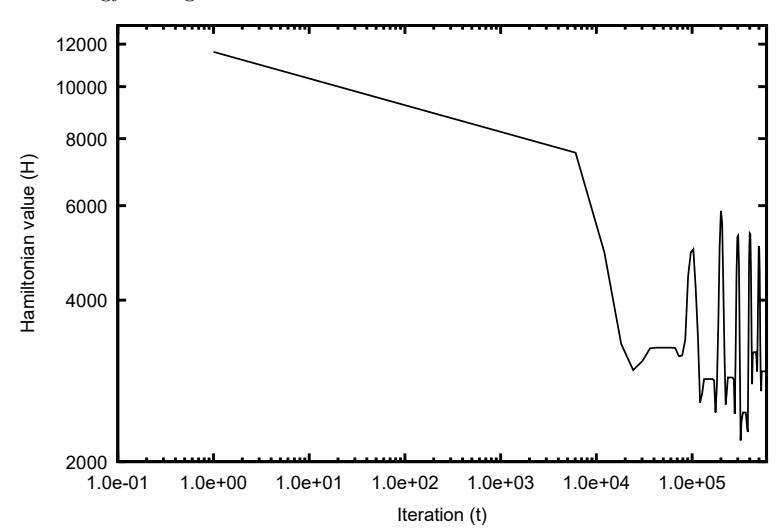
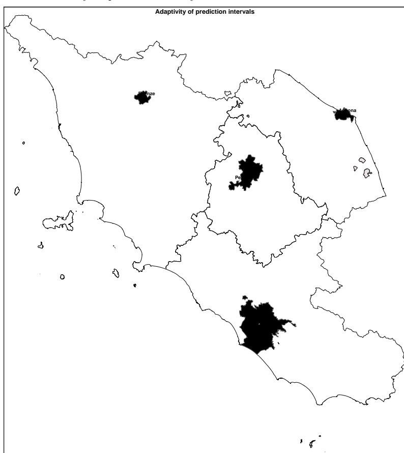

# Unveiling Complex Territorial Socio-Economic Dynamics: A Statistical Mechanics Approach

Pierpaolo Massoli

\*Directorate for Methodology and Statistical Process Design (DCME), Italian National Institute of Statistics (ISTAT), Via Cesare Balbo 16, Rome, 00184, Italy.

Corresponding author(s). E-mail(s): pimassol@istat.it;

#### Abstract

This study proposes a novel approach based on the Ising model for analyzing socio-economic emerging patterns between municipalities by investigating the observed configuration of a network of selected territorial units which are classified as being central hubs or peripheral areas. This is interpreted as being a reference of a system of interacting territorial binary units. The socio-economic structure of the municipalities is synthesized into interpretable composite indices, which are further aggregated by means of Principal Components Analysis in order to reduce dimensionality and construct a univariate external field compatible with the Ising framework. Monte Carlo simulations via parallel computing are conducted adopting a Simulated Annealing variant of the classic Metropolis-Hastings algorithm. This ensures an efficient local exploration of the configuration space in the neighbourhood of the reference of the system. Model consistency is assessed both in terms of energy stability and the likelihood of these configurations. The comparison between observed configuration and simulated ones is crucial in the analysis of multivariate phenomena, concomitantly accounting for territorial interactions. Model uncertainty in estimating the probability of each municipality being a central hub or peripheral area is quantified by adopting the model-agnostic Conformal Prediction framework which yields adaptive intervals with guaranteed coverage. The innovative use of geographical maps of the prediction intervals renders this approach an effective tool. It combines statistical mechanics, multivariate analysis and uncertainty quantification, providing a robust and interpretable framework for modeling socio-economic territorial dynamics, with potential applications in Official Statistics.

Keywords: Ising Model, Composite Indices, MCMC Simulation, Parallel Computing, Conformal Prediction

## 1 Introduction

The increasing availability of geo-referenced demographic and economic data constitutes a challenging opportunity in spatial data analysis. Descriptive approaches may prove to be inadequate when managing data complexity if territorial structures and socio-economic aspects are combined. Traditional spatial-econometric approaches are usually based on autocorrelation and regional dependencies, providing important state-of-the-art methodology in applied statistics [\(Anselin](#page-23-0) [1988;](#page-23-0) [Bivand et al.](#page-23-1) [2013\)](#page-23-1). These models require a non-trivial construction of a pre-defined spatial weight matrix and rely on assumptions of linearity and normality of input data, which may not hold in real-world applications. As a result, they may fail to capture complex non-linear relationships as well as the spatial heterogeneity of socio-economic data, resulting in a limited generalization capability. Composite indices methodology offers a more flexible approach for analyzing the influence of diverse factors related to local units such as regions or municipalities, providing a valid alternative to the aforementioned descriptive and traditional methods. These widely used methods are adopted in official statistics to synthesize multiple dimensions of complex phenomena into a single value, enabling territorial comparisons across a set of statistical units for the evaluation of multidimensional well-being, deprivation, and social vulnerability. A most relevant example is the research work carried out by the Italian BES (equitable and sustainable well-being, Italian acronym) Committee for measuring multidimensional economic, social, and policy domains [\(Istat](#page-24-0) [2024\)](#page-24-0). These measures support the understanding of complex socio-economic phenomena and facilitate effective communication between researchers and policy makers, especially when rankings of statistical units are analyzed. Composite indicators play a central role in the field of social indicators, offering essential tools for monitoring inequality, well-being, and regional cohesion. They are widely adopted by national statistical institutes and international frameworks to evaluate social progress and guide public policy across space [\(Noll](#page-24-1) [2004;](#page-24-1) [Greco et al.](#page-24-2) [2019\)](#page-24-2). These indicators provide a multidimensional representation of well-being, going beyond income-based measures and enabling spatially informed decision-making. Despite their widespread use, most composite indices rely on simple additive aggregation functions. Although broadly accepted, these methods often assume complete compensability across dimensions—meaning that a deficit in one dimension can be offset by a surplus in another—which may not hold in real-world settings. To address this limitation, a non-compensatory composite index has been proposed for both spatial and spatial-temporal comparisons [\(Mazziotta and Pareto](#page-24-3) [2016\)](#page-24-3). A critical limitation remains: composite indices, whether compensatory or not, do not capture interactions between statistical units. As such, they may prove inadequate for analyzing complex territorial dynamics that emerge from interdependencies among local units. In the field of machine learning, spatial methods are gaining interest in official statistics, where predictive modeling of heterogeneous socio-economic data is a standard task, as in the case of convolutional neural networks for estimating poverty by analyzing satellite imagery combined with socio-economic predictors [\(Jean et al.](#page-24-4) [2016\)](#page-24-4). This integration of spatial statistics with data-driven approaches is particularly effective in gaining a deeper insight into social inequalities across a given territory. In the same context of territorial analysis using machine learning, a novel approach based on region-specific boosted classification trees has been proposed to evaluate the importance of a set of composite dimensions in relation to an observed classification of Italian municipalities as either central hubs or peripheral areas [\(Casacci et al.](#page-23-2) [2024\)](#page-23-2). The results of this approach illustrate the potential of using composite indices in machine learning while considering the territory as divided into a set of disjoint partitions, without accounting for interactions between local units. These limitations suggest that models integrating local spatial interactions with external influences to interpret observed territorial arrangements of local units may prove to be more robust when compared to other classification approaches. Graph-based models have recently gained increasing attention for their ability to represent spatial systems through topological rather than strictly geographical adjacency. In these approaches, spatial units are interpreted as nodes in a network, with edges encoding various forms of structural or functional similarity rather than physical contiguity. This allows for the modeling of spatial interactions in highly heterogeneous systems where classical distance-based metrics may be inadequate. In human geography and urban planning, graph representations have been employed to study socio-spatial organization, infrastructure networks, and regional dependencies [\(Liu and Jiang](#page-24-5) [2022;](#page-24-5) [Batty](#page-23-3) [2021\)](#page-23-3). These models emphasize the conceptual nature of spatial relationships, offering a flexible framework for representing territorial complexity. The approach proposed in this study builds on this graph-based perspective by modeling socio-economic interactions between municipalities based on shared territorial profiles, independently of strict geographical proximity. In this perspective, this study proposes the Ising model from Statistical Mechanics, a versatile algorithm for describing interactions among particles in complex physical systems [\(Ising](#page-24-6) [1925\)](#page-24-6). Recent studies have emphasized the potential of adopting tools from statistical physics and network science for modeling socio-economic and territorial systems. Approaches based on the Ising model and its variants have been successfully applied to understand regional disparities [\(Schae](#page-24-7)[fer and Konig](#page-24-7) [2023\)](#page-24-7), structural dependencies in socio-economic resilience [\(Duan et al.](#page-23-4) [2022\)](#page-23-4), and spatial complexity in urban systems [\(Jia et al.](#page-24-8) [2024\)](#page-24-8). These works suggest that integrating spatial interactions within probabilistic frameworks can enhance the interpretability and robustness of territorial models. This method has also been successfully applied to opinion dynamics, biological networks, and socio-economic territorial domains [\(Galam](#page-23-5) [1997;](#page-23-5) [Durlauf](#page-23-6) [1999\)](#page-23-6). A key feature of this model consists in the effective integration of local interactions with external influences in a probabilistic modeling framework. In the specific context of spatial analysis, this method may describe the asymptotic behavior of a network of interacting local units subject to an external field of observed influences, by taking the adjacency of the units into account as is the case of municipalities with territorial attributes subject to socio-economic influences. In such a case the adjacency of local units is interpreted in terms of both geographical proximity and territorial similarity. Due to the combinatorial complexity of such a network, the exploration of all possible configurations of the system is not feasible. Therefore, the system is simulated by means of Markov Chain Monte Carlo (MCMC) techniques based on the Metropolis-Hastings algorithm, in order to generate configurations of binary local units sampled from an unknown probability distribution as the system reaches stationarity [\(Metropolis et al.](#page-24-9) [1953;](#page-24-9) [Binder](#page-23-7) [1997\)](#page-23-7). This simulation process may be computationally intensive. To reduce the execution time and computational burden, a parallel computing approach is mandatory in most realworld applications [\(McCallum and Weston](#page-24-10) [2011;](#page-24-10) [Weston et al.](#page-25-0) [2017\)](#page-25-0). The randomly generated configurations are used to estimate the probability of each local unit being in a particular state, thereby assessing the contribution of socio-economic aspects while accounting for territorial similarities in the emergence of specific patterns in the estimated classification of municipalities. The comparison with the observed classification of municipalities is crucial for evaluating the socio-economic influences, which are defined by a set of composite indices summarizing social, demographic, and economic characteristics. Principal Components Analysis is then applied to further aggregate these indices into a single latent structure, referred to as the external field in the Ising model. The model is simulated using Simulated Annealing (SA), a variant of the aforementioned MCMC approach, aimed at iteratively exploring the configuration space by flipping nodes according to local energy changes [\(Aarts and Korst](#page-23-8) [1989;](#page-23-8) [Geman](#page-24-11) [and Geman](#page-24-11) [1984\)](#page-24-11). Simulations are initialized from the observed territorial classification, which serves as the reference configuration. As reported in the literature, this algorithm is asymptotically convergent to a global optimum (if it exists) when a logarithmic cooling schedule is adopted, regardless of the initial configuration and initial temperature of the system. This study proposes an approach that diverges from this theoretical setting by employing a localized stochastic search for more energetically favorable and more likely configurations in the neighbourhood of the reference. As a consequence, an adaptation of the standard Ising framework is proposed, where the updating mechanism is modified in a stochastic gradient descent perspective. The reliability of probability estimates is assessed through the Conformal Prediction (CP) framework [\(Vovk et al.](#page-25-1) [2005;](#page-25-1) [Shafer and Vovk](#page-24-12) [2008;](#page-24-12) [Angelopoulos and Bates](#page-23-9) [2021;](#page-23-9) [Tibshirani](#page-25-2) [2023\)](#page-25-2). The methods in this framework evaluate distribution-free prediction intervals with guaranteed coverage of the true value of the target variable of a machine learning model, even in the absence of traditional model assumptions [\(Lei et al.](#page-24-13) [2018;](#page-24-13) [Burnaev and Vovk](#page-23-10) [2014\)](#page-23-10). The proposed approach aims to contribute to the field of spatial analysis by combining methods from Statistical Physics, Multivariate Analysis, and Conformal Prediction. The Ising model framework is innovatively extended for socio-economic analysis. The incorporation of Conformal Prediction introduces a crucial step for quantifying uncertainty through the construction of adaptive prediction intervals, which are projected onto geographical uncertainty maps. These maps represent a valuable tool for detecting areas of limited model reliability in policydriven territorial analysis, as highlighted by the results from the real-world case study presented in this article.

## 2 Theoretical background

In order to introduce the basic aspects of the proposed approach to the reader, some notions regarding the Ising model as well as the composite indices method being adopted and Conformal Prediction framework are reported in this section.

#### 2.1 The Ising model

The Ising model, formerly proposed for studying ferromagnetism in materials in a Statistical Mechanics context, is also applied to more general systems where the effect of local interactions is important. It is a discrete system constituted by a network of N nodes, each assuming a binary state si ∈ {−1, +1} (i = 1, 2, . . . , N) called spin. A configuration of the system is denoted by s = {s1, s2, . . . , sN } which is an element of the set S of all possible configurations. A straightforward mathematical representation of the network is the undirected graph. The energy (Hamiltonian) of a configuration is defined as follows

H(s) = − 1 2 X N i,j Jij sisj − X N i hisi (1)

where the element Jij of the symmetric matrix J defines the interaction between nodes i and j while hi is the external field acting on node i. By representing the network as being a graph, J may be interpreted as the weighted adjacency matrix, where Jij > 0 indicates the pair (i, j) of connected nodes. As the system reaches thermodynamic equilibrium, the probability of observing a given configuration s is defined by means of the Boltzmann distribution:

P(s) = 1 Z e − H(s) T , (2)

where T is the temperature of the system and Z is the partition function defined as follows:

Z = X s∈S exp(−H(s)). (3)

This distribution assigns a higher probability to configurations related to lower energy values, depending on the temperature of the system. This fixed parameter influences the physical behavior of the system so that when T is high the system is chaotic while lower the temperatures imply configurations pertaining to minimum values of energy. The general Hamiltonian function is non-convex with a highly irregular surface, suggesting the Simulated Annealing (SA) variant of the classic Metropolis-Hastings algorithm which is usually adopted in the standard Ising framework. The interaction matrix J results to be indefinite[1](#page-4-0) in many practical cases, implying the existence of multiple local minima as well as saddle points of the Hamiltonian function. As a result, standard MCMC method may get stuck in sub-optimal configurations which are best avoided by a SA strategy. This variant requires a time-dependent temperature cooling schedule T = f(t), decreasing over time, and updates the solution in accordance with an acceptance criterion. The acceptance probability of a proposed spin configuration at time t is defined as follows:

α = min n 1, exp − ∆H T o (4)

In Linear Algebra, a quadratic form q(x, y) = y T Ax with x, y ∈ R n \ {0 is indefinite if the symmetric matrix A admits both positive and negative eigenvalues so that q(x, y) > 0 or q(x, y) < 0.

where ∆H is the (local) change in energy subsequent to the flipping of the spin pertaining to a node selected at random. This node selection is iteratively repeated during the MCMC simulation in order to span the entire network, yielding an approximate estimate of the total energy variation in a Stochastic Gradient Descent perspective. As the system cools down it converges to a minimum of the energy gradually by escaping local minima. In real systems when the interaction structure is a large weighted graph, the partition function Z becomes computationally intractable, hindering a direct computation of probabilities as is indicated in Equation [2.](#page-4-1) As a consequence, MCMC approaches are adopted in order to generate system configurations sampled from the aforementioned probability distribution.

## 2.2 Methods for creating composite indices

Composite indices are widely adopted in the social sciences when the synthesis of multi-dimensional information into a single value is required for taking the overall performance of statistical units into account with respect to specific phenomena. Composite indices facilitate the comparison between different statistical units. Compensatory indices provide a compensation of low values in a base indicator with high values in another if the assumption that they are substitutable is valid. Non-compensatory composite indices are suitable when all input dimensions are essential.

#### A popular non-compensatory composite index

A well-known method in the literature for constructing composite indices is the Mazziotta-Pareto Index (MPI), a non-compensatory method based on a standardization of base indicators in z-scores for a subsequent aggregation by penalizing unbalanced unit profiles. Suppose an input dataset X = {xij} containing j = 1, 2, . . . , M base indicators pertaining to i = 1, 2, . . . , N statistical units, the MPI composite index requires the standardization of every value in the dataset as follows

x s ij = 10 · polj · xij − µj σj + 100 (5)

where xij is the original i-th value of the j-th base indicator, polj its polarity (equal to +1 or −1), µj its mean, and σj its standard deviation. The MPI is subsequently computed as follows:

MP Ii = Mi ± Si · Si Mi , (6)

where Mi and Si are the mean and standard deviation of the standardized profile i, respectively. The sign ± depends on whether the phenomenon being under consideration is positive or negative. A higher dispersion among the input base indicators affects the final score of the composite index, reflecting a penalization for unbalanced units. In order to create a meaningful index in relation to a specific aspect under examination, all its base indicators have to be related to the same as well. The polarity of each indicator may assume opposite signs insofar as they all have the same direction. This crucial aspect of the composite index construction has to be addressed by researchers before proceeding to the construction.

#### An effective compensatory composite index

Another well-known method in the literature for synthesizing information is Principal Components Analysis (PCA), a dimensionality reduction technique that transforms the original correlated variables into a set of uncorrelated components. The first few principal components typically maintain most of the variance in the data, allowing for a simplified yet informative representation. In this context, the principal components are used to construct a weighted composite index, where weights are derived from the explained variance of each component. The dataset X is decomposed into its principal components pc1 , pc2 , . . . , pcM, which are aggregated as follows:

CPPCA = λ1pc1 + λ2pc2 + . . . + λMpcM (7)

where λi indicates the i-th normalized eigenvalue of the PCA decomposition of the input dataset[2](#page-6-0) . Each λi represents the proportion of total variance explained by the i-th principal component. This approach ensures that the composite index reflects the dominant structure of variability in the original data

### 2.3 A quick glance at Conformal Prediction

Conformal Prediction (CP) is a versatile framework for quantifying uncertainty in a machine learning model y = f(x), yielding guaranteed coverage relating to its prediction intervals without requiring assumptions about data distribution. This framework is particularly robust insofar as model reliability is a critical concept as far as practical applications are concerned. Prediction intervals are evaluated by means of a calibration set in order to compute non-conformity scores. In this context these latter are calculated as standardized residuals defined as follows:

si = |yi − yˆi u(x) , (8)

where yi and yˆi are respectively the observed (true) and predicted values and u(x) represents a measure of the uncertainty related to the input vector x computed by using data belonging to the calibration set. The prediction intervals for every observation x belonging to the test set are evaluated as follows:

C(x) = [yˆi − qσ, ˆ yˆi + qσˆ ], (9)

where qˆ is the ⌈(1−α)(n+1)⌉/n quantile with n equal to the number of observations in the calibration dataset and α is the user-defined level of accuracy. This split-conformal approach requires that the dataset is partitioned into disjoint calibration and test sets. The CP framework requires a dataset of n observations {(X = xi , Y = yi)}

2The weights λi used in the construction of the composite index are normalized so that their sum is equal to one.

(i = 1, 2, . . . , n) with features X ∈ R d and response y ∈ R, the prediction interval C(X) = [L(X), U(X)] covers the true value with probability:

Pr(y ∈ C(X)) ≥ 1 − α, (10)

In order to further evaluate the properties of prediction intervals whilst ensuring a pre-fixed coverage the Mean Interval Width (MIW) is used. It is defined as:

MIW = 1 n Xn i=1 (Ui − Li) (11)

where Ui and Li are the upper and lower bounds of the prediction interval for observation i in a test set containing n observations. In order to normalize this measure relative to the scale of the target variable, the Relative Interval Width (RIW):

RIW = MIW ymax − ymin (12)

where ymax and ymin denote the maximum and minimum observed values of the target variable. A lower MIW indicates narrower intervals, while a lower RIW facilitates comparisons across different datasets or models by adjusting for data scale variations. These measures yield a precise evaluation of the adaptivity of the prediction intervals.

## 3 Proposed approach

The proposed approach is grounded on the application of the Ising model to the analysis of binary territorial classifications, integrating local interactions and external influences within a probabilistic framework. This methodology is designed to be general and adaptable to any spatial context in which local units are described by a set of socio-economic characteristics and territorial features, and a binary classification is available. Each local unit is characterized by a set of base indicators capturing demographic, educational, economic, and occupational aspects, as well as territorial attractiveness and dynamism. These indicators are aggregated into composite indices by means of the Mazziotta-Pareto methodology. Dimensionality is reduced through Principal Components Analysis (PCA), which is used to construct the external field of the model, as illustrated in the case study which follows. Territorial similarities are incorporated through the construction of a weighted undirected graph where nodes represent local units. The edges reflect proximity or similarity based on features such as altitude, surface area, population size, degree of urbanization and coastal proximity. The resulting interaction matrix defines the topology of the Ising network. Model simulation is performed using a variant of the Metropolis-Hastings algorithm based on Simulated Annealing. The observed configuration is considered as a starting point of the algorithm which explores the space of possible configurations by changing the state of one node at a time. The proposed Simulated Annealing scheme, guided by a rapidly decreasing temperature schedule, performs a localized stochastic search around this reference. Rather than seeking a global minimum, the model aims to identify nearby, energetically favorable configurations, thus reducing sensitivity to the initial state over long simulations and supporting the interpretative focus of the approach. The probability of each local unit being in a given state is estimated from the marginal distribution obtained by generating multiple configurations. In order to quantify the uncertainty of these estimates, the Conformal Prediction framework is employed, deriving distribution-free prediction intervals with guaranteed coverage under minimal assumptions. The uncertainty quantified by the model is primarily epistemic, stemming from structural assumptions and aggregation processes, rather than data randomness. As a consequence, the absence of a sensitivity analysis on the MCMC parameters is compensated by adopting the Conformal Prediction framework as the uncertainty estimation accounts for the total variability induced by the model structure. This framework provides a robust methodology for analyzing territorial configurations as emergent phenomena shaped by endogenous interactions and exogenous socio-economic pressures, with particular applicability to complex heterogeneous systems. The estimated marginal distribution is therefore not an end in itself, but a means to generate plausible territorial classifications of the municipalities in terms of −1/+1 spin values. These simulated configurations represent alternative arrangements that are coherent with the model assumptions and can be compared to the observed classification. This comparison enables a deeper investigation of the socio-economic dimensions that drive the emergence, deviation, or ambiguity of spatial patterns across the territory.

## 4 A real-world application to Italian municipalities

In order to illustrate the potential of the proposed method, a case study regarding realworld data was analyzed. Data were taken from the statistical register ARCHIMEDE of the Italian National Institute of Statistics (ISTAT). The register integrates diverse administrative sources, providing a detailed description of all Italian municipalities. The main objective of this case study is not to claim superiority of the proposed approach over existing classification methods, rather to investigate whether a statistical mechanics-based model can reproduce and explain spatial patterns emerging from territorial interactions. Nonetheless, a comparative benchmark with standard models is presented in Section [5.5,](#page-20-0) as a final step to assess classification performance from a predictive perspective.

## 4.1 The input dataset

The input dataset was extracted from the aforementioned register by selecting a subset of relevant socio-economic base indicators. This dataset is made up of a total of 7908 municipalities with profiles with no missing data, each being characterized by a set of socio-demographic, economic and territorial variables as well as geographic attributes. Each municipality is classified as being a central hub or peripheral area based on exogenous criteria. As the available territory is rather large and non-homogeneous, the results may be difficult to interpret and the model simulations may be computationally intensive; the only territory which was taken into consideration was the central macro-region made up by the following regions: Lazio, Marche, Tuscany and Umbria. As a result, the total number of municipalities was reduced to 966. This case study analyzed the configurations of municipalities which were generated by using the Ising model in accordance with the observed one which is the reference configuration. The objective was to investigate the impact of socio-economic aspects on the probability of municipalities being central hubs, having taken territorial structures into account. The list of features is reported in Table [1.](#page-9-0) The polarities of the base indicators are set

Table 1 Description of Composite Indices

up in order to calculate coherent values of composite indices in the real-world scenario being considered. These indices constitute the univariate external field of the Ising model as is reported in the following. Territorial attributes of municipalities are used for modelling interactions between units; all those ones sharing the same territorial profile are connected with a weight equal to 1 even though they may be not neighbouring municipalities. The territorial attributes are reported in Table [2.](#page-10-0) As a result, the network becomes a simple undirected graph in which each node identifies a municipality of the territory being considered. The interaction matrix J of Equation [1](#page-4-2) reduces therefore to the adjacency matrix with 0, 1 elements. The observed configuration is considered as being the reference configuration of spins {−1, +1} for the MCMC simulations. The base indicators listed in Table [1](#page-9-0) were selected solely on the basis of their availability. Even though the addition of variables such as transport infrastructure coverage, commuter flows and economic networks may further refine the modeling of

Table 2 Territorial attributes of municipalities

| Attribute Item             | Description |           |            |        |              |                     |
|----------------------------|-------------|-----------|------------|--------|--------------|---------------------|
| (Altitude of the centre)   |             |           |            |        |              |                     |
| 1                          | Lowland     | (below    |            | 300    | meters)      |                     |
| 2                          | Hill        | (between  | 300        | and    | 600          | meters)             |
| 3                          | Mountain    |           | (above     | 600    | meters)      |                     |
| (Resident population Size) |             |           |            |        |              |                     |
| 1                          | Small       | (fewer    | than       | 5,000  | inhabitants) |                     |
| 2                          | Medium      | (between  |            | 5,000  | and          | 50,000 inhabitants) |
| 3                          | Large       | (more     | than       | 50,000 |              | inhabitants)        |
| (Surface Area)             |             |           |            |        |              |                     |
| 1                          | Small       | (less     | than       | 15 km  | 2)           |                     |
| 2                          | Medium      | (between  |            | 15     | and          | 100 km 2)           |
| 3                          | Large       | (more     | than       | 100    | km           | 2).                 |
| (Coastal Location)         |             |           |            |        |              |                     |
| 0                          | Non-coastal |           |            |        |              |                     |
| 1                          | Coastal     |           |            |        |              |                     |
| (Urbanization Level)       |             |           |            |        |              |                     |
| 1                          | City        | / Densely | populated  |        |              | areas               |
| 2                          | Towns       | and       | suburbs    | /      | Intermediate | density areas       |
| 3                          | Rural       | areas     | / Sparsely |        | populated    | areas               |

territorial interactions for yielding more coherent configurations, a deeper investigation into the optimal selection of base indicators is beyond the scope of this study. It is important to point out that the interaction matrix was constructed by connecting municipalities which share similar structural and territorial attributes regardless of their geographical contiguity. As a result, this matrix describes a conceptual network, which is more suitable to the proposed approach in this study. as opposed to geographical adjacency, which may connect highly dissimilar municipalities, this formulation promotes interactions among units with comparable profiles, supporting a more interpretable modeling of territorial structures.

## 4.2 External field of the Ising model

Before applying the PCA as is described in Section [2](#page-3-0) in order to create the external field, the Pearson correlation matrix between the input composite indices (MP I.1- MP I.6) was computed. This matrix reveals that the correlation between MP I.3

Table 3 Correlation of the composite indices

|       | MPI.1 | MPI.2 | MPI.3 | MPI.4 | MPI.5 | MPI.6 |
|-------|-------|-------|-------|-------|-------|-------|
| MPI.1 | 1.000 | 0.255 | 0.170 | 0.172 | 0.177 | 1.000 |
| MPI.2 | 0.255 | 1.000 | 0.441 | 0.428 | 0.240 | 0.255 |
| MPI.3 | 0.170 | 0.441 | 1.000 | 0.893 | 0.046 | 0.170 |
| MPI.4 | 0.172 | 0.428 | 0.893 | 1.000 | 0.069 | 0.172 |
| MPI.5 | 0.177 | 0.240 | 0.046 | 0.069 | 1.000 | 0.177 |
| MPI.6 | 1.000 | 0.255 | 0.170 | 0.172 | 0.177 | 1.000 |

(economic well-being) and MP I.4 (employment) assumes a value equal to 0.893 as well as the correlation between MP I.1 and MP I.6 equal to 1 highlight linear dependency between them while MP I.5 (attractiveness of the municipality) reflects a weakly correlated input dimension in relation to the other ones, revealing redundant information which motivates the adoption of the dimensionality reduction approach by means of PCA. As a consequence, the composite indices in the input dataset X were transformed into uncorrelated dimensions so that X = {pc1 , pc2 , . . . , pc6} where the vector pci indicates the i-th principal component. The objective is to create a supercomposite index which is not affected by input data dependencies yet maintaining the maximum value of the explained variance of the same. On the basis of this reasoning the external field was defined as follows:

h = λ1pc1 + λ2pc2 + . . . + λ6pc6 (13)

where h = {h1, h2, . . . , hn} is the array of the values of the resulting external field pertaining to n municipalities which constitute the territorial network of the model. The weights λi being used to construct the external field are reported in Table [4.](#page-11-0) The

Table 4 Principal Components Analysis summary

| Component                      | PC1    | PC2    | PC3    | PC4    | PC5    | PC6    |
|--------------------------------|--------|--------|--------|--------|--------|--------|
| Standard deviation             | 1.7327 | 1.1968 | 0.9416 | 0.6925 | 0.4461 | 0.0000 |
| Proportion of Variance ( λ i ) | 0.5004 | 0.2387 | 0.1478 | 0.0799 | 0.0332 | 0.0000 |
| Cumulative Proportion          | 0.5004 | 0.7391 | 0.8869 | 0.9668 | 1.0000 | 1.0000 |

number of variables in the input dataset X may be further reduced due to the fact that the first three principal components are sufficient to explain the 88.69% of the variance of the input data. The external field is not required to be interpretable as it is related to the MPI indices which are synthetized via PCA, performing an efficient dimensionality reduction while maintaining relevant information. The aggregation of the input composite indices by means if the PCA is motivated by the requirement of extracting a latent structure which preserves the most of variance while removing collinearity among the input data. The PCA-based super-index offers a valid synthesis of the input composite indices, yielding a continuous univariate variable which constitutes the bridge between the Ising model and the multivariate socio-economic aspects under investigation. Despite the complete collinearity of two input variables, all six principal components are maintained in the construction of the external field. The component related to zero variance does not contribute to the weighted sum, as its corresponding eigenvalue is zero. As a result, the formulation in Equation [13](#page-11-1) remains numerically stable while preserving the full dimensional structure of the data.

### 4.3 MCMC simulations of the model

The marginal probability of each local unit being in the central hub state is estimated through Monte Carlo simulations. The simulation starts from the observed territorial configuration and proceeds by flipping spins according to local energy changes. A total of Niter iterations is performed, with temperature initialized at T0 = 100 and decreasing according to a hyperbolic schedule T(t) = T0/t. This allows the system to rapidly concentrate around energetically favorable configurations. At each iteration, a local unit is randomly selected, and its spin is flipped with a probability depending on the energy variation and current temperature. The empirical marginal probability

for each unit is computed as the frequency of state +1 across sampled configurations, representing the estimated likelihood of being classified as a central hub. Since the simulation aims to explore configurations near the observed one rather than achieve global convergence, this setup is effective in detecting plausible structural alternatives driven by the model dynamics. The MCMC algorithm requires a large number of iterations t = 1, 2, . . . , Niter to produce stable results, making a parallel computing approach often necessary. In the Simulated Annealing meta-heuristic framework, the probability of accepting energetically unfavorable configurations (∆H > 0) depends on the cooling profile. A faster rate reduces the probability of such acceptances, directing the process towards lower-energy states (∆H < 0). It is well-established in the literature that this optimization technique converges asymptotically to an optimum independently of the initial configuration and temperature when a logarithmic schedule is used. In this study, the initial configuration is fixed rather than selected at random, while temperature is initialized at T0 = 100, a value that supports broad initial exploration and gradual focus on the reference configuration. Empirical validation confirmed that varying T0 produces consistent estimates. The purpose is not exhaustive global exploration, rather to identify energetically plausible configurations in the neighbourhood of the observed one. A slower logarithmic schedule may induce unwanted deviations from this reference. In order to achieve this aim, a hyperbolic cooling function T(t) = T0/t is adopted to accelerate convergence around the observed configuration. The setting of this schedule thus reflects the preference for local rather than global exploration. Each sampled configuration generated by the Ising model corresponds to a categorical classification of the entire set of municipalities, where each unit is assigned a binary state si ∈ {−1, +1} indicating peripheral area or central hub, respectively. As a result, the simulation process yields a collection of alternative territorial classifications consistent with the interaction network and the external field. The empirical marginal probability that a given municipality is classified as a central hub is then estimated as the relative frequency of state +1 across all sampled configurations after the burn-in phase. This approach assesses model-driven deviations from the observed classification rather than seeking a single global minimum. The simulation algorithm iteratively selects one node at random and flips its spin based on the energy change and current temperature, as detailed in Section [2.1.](#page-4-3) This procedure generates a sequence of configurations used to estimate marginal probabilities. The empirical estimation corresponds to the proportion of sampled configurations in which each unit assumes state +1, indicating classification as a central hub. Given the rationale above, the absence of a formal sensitivity analysis is justified. The uncertainty due to simulation is already incorporated into the estimated marginal probabilities, making a Conformal Prediction approach a suitable alternative. The energy and likelihood of sampled configurations are evaluated as described in the following section.

## 4.4 Energy and likelihood of the simulated configurations

The coherence of the model was assessed after having estimated the marginal probability distribution of each municipality, the same is used to generate N new spin configurations in order to evaluate the ratio between energy H of each s and the reference configuration Href (see Equation [1\)](#page-4-2). Energy ratios having most of the values below 1 indicate a reliable and robust system. On the basis of this reasoning, the ratio between the log-likelihood of each simulated configuration and the reference one indicates configurations which are more compatible with the territorial constraints as well as the external field . According to Equation [2,](#page-4-1) the ratio is defined as follows:

log P(s) P(sref ) ∝ −∆H (14)

where ∆H = H − Href indicates the difference between the hamiltonian of a generic configuration and the reference one. This formulation avoids the evaluation of the partition function which is intractable in real-world systems[3](#page-13-0) . These measurements are proposed for the selection of a set of configurations used for estimating the probability distribution in order to investigate the misclassified municipalities. A further analysis of the spectrum of the interaction matrix J includes the presence of both positive and negative eigenvalues, confirming a non-convex Hamiltonian which may exhibit multiple local minima[4](#page-13-1) .

## 4.5 Uncertainty quantification of the model

It is important to remind the reader that, the probability that each municipality is a central hub is estimated as being the empirical mean of its spin value across a sample of configurations generated by the model at stationarity. As a consequence, the generation of a pre-fixed number of samples of spin configurations is required in order to have as many independent marginal probability estimations as the number of samples in which each sampled configuration represents a plausible territorial classification. Uncertainty of the model in producing these estimates is effectively evaluated by determining the prediction intervals of the probabilities of being a central hub for each municipality in the network. To be more precise, subsequent to the evaluation of the likelihood of the sampled configurations as is described in the previous section, K matrices of N spin configurations are generated in order to get K independent estimations of the aforementioned marginal probability. The prediction intervals of the estimated probability for each municipality are evaluated according to the Conformal Prediction approach reported in Section [2](#page-3-0) where the non-conformity scores are calculated as described by Equation [8](#page-6-1) where the true value of the probability for the i-th municipality is denoted by yi while yˆi is its k-th probability estimate (k = 1, 2, . . . , K) . In this study the uncertainty u(x) is considered equal to the standard deviation σ(x) of the K values of each municipality. The idea behind the construction of prediction intervals is that the analysis of the coverage as well as the adaptivity of the intervals provides useful insights on the model accuracy in relation to the external socio-economic information spread on the territory. Another notable contribution of the Conformal Prediction framework adopted in this study is the innovative generation of uncertainty maps for highlighting areas where model estimates diverge from the observed configuration. The robustness of the estimated marginal probabilities is

3The log-likelihood ratio is proportional to the energy variation up to a scaling factor given by the temperature T of the system which is considered as being at a temperature assumed when computing the ratio for comparing the simulated configurations to the reference.

4The determinant of J is negative resulting equal to det(J) = −6.24 × 1035

empirically assessed through the Conformal Prediction framework, instead of performing a traditional sensitivity analysis on MCMC parameters (i.e. initial temperature and number of iterations). The prediction intervals quantify the uncertainty arising from both the simulation process and the model structure, thus avoiding the traditional sensitivity analysis of the MCMC simulations.

## 5 Results

In order to provide a robust estimation of the aforementioned marginal probability, the MCMC simulation of the Ising model was performed by means of a total of 600000 iterations of which the first 60000 (10%) were discarded as they were generated during the burn-in step of the simulations to ensure a stationary sampling process. The remaining 90% of the configurations were used to estimate the probability. Simulations were executed in a parallel computing context on a machine equipped with 8 logical cores (including hyperthreading). Six cores were utilized for computation, resulting in a total execution time of approximately 1.19 min. The simulations were carried out locally on a laptop featuring an 11th generation Intel Core i5-1145G7 processor with 4 physical cores and 8 threads, and a base frequency of 2.60 GHz. The operating system was a 64-bit version of Microsoft Windows. All computations were performed locally, without relying on cloud-based or distributed computing resources.

The selection of MCMC simulation parameters was not the result of a sensitivity analysis; parameters were set up on the basis of load-balancing considerations, rendering an efficient use of the six cores available when performing parallel computing. The number of iterations was set up in order to allocate a sufficient large number of the same to the aforementioned cores. The energy variation over the MCMC iterations

Fig. 1 Model energy during the MCMC simulations

reported in Figure [1](#page-14-0) shows a progressive and rather rapid decrease in energy during the early iterations of the simulations, with the Hamiltonian dropping from an initial high value above 11,000. This decrease is followed by an evident stationary process where the energy fluctuates within a narrow range between 2,000 and 3,000. This behavior indicates convergence towards optimal solutions, corresponding to a minimum of the energy (∆H → 0). During the MCMC simulations, the minimization of ∆H may be interpreted as being a stochastic gradient descent method applied to the Hamiltonian landscape. The reported stabilization of ∆H suggests that the system has reached a steady state in which the overall energy becomes approximately constant over time and concomitantly corresponding to minimum-energy configurations. The following sections report the results obtained from this simulation process, starting from the final energy configuration reached through the annealing procedure.

### 5.1 Observed and estimated distributions

The classification accuracy is calculated by comparing the observed configuration (sref) with the predicted one (spre), which is evaluated by summarizing all the configurations sampled from the stationary distribution of the Ising model; the resulting value is equal to 93.89%. In order to further evaluate the similarity between the observed

Table 5 Mismatch matrix

territorial configuration and the probabilities estimated by the MCMC simulations, we computed the Jensen-Shannon Divergence (JSD) between the binary vector derived from the observed configuration and the estimated probability distribution Pˆ. The observed data (with 1 indicating a central hub and 0 otherwise), and Pˆ the vector of estimated probabilities for each municipality. The JSD between P and Pˆ was calculated as: JSD(P, Pˆ) = 0.0766 This low divergence value indicates a strong agreement between the observed and estimated spatial configurations, confirming the ability of the Ising model and the MCMC simulation process to capture the underlying territorial structure.

## 5.2 Energy and likelihood of the generated configurations

The energy of the reference configuration was: Href = 11552.59. In order to assess the quality of the configurations generated by the model in relation to the observed configuration, the ratio between energy H of 25000 sampled configurations and Href was evaluated. Similarly, the log-likelihood ratio of the same was computed as described in Equation [14.](#page-13-2) Results are reported in Table [6.](#page-16-0) An alternative bootstrap analysis was also carried out in order to investigate the variability of both the log-likelihood ratio and the system energy based on the configurations generated by the model. A

Table 6 Energy and log-likelihood ratio

| Statistic | Energy | ratio H/H ref | Log-likelihood | ratio log( L/L ref ) |
|-----------|--------|---------------|----------------|----------------------|
| Min.      | 0      | 1534          | 8              | 7056                 |
| 1st Qu.   | 0      | 2603          | 8              | 9044                 |
| Median    | 0      | 3122          | 8              | 9793                 |
| Mean      | 0      | 3106          | 8              | 9817                 |
| 3rd Qu.   | 0      | 3618          | 9              | 0530                 |
| Max.      | 0      | 4780          | 9              | 1872                 |

total of R = 200 bootstrap replications were executed, each consisting of a sample of M = 1000 configurations drawn with replacement from the original set of N configurations. For each resample, the mean log-likelihood ratio and the mean energy were computed separately. Parallel computing was required by allocating 6 cores of the available machine resources. The total computation time was approximately 3 minutes for each bootstrap procedure. The estimated mean log-likelihood ratio and its 95% confidence interval as well as those pertaining to the energy ratio are summarized in Table [7.](#page-16-1)

Table 7 Confidence intervals by using bootstrap

## 5.3 Coverage and adaptivity of the prediction intervals

In order to evaluate the prediction intervals K = 20000 samples of N = 300 configurations of spins were generated as is described in Section [4.5.](#page-13-3) Due to the fact that the Ising model estimates the probability of being a central hub for each municipality, prediction intervals have to be equal to [0, 1] at maximum so that the lower L and the upper U bounds of the intervals are required to be corrected as follows: L ∗ = max(0, L) and U ∗ = min(U, 1) respectively. As a consequence, the mean interval width (MIW ) and its normalized version RIW coincide. The empirical coverage of the prediction intervals results equal to 96.99% in accordance with a confidence level equal to 95%. The number of remaining municipalities with an out-of-interval estimated probability is equal to 29, namely a subset of the 59 mismatches reported in Table [5.](#page-15-0) The measurement of the adaptivity reveals that the 94.02% of prediction intervals have zero width (L ∗ = U ∗ ) while the percentage of intervals which reveal full uncertainty ([L ∗ , U∗ ] = [0, 1]) is equal to 4.80% and a value of 1.17% with intermediate width (0 < [L ∗ , U∗ ] < [0, 1]). The subset of the remaining 30 misclassified units pertaining to cases in which all the prediction intervals range from 0 to 1 even though the estimated probability falls into the interval. In virtue of these results the average adaptivity of the prediction intervals MIW is equal to 0.05236 which suggests an overall high accuracy of the model in generating optimal configurations of the municipalities. This analysis of the adaptivity of the prediction intervals, since it is performed only on the subset of cases in which the predicted probability falls within the intervals, reveals that there are further cases in which the model is uncertain. To be more precise, 15 municipalities belonging to the set of intervals with the desired coverage were identified as having a prediction interval with maximum width indicating maximum model uncertainty while 11 cases with a smaller non-zero interval width still indicate uncertainty in the probability estimates of those municipalities. The uncertainty map illustrates the adaptivity on the territory being under examination as is reported in Figure [2.](#page-17-0) The map focuses exclusively on municipalities whose predicted probability of being a central hub falls into the corresponding prediction interval. The figure displays munic-

Fig. 2 Model Uncertainty map of Central Italy

ipalities with non-zero prediction interval width in order to indicate the less reliable model results only. These latter are possibly due to local data variability, structural model limitations as well as insufficient covariate information, impairing interpretation of the results so that they require potential methodological refinement. Municipalities which have full uncertainty (i.e., prediction interval width equal to [0, 1]) are marked in black, highlighting maximum model uncertainty while municipalities related to lower non-zero values of uncertainty are marked in grey. Municipalities highlighted on the map do not fully match all the misclassified ones reported in Table [5,](#page-15-0) implying that there are also units correctly classified even though the model is uncertain. Among the 937 municipalities having a coverage of 95%, neither the 881 municipalities pertaining to intervals with zero width are misclassified nor the 11 municipalities with non-zero width less than 1. A residual set of 45 municipalities pertaining to intervals with maximum width are divided into 15 correctly classified units and 30 misclassified units. Results also illustrate that there are 29 municipalities have a probability of being a central hub outside their prediction intervals.

## 5.4 Analysis of the socio-economic aspects

In order to avoid confusion in the reading of this section it is important to clarify that unlike the uncertainty map in Section [5.3,](#page-16-2) the analysis in the following includes all observed cases, regardless of whether the predicted probability falls into its prediction interval. The 59 misclassified municipalities therefore include both in-interval and out-of-interval cases. The average values of the input composite indices across three groups of municipalities, classified according to the concordance between their observed and predicted attractiveness status are summarized in Table [8.](#page-18-0) . The average

Table 8 Average MPI values by classification group

| Group                         | n   | MPI1   | MPI2   | MPI3   | MPI4   | MPI5   | MPI6   |
|-------------------------------|-----|--------|--------|--------|--------|--------|--------|
| No Central Hub-No Central Hub | 566 | 95.92  | 99.90  | 97.83  | 98.30  | 98.46  | 95.92  |
| Central Hub-No Central Hub    | 59  | 98.29  | 101.87 | 101.44 | 100.89 | 97.97  | 98.29  |
| Central Hub-Central Hub       | 341 | 103.55 | 104.64 | 102.45 | 102.87 | 102.69 | 103.55 |

values of the composite indices in accordance with the territorial variables being considered in order to create the network of the model are reported in Table [9–](#page-19-0)Table [13.](#page-20-1)

This stratified analysis reveals that misclassified municipalities often exhibit intermediate or ambiguous socio-economic profiles, confirming the capacity of the model in highlighting ambiguous patterns in the observed classification. The results indicate that the composite indices reveal a clear difference in socio-economic profiles between municipalities which are classified as being central hubs and peripheral areas. The former consistently exhibit higher values on indices related to economic well-being, employment levels, and territorial attractiveness, whereas the latter tend to score lower on these dimensions but higher on indices reflecting demographic aging and population stability. This divergence underscores the fact that complex, multidimensional processes-ranging from labor market dynamics to population mobility-coalesce to form

Table 9 Average MPI values by group and altitude level

| Group                         | Altitude | n   | MPI1   | MPI2   | MPI3   | MPI4   | MPI5   | MPI6   |
|-------------------------------|----------|-----|--------|--------|--------|--------|--------|--------|
| No Central Hub No Central Hub | 1        | 151 | 100.78 | 100.90 | 97.17  | 97.90  | 99.84  | 100.78 |
| No Central Hub No Central Hub | 2        | 291 | 96.47  | 100.68 | 98.61  | 99.08  | 98.91  | 96.47  |
| No Central Hub No Central Hub | 3        | 124 | 88.69  | 96.85  | 96.83  | 96.96  | 95.73  | 88.69  |
| Central Hub No Central Hub    | 2        | 59  | 98.29  | 101.87 | 101.44 | 100.89 | 97.97  | 98.29  |
| Central Hub Central Hub       | 1        | 268 | 104.00 | 104.64 | 102.70 | 103.23 | 102.72 | 104.00 |
| Central Hub Central Hub       | 2        | 65  | 102.41 | 104.79 | 101.82 | 101.88 | 102.51 | 102.41 |
| Central Hub Central Hub       | 3        | 8   | 97.62  | 103.20 | 99.17  | 98.63  | 103.47 | 97.62  |

Table 10 Average MPI values by group and surface area class

| Group                         | Surface | Area n | MPI1   | MPI2   | MPI3   | MPI4   | MPI5   | MPI6   |
|-------------------------------|---------|--------|--------|--------|--------|--------|--------|--------|
| No Central Hub No Central Hub | 1       | 93     | 94.78  | 98.47  | 97.39  | 97.06  | 94.90  | 94.78  |
| No Central Hub No Central Hub | 2       | 393    | 96.15  | 99.91  | 97.66  | 98.25  | 98.50  | 96.15  |
| No Central Hub No Central Hub | 3       | 80     | 96.08  | 101.53 | 99.22  | 100.00 | 102.44 | 96.08  |
| Central Hub No Central Hub    | 2       | 59     | 98.29  | 101.87 | 101.44 | 100.89 | 97.97  | 98.29  |
| Central Hub Central Hub       | 1       | 49     | 103.34 | 103.82 | 101.83 | 102.74 | 98.70  | 103.34 |
| Central Hub Central Hub       | 2       | 220    | 104.28 | 103.99 | 102.37 | 102.99 | 101.72 | 104.28 |
| Central Hub Central Hub       | 3       | 72     | 101.46 | 107.15 | 103.10 | 102.57 | 108.40 | 101.46 |

Table 11 Average MPI values by group and population size class

| Group                         | Population | Class n | MPI1   | MPI2   | MPI3   | MPI4   | MPI5   | MPI6   |
|-------------------------------|------------|---------|--------|--------|--------|--------|--------|--------|
| No Central Hub No Central Hub | 1          | 447     | 93.96  | 99.22  | 97.57  | 98.13  | 97.55  | 93.96  |
| No Central Hub No Central Hub | 2          | 116     | 103.06 | 102.45 | 98.85  | 98.94  | 101.66 | 103.06 |
| No Central Hub No Central Hub | 3          | 3       | 110.57 | 102.74 | 98.31  | 98.51  | 110.45 | 110.57 |
| Central Hub No Central Hub    | 1          | 59      | 98.29  | 101.87 | 101.44 | 100.89 | 97.97  | 98.29  |
| Central Hub Central Hub       | 1          | 90      | 101.92 | 103.02 | 101.20 | 102.28 | 98.86  | 101.92 |
| Central Hub Central Hub       | 2          | 226     | 104.34 | 104.84 | 102.88 | 103.31 | 103.15 | 104.34 |
| Central Hub Central Hub       | 3          | 25      | 102.27 | 108.61 | 103.08 | 100.97 | 112.41 | 102.27 |

the territorial patterns observed within the input data. The synthesis of diverse base indicators into coherent composite measures captures not only specific socio-economic aspects but also their relationship within a territorial framework, thereby highlighting the requirement for models capable of integrating structural territorial information and socio-economic latent dynamics, such as the Ising-based approach proposed.")n a policy-making perspective, the ability to detect ambiguous or transitional municipalities enables a more granular allocation of resources and planning strategies, promoting equitable development and reducing structural disparities across regions.

Table 12 Average MPI values by group and coastal municipality status

| Group                         | Coastal | (CLITO) n | MPI1   | MPI2   | MPI3   | MPI4   | MPI5   | MPI6   |
|-------------------------------|---------|-----------|--------|--------|--------|--------|--------|--------|
| No Central Hub No Central Hub | 0       | 540       | 95.80  | 99.77  | 98.09  | 98.49  | 98.14  | 95.80  |
| No Central Hub No Central Hub | 1       | 26        | 98.24  | 102.60 | 92.49  | 94.47  | 105.24 | 98.24  |
| Central Hub No Central Hub    | 0       | 59        | 98.29  | 101.87 | 101.44 | 100.89 | 97.97  | 98.29  |
| Central Hub Central Hub       | 0       | 288       | 104.06 | 104.09 | 102.74 | 103.32 | 102.02 | 104.06 |
| Central Hub Central Hub       | 1       | 53        | 100.75 | 107.63 | 100.85 | 100.41 | 106.36 | 100.75 |

Table 13 Average MPI values by group and degree of urbanization

| Group                         | DEGURB | n   | MPI1   | MPI2   | MPI3   | MPI4   | MPI5   | MPI6   |
|-------------------------------|--------|-----|--------|--------|--------|--------|--------|--------|
| No Central Hub No Central Hub | 2      | 75  | 105.75 | 102.91 | 97.87  | 98.08  | 102.16 | 105.75 |
| No Central Hub No Central Hub | 3      | 491 | 94.41  | 99.44  | 97.83  | 98.33  | 97.90  | 94.41  |
| Central Hub No Central Hub    | 3      | 59  | 98.29  | 101.87 | 101.44 | 100.89 | 97.97  | 98.29  |
| Central Hub Central Hub       | 1      | 12  | 101.13 | 109.53 | 103.02 | 100.39 | 114.85 | 101.13 |
| Central Hub Central Hub       | 2      | 202 | 104.70 | 104.93 | 102.63 | 102.97 | 103.91 | 104.70 |
| Central Hub Central Hub       | 3      | 127 | 101.94 | 103.70 | 102.11 | 102.94 | 99.61  | 101.94 |

## 5.5 Benchmark models for comparison

In order to evaluate the performance of the proposed model, three benchmark models were estimated using the same explanatory variables described in Section [4.1,](#page-8-0) restricted to municipalities in the central macro-region of Italy. These models represent standard approaches from statistical inference, spatial econometrics, and machine learning. The Logistic regression is a classical baseline for binary classification. It models the log-odds of the probability of being a central hub as a linear combination of the six composite indicators, without accounting for any spatial or structural dependence among municipalities. The Spatial autoregressive model (SAR) explicitly incorporates a structural dependency term by including a weighted average of the dependent variable across neighbouring units. In this study, the SAR model was implemented using the same conceptual similarity matrix adopted in the proposed Ising-based approach, thus allowing a structurally consistent comparison. The Random Forest model is a non-parametric ensemble method based on decision trees. It allows for non-linear interactions between variables and does not assume any form of spatial structure. The Spatial Error Model (SEM) was intentionally excluded from the comparison, as its formulation assumes spatial autocorrelation in the residuals rather than in the response variable. Since the aim of the present work is to explicitly model structural interdependencies, rather than to absorb unobserved spatial effects, the SEM is conceptually misaligned with the proposed modeling framework. Model predictions were compared with the observed classification, which corresponds to the initial configuration used in the Ising simulations. The comparison was carried out in terms of classification accuracy and Jensen–Shannon divergence with respect to the observed configuration.

Table 14 Classification accuracy and Jensen–Shannon divergence with respect to the observed configuration for each benchmark model and the proposed Ising model.

| Model    |                | Accuracy Jensen–Shannon | Divergence |
|----------|----------------|-------------------------|------------|
| Logistic | Regression     | 0.7536                  | 0.1767     |
| Spatial  | Autoregressive | (SAR) 0.7660            | 0.1811     |
| Random   | Forest         | 0.7402                  | 0.1767     |
| Ising    | model          | 0.9389                  | 0.0766     |

isfactory balance between structural coherence and predictive performance. While the logistic and spatial autoregressive models rely on linear assumptions or fixed spatial structures, and Random Forest captures non-linearities without accounting for spatial dependencies, the Ising model is able to embed both structural interactions and explanatory heterogeneity. Despite not being optimized for classification accuracy, it attains a competitive performance, supporting its suitability for modeling complex territorial dynamics.

## 6 Conclusions

This study introduces a framework for modeling territorial dynamics based on the Ising model, applied to the classification of municipalities into central hubs and peripheral areas. The approach integrates a spatial interaction network constructed from shared structural and geographical characteristics with an external field defined by socio-economic composite indices. This formulation allows the model to incorporate both local interactions and external influences in a unified probabilistic context. The use of composite indices serves a dual purpose: in addition to providing a concise and interpretable representation of complex socio-economic phenomena, these indices are a strategy for dimensionality reduction concomitantly taking multiple interrelated factors into account. This contributes to a more tractable modeling framework whilst preserving the multidimensional nature of territorial dynamics. Model simulations leverage the Markov Chain Monte Carlo method which employs a Simulated Annealing variant. In order to reduce the computational effort of MCMC simulations, it is necessary to adopt a parallel computing approach so that the execution time is kept at an acceptable level. This ensures scalability of the proposed approach when applied to more complex large-scale datasets. This study may represent one of the first applications of a statistical mechanics-based model for territorial classification driven by structural socio-economic similarities in substitution of geographical contiguity. The proposed framework may be extended to other domains in Official Statistics in which latent interaction structures emerge from demographic and economic indicators. The objective is to search for configurations which are energetically more favorable and statistically more likely in order to compare them to the observed reference. As the Markov chain becomes stationary, the algorithm explores configurations which are close to the one pertaining to a minimum energy value and providing insight into alternative structural equilibria. The application of Conformal Prediction enhances the proposed framework by enabling the construction of adaptive prediction intervals for each local classification. These intervals serve as a valuable measure of uncertainty varying across the territory in accordance with the strength of local external influences. In this context, uncertainty maps are introduced as an original analytical tool, capable of revealing territorial sub-areas where the model exhibits greater unreliability. These maps support a more detailed interpretation of local dynamics. By combining elements of statistical physics, multivariate analysis, and probabilistic inference, the proposed approach offers a flexible and extensible methodology for the analysis of spatial classifications. It is suitable for a wide range of territorial applications which include: multidimensional policy analysis, identification of structurally ambiguous areas with potential extensions to spatial-temporal systems. The set-up of a similarity-based graph which connects municipalities having analogous territorial profiles is unusual when compared to models which rely on traditional spatial contiguity. This structural perspective encompasses interactions which are more meaningful in the socio-economic context, extending the applicability of the Ising model to conceptual networks rather than strictly spatial ones. The empirical results suggest that the proposed Ising-based approach captures the latent structure of territorial systems, offering a novel perspective for interpreting spatial configurations grounded in statistical mechanics. While the model was not primarily designed for predictive purposes, its classification performance is competitive when benchmarked against standard statistical and machine learning methods. This indicates that the proposed methodology not only reproduces observed patterns but also embeds a level of robustness that may support its application in real-world territorial analyses. Future research may explore continuous-valued generalizations of the model or extend the analysis to finer spatial scales such as provinces or census tracts, allowing for a deeper investigation of local heterogeneities and uncertainty sources.

## Declarations

### • Funding

- The author declares that this research received no external funding.
- Conflict of interest/Competing interests The author declares no conflicts of interest regarding the content of this manuscript.
- Ethics approval and consent to participate Not applicable.
- Consent for publication Not applicable.
- Data availability Not applicable.

- Materials availability Not applicable. .
- Code availability The code supporting the findings of this study is available upon reasonable request.

## References

Aarts, E.H.L. and Korst, J. (1989). Simulated Annealing and Boltzmann Machines: A Stochastic Approach to Combinatorial Optimization and Neural Computing. John Wiley & Sons, New York. Angelopoulos, A.N. and Bates, S. (2021). A gentle introduction to conformal prediction and distribution-free uncertainty quantification. arXiv preprint arXiv:2107.07511. Anselin, L. (1988). Spatial Econometrics: Methods and Models. Kluwer Academic Publishers, Dordrecht. Batty, M. (2021). Simulating cities with agents and networks. Nature Reviews Physics, 3(2), 89–98. Binder, K. (1997). Applications of monte carlo methods to statistical physics. Reports on Progress in Physics, 60(5), 487–559. Bivand, R.S., Pebesma, E., and Gomez-Rubio, V. (2013). Applied Spatial Data Analysis with R (2nd ed.). Springer. Burnaev, E. and Vovk, V. (2014). Efficiency of conformalized ridge regression. Proceedings of The 27th Conference on Learning Theory, PMLR 35:605–622. Casacci, S., Massoli, P., Vivio, R., Barberis, P., De Gabrieli, M.D., Di Domenico, S., and Rocchetti, G. (2024). A multidimensional analysis of Italian inner areas using a set of socio-demographic indicators from administrative sources. Poster presented at the 15th National Conference on Statistics, Rome, July 3-4. [https://www.istat.](https://www.istat.it/storage/15-Conferenza-nazionale-statistica/poster/11_38_Casacci_POSTER.pdf) [it/storage/15-Conferenza-nazionale-statistica/poster/11](https://www.istat.it/storage/15-Conferenza-nazionale-statistica/poster/11_38_Casacci_POSTER.pdf) 38 Casacci POSTER.pdf Duan, H., Liu, F., and Xu, Y. (2022). Modeling socio-economic resilience with Isinglike models and PCA-based indicators. Physica A: Statistical Mechanics and its Applications, 604, 127809. Durlauf, S.N. (1999). How can statistical mechanics contribute to social science? Proceedings of the National Academy of Sciences, 96(19), 10582–10584. Galam, S. (1997). Rational group decision making: A random field Ising model at T=0. Physica A: Statistical Mechanics and its Applications, 238(1-4), 66–80.

Geman, S. and Geman, D. (1984). Stochastic relaxation, Gibbs distributions, and the Bayesian restoration of images. IEEE Transactions on Pattern Analysis and Machine Intelligence, PAMI-6(6), 721–741. Greco, S., Ishizaka, A., Tasiou, M., and Torrisi, G. (2019). On the methodological framework of composite indices: A review of the issues of weighting, aggregation, and robustness. Social Indicators Research, 141(1), 61–94. Ising, E. (1925). Beitrag zur Theorie des Ferromagnetismus. Zeitschrift f¨ur Physik, 31, 253–258. Istat (2024). Well-being and inequalities in Italy. [https://www.istat.it/en/](https://www.istat.it/en/statistical-themes/focus/well-being-and-sustainability) [statistical-themes/focus/well-being-and-sustainability](https://www.istat.it/en/statistical-themes/focus/well-being-and-sustainability) Jean, N., Burke, M., Xie, M., et al. (2016). Combining satellite imagery and machine learning to predict poverty. Science, 353(6301), 790–794. Jia, R., Ma, Y., and Tan, Z. (2024). Socio-spatial pattern discovery via network-based modeling: A statistical physics perspective. Computational Urban Science, 4(1), 12–24. Lei, J., G'Sell, M., Rinaldo, A., et al. (2018). Distribution-free predictive inference for regression. Journal of the American Statistical Association, 113(523), 1094–1111. Liu, Y. and Jiang, B. (2022). Graph-based models in human geography: A review. Transactions in GIS, 26(2), 315–332. McCallum, Q.E. and Weston, S. (2011). Parallel R: Data Analysis in the Distributed World. O'Reilly Media, Sebastopol, CA. Mazziotta, M. and Pareto, A. (2016). On a generalized non-compensatory composite index for measuring socio-economic phenomena. Social Indicators Research, 127, 983–1003. Metropolis, N., Rosenbluth, A.W., Rosenbluth, M.N., et al. (1953). Equation of state calculations by fast computing machines. Journal of Chemical Physics, 21(6), 1087– 1092. Noll, H.-H. (2004). Social indicators and quality of life research: Background, achievements and current trends. In: Genov N. (ed), Advances in Sociological Knowledge Over Half a Century. Springer, pp. 151–181. Schaefer, P. and Konig, M. (2023). Regional disparities in Europe: A complex systems approach. Regional Science Policy & Practice, 15(2), 145–163. Shafer, G. and Vovk, V. (2008). A tutorial on conformal prediction. Journal of Machine Learning Research, 9, 371–421.

Tibshirani, R. (2023). Conformal prediction. Stat 154/254: Modern Statistical Prediction and Machine Learning. University of Berkeley, Spring 2023.

Vovk, V., Gammerman, A., and Shafer, G. (2005). Algorithmic Learning in a Random World. Springer.

Weston, S., Forester, R., and Revollo, M. (2017). Getting started with doparallel and foreach. [https://cran.r-project.org/web/packages/doParallel/vignettes/](https://cran.r-project.org/web/packages/doParallel/vignettes/gettingStartedParallel.pdf) [gettingStartedParallel.pdf](https://cran.r-project.org/web/packages/doParallel/vignettes/gettingStartedParallel.pdf)