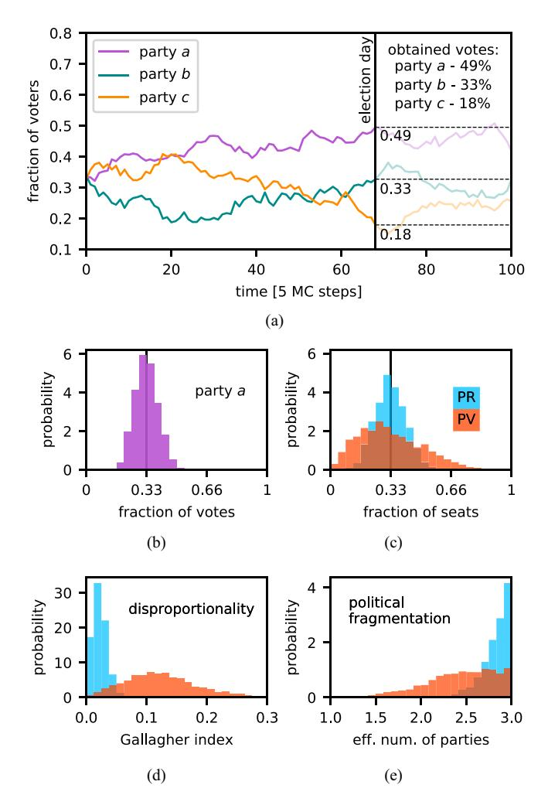
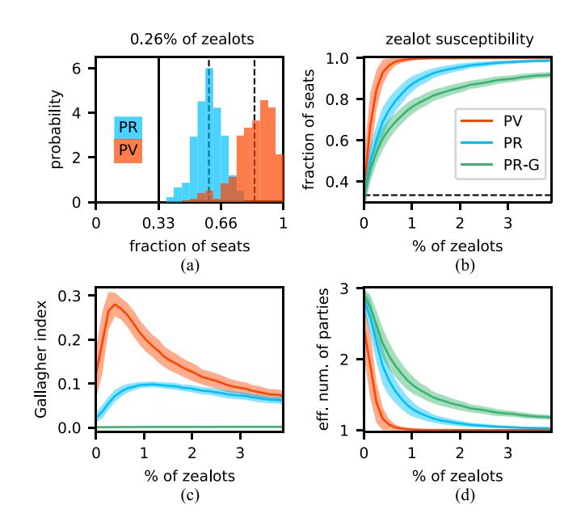
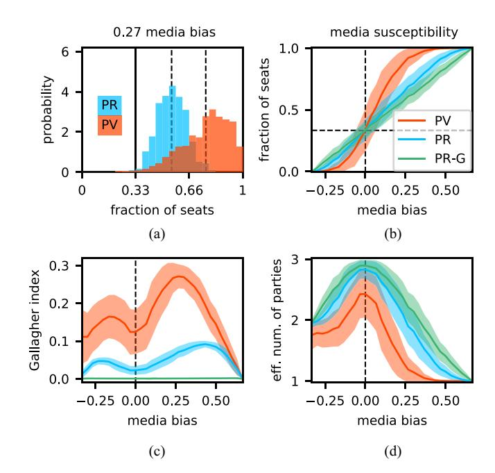
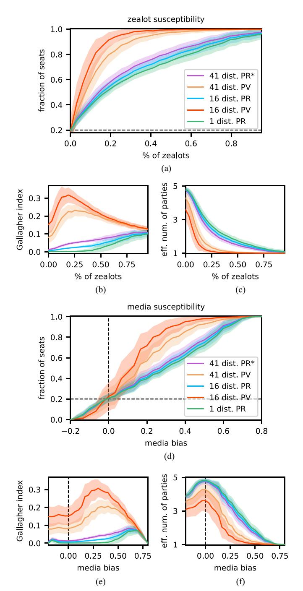
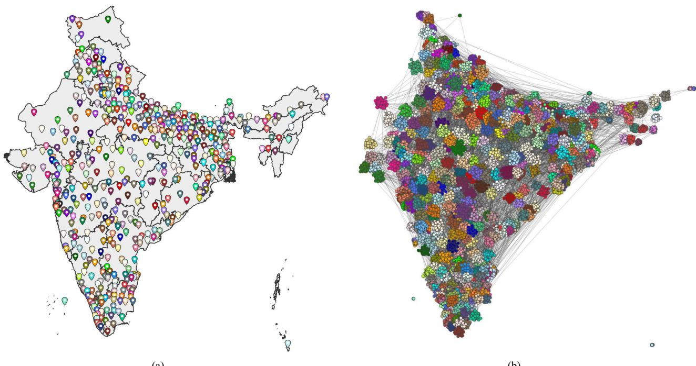
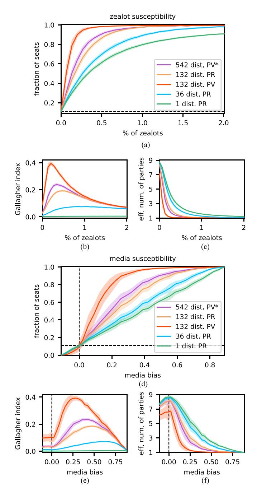

# Susceptibilities of Democratic Electoral Systems

IEEE Transactions on Computational Social Systems

Raducha, Tomasz; Klamut, Jarosław; Cremades, Roger; Bouman, Paul; Wiliński, Mateusz <https://doi.org/10.1109/TCSS.2024.3464092>

This publication is made publicly available in the institutional repository of Wageningen University and Research, under the terms of article 25fa of the Dutch Copyright Act, also known as the Amendment Taverne.

Article 25fa states that the author of a short scientific work funded either wholly or partially by Dutch public funds is entitled to make that work publicly available for no consideration following a reasonable period of time after the work was first published, provided that clear reference is made to the source of the first publication of the work.

This publication is distributed using the principles as determined in the Association of Universities in the Netherlands (VSNU) 'Article 25fa implementation' project. According to these principles research outputs of researchers employed by Dutch Universities that comply with the legal requirements of Article 25fa of the Dutch Copyright Act are distributed online and free of cost or other barriers in institutional repositories. Research outputs are distributed six months after their first online publication in the original published version and with proper attribution to the source of the original publication.

You are permitted to download and use the publication for personal purposes. All rights remain with the author(s) and / or copyright owner(s) of this work. Any use of the publication or parts of it other than authorised under article 25fa of the Dutch Copyright act is prohibited. Wageningen University & Research and the author(s) of this publication shall not be held responsible or liable for any damages resulting from your (re)use of this publication.

For questions regarding the public availability of this publication please contact [openaccess.library@wur.nl](mailto:openaccess.library@wur.nl)

# Susceptibilities of Democratic Electoral Systems

Tomasz Raducha [,](https://orcid.org/0000-0002-2545-1487) Jarosław Klamut [,](https://orcid.org/0000-0002-5164-6931) Roger Cremades [,](https://orcid.org/0000-0002-4514-2462) Paul Bouman [,](https://orcid.org/0000-0003-4893-4083) and Mateusz Wilinski ´

*Abstract***—The two most common families of electoral systems (ESs), defining the rules used to elect assemblies and legislative institutions, are proportional representation (PR) and plurality (Bormann and Golder, 2013; Farrell, 2011). When they are evaluated, most often the arguments come from social choice theory and political science. The former overall uses an axiomatic approach that includes a list of mathematical criteria a system should fulfill (Urken et al., 1995; Sen, 1995). The latter predominantly focuses on the tradeoff between proportionality of apportionment and governability (Monroe, 1994; Carey and Hix, 2011). However, there is an ongoing discussion about which ES is the best (Bowler et al., 2005; Farrell and Gallagher, 1999) and which set of indexes and measures would be the most important in such assessment (Pennisi, 1998). Although previous research addressed various perceptions of fairness related to the proportionality of different ESs (Blau, 2004; Plescia et al., 2020), the sensitivity of ES to efforts that influence opinions has been neglected. Here, we address this research gap with a framework that can measure ESs' susceptibility to different means of influence. Using a simulation study, we show that plurality ESs are less stable than PR. They are more susceptible to coordinated efforts to influence opinions, for example, by political agitators and media propaganda. A review of real-world ES reveals possible improvements in their design, leading to lower susceptibility. Additionally, our simulation framework allows the computation of popular indexes, such as the Gallagher index and the effective number of parties, in different scenarios. Our work provides a new tool for dealing with modern threats to democracy that could destabilize voting processes (Hyde, 2020). Furthermore, our results add an important argument to a longstanding discussion on the evaluation of ES.**

Received 14 December 2023; revised 10 May 2024, 10 July 2024, and 13 September 2024; accepted 16 September 2024. This work was supported by the Spanish Ministry of Science and Innovation under Grant PID2022-141802NB-I00. Mateusz Wilinski was supported by the the European Union's Horizon 2020 Research and Innovation Programme under the Marie Skłodowska–Curie under Grant 101066936. *(Corresponding author: Tomasz Raducha.)*

Tomasz Raducha is with the Grupo Interdisciplinar de Sistemas Complejos (GISC), Departamento de Matemáticas, Universidad Carlos III de Madrid, 28911 Leganés, Spain, and also with the Instituto de Física Interdisciplinar y Sistemas Complejos IFISC (CSIC-UIB), E-07122 Palma, Spain (e-mail: [raducha.tomasz@gmail.com\)](mailto:raducha.tomasz@gmail.com).

Jarosław Klamut is with the Faculty of Physics, University of Warsaw, 02-093 Warsaw, Poland.

Roger Cremades is with the Department of Social Sciences, Wageningen University and Research, 6706 KN Wageningen, The Netherlands, and also with Fondazione Eni Enrico Mattei, 30135 Venice, Italy.

Paul Bouman is with the Erasmus School of Economics, Erasmus University, 3062 PA Rotterdam, The Netherlands.

Mateusz Wilinski is with the Theoretical Division, Los Alamos National ´ Laboratory, Los Alamos, NM 87544 USA, and also with Tampere University, 33100 Tampere, Finland (e-mail: [wilinski.mateusz@gmail.com\)](mailto:wilinski.mateusz@gmail.com).

This article has supplementary downloadable material available at [https://](https://doi.org/10.1109/TCSS.2024.3464092) [doi.org/10.1109/TCSS.2024.3464092,](https://doi.org/10.1109/TCSS.2024.3464092) provided by the authors.

Digital Object Identifier 10.1109/TCSS.2024.3464092

*Index Terms***—Democratic processes, electoral susceptibility, electoral systems (ESs), opinion dynamics, voting systems.**

#### I. INTRODUCTION

**D** EMOCRACIES across the globe are facing multiple pressing issues, ranging from the erosion of public trust and persistent corruption scandals to the pervasive spread of disinformation. The vulnerability of democratic processes has become evident in the aftermath of scandals related to Cambridge Analytica—2016 U.S. elections, the Brexit referendum, and elections in Kenya [\[13\],](#page-14-0) [\[14\].](#page-14-1) The deceptive use of social media increased social and political polarization across world regions, as visible in the United States, the European Union, and several Asian countries [\[15\],](#page-14-2) [\[16\],](#page-15-0) [\[17\],](#page-15-1) [\[18\],](#page-15-2) [\[19\],](#page-15-3) [\[20\],](#page-15-4) [\[21\],](#page-15-5) [\[22\],](#page-15-6) [\[23\].](#page-15-7) Furthermore, the threat of authoritarianism materializes through unequivocal instances of fraud, exemplified by the Crimea referendum and the Belarus elections. These challenges are eroding democracy, the most frequent source of governmental power, and raise urgent questions about its vulnerabilities [\[24\].](#page-15-8) One of them is its susceptibility to external influence, which has been systematically overlooked in electoral systems (ESs) research.

The phenomenon of democratic backsliding, or reverse democratic transition, has recently attracted research attention [\[25\],](#page-15-9) [\[26\].](#page-15-10) Organizations such as The Economist Intelligence Unit and Freedom House report worrying declines in democratic indexes [\[27\],](#page-15-11) [\[28\].](#page-15-12) However, there is no agreement on the requirements of a good democracy. As a result, some researchers argue that the global state of democracy is stable and has improved considerably since the 1990s [\[29\].](#page-15-13) Either way, there are many potential threats to democratic stability that can impact civil liberties, the functioning of government, political participation, political culture, and electoral processes. When analyzing the latter aspect, fairness and stability of national elections are often pivotal [\[30\],](#page-15-14) [\[31\].](#page-15-15) Indeed, fair elections lay at the core of representative democracy; however, the definition of fairness is unclear in this context [\[10\].](#page-14-3)

Democratic states have countless ways of performing elections based on different ESs. Their design is a critical component of democratic governance because it directly influences citizen representation and decision-making processes within society. ESs define the rules by which citizens elect their representatives and, consequently, determine the composition and functioning of legislative bodies. The need for systems that best reflect the will of the people and foster effective governance is broadly recognized. Yet, the stability of national elections and their security in the context of ESs is not well studied. It is in the public interest to study and understand how different ESs relate to different vulnerabilities and contemporary challenges. We address this issue using a new framework that enables us to simulate and analyze the susceptibility of different ESs to coordinated efforts to influence opinions. This introduces the possibility to empirically quantify tradeoffs between ESs in various scenarios.

Our main contributions are threefold. First, we implement a simulation framework we use to evaluate different ESs. Second, we measure the susceptibility of different systems in a stylized setup and observe that systems based on proportional representation (PR) are generally less susceptible than systems based on plurality, but this difference is nonlinear and depends on the situation. Finally, we conduct additional computational experiments using data from ESs in Poland, India, and Israel. These experiments confirm the observations in our stylized experiments and show relevant tradeoffs between different families of systems.

### *A. ESs and Their Evaluation*

In this study, we focus on the two common families of ES used to elect candidates to national legislatures, namely systems based on PR and systems based on plurality, which we refer to as plurality voting (PV) [\[1\],](#page-14-4) [\[2\]](#page-14-5) (see the supplementary material for more detailed description of different ESs). PR is among the more commonly used (families of) ESs world-wide. It is normally associated with a party list, which can be either open or closed. PR systems usually assume multiple multimember constituencies (e.g., in elections to the Poland's Sejm), but a single nation-wide electoral district also exists (e.g., in elections to the Israel's Knesset). The method of seat allocation within districts is a crucial part of PR, which may give an advantage either to bigger or smaller parties. Often a global entry threshold is also specified. Ranked versions of PR exist, for example, single transferable vote (STV), but as they are a lot less common than other ES and require a more complicated model to track the preference orders of voters, we consider combining them with the voter model an interesting direction for future research beyond the scope of this work.

Another commonly used ES in national parliaments is based on plurality. In this system, the candidate or the party with the highest score wins, with no requirement to obtain a certain fraction of votes. It usually involves dividing the country into single-member constituencies (e.g., elections to India's House of the People or Poland's Senate) and is then called single member plurality (SMP) or first-past-the-post voting (FPTP). Multimember constituencies are also possible in PV, for instance in party block voting (PBV) where all seats are assigned to the same party, or in single nontransferable vote (SNTV) where mixed representation is possible. Although it is much less common than FPTP, the most well-known example of PBV being used today is the U.S. Electoral College. For an extensive review of ESs including PR and PV, we refer the reader to [\[32\],](#page-15-16) [\[33\],](#page-15-17) [\[34\],](#page-15-18) and [\[35\].](#page-15-19)

The study of ESs dates back at least to the XVIII century and the work of Nicolas de Condorcet, who discovered the paradox of cyclic collective preferences [\[36\].](#page-15-20) Together with much later ideas of Kenneth Arrow [\[37\],](#page-15-21) it laid the foundation of the modern social choice theory [\[3\].](#page-14-6) It is concerned with the aggregation of multiple individual preferences into a single preference and provides a general mathematical understanding of such processes. Many reasonable criteria were established within social choice theory to be fulfilled by ESs, but no system can satisfy all of them. This fact is usually described by different *impossibility theorems*. For example, the Arrow's impossibility theorem showed that no aggregation mechanism can exist that satisfies all of some intuitively desirable criteria. Later, the Gibbard–Satterthwaite and Gibbard theorems followed, showing that ESs either has a dictatorial voter, are limited to two choices, or are susceptible to strategic voting, meaning that casting a sincere ballot is not necessarily aligned with the preferences of the voter.

This spawned a lot of further research, where alternative criteria were considered and other impossibility theorems were developed. For example, it has been argued that Arrow's impossibility theorem has little relevance when there is a large group of voters, as a simple majority rule typically gives a good approximation of desirable outcomes [\[38\].](#page-15-22) Another example is the development of *majority judgment*, an ES that aims to circumvent the impossibility theorems by letting voters judge the suitability of the choices, and a median rule is used to limit strategic considerations for the voters [\[39\].](#page-15-23)

Nevertheless, a major part of the work in social choice theory considers exclusively ranked voting, which is still rare in national legislatures [\[1\].](#page-14-4) It is, therefore, not surprising that it does not provide an answer to which ES is better. Furthermore, when arguing against or in favor of a given ES, it is often possible to find mathematical criteria that will back up the preferences [\[4\].](#page-14-7) Ultimately, the theoretical study of ESs and the empirical analysis are two important and complementary approaches.

Without a doubt, the evaluation of ESs is a prominent topic in political science [\[40\],](#page-15-24) [\[41\].](#page-15-25) A substantial part of the research concentrates on disproportionality (also known as malapportionment), i.e., the discrepancy between the fraction of votes gained and the fraction of seats assigned [\[5\],](#page-14-8) [\[9\],](#page-14-9) [\[32\],](#page-15-16) [\[42\],](#page-15-26) [\[43\].](#page-15-27) Several indexes have been proposed to evaluate malapportionment in ESs, for example, the Gallagher index [\[44\],](#page-15-28) [\[45\],](#page-15-29) [\[46\]](#page-15-30) and the Loosemore–Hanby index [\[47\],](#page-15-31) [\[48\].](#page-15-32) The different indices aim to measure proportionality and/or electoral "efficiency" and can be seen as distance measures between the distribution of votes and the distribution of seats allocated. As different indices take various approaches to summarize this distance, there is not a single measure most appropriate for all situations, and it can be beneficial to evaluate results using multiple indices [\[9\],](#page-14-9) [\[49\].](#page-15-33) PR systems generally minimize the disproportionality between the votes and seats gained, but it is not the only measure of ES's quality (disproportionality also depends on the seat assignment method, see the supplementary material).

Many authors highlight the tradeoff between proportionality and *governability—*the elected body should have enough power to be able to act [\[4\].](#page-14-7) Perfectly PR of a diverse party list would result in no party having the ability to rule and would force broad coalitions, which are often ineffective. This political fragmentation can be measured by the index called effective number of parties [\[50\],](#page-15-34) which is higher for PR systems. That is the main argument for FPTP or more generally plurality in the literature [\[10\],](#page-14-3) [\[51\].](#page-15-35) Other advantages of PV commonly mentioned by scholars are as follows: having a more direct effect on the expulsion of prime ministers and cabinets (it is easier to follow the political activity of a single chosen candidate in the local district and, perhaps, do not vote for them again) and the translation of votes to power, which is arguably more important than the translation of votes to seats (i.e., the proportionality as usually defined). However, under PV so-called electoral inversion can happen—the party with the highest number of votes nationwide might not win the most seats. Additionally, those systems may result in worse minority representation. Hence, it comes as no surprise that there remains discussion about the pros and cons of ESs [\[7\],](#page-14-10) and that it is not easy to choose a single preferred system [\[8\].](#page-14-11) It is, therefore, essential to provide new tools for evaluation of ESs.

# *B. The Perspective of Complexity Science*

The ES together with the underlying voting processes and opinion dynamics can be seen as a complex system [\[52\],](#page-15-36) [\[53\],](#page-15-37) [\[54\],](#page-15-38) [\[55\].](#page-15-39) Complexity science has a significant impact on social and economic sciences. It provides a new paradigm in the analysis of macroscopic phenomena emerging from microscopic rules and interaction of many elements [\[56\].](#page-15-40) Concepts from complexity science and complex networks have been applied in the description of opinion formation and voting processes, as well as in analyses of the influence of media or terrorist attacks on them [\[57\],](#page-15-41) [\[58\],](#page-15-42) [\[59\],](#page-15-43) [\[60\],](#page-15-44) [\[61\],](#page-15-45) [\[62\].](#page-15-46)

Notably, applications can also be found in the evaluation of ESs. For instance, the Sznajd model [\[63\]](#page-15-47) and cellular automata [\[64\]](#page-15-48) have been used to simulate the dynamics of voter opinions and subsequently conduct elections, followed by evaluating the outcomes using metrics such as the Gallagher index [\[65\],](#page-15-49) [\[66\].](#page-15-50) Others have explored the influence of district magnitude and seat allocation methods on the proportionality of election results, assuming a log-normal distribution of vote share [\[67\].](#page-15-51) These studies provide valuable insights into the mechanisms that can either increase or decrease disproportionality in electoral outcomes. A socio-physics approach was used to evaluate vulnerability of majoritarian ES to lobbying [\[68\],](#page-15-52) and a mathematical model was applied to identify which social characteristics and electoral design are more resilient against opinion manipulation [\[69\].](#page-15-53) Furthermore, a complexity science perspective has been outlined to analyze the overall stability of democracy [\[30\],](#page-15-14) [\[31\].](#page-15-15) In the authors' words: "scholars of democracy need to move away from arguments based on static equilibrium to more dynamic frameworks which are better suited to understanding how stable the equilibria are to perturbations."

A remarkable contribution of complexity science to understand the dynamics of voting processes was the development of the voter model [\[70\],](#page-15-54) [\[71\],](#page-15-55) [\[72\],](#page-15-56) [\[73\],](#page-16-0) [\[74\],](#page-16-1) [\[75\].](#page-16-2) A group of voters in the model is represented by a network—a set of nodes connected by links, which allow for interactions that represent the possibility to exchange ideas and opinions by

various kinds of social discourse. In its basic formulation, there are two possible states that represent two opposing opinions. These opinions translate into votes that will be cast, hence they can also represent two parties or candidates participating in the elections. It is straightforward to generalize the model into many possible parties—indeed, the multistate version of the voter model has been studied [\[76\],](#page-16-3) [\[77\].](#page-16-4) It has been shown that, as in the basic binary formulation, an order–disorder phase transition is induced by increasing noise.

There are two basic actions in the noisy voter model (NVM)—state copying and independent state update. State copying between neighbors represents social influence, which is the core of social interactions and opinion dynamics. Independent state changes due to noise are interpreted as free choices of the individuals *making up their own mind*. Therefore, the time evolution within the model by repeatedly performing these actions can be seen as a competition between two attitudes conformism and independence [\[78\],](#page-16-5) [\[79\].](#page-16-6) It has been shown that such a relatively simple model has a great explaining power when predicting vote share distribution and vote share spatial correlations [\[80\],](#page-16-7) [\[81\].](#page-16-8) Note that the voter model can cover different underlying strategies of voters, since the outcome of any strategy for one voter is always a single ballot. The state of a node tells us how the voter would fill this ballot at a given time (see the supplementary material for more information on the voter model).

In the base version of this model, the way nodes interact with their neighbors is equal for all nodes, and each independentstate update selects the new state uniformly from the alternatives. In our study, we consider the introduction of distortions and biases to this base model as *external influences*. This includes the introduction of nodes that never change their opinion (*zealots*) and the introduction of bias toward or against a certain opinion during independent state updates. Such external influences allow for various interpretations, e.g., influence of political agitators and interest groups, strongly held beliefs of a specific faction, and propaganda by biased media. While attempts to influence opinions can be seen as malicious, benevolent, or neutral, the model can be used to study susceptibility to external influences regardless of the intent. We consider an ES to be *susceptible*, if the outcomes in a large sample of simulated election results are sensitive to such influences. Note that we consider stylized computational models and interpret the terms *zealots* and *media bias* narrowly in the context of these models, similar to previous work by complex systems authors working on the voter model. We remark that more nuanced interpretations of these concepts exist in other fields of research.

# *C. Modeling ESs*

There has been little focus, as mentioned before, on ESs' stability and vulnerability in the presence of external influences. Here, we study ESs in a dynamical framework to explore these issues. Our approach goes far beyond two-point volatility already seen in the literature [\[42\],](#page-15-26) [\[43\],](#page-15-27) [\[82\].](#page-16-9) We analyze the vulnerability of ES based on a long run of opinion dynamics with many elections performed during the evolution. Given

the strong empirical support for the noisy voter in the context of elections [\[80\],](#page-16-7) [\[81\],](#page-16-8) we use it as the underlying opinion dynamics model in the simulations. This allows us to construct a probability distribution of vote share and seat share under every ES. Then, we consider a system less stable if it has larger variance of the election results and more vulnerable if it magnifies external influences.

Using computer simulations to produce vote statistics is common in the literature [\[65\],](#page-15-49) [\[66\],](#page-15-50) [\[83\],](#page-16-10) [\[84\],](#page-16-11) [\[85\],](#page-16-12) [\[86\].](#page-16-13) After all, "in order to calculate theoretical averages one has to make some kind of distributional assumption" [\[87\].](#page-16-14) In our case, we assume the dynamics of the voter model to produce the distribution of votes. We can apply different ESs to the samples of votes, including PR systems and PV systems applied to both singlemember and multimember constituencies. Our numerical approach has two main advantages over the analysis of empirical vote distributions. First of all, it is impossible to obtain a sample of thousands of elections, as we do, from the observational data of any country. Second, using simulations allows us to plant distortions and biases already at the level of opinion dynamics and observe their macroscopic effects under different ESs. In particular, we introduce zealots in the population—voters that never change their mind [\[88\],](#page-16-15) [\[89\].](#page-16-16) We also add skewed noise, resulting in biased independent choices. In this way, we can model asymmetrical media coverage or straightforward propaganda [\[59\],](#page-15-43) [\[90\],](#page-16-17) [\[91\].](#page-16-18) Finally, we analyze zealot susceptibility and media susceptibility in stylized and real-world ESs, providing an understanding of their (in)stability.

We perform the simulations as follows. First, we construct a network of N voters with an average degree k using the stochastic block model (SBM) or its spatial version (see Materials and Methods for details on the simulation setup). The blocks in the network (topological communities) correspond to electoral districts (sometimes several communities can be merged into one electoral district), of which the connectivity is determined by the interconnectedness ratio r. Each individual in the network is then assigned one of n states si ∈ {a, b, c, ...} at random with a uniform probability. The parameter n denotes the number of parties running in elections, a node in state a will vote for party a, etc. If there are zealots, they are marked and their state is set to the biased state sb shared between all zealots. If there is media propaganda, the probability of independent change into the biased state sb is set to a value pm ∈ [0, 1] and the probability for other states to (1 − pm)/(n − 1). Without media propaganda, probability is equal for all states and pm = 1/n, therefore the media bias can be directed in favor as well as against a given party.

After preparing the network structure, we run the simulation of opinion dynamics with voters progressively changing their preferred candidates—see Fig. [1\(](#page-4-0)a). The noise rate parameter ε controls the competition between influence of the peers and independent choices. Note that those choices are independent from the social influence but not from the media influence. Every given number of time steps we stop the process and elections are performed using several ESs, which will be compared (when analyzing zealot susceptibility, the network is initialized again before each election). The vote share and the seat share

Fig. 1. Simulation of elections and basic differences between ESs. (a) Changes over time of the fraction of voters supporting each of three parties in the simulation, which directly translates into the fraction of votes. An exemplary day of election is indicated together with the fraction of votes each party would obtain on that day. (b) Vote share distribution of party a obtained over 4000 simulated elections, the average fraction of votes is equal 0.332 ± 0.065. (c) Seat share distribution of party a obtained in the same elections under PR (blue) and PV (red) ES. The average fraction of seats is equal 0.331 ± 0.085 for PR and 0.33 ± 0.17 for PV. (d) Histogram of the Gallagher index for the two ES, the average value is equal 0.022 ± 0.011 for PR and 0.124 ± 0.058 for PV. (e) Histogram of the effective number of parties for the two ES, the average value is equal 2.83 ± 0.15 for PR and 2.43 ± 0.38 for PV. All histograms were obtained over 4000 elections. Simulations were ran for ε = 0.005, k = 12, r = 0.002, N = 104 divided into 100 equal communities. Each electoral district corresponding to a community has five seats assigned, giving 500 seats in total. See supplementary material Figs. S1–S3 for different ESs and the Loosemore–Hanby index.

are saved, and the process continues until a desired sample of election results is collected.

Finally, based on the collected sample, we build vote share distribution [Fig. [1\(](#page-4-0)b)] and seat share distributions for all considered ES [Fig. [1\(](#page-4-0)c)]. Note that unless indicated otherwise, by seat share distribution we mean the probability distribution of fraction of seats obtained by a given party, not how seats are distributed among parties in a legislature. The former can be constructed after collecting statistics of many elections, the latter is a result of just one election. If there was any external influence included in the simulation, we could estimate its consequences under a given ES by analyzing how much the seat share changes compared to the neutral run. In this manner, we can study zealot and media susceptibility.

It should be pointed out that in our work terms *stability* and *susceptibility* are aligned with the mathematical intuition. First, stability refers to the spread of a given distribution, as measured by the standard deviation, and how it changes as a function of media bias or number of zealots. We say that a system with higher standard deviation is less stable, as it is easier to make a large shift in the election result. Second, susceptibility of an ES is measured by looking at the difference between seat distributions in the neutral scenario and a scenario with a given external influence. For simplicity, we estimate this "statistical distance" between the distributions by the difference in the average seat shares.

#### II. RESULTS

## *A. Basic Differences Between ESs*

We initially focus on two stylized ESs denoted in the figures: PR—a PR system with a division into 100 constituencies and the Jefferson seat assignment method (also known as the D'Hondt method), and PV—a plurality ES with a division into the same 100 constituencies, which is either FPTP or PBV depending on the number of seats per district. For comparison, we also include a PR system with one nation-wide constituency and the Jefferson seat assignment method, denoted by PR-G (see the supplementary material for more ES). Here, we do not consider an entry threshold, and all systems have the same number of 500 seats available (five per district for PR and PV), as well as the same value of other parameters of the simulation: N = 104 , k = 12, r = 0.002, ε = 0.005, and n = 3 parties.

The systems we begin the analysis with, although possessing realistic elements, are more theoretical due to the simplified district size and magnitude distributions, as well as no geographical structure of constituencies and connections between them. These idealized ESs serve multiple purposes. First, they allow us to elucidate the fundamental differences between the main categories of ES. Second, we can explore the significance of key parameters and their influence on the stimulation outcomes. Furthermore, our goal is to ensure that the results obtained align with well-established findings in the field of political science, thereby confirming the validity of our framework.

The vote share distribution of party a obtained over 4000 elections is presented in Fig. [1\(](#page-4-0)b). As expected from the symmetrical design of the simulation with respect to all parties, it is centered around the average value of 1/n = 1/3. For the same reason, the average fraction of seats won is the same across all ES, but the characteristics of the distribution can and do vary, as visible in Fig. [1\(](#page-4-0)c). Note that corresponding results for parties b and c are roughly the same in the absence of external influences (see supplementary material Fig. S2).

Comparing the distribution of votes with those of seats in Fig. [1,](#page-4-0) we can see that PR system produces a seat distribution with a higher similarity to the vote distribution, while PV produces much more volatile results. Even in the simplest case without external influences, the contrast between plurality and PR is clearly visible. This confirms the known intuition about the two systems but also allows us to quantify it—in the analyzed case the standard deviation of PV election results is twice as high as for PR (0.17 and 0.085, respectively).

The difference is also significant in the distribution of disproportionality and political fragmentation indexes of PR and PV, as we can see in Fig. [1\(](#page-4-0)d) and [1\(](#page-4-0)e). PV produces much less proportional results with the average value of the Gallagher index G = 0.124 ± 0.058, which is an order of magnitude larger than for PR scoring G = 0.022 ± 0.011. Additionally, the latter does not exceed 0.08 in any election, while the former can reach values over 0.34. In the supplementary material, we include analysis of the Loosemore–Hanby index, with equivalent conclusions. Similarly, there is a discrepancy in the effective number of parties, although not as extensive. PV promotes lower fragmentation with E = 2.43 ± 0.38 on average, while PR obtains E = 2.83 ± 0.15. Nevertheless, there is a big difference in the standard deviation of the effective number of parties and the general shape of the distribution.

The possibility of computing popular indexes measuring the performance of ES in different scenarios creates a unique tool to evaluate ES. It allows us to study their statistical properties over samples of thousands of electoral results, which are impossible to obtain solely from historical elections of a given country. Moreover, it provides an additional meaning to the observed values. If a country obtains a certain value of the Gallagher index in a given election, what does it say about its ES? After all, disproportionality indexes depend on the vote distribution; therefore, the score might be significantly different in the next elections. On the other hand, if we observe persistent patterns across many elections with different vote distributions and across varying parameters, we can be confident that they relate to the underlying ES.

The case of (unrealized) electoral reform in Canada well illustrates the need for a precise application of ES measures. In 2016, the House of Commons of Canada created a special committee to review different possibilities and provide guidance on the potential reform. The first recommendation put forward by the committee was that "the government should seek to design a system that achieves a Gallagher score of 5 or less" [\[92\]](#page-16-19) (where 5 means 5% translating to 0.05 in the normalized scale that we use). It is not clear, however, what the authors want to achieve. Should it be always lower than 0.05 for any conceivable distribution of votes? Or maybe the median or the average value of the index should be below 0.05? If so, over what sample this average value should be calculated? Our framework provides the possibility of computing the indexes under different conditions and defining precise requirements for their values.

# *B. Effects of Simulation Parameters*

The above considerations raise a question about how the details of elections (e.g., the number of parties running) and parameters of the model (e.g., the noise rate ε) influence observed dependencies. We provide an in-depth analysis of the

effects of different parameters in the supplementary material text and Figs. S2–S11. Here, we summarize the main findings.

With an increasing number of parties n, the standard deviation of the seat share decreases for PR and PV and their seat share distributions become more similar. The two systems produce more similar results in terms of the seat share distribution also for a bigger number of districts q, fewer seats available in each district qs, higher noise rate ε, smaller network size N, and lower interconnectedness ratio r. Not surprisingly, disproportionality measured by the Gallagher and the Loosemore–Hanby indexes is higher, and political fragmentation measured by the effective number of parties is lower under PV compared to PR, across all tested parameters' values. Different parameters, however, can have divergent effects on the two ES. For example, the average value of the Gallagher index under PR will increase after increasing n or q, or after decreasing qs, ε, or N. The disproportionality of PV, in comparison, increases with growing r, while n, q, and ε have the opposite effect. Notably, the average degree k has negligible influence on the resulting seat share and values of the indexes for both systems. PV and PR display identical behavior only after decreasing the number of seats available in each constituency to one—in such case, both systems effectively become FPTP voting (see supplementary material Fig. S7).

An interesting effect can be observed for a low-noise rate ε, low number of districts q, or high-interconnectedness ratio r: a shift from unimodal to bimodal seat share distribution appears for PV. Moreover, the two peaks of the bimodal distribution are placed on the extreme values of 0 and 1. Put simply, landslide victories of one party become highly probable, while no such effect is obtained for PR in the explored parameters' range. This effect is a manifestation of an inherent property of PV systems. In PV, even the smallest plurality equally distributed across all districts is enough to secure a total victory, whereas the same support concentrated in a few constituencies may result in losing the leading position in the legislature. This fact is well known and utilized in the manipulative practice of gerrymandering [\[86\],](#page-16-13) [\[93\].](#page-16-20) In the context of opinion dynamics, it means that more isolated districts provide less opportunity for the dominance of a single party in PV, since its support cannot easily spread across them.

### *C. Zealots and Media Influence*

The central consideration of this study is a scrutiny of the susceptibility of ES under external influences in the context of the NVM. To analyze the effect of zealots, we introduce a specific number of zealots in the population and asses the resulting change in the distribution of seat share. In Fig. [2\(](#page-6-0)a), we present the effect of 0.26% of voters being zealots of party a. Comparing it to the neutral case in Fig. [1\(](#page-4-0)c), we can see how much one party can gain with the help of a group with a fixed opinion. The most striking result is the magnitude of advantage that zealots can produce in different ESs—PV amplifies the influence when translating the votes into seats, resulting in 0.845 ± 0.097 of all seats gained, compared to 0.602 ± 0.072

Fig. 2. Influence of zealots on electoral outcomes. (a) Seat share distribution of the zealot party a under PR (blue) and PV (red) ES for 0.26% of zealots in the population. The solid line indicates the average fraction of seats obtained in the neutral case with no zealots (1/3), while dashed lines indicate the average values of shifted distributions: 0.602 ± 0.072 for PR and 0.845 ± 0.097 for PV. (b) Average seat share of the zealot party a versus percentage of zealots in the population for three ES: PV, PR, and PR-G. The colored shade indicates results within one standard deviation from the average. The dashed line marks the average fraction of seats obtained with no zealots (1/3). (c) Average value of the Gallagher index versus the percentage of zealots in the population for the three ES. (d) Average value of the effective number of parties versus percentage of zealots in the population for the three ES. All results obtained over 500 elections with N = 104 , q = 100, qs = 5, k = 12, r = 0.002, ε = 0.005, and n = 3 parties. See supplementary material Figs. S12 and S13 for other values.

for PR. In this sense, we can say that PV is a more susceptible system than PR, at least with respect to zealots.

Next, we investigate the extent to which a system tends to gravitate toward the zealot's state on average, when the number of zealots varies. We present the zealot susceptibility of both ES in Fig. [2\(](#page-6-0)b), together with a comparison to the PR-G system. The disparities between the systems are substantial. We observe a gradual increase in the mean election result of the zealot's party toward complete dominance in each case. However, under PR, even with almost 4% of voters being zealots, the zealot party does not achieve a land-slide victory. Conversely, in PV we observe a much more rapid increase in the zealot's party average seat share, leading to almost all seats taken with less than 1% of zealots. Consequently, a PV system requires considerably less effort and resources to exert effective influence. PR-G with one global district, on the other hand, is the least zealot susceptible system. Indeed, any local influence that zealots might exert does not matter under PR-G unless it is strong enough to shift the opinion of the whole population.

What is crucial, these results are robust under various parameter choices. The basic differences between ES zealot susceptibility remain true after varying the average degree k, noise rate ε, interconnectedness ratio r, or number of parties n (see supplementary material Figs. S12 and S13). Notably, a higher r hardly changes the susceptibility of PR but visibly increases it for PV. Greater ε lowers the susceptibility for both systems, but more so for PR.

In Fig. [2\(](#page-6-0)c) and [2\(](#page-6-0)d), we also show how the Gallagher index and the effective number of parties are influenced by varying the percentage of zealots. Clearly, PV displays the highest disproportionality and lowest fragmentation, followed by PR and PR-G. The last system can achieve virtually perfect proportionality of apportionment even under high influence of zealots. Remarkably, the disproportionality indexes of PV and PR reach the maximal value for intermediate numbers of zealots. For around 0.4% of zealots in the population, election results become the most disproportional for PV with the average Gallagher index reaching a value of G = 0.280 ± 0.027. For PR, the maximum is obtained at approximately 1.2% of zealots with the index equal G = 0.0982 ± 0.0066, while PR-G reaches at most a value of G = 0.00157 ± 0.00066. It shows that the division into districts will inherently increase disproportionality (although it depends on the seat assignment method, see the supplementary material). It also demonstrates that not always vast resources are necessary to damage proportionality of elections and sway the result in a preferred direction.

The second influence of electoral processes that we study is propaganda by biased media modeled by skewed noise. The seat share distribution obtained after increasing the media bias toward party a to 0.27 is shown in Fig. [3\(](#page-7-0)a). Similarly to zealots, biased media can significantly shift the average number of seats gained by a party, which is clearly visible after comparing Figs. [3\(](#page-7-0)a) with Fig. [1\(](#page-4-0)c). Once again, the average seat share of party a is much more increased under PV than PR for the same amount of influence exerted on voters. In this sense, we can say that PV system is more susceptible to biased media than PR.

Media propaganda, in contrast to zealots, can also be directed against party a. In Fig. [3\(](#page-7-0)b), we present media susceptibility of three ES for the whole range of possible media bias values. The biggest difference can be observed between PV, which is the most susceptible, and any proportional system. Noticeably, there is only a minor difference in media susceptibility between PR and PR-G—they fall within one standard deviation from each other. This indicates that the division into many constituencies is not a decisive factor in response to media propaganda. Indeed, the influence of media is global, while the influence of zealots is local.

Even after altering the values of the average degree k, noise rate ε, interconnectedness ratio r, or the number of parties n, the qualitative distinctions among the considered ES remain consistent (see supplementary material Figs. S14 and S15). In each case, PV exhibits the highest media susceptibility, followed by PR, and PR-G at the end. Larger values of ε significantly reduce the standard deviation of media susceptibility for all systems. Additionally, an increase in r has a minimal impact on the susceptibility of PR, yet clearly increases it for PV.

In Fig. [3\(](#page-7-0)c) and [3\(](#page-7-0)d), we present the variations in disproportionality and fragmentation indexes in response to varying media bias. The ESs can be arranged in ascending order of the Gallagher index and descending order of the effective number of parties: PR-G, PR, and PV. Nonetheless, the relative

Fig. 3. Influence of biased media on electoral outcomes. (a) Seat share distribution of the media party a under PR (blue) and PV (red) ES for a media bias of 0.27. The solid line indicates the average fraction of seats obtained in the case of neutral media (1/3), while dashed lines indicate average values of shifted distributions: 0.558 ± 0.088 for PR and 0.77 ± 0.14 for PV. (b) Average seat share of the media party a versus media bias for three ES: PV, PR, and PR-G. The colored shade indicates results within one standard deviation from the average. The vertical dashed line indicates the simulation with neutral media, and the horizontal one marks the average fraction of seats obtained in that case (1/3). (c) Average value of the Gallagher index versus media bias for the three ES. (d) Average value of the effective number of parties versus media bias for the three ES. All results obtained over 1000 elections with N = 104 , q = 100, qs = 5, k = 12, r = 0.002, ε = 0.005, and n = 3 parties. See supplementary material Figs. S14 and S15 for other values.

differences between the systems vary. In particular, the disproportionality indexes reach their maximum for intermediate values of negative or positive media bias. For a positive bias of approximately 0.27, the election results for PV become the most disproportional, with the average Gallagher index reaching G = 0.271 ± 0.032. For PR, the maximum disproportionality occurs at around 0.43, with the average index value G = 0.0918 ± 0.0085. For the negative bias, PV obtains the maximum at −0.17 with G = 0.165 ± 0.057, and PR at −0.2 with G = 0.0472 ± 0.0097. PR-G is able to maintain near-perfect proportionality even in the presence of considerable media bias with G = 0.00169 ± 0.00064 in the most disadvantageous result. The effective number of parties decreases for extreme negative bias down to 2 (or slightly below for PV) and down to 1 for extreme positive bias. This is because negative bias can eliminate one of three parties and positive bias can eliminate two, by forging a landslide victory of one party.

These findings demonstrate the widely recognized fact that obtaining high-media coverage and using it in favor or against a political party can drive the election results. Moreover, they show how disruptive it can be to the proportionality of the ES. The impact of media propaganda and zealots is especially powerful in PV for relatively small deviations from the neutral

(a) (b)

Fig. 4. Constructing a network for simulations of the Poland's Sejm. (a) Map of Poland with division into 16 voivodeships, i.e., the biggest administrative districts of the country. The capital of each of 41 electoral districts applied in elections to the Sejm is indicated with a colored marker. (b) Network of 41 × 103 nodes generated for simulations of elections to the Poland's Sejm. Nodes are centered around the capital of the constituency. The bigger the population of a constituency, the more spread are the nodes.

case—the impact of any influence per its unit is significantly higher than in PR (see the supplementary material for marginal susceptibilities). It is also worth noting that with increasing media bias or number of zealots we observe diminishing returns from both means of influence.

# *D. Case Study: Poland's Sejm*

After exploring the differences between the two main categories of ES and basic dependencies between parameters in stylized networks, we study real-world ES applied in Poland and India. In the supplementary material, we additionally analyze Israel and the Senate of Poland. All four ESs were chosen: 1) to have the same number of PV and PR systems; 2) based on the data availability for the system itself, as well as the availability of the demographic and work commuting data; and 3) to showcase a diverse set of democracies.

The first system we scrutinize is the one used in elections to the Poland's Sejm, which is the lower house of the bicameral parliament of Poland. It is a party-list PR with 460 seats in total to be assigned across 41 constituencies, whose capitals are presented on a map in Fig. [4\(](#page-8-0)a). The number of seats per electoral district varies from 7 to 20, and they are assigned using the Jefferson seat assignment method, after excluding parties below the threshold of 5% of votes nation-wide. In the 2019 elections to the Poland's Sejm, there were approximately 30 million people able to vote, and in every district there were at least five political parties registered [\[94\].](#page-16-21)

For the simulation of elections to the Poland's Sejm, we create a network with N = 41 × 103 nodes divided into 41 topological communities, as shown in Fig. [4\(](#page-8-0)b), using the spatial version of the SBM (see Materials and Methods). Those communities correspond to the real electoral districts, and their relative sizes are based on the actual populations of voters in the districts. Each community is assigned a geographical location, more precisely the coordinates of the district's capital [see Fig. [4\(](#page-8-0)a)]. The connectivity between nodes is based on the work commuting distance, which means it decreases with the geographical distance as in [\(1\)](#page-13-0). The supplementary datasets and the configuration files in our online code repository [\[95\]](#page-16-22) contain the exact data used in the simulations.

In addition to the actual ES used in elections to the Poland's Sejm (labeled as "41 dist. PR\*" in the figures), we study four alternative systems. The first alternative system ("41 dist. PV") is a PV system with the same division into districts and the same number of seats in each district, but the party with plurality in a given district obtains all seats (effectively it is a PBV system). Plurality was considered during 2011 electoral reform in Poland. That year the system of the Poland's Senate changed from a PR to FPTP voting. Similar transformation was considered also for the Sejm but was deemed unconstitutional.

We then consider two alternative systems with electoral districts corresponding to 16 voivodeships, i.e., the highest level administrative districts of Poland [see Fig. [4\(](#page-8-0)a)]. We merge all electoral districts within the same voivodeship into one, accumulating the seats into a single pool per voivodeship. On top of this new division, we consider the original PR system ("16 dist. PR") and a PBV system with the winner-takes-all approach in each district ("16 dist. PV"). Finally, we examine a PR system where all 460 seats are assigned within a single nation-wide district ("1 dist. PR"). We do not include the entry threshold in the PV alternative systems, and the PR alternative systems have the same 5% threshold and the same seat assignment method as the original one.

After these initial steps we can analyze zealot and media susceptibility of the elections to the Sejm in the same manner as for the theoretical systems. In Fig. [5,](#page-9-0) we demonstrate this analysis for all ES considered—the original one and four alternatives. Fig. [5\(](#page-9-0)a) shows the average fraction of seats won by the zealot party versus the percentage of zealots in the population. The first striking result is the difference in zealot susceptibility between any PR and PV systems. For instance, with 0.22% of zealots the most susceptible PR systems assign 0.611 ± 0.041 of seats to the zealot party, while the least susceptible PV system 0.829 ± 0.059. For the Poland's Sejm, which has 460 seats in total, this makes a difference of 100 seats. All three PR systems, although having very different district divisions, are similar in their response to zealots (within one standard deviation from each other) and much less susceptible than both PV systems. This observation holds for any value of the noise rate ε (see supplementary material Fig. S17).

In Fig. [5\(](#page-9-0)b) and [5\(](#page-9-0)c), we show the Gallagher index and the effective number of parties in the presence of zealots. Under PV systems elections can become highly disproportional for very small percentage of zealots in the population—the maximum value of disproportionality indexes in PV is reached close to 0.2% of zealots, while in PR systems disproportionality becomes maximal when the zealot party is close to a complete domination at almost 1% of zealots. For example, for 0.25% of zealots under "41 dist. PV" system the Gallagher index is equal G = 0.233 ± 0.032, while at the same time G = 0.109 ± 0.015 for the original ES. The political fragmentation decreases with an increasing number of zealots, as expected, and is generally lower for PV systems.

Fig. [5\(](#page-9-0)d) illustrates the second external influence that we study, namely the susceptibility to media propaganda, as a function of the amount of bias. The conclusions are similar to the ones with respect to zealots—PV systems are generally more susceptible to biased media than PR systems. All PR systems display a very similar media susceptibility within one standard deviation from each other. For example, for a bias of 0.2 PR systems, ordered from 1 to 41 districts, assign 0.396 ± 0.050, 0.411 ± 0.053, and 0.429 ± 0.057 seats to the media party, while 0.57 ± 0.11 is assigned under "41 dist. PV." In terms of the number of seats in the legislature, it is 182, 189, and 197 in the PR systems, and 262 seats in the PV system. Notably, in PV media bias provides the highest returns not at the very beginning, such as zealots, but after already exerting some influence—the maximum of marginal susceptibility is shifted to the right from the zero bias (see supplementary material Fig. S18).

Media propaganda causes the highest disproportionality for intermediate values of influence, as visible in Figs. [5\(](#page-9-0)e) and [5\(](#page-9-0)f). It happens much earlier, however, in PV systems than in PR ones. Again, the disparity between the two families of ES is much bigger in terms of proportionality than political fragmentation, but PR systems maintain higher values of the effective number of parties most of the time.

These results show the applicability of our approach in a potential electoral reform. In short, the PR systems in this case are quite robust in terms of the number of districts. They are also significantly less susceptible to both zealots and media

Fig. 5. Influence of zealots and biased media on the elections to the Poland's Sejm. (a) Average seat share of the zealot party a versus percentage of zealots in the population for the five considered ES. The colored shade indicates results within one standard deviation from the average. The dashed line marks the average fraction of seats obtained with no zealots (1/5). (b) Average value of the Gallagher index versus percentage of zealots in the population for the five ESs. (c) Average value of the effective number of parties versus percentage of zealots in the population for the five ESs. All results with zealots were obtained over 200 elections. (d) Average seat share of the media party a versus media bias for the five considered ES. The vertical dashed line indicates the simulation with neutral media, and the horizontal one marks the average fraction of seats obtained in that case (1/5). (e) Average value of the Gallagher index versus media bias for the five ESs. (f) Average value of the effective number of parties versus media bias for the five ESs. All results with media bias were obtained over 1000 elections. The network has 41 × 103 nodes, with the average degree k = 12, divided into 41 communities corresponding to the actual electoral districts. There are 460 seats to gain in total, n = 5 parties, and the noise rate ε = 0.002. See supplementary material Figs. S16–S18 for more details and results for the Poland's Sejm.

(a) (b)

Fig. 6. Constructing a network for simulations of India's House of the People. (a) Map of India with division into 36 administrative districts of the country (28 states and 8 union territories). The capital of each of 542 electoral districts applied in elections to the House of the People is indicated with a colored marker. (b) Network of 105 nodes generated for simulations of elections to India's House of the People. Nodes are centered around the capital of the constituency. The bigger the population of a constituency, the more spread are the nodes.

bias. If the stability of elections to the Poland's Sejm was the main concern of Polish authorities, based on our analysis we can say that an electoral reform changing the system to be plurality based would be detrimental. Conversely, decreasing the number of districts under the current ES would marginally improve the robustness against external influences. However, the effect is so small that most likely it would not justify a reform. The current ES, therefore, is a prudent choice in the context of vulnerabilities.

# *E. Case Study: India's House of the People*

The second real-world ES we investigate is the one employed in elections to India's House of the People, also known as Lok Sabha, which is the lower house of the bicameral parliament of India. The system utilized to select its members is a plurality ES with 543 single-member districts, presented in Fig. [6\(](#page-10-0)a). The candidate with the biggest number of votes in a constituency wins the seat, i.e., it is FPTP voting. In the 2019 elections, approximately 910 million Indian citizens were eligible to vote [\[96\],](#page-16-23) making it the biggest democracy in the world. The same year, among many active political parties, only nine parties obtained more than 2% of votes.

For the simulation of elections to the House of the People, we construct a network of N = 105 nodes divided into 542 topological communities, analogous to real electoral districts (excluding Vellore, see the supplementary material). The relative sizes of these communities are based on the actual populations of voters in the districts. Each community is assigned a geographical location, corresponding to the coordinates of the district's capital [see Fig. [6\(](#page-10-0)a)]. The connectivity between nodes decreases with the geographical distance between them as in [\(1\)](#page-13-0) [see Fig. [6\(](#page-10-0)b)]. The supplementary datasets and the configuration files in our online code repository [\[95\]](#page-16-22) contain the exact data used in the simulations.

We study the actual ES used in elections to the lower house of the India's parliament (labeled as "542 dist. PV\*" in the figures) and four alternative systems. The first alternative system ("132 dist. PV") is a PV system with a division into 132 multimember constituencies corresponding to India's divisions, i.e., administrative units bigger than districts and smaller than states. There are 102 divisions in India—ten states and five union territories are not divided into divisions. However, for a more homogeneous distribution of district magnitude, we divide bigger states according to the geographical proximity of districts, resulting in 132 constituencies in total in the alternative system. Under the system "132 dist. PV" all seats in a constituency are assigned to the party with the best score (effectively it is a PBV system). Next, we consider a PR system with an identical division of the country ("132 dist. PR"), and two more PR systems with electoral districts corresponding to the 28 states and 8 union territories of India ("36 dist. PR") and with one nation-wide district ("1 dist. PR"). We merge all single-member districts of the original system within the same alternative constituency, accumulating the seats into a single pool. The alternative systems do not include an entry threshold, and the PR alternative systems use the Jefferson seat assignment method.

In Fig. [7\(](#page-11-0)a), we present an analysis of zealot susceptibility across all ESs considered for the House of the People. It shows the average fraction of seats won by the zealot party in relation to the percentage of zealots in the population. In general, there is a divergence in zealot susceptibility between PR and PV systems. However, in contrast to Poland, the three PR systems exhibit distinct responses to zealots. The system with one constituency is the least susceptible to zealots, followed by the one with 36 constituencies, and the most susceptible system is the one with 132 constituencies. The differences in the average seat share are significantly larger than one standard deviation. The PR system with 132 constituencies ("132 dist. PR") is surprisingly similar, in terms of zealot susceptibility, to the real system ("542 dist. PV\*"). Those observations hold true for any noise rate ε (see supplementary material Fig. S26).

In Fig. [7\(](#page-11-0)b) and [7\(](#page-11-0)c), we can see the Gallagher index and the effective number of parties changing in response to zealots. Again, under PV systems, elections can become highly disproportional even with a minuscule percentage of zealots in the population. Notably, it is also the case for the PR system with 132 districts ("132 dist. PR"). The maximum level of disproportionality in PV systems is reached for 0.2% and 0.34% of zealots, depending on the number of districts, while for 0.47% in the "132 dist. PR" system. For the latter, the Gallagher index reaches then G = 0.1925 ± 0.0066, and is a bit higher for the original ES in the most disproportional outcome with G = 0.239 ± 0.011. As expected, an increase in the number of zealots leads to a decrease in political fragmentation, with PV systems generally exhibiting lower levels of fragmentation. The discrepancy between PV and PR in the effective number of parties, however, is much smaller than in the Gallagher index.

Fig. [7\(](#page-11-0)d) shows the susceptibility to media propaganda as a function of bias magnitude. PV systems tend to be more susceptible to biased media compared to PR systems. But in contrast to the zealot susceptibility, PR systems exhibit more comparable levels of media susceptibility to each other. In Fig. [7\(](#page-11-0)e) and [7\(](#page-11-0)f), we present the Gallagher index and the effective number of parties versus media bias. Media propaganda causes the highest level of disproportionality for intermediate levels of influence, just like the zealots. Maximal disproportionality arises slightly earlier in PV systems compared to PR systems. The discrepancy between the two families of ES is more pronounced in terms of proportionality rather than political fragmentation.

The similarity between the actual ES ("542 dist. PV\*") and the PR system with 132 districts ("132 dist. PR") is noteworthy—both systems have a similar scoring across all measures. The PR system is only marginally less susceptible to media propaganda (the difference is below one standard deviation) and only in some cases more proportional and more fragmented. For example, when media bias is equal to 0.42, the media party obtains 0.841 ± 0.036 of seats in the original ES and 0.769 ± 0.044 in "132 dist. PR"—a difference of 39 seats in the House of the People. For 0.34% of zealots, when the discrepancy in the results of the two systems is the

Fig. 7. Influence of zealots and biased media on the elections to India's House of the People. (a) Average seat share of the zealot party a versus percentage of zealots in the population for the five considered ES. The colored shade indicates results within one standard deviation from the average. The dashed line marks the average fraction of seats obtained with no zealots (1/9). (b) Average value of the Gallagher index versus percentage of zealots in the population for the five ESs. (c) Average values of the effective number of parties versus percentage of zealots in the population for the five ESs. All results with zealots were obtained over 200 elections. (d) Average seat share of the media party a versus media bias for the five considered ES. The vertical dashed line indicates the simulation with neutral media, and the horizontal one marks the average fraction of seats obtained in that case (1/9). (e) Average value of the Gallagher index versus media bias for the five ESs. (f) Average value of the effective number of parties versus media bias for the five ESs. All results with media bias were obtained over 500 elections. The network has 105 nodes, with the average degree k = 12, divided into 542 communities corresponding to the actual electoral districts. There are 542 seats to gain in total, n = 9 parties, and the noise rate ε = 0.002. See supplementary material Figs. S25–S27 for more details and results for India's House of the People.

biggest, the original ES assigns 0.819 ± 0.025 of seats to the zealot party while the other 0.743 ± 0.027, giving 41 seats of difference from over 500 in total. These differences are much smaller than between any pair of all the tested PR systems. Disproportionality and fragmentation in the presence of zealots, and zealot susceptibility of these two systems are in many cases within a single standard deviation from each other as well. This is partially an effect of a relatively small district magnitude for 132 constituencies—on average each district has only four seats assigned in this case. As shown in Fig. S7 from the supplementary material, for lower district magnitude PR systems become similar to FPTP. When it comes to other cases, it is clear that decreasing the number of districts, while keeping the PV system, rapidly increases the susceptibility toward both zealots and media bias. At the same time, changing the ES to PR and reducing the number of districts has an opposite outcome.

As in many countries, there is a discussion in India about possible improvements of the ES used in elections to the parliament, possibly transforming it into a PR [\[97\].](#page-16-24) If one of the goals of the Indian policymakers was minimizing potential threats to democratic processes, it would be more advisable to create 36 multimember constituencies based on the states, rather than 132 constituencies based on the divisions. A change to the latter system would yield only a marginal increase in resilience against zealots and media propaganda, which would most likely not justify the expense of electoral reform. The lowest vulnerability to external influences is achievable for one nation-wide district; however, such a system is highly unrealistic to be applied in the biggest democratic country of the world. As expected, a reform deciding for a PR system would also decrease the disproportionality, although at the cost of a slightly higher political fragmentation.

#### III. DISCUSSION

We study the vulnerability of democratic ESs in a dynamic setting, with a particular focus on their stability and susceptibility to external influences. Our approach involves constructing a network of voters and simulating opinion dynamics among them, enabling us to explore the effects of various factors at the population level and gain insights into the overall behavior of ES with different designs. The numerical framework employed in our study allows for averaging outcomes across multiple elections under any ES, which is not feasible when analyzing empirical data from a single country.

Initially, we examine stylized ES, specifically emphasizing the differences between the two main categories: PR and PV. By conducting multiple election simulations, we observe that PV systems exhibit significantly higher result variance, leading to a bimodal seat share distribution in extreme cases. In this sense we can say that PV systems are less stable than the PR systems, also in terms of measures of disproportionality and political fragmentation. Furthermore, we investigate how parameters influencing the network structure and opinion dynamics, such as the network size and noise rate, and details of ES, such as the district magnitude and number of districts, impact electoral outcomes. Notably, we find that a higher interconnectedness ratio, representing closer proximity between constituencies, increases the probability of landslide victories in PV systems, whereas no such effect is observed in PR systems. These intriguing findings merely scratch the surface regarding how the properties of the network influence electoral processes. We hope to explore this direction in future research.

PV electoral systems consistently demonstrate higher susceptibility to zealots and biased media, which we simulate by introducing voters who do not change their opinions and by incorporating skewed noise. This implies that the increase in the number of obtained seats resulting from external influence is greater in PV systems than in PR systems. Similar findings were reported in [\[69\].](#page-15-53) External influences also exert a stronger impact on the Gallagher index of PV systems, as relatively minor distortions at the population level can yield highly disproportional outcomes. On the other hand, PR systems tend to exhibit greater political fragmentation, although the difference in the effective number of parties between the two systems is relatively smaller.

In addition, our analysis of real-world ES corroborates the main finding regarding the susceptibility of PR and PV systems, with the latter being more zealot and media susceptible across various geographical settings. However, the magnitude of this difference is not always substantial, suggesting that not every electoral reform solely changing PV into PR would be justified. For example, in the case of India's House of the People, merging all single-member districts into constituencies based on India's divisions, with seat allocation utilizing the Jefferson method, would yield only marginal improvements in terms of susceptibility.

Further experiments and clarifications are available in the supplementary material. The vast material includes details of the methods sued in the article, full derivation of the analytical approximation for the model, different disproportionality and political fragmentation indexes, results for different parametrizations of the model (number of parties, number of districts and their size, noise magnitude, network density, etc.), more detailed plots and two more real-world ESs. Moreover, our code repository [\[95\]](#page-16-22) includes documentation, which should allow the reader to simulate all sorts of other cases.

The study of ES vulnerability holds paramount importance in democratic societies. Our analysis indicates that PR ESs generally offer a more robust choice than plurality ESs, particularly in light of contemporary threats to democratic processes. However, we acknowledge that there are numerous important indicators of ES performance, and our results should be considered alongside other insights from political science and related fields. Electoral reforms often encounter challenges as the design of ES is influenced by multiple factors, including historical, cultural, and economic considerations. Our work does not take the above-mentioned into account, as well as other things, which are not directly connected to elections, but have an important role in setting and maintaining certain ES.

We also lack a more sophisticated mechanism of interaction and decision making, which may include strategic thinking, where the decision depends also on the type of elections and polling results, or where people vote against certain candidates by selecting their biggest opponent. Another possible extension could incorporate parties' efforts to influence the turnout. We can simply change the network size to simulate different turnouts, but in some instances higher or lower turnout can be beneficial only to some of the parties.

Nevertheless, comprehending vulnerabilities helps to identify potential weaknesses and safeguards the integrity of democratic processes. Future research could delve into the effects of seat assignment methods within the realm of ES susceptibility, as our findings suggest that this aspect could be decisive among PR ESs. Finally, the strongest element of our work is its flexibility, which allows further development and potentially dealing with the flaws outlined above.

#### IV. METHODS

To simulate electoral processes, we employ a model comprising of three main components—generating a network, running opinion dynamics, and performing elections. In the subsequent paragraphs we describe our simulation framework constructed to evaluate both theoretical and real-world ESs. The details provided below are sufficient to reproduce our work, however for a more meticulous explanation see the supplementary material and our online code repository [\[95\].](#page-16-22)

#### *A. Network Generation*

The network is constructed utilizing the SBM [\[98\],](#page-16-25) facilitating the division of network nodes into multiple topological communities. SBM, which is a simple extension of a random graph, is a standard model of communities in social networks [\[99\].](#page-16-26) Intercommunity connections are assigned lower probabilities, while intracommunity connections are assigned higher probabilities. This ratio is regulated by the interconnectivity parameter r. Other key parameters such as network size N, number of communities q, and average degree k allow customization of the network. The network structure remains constant throughout the simulation, with topological communities, or their aggregates, functioning as electoral districts.

For simulations involving abstract ESs, the standard SBM is employed to generate the network. The number of nodes N, the average degree k, and the number of communities q are specified, with each community comprising an equal size of N/q nodes (although varying sizes are also possible). The total number of links in the network equals N k/2. Connectivity within and between districts is determined solely by the interconnectedness ratio r, resulting in every pair of districts having an equal probability of being connected. Geographical and spatial structures are not considered, aside from the division into communities.

In simulations of real ESs, after specifying the network size N and average degree k, the network is divided into communities corresponding to actual electoral districts. Consequently, the proportions between community sizes mirror the proportions between voter populations in the respective districts. Furthermore, geographical coordinates corresponding to the district capitals are assigned to each community and its nodes, resulting in every node having a geographic location. In this modified version of the SBM, the probability of connection between two nodes decreases with the geodesic distance between them as

p(x) ∝ 1 (x + c) (1)

where x is the distance between the nodes and c is a parameter we call the planar constant. Probability p is then normalized according to the specified average degree. The planar constant c is determined by fitting [\(1\)](#page-13-0) to empirical data on work commuting distance (see supplementary material Figs. S16, S22, and S25 for the fitting). This way, a realistic connectivity between districts is established [\[80\].](#page-16-7)

#### *B. Opinion Dynamics*

We utilize the NVM [\[71\],](#page-15-55) [\[72\],](#page-15-56) [\[73\],](#page-16-0) [\[74\],](#page-16-1) [\[75\]](#page-16-2) to simulate opinion dynamics among voters, wherein nodes represent individuals with n possible states, denoted as si ∈ {a, b, c, ...} (this version of the model is also called the multistate NVM [\[76\],](#page-16-3) [\[77\],](#page-16-4) [\[89\]\)](#page-16-16). NVM was first introduced in [\[100\]](#page-16-27) in the context of ants choosing between symmetrical food sources, but it was quickly adapted to social context [\[70\]](#page-15-54) and proved successful in capturing certain known characteristics, for example, herding [\[101\],](#page-16-28) [\[102\],](#page-16-29) [\[103\].](#page-16-30) The state of a node represents one of multiple possible party choices—a node in state a will vote for party a, etc.

After generating the structure of the network, every node is assigned one of n states at random with a uniform probability. Then, the simulation of opinion dynamics starts, with the basic step consisting of four actions: 1) draw a random node called the active node; 2) draw a random neighbor of the active node; 3) the active node copies the state of the neighbor; and 4) with probability ε the active node adapts one of n states at random. The noise rate ε is a parameter of the simulation. For ε = 1 the state updates are fully random and state copying is always overridden by noise (in such case the results can be described analytically, see the *Binomial approximation* section in the supplementary material and Fig. S4). For ε = 0 there is no noise and nodes can change their states solely due to interaction.

There are two possible phases in the NVM which can be obtain by changing the noise rate: a consensus phase and a fully mixing phase. We perform simulations in the fully mixing phase to obtain symmetrical results for all parties. Otherwise, it would be impossible to asses to what degree the superiority of one party is caused by the zealots and media propaganda, and what is just a typical outcome of the consensus phase. The simulation is ran for a fixed number of time steps until a stationary state is obtained (thermalization) before collecting election results. After thermalization, elections are performed a given number of times, each election being separated a given number of Monte Carlo (MC) time steps from the next one (typically 50 MC time steps). When studying zealot susceptibility, however, we always reset the setup by initializing the states of nodes and thermalizing the system again before every election. This ensures that zealots are in a random (and different) part of the network before each election. A simulation ends after performing desired number of elections.

Zealots are introduced in the network at the beginning of the simulation after initializing state of the nodes. The nodes for zealots are randomly selected, they are marked as zealots and they change the state to the zealot state sb, regardless of what state they had at the beginning. As mentioned, when the states are reset zealots are randomly chosen again. Zealots always have the same state sb = a and they never change it during the simulation, i.e., when a zealot is chosen as the active node all actions are skipped and we move to the next time step.

Media propaganda is simulated by modifying the random state update into a biased state update in favor or against a given party. In the nonbiased case, every party has the same probability of 1/n to be chosen by the active node. A bias is introduced by fixing the probability pm ∈ [0, 1] of choosing a particular party. If pm < 1/n (negative bias), the propaganda is directed against the party, if pm > 1/n (positive bias) the propaganda works in favor of the party. For simplicity, we always choose party a as the one with the probability pm. All other parties are equally likely to be chosen, and the probability for each of them is equal to (1 − pm)/(n − 1). We measure the strength of media bias as pm − 1/n ∈ [−1/n,(n − 1)/n]. This range depends on the number of parties n; however, a negative or positive value always indicates a propaganda directed against or in favor of party a, respectively.

#### *C. Applying ESs*

Our simulations incorporate elections using different ESs, and each of them may have a distinct division into constituencies. We determine the voters of each electoral district under each ES at the beginning of the simulation. In most cases, electoral districts overlap with topological communities of the SBM, but our framework allows merging multiple topological communities into a single constituency. Importantly, we can test various divisions into districts during the same simulation, ensuring that observed differences are not solely attributed to specific simulation trajectories. Furthermore, we can define the number of seats available in each district, accommodating both plurality ESs, such as FPTP and PBV, and PR systems. The model supports the application of an electoral entry threshold and offers several popular seat assignment methods such as the Jefferson method and the Webster method.

The election process begins with vote counting for each party, i.e., counting nodes in each state. If an entry threshold exists, voters affiliated with parties falling below the threshold are excluded. Seats available in each district are then assigned to parties according to the specified method, and the obtained seats are aggregated to determine the final seat distribution. Vote share and seat share data for all parties under different ESs are recorded, and the simulation can continue.

# *D. Disproportionality and Political Fragmentation Indexes*

Let n be the number of parties running in the elections, the fraction of votes obtained by party i be vi ∈ [0, 1], and the fraction of seats assigned for the party be ti ∈ [0, 1]. Then, the Gallagher index [\[44\],](#page-15-28) [\[45\],](#page-15-29) [\[46\]](#page-15-30) can be expressed as

G = vuut 1 2 Xn i=1 (vi − ti) 2 (2)

and the effective number of parties [\[50\]](#page-15-34) is given by

E = 1 Pn i=1 t . (3)

Note that G ∈ [0, 1] with higher values indicating more disproportionality, and E ∈ [1, n] with higher values indicating more political fragmentation. In the political science literature, the Gallagher index is often computed using percentages of seats (instead of fractions) and so gives a result which is a percentage as well. To obtain the percentage, one has to simply multiply the value that we provide by 100.

#### ACKNOWLEDGMENT

Tomasz Raducha would like to thank Juan Fernández Gracia for the discussions at the early stage of the research and Moritz Pflüger for the careful corrections to the final manuscript. Roger Cremades gratefully acknowledges a discussion with Dr. Divya Pandey about India's House of the People. Initial work on the article was part of the Winter Workshop on Complex Systems, the authors thank Andreia Sofia Teixeira and Carlo Campajola for their contributions during this initial phase of the research.

#### REFERENCES

[1] N.-C. Bormann and M. Golder, "Democratic electoral systems around the world, 1946–2011," *Electoral Stud.*, vol. 32, no. 2, pp. 360–369, 2013. [2] D. M. Farrell, *Electoral Systems: A Comparative Introduction*. New York, NY, USA: Macmillan International Higher Education, 2011. [3] I. M. A. B. Urken et al., *Classics of Social Choice*. Ann Arbor, MI, USA: Univ. of Michigan Press, 1995. [4] A. Sen, "How to judge voting schemes," *J. Econ. Perspectives*, vol. 9, no. 1, pp. 91–98, 1995. [5] B. L. Monroe, "Disproportionality and malapportionment: Measuring electoral inequity," *Electoral Stud.*, vol. 13, no. 2, pp. 132–149, 1994. [6] J. M. Carey and S. Hix, "The electoral sweet spot: Low-magnitude proportional electoral systems," *Amer. J. Political Sci.*, vol. 55, no. 2, pp. 383–397, 2011. [7] S. Bowler, D. M. Farrell, and R. T. Pettitt, "Expert opinion on electoral systems: So which electoral system is 'best'?" *J. Elections, Public Opinion Parties*, vol. 15, no. 1, pp. 3–19, 2005. [8] D. M. Farrell and M. Gallagher, "British voters and their criteria for evaluating electoral systems," *Brit. J. Politics Int. Relations*, vol. 1, no. 3, pp. 293–316, 1999. [9] A. Pennisi, "Disproportionality indexes and robustness of proportional allocation methods," *Electoral Stud.*, vol. 17, no. 1, pp. 3–19, 1998. [10] A. Blau, "Fairness and electoral reform," *Brit. J. Politics Int. Relations*, vol. 6, no. 2, pp. 165–181, 2004. [11] C. Plescia, A. Blais, and J. Högström, "Do people want a 'fairer' electoral system? An experimental study in four countries," *Eur. J. Political Res.*, vol. 59, no. 4, pp. 733–751, 2020. [12] S. D. Hyde, "Democracy's backsliding in the international environment," *Science*, vol. 369, no. 6508, pp. 1192–1196, 2020. [13] N. Persily, "The 2016 US election: Can democracy survive the internet?" *J. Democracy*, vol. 28, no. 2, pp. 63–76, 2017. [14] V. Laterza, "Cambridge analytica, independent research and the national interest," *Anthropology Today*, vol. 34, no. 3, pp. 1–2, 2018. [15] N. Tan, "Electoral management of digital campaigns and disinformation in East and Southeast Asia," *Election Law J.: Rules, Politics, Policy*, vol. 19, no. 2, pp. 214–239, 2020.

- [16] E. Goodman, S. Labo, D. Tambini, and M. Moore, "The new political campaigning," *Media Policy Brief 19*. London: Media Policy Project, 2017. [17] N. Grinberg, K. Joseph, L. Friedland, B. Swire-Thompson, and
- D. Lazer, "Fake news on Twitter during the 2016 US presidential election," *Science*, vol. 363, no. 6425, pp. 374–378, 2019. [18] R. Havertz, "Right-wing populism and neoliberalism in Germany: The AFD's embrace of ordoliberalism," *New Political Economy*, vol. 24, no. 3, pp. 385–403, 2019. [19] Y. Yang, "Challenges facing India's pluralistic society," in *Proc. Annu. Rep. Develop. Indian Ocean Region,* Springer, 2017, pp. 107–142. [20] R. H. Pildes, "Why the center does not hold: The causes of hyperpolarized democracy in America," *California Law Rev.*, vol. 99, 2011, Art. no. 273. [21] S. Morgan, "Fake news, disinformation, manipulation and online tactics to undermine democracy," *J. Cyber Policy*, vol. 3, no. 1, pp. 39–43, 2018. [22] J. A. Tucker, Y. Theocharis, M. E. Roberts, and P. Barberá, "From liberation to turmoil: Social media and democracy," *J. Democracy*, vol. 28, no. 4, pp. 46–59, 2017. [23] E. Dubois and F. McKelvey, "Political bots: Disrupting Canada's democracy," *Can. J. Commun.*, vol. 44, no. 2, pp. 27–33, 2019. [24] W. L. Bennett and S. Livingston, "The disinformation order: Disruptive communication and the decline of democratic institutions," *Eur. J. Commun.*, vol. 33, no. 2, pp. 122–139, 2018. [25] D. Waldner and E. Lust, "Unwelcome change: Coming to terms with democratic backsliding," *Annu. Rev. Political Sci.*, vol. 21, no. 1, pp. 93–113, 2018. [26] J. N. Druckman et al., "Correcting misperceptions of out-partisans decreases American legislators' support for undemocratic practices," *Proc. Nat. Acad. Sci.*, vol. 120, no. 23, 2023, Art. no. e2301836120. [27] "EIU democracy index 2019—world democracy report," Accessed: Jun. 21, 2022. [Online]. Available: [https://www.eiu.com/topic/democracy](https://www.eiu.com/topic/democracy-index)[index](https://www.eiu.com/topic/democracy-index) [28] F. House, "Freedom in the world 2016," Accessed: Jun. 21, 2022. [Online]. Available: [https://freedomhouse.org/sites/default/files/](https://freedomhouse.org/sites/default/files/FH_FITW_Report_2016.pdf) [FH\\_FITW\\_Report\\_2016.pdf](https://freedomhouse.org/sites/default/files/FH_FITW_Report_2016.pdf) [29] S. Levitsky and L. Way, "The myth of democratic recession," *J. Democracy*, vol. 26, no. 1, pp. 45–58, 2015. [30] K. Wiesner et al., "Stability of democracies: A complex systems perspective," *Eur. J. Phys.*, vol. 40, no. 1, 2018, Art. no. 014002. [31] T. Eliassi-Rad et al., "What science can do for democracy: A complexity science approach," *Humanities Social Sci. Commun.*, vol. 7, no. 1, pp. 1–4, 2020. [32] M. S. Shugart and R. Taagepera, *Votes from Seats: Logical Models of Electoral Systems*. Cambridge, U.K.: Cambridge Univ. Press, 2017. [33] J. Santucci, *More Parties or No Parties: The Politics of Electoral Reform in America*. Oxford, U.K.: Oxford Univ. Press, 2022. [34] E. Herron, R. Pekkanen, and M. Shugart, *The Oxford Handbook of Electoral Systems*. Oxford, U.K.: Oxford Univ. Press, 2018. [35] D. Rae, *The Political Consequences of Electoral Laws*. New Haven, CT, USA: Yale Univ. Press, 1967. [36] H. P. Young, "Condorcet's theory of voting," *Amer. Political Sci. Rev.*, vol. 82, no. 4, pp. 1231–1244, 1988. [37] K. J. Arrow, "A difficulty in the concept of social welfare," *J. Political Economy*, vol. 58, no. 4, pp. 328–346, 1950. [38] G. Tullock, "The general irrelevance of the general impossibility theorem," *Quart. J. Econ.*, vol. 81, no. 2, pp. 256–270, 1967. [39] M. Balinski and R. Laraki, "A theory of measuring, electing, and ranking," *Proc. Nat. Acad. Sci.*, vol. 104, no. 21, pp. 8720–8725, 2007. [40] A. Blais and L. Massicotte, "Electoral systems," *Comparing Democracies*, vol. 2, pp. 40–69, Sep. 1996. [41] J. Carey, S. Hix, M. Htun, S. Mozaffar, G. Powell, and A. Reynolds, "Between science and engineering: Reflections on the APSA presidential task force on political science, electoral rules, and democratic governance: Political scientists as electoral system engineers," *Perspectives Politics*. vol. 11, no. 3, pp. 827–840, 2013. [42] R. Taagepera and B. Grofman, "Mapping the indices of seats–votes disproportionality and inter-election volatility," *Party Politics*, vol. 9, no. 6, pp. 659–677, 2003. [43] M. Koppel and A. Diskin, "Measuring disproportionality, volatility and malapportionment: Axiomatization and solutions," *Social Choice Welfare*, vol. 33, no. 2, 2009, Art. no. 281. [44] M. Gallagher, "Proportionality, disproportionality and electoral systems," *Electoral Stud.*, vol. 10, no. 1, pp. 33–51, 1991. [45] M. Gallagher, "Comparing proportional representation electoral systems: Quotas, thresholds, paradoxes and majorities," *Brit. J. Political Sci.*, vol. 22, no. 4, pp. 469–496, 1992. [46] K. Benoit, "Which electoral formula is the most proportional? A new look with new evidence," *Political Anal.*, vol. 8, no. 4, pp. 381–388, 2000. [47] J. Loosemore and V. J. Hanby, "The theoretical limits of maximum distortion: Some analytic expressions for electoral systems," *Brit. J. Political Sci.*, vol. 1, no. 4, pp. 467–477, 1971. [48] V. Fry and I. McLean, "A note on rose's proportionality index," *Electoral Stud.*, vol. 10, no. 1, pp. 52–59, 1991. [49] M. S. Shugart, "Electoral 'efficiency' and the move to mixed-member systems," *Electoral Stud.*, vol. 20, no. 2, pp. 173–193, 2001. [50] M. Laakso and R. Taagepera, "'Effective' number of parties: A measure with application to west Europe," *Comparative Political Stud.*, vol. 12, no. 1, pp. 3–27, 1979. [51] M. Pinto-Duschinsky, "Send the rascals packing: Defects of proportional representation and the virtues of the Westminster model," *Representation*, vol. 36, no. 2, pp. 117–126, 1999. [52] M. Gell-Mann, "What is complexity?" in *Complexity and Industrial Clusters*, Heidelberg, Germany: Physica-Verlag HD, 2002, pp. 13–24. [53] J. Ladyman, J. Lambert, and K. Wiesner, "What is a complex system?" *Eur. J. Philosophy Sci.*, vol. 3, no. 1, pp. 33–67, 2013. [54] M. San Miguel, "Frontiers in complex systems," *Frontiers Complex Syst.*, vol. 1, 2023, Art. no. 2. [55] G. Bianconi et al., "Complex systems in the spotlight: Next steps after the 2021 Nobel prize in physics," *J. Phys.: Complexity*, vol. 4, no. 1, 2023, Art. no. 010201. [56] C. Castellano, S. Fortunato, and V. Loreto, "Statistical physics of social dynamics," *Rev. Modern Phys.*, vol. 81, no. 2, 2009, Art. no. 591. [57] S. Fortunato and C. Castellano, "Scaling and universality in proportional elections," *Phys. Rev. Lett.*, vol. 99, no. 13, 2007, Art. no. 138701. [58] P. Sobkowicz, "Quantitative agent based model of opinion dynamics: Polish elections of 2015," *PLoS One*, vol. 11, no. 5, 2016, Art. no. e0155098. [59] I. Moya, M. Chica, J. L. Saez-Lozano, and O. Cordon, "An agent-based model for understanding the influence of the 11-m terrorist attacks on the 2004 Spanish elections," *Knowl.-Based Syst.*, vol. 123, no. C, pp. 200–216, 2017. [60] E. Fieldhouse, L. Lessard-Phillips, and B. Edmonds, "Cascade or echo chamber? A complex agent-based simulation of voter turnout," *Party Politics*, vol. 22, no. 2, pp. 241–256, 2016. [61] A. F. Siegenfeld and Y. Bar-Yam, "Negative representation and instability in democratic elections," *Nature Phys.*, vol. 16, no. 2, pp. 186–190, 2020. [62] W. Lee, S.-G. Yang, and B. J. Kim, "The effect of media on opinion formation," *Physica A: Statist. Mechan. Appl.*, vol. 595, 2022, Art. no. 127075. [63] K. Sznajd-Weron, J. Sznajd, and T. Weron, "A review on the Sznajd model—20 years after," *Physica A: Statist. Mechan. Appl.*, vol. 565, 2021, Art. no. 125537. [64] S. Bandini, G. Mauri, and R. Serra, "Cellular automata: From a theoretical parallel computational model to its application to complex systems," *Parallel Comput.*, vol. 27, no. 5, pp. 539–553, 2001. [65] T. M. Gwizdałła, "The dynamics of disproportionality index for cellular automata based sociophysical models," in *Proc. Int. Conf. Cellular Automata*, Heidelberg, Germany: Springer, 2012, pp. 91–100. [66] T. M. Gwizdalla, "Gallagher index for sociophysical models," *Physica A: Statist. Mechanics Appl.*, vol. 387, no. 12, pp. 2937–2951, 2008. [67] M. Pierzgalski, "Balancing disproportionality and parliament fragmentation: A simulation study of the mechanical effects of district magnitude on electoral outcomes," *Electoral Stud.*, vol. 54, pp. 205– 217, Jun. 2018. [68] S. Galam, "Geometric vulnerability of democratic institutions against lobbying: A sociophysics approach," *Math. Models Methods Appl. Sci.*, vol. 27, no. 1, pp. 13–44, 2017. [69] G. M. Givi, R. Delabays, M. Jacquemet, and P. Jacquod, "On the robustness of democratic electoral processes to computational propaganda," *Sci. Rep.*, vol. 14, no. 1, 2024, Art. no. 193. [70] B. L. Granovsky and N. Madras, "The noisy voter model," *Stochastic Processes Their Appl.*, vol. 55, no. 1, pp. 23–43, 1995. [71] A. Carro, R. Toral, and M. San Miguel, "The noisy voter model on complex networks," *Sci. Rep.*, vol. 6, no. 1, pp. 1–14, 2016. [72] S. Redner, "Reality-inspired voter models: A mini-review," *Comptes Rendus Physique*, vol. 20, no. 4, pp. 275–292, 2019.

- [73] T. Raducha, B. Min, and M. San Miguel, "Coevolving nonlinear voter model with triadic closure," *EPL (Europhys. Lett.)*, vol. 124, no. 3, 2018, Art. no. 30001. [74] T. Raducha and M. San Miguel, "Emergence of complex structures from nonlinear interactions and noise in coevolving networks," *Sci. Rep.*, vol. 10, no. 1, pp. 1–14, 2020. [75] A. Jedrzejewski and K. Sznajd-Weron, "Nonlinear q-voter model from the quenched perspective," *Chaos: An Interdisciplinary J. Nonlinear Sci.*, vol. 30, no. 1, 2020, Art. no. 013150. [76] F. Herrerías-Azcué and T. Galla, "Consensus and diversity in multistate noisy voter models," *Phys. Rev. E*, vol. 100, no. 2, 2019, Art. no. 022304. [77] B. Nowak, B. Ston, and K. Sznajd-Weron, "Discontinuous phase tran- ´ sitions in the multi-state noisy q-voter model: Quenched vs. annealed disorder," *Sci. Rep.*, vol. 11, no. 1, 2021, Art. no. 6098. [78] P. Nyczka and K. Sznajd-Weron, "Anticonformity or independence?— Insights from statistical physics," *J. Statist. Phys.*, vol. 151, no. 1, pp. 174–202, 2013. [79] A. Abramiuk-Szurlej, A. Lipiecki, J. Pawłowski, and K. Sznajd-Weron, "Discontinuous phase transitions in the q-voter model with generalized anticonformity on random graphs," *Sci. Rep.*, vol. 11, no. 1, pp. 1–9, 2021. [80] J. Fernández-Gracia, K. Suchecki, J. J. Ramasco, M. San Miguel, and
- V. M. Eguíluz, "Is the voter model a model for voters?" *Phys. Rev. Lett.*, vol. 112, no. 15, 2014, Art. no. 158701. [81] D. Braha and M. A. De Aguiar, "Voting contagion: Modeling and analysis of a century of US presidential elections," *PLoS One*, vol. 12, no. 5, 2017, Art. no. e0177970. [82] M. N. Pedersen, "The dynamics of European party systems: Changing patterns of electoral volatility," *Eur. J. Political Res.*, vol. 7, no. 1, pp. 1–26, 1979. [83] T. N. Tideman and F. Plassmann, "Which voting rule is most likely to choose the 'best' candidate?" *Public Choice*, vol. 158, no. 3, pp. 331– 357, 2014. [84] J. Green-Armytage, T. N. Tideman, and R. Cosman, "Statistical evaluation of voting rules," *Social Choice Welfare*, vol. 46, no. 1, pp. 183–212, 2016. [85] J. Green-Armytage, "Strategic voting and nomination," *Social Choice Welfare*, vol. 42, no. 1, pp. 111–138, 2014. [86] C. T. Kenny, C. McCartan, T. Simko, S. Kuriwaki, and K. Imai, "Widespread partisan gerrymandering mostly cancels nationally, but reduces electoral competition," *Proc. Nat. Acad. Sci.*, vol. 120, no. 25, 2023, Art. no. e2217322120. [87] K. Schuster, F. Pukelsheim, M. Drton, and N. R. Draper, "Seat biases of apportionment methods for proportional representation," *Electoral Stud.*, vol. 22, no. 4, pp. 651–676, 2003. [88] N. Khalil, M. San Miguel, and R. Toral, "Zealots in the mean-field noisy voter model," *Phys. Rev. E*, vol. 97, no. 1, 2018, Art. no. 012310. [89] N. Khalil and T. Galla, "Zealots in multistate noisy voter models," *Phys. Rev. E*, vol. 103, no. 1, 2021, Art. no. 012311. [90] J. C. González-Avella, M. G. Cosenza, K. Klemm, V. M. Eguíluz, and M. San Miguel, "Information feedback and mass media effects in cultural dynamics," *J. Artif. Societies Social Simul.*, vol. 10, no. 3, 2007, Art. no. 9. [Online]. Available: <https://www.jasss.org/10/3/9.html> [91] J. C. González-Avella, M. G. Cosenza, and M. San Miguel, "A model for cross-cultural reciprocal interactions through mass media," *PLoS One*, vol. 7, no. 12, 2012, Art. no. e51035. [92] "Committee Report No. 3 - ERRE (42-1) - House of Commons of Canada — ourcommons.ca," Accessed: Jun. 30, 2023. [Online]. Available: [https://www.ourcommons.ca/DocumentViewer/en/42-](https://www.ourcommons.ca/DocumentViewer/en/42-1/ERRE/report-3/page-408/) [1/ERRE/report-3/page-408/](https://www.ourcommons.ca/DocumentViewer/en/42-1/ERRE/report-3/page-408/) [93] A. J. Stewart, M. Mosleh, M. Diakonova, A. A. Arechar, D. G. Rand, and J. B. Plotkin, "Information gerrymandering and undemocratic decisions," *Nature*, vol. 573, no. 7772, pp. 117–121, 2019. [94] "Wybory do Sejmu I Senatu Rzeczypospolitej Polskiej 2019 R. — sejmsenat2019.pkw.gov.pl," Accessed: Jun. 1, 2023. [Online]. Available: [https://sejmsenat2019.pkw.gov.pl/sejmsenat2019/pl/dane\\_w\\_arkuszach](https://sejmsenat2019.pkw.gov.pl/sejmsenat2019/pl/dane_w_arkuszach) [95] T. Raducha, M. Wilinski, J. Klamut, P. Bouman, and R. Cremades, "Electoral systems simulations (v1.0.0)," Aug. 2023, doi: [10.5281/zenodo.8220453.](http://dx.doi.org/10.5281/zenodo.8220453) [96] "General Election 2019 - election commission of India," Accessed: Jun. 1, 2023. [Online]. Available: [https://eci.gov.in/files/category/1359](https://eci.gov.in/files/category/1359-general-election-2019/) [general-election-2019/](https://eci.gov.in/files/category/1359-general-election-2019/) [97] S. Misra, "The shift to proportional representation: Is it time for India? — ORF — orfonline.org," Accessed: Jun. 8, 2023. [Online]. Available: [https://www.orfonline.org/research/the-shift-to](https://www.orfonline.org/research/the-shift-to-proportional-representation-is-it-time-for-india/)[proportional-representation-is-it-time-for-india/](https://www.orfonline.org/research/the-shift-to-proportional-representation-is-it-time-for-india/) [98] P. W. Holland, K. B. Laskey, and S. Leinhardt, "Stochastic blockmodels: First steps," *Social Netw.*, vol. 5, no. 2, pp. 109–137, 1983. [99] C. J. Anderson, S. Wasserman, and K. Faust, "Building stochastic blockmodels," *Social Netw.*, vol. 14, no. 2, pp. 137–161, 1992. [100] A. Kirman, "Ants, rationality, and recruitment," *Quart. J. Econ.*, vol. 108, pp. 137–156, 1993. [101] S. Alfarano, T. Lux, and F. Wagner, "Estimation of agent-based models: The case of an asymmetric Herding model," *Comput. Econ.*, vol. 26, pp. 19–49, 2005. [102] A. Carro, R. Toral, and M. San Miguel, "Markets, herding and response to external information," *PLoS One*, vol. 10, 2015, e0133287. [103] A. F. Peralta, A. Carro, M. San Miguel, and R. Toral, "Analytical and numerical study of the non-linear noisy voter model on complex networks" *Chaos: Interdisciplinary J. Nonlinear Sci.*, vol. 28, no. 7, 2018.