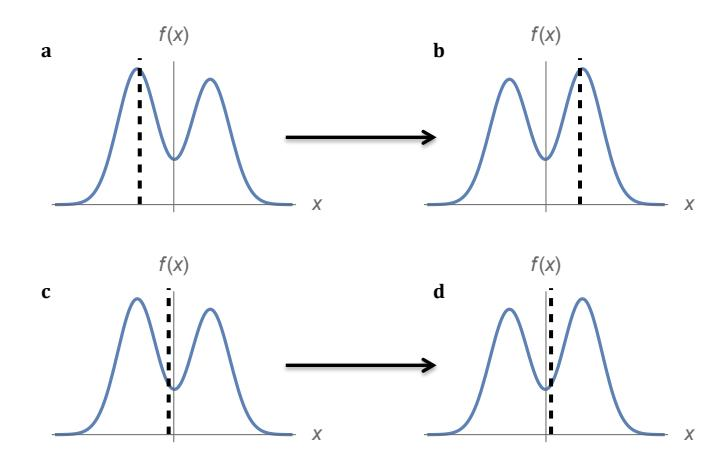
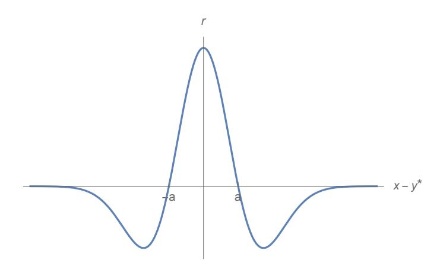
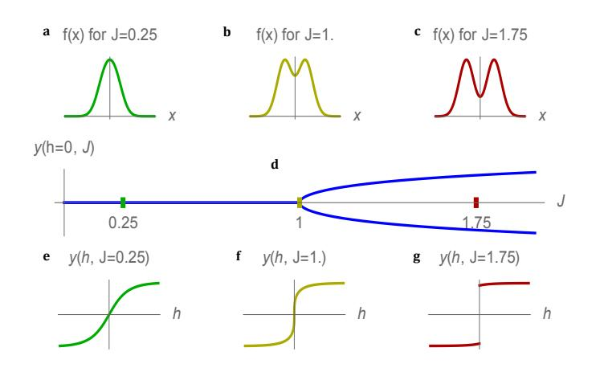
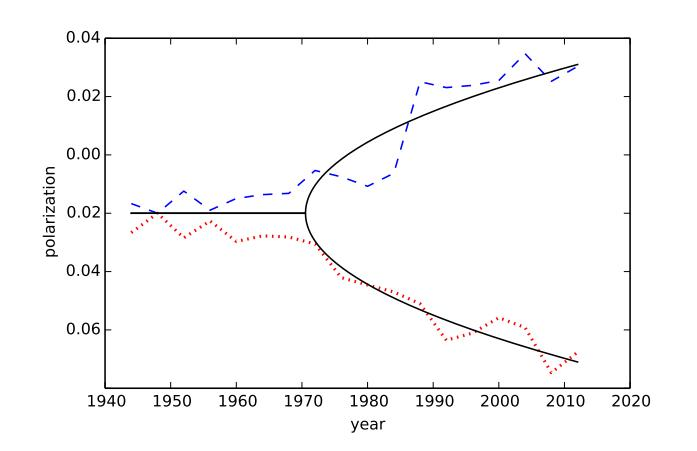
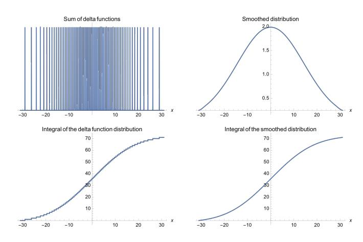

Alexander F. Siegenfeld1, 2, [∗](#page-0-0) and Yaneer Bar-Yam2

1*Department of Physics, Massachusetts Institute of Technology, 77 Massachusetts Ave., Cambridge, MA*

2*New England Complex Systems Institute, 277 Broadway, Cambridge, MA*

The challenge of understanding the collective behaviors of social systems can benefit from methods and concepts from physics [\[1–](#page-11-0)[6\]](#page-11-1), not because humans are similar to electrons, but because certain large-scale behaviors can be understood without an understanding of the smallscale details [\[7\]](#page-11-2), in much the same way that sound waves can be understood without an understanding of atoms. Democratic elections are one such behavior. Over the past few decades, physicists have explored scaling patterns in voting and the dynamics of political opinion formation, e.g. [\[8–](#page-11-3)[13\]](#page-11-4). Here, we define the concepts of *negative representation*, in which a shift in electorate opinions produces a shift in the election outcome in the opposite direction, and *electoral instability*, in which an arbitrarily small change in electorate opinions can dramatically swing the election outcome, and prove that unstable elections necessarily contain negatively represented opinions. Furthermore, in the presence of low voter turnout, increasing polarization of the electorate can drive elections through a transition from a stable to an unstable regime, analogous to the phase transition by which some materials become ferromagnetic below their critical temperatures. Empirical data suggest that United States presidential elections underwent such a phase transition in the 1970s and have since become increasingly unstable.

Elections are, fundamentally, a means of aggregating many opinions into one—those of the citizens into that of the elected official. Here, an opinion refers to a person's entire set of political beliefs; i.e. each citizen (and candidate) has one opinion. For simplicity, we focus on the case in which the set of all possible opinions can be embedded in a one-dimensional continuous space (e.g. a position on a left-right spectrum), as in many studies in the social choice literature (reviewed in section [S2 C\)](#page-10-0). However, our results can be extended to a multidimensional space (see section [S2 A\)](#page-8-0). The first part of this manuscript examines general properties of electoral representation (which we connect to the voting power literature in section [S2 B\)](#page-9-0) and instability, using a mathematical formalism that departs from the literature in that it makes no assumptions about how people vote or even the structure of the voting process. The second part of this manuscript presents a specific model that builds upon the social choice literature in order to demonstrate how, when the assumption of concave voter preferences is relaxed, instability and negative representation can arise. The specific model is shown to map onto the well-known mean-field Ising model [\[14\]](#page-11-5) of magnetic materials. The emergence of instability can couple to geospatially varying local election outcomes and the potentially destabilizing effects of a two party system. Finally, the manuscript considers the implications of such a model for contemporary American elections.

We define an *election* by y[f(x)], a *functional* that maps the distribution of electorate opinions f(x)—defined so that for any interval [a, b] ⊂ R, the number of citizens with opinions in that interval is R b a f(x)dx—to the election outcome y ∈ R, i.e. the opinion of the elected official. Note that in this framework, candidacy is endogenous: candidate opinions—or equivalently, which candidates run—are themselves functions of the electorate opinions. Any electoral system, regardless of its detailed mechanisms (e.g. the number of candidates or parties, the existence of primary elections, restrictions on candidate entry, etc.) can be conceptualized as such a process that outputs the opinion of the winning candidate based on the electorate opinions. In order that no opinion be *a priori* privileged over others, the one restriction we place on this process is *translational invariance*, i.e.

y[f(x + c)] + c = y[f(x)] (1)

for all c (section [S1 A\)](#page-4-0).

In order to measure the sensitivity of the election outcome to changes in electorate opinions [\[15\]](#page-11-6), we define the *representation* of an opinion x by

rc(f, x) = δy c (2)

where δy is the change in outcome that occurs if an individual's opinion changes from x to x 0 = x + c. (Representation should *not* be defined using only the distance between a citizen's opinion and that of the elected candidate: opinions without causal influence on the election outcome are not represented, even if they happen to align with that outcome.) It is convenient to measure representation by

r(f, x) = limc→0 rc(f, x) (3)

when the limit exists, since r(f, x) does not depend on c.

For a large population, a number of results hold if the election is differentiable (see section [S1 B](#page-4-1) for details). First,

r(f, x) = d dx δy δf(x) (4)

Second, rc(f, x) is the average of r(f, x) over the interval [x, x + c], and thus representation of individual opinions can be measured by r(f, x) alone. Third, the total representation of the electorate's opinions equals 1:

Z ∞ −∞ f(x)r(f, x)dx = 1 (5)

∗ [Corresponding author. Email: asiegenf@mit.edu](mailto:Corresponding author. Email: asiegenf@mit.edu)

FIG. 1. Election outcomes (vertical dashed lines) shift in response to a shift in the distribution of electorate opinions (f(x), denoted by the solid curves, where the horizontal axes (x) denote political opinion). a-b, When not everyone votes, an election can be unstable (eq. [\(11\)](#page-2-0))—a small shift in opinions to the right causes a large swing in the election outcome. c-d, In a stable election, by contrast, a small shift in opinions causes a similarly small shift in outcome.

We now show that all unstable elections contain negatively represented opinions. An election is *unstable* if an arbitrarily small change in opinion can cause a sizable change in the election outcome (fig. [1\)](#page-1-0), i.e. for some f and x,

limc→0 crc(f, x) 6= 0 (6)

If an election y[f] is unstable for an opinion distribution f0, then if some opinion x0 changes by a small amount (call the resulting opinion distribution f1), the election outcome changes by a larger amount C, i.e. δy1 ≡ y[f1] − y[f0] = C with |C| > ||. Now consider starting with f0 and shifting all opinions except x0 by − (call the resulting opinion distribution f2). Since f2(x) = f1(x+), δy2 ≡ y[f2]−y[f0] = C− by translational invariance (eq. [\(1\)](#page-0-1)). Thus, δy1 and δy2 have the same sign (since |C| > ||), despite being caused by changes of opinion in opposite directions, so one of the two changes in opinions must be negatively represented. This proof that unstable elections always contain negatively represented opinions relies only on translational invariance; therefore, we expect it to hold generally in real-world conditions, regardless of the size of the electorate, the number of candidates or parties, the existence of primaries, the effects of the Electoral College, etc.

Thus far we have presented general results that apply to all elections; we now examine a particular class of models in order to illustrate how negative representation can arise and to show how polarization drives elections through a phase transition into the unstable regime. Consider an election with two candidates (or two major political parties) who choose their positions in order to maximize their chances of winning the election (or, equivalently, choose to run/are selected to run in the general election based on these considerations). Then, under the assumptions of an affine linear *utility difference model* [\[16\]](#page-11-7) (see section [S1 D\)](#page-5-0), the possible election outcomes

argmax y∈R Z ∞ −∞ ux(y)f(x)dx (7)

where the utility function ux denotes the political preferences of someone with opinion x. We note that this model always admits at least one Nash equilibrium in candidate strategies (section [S1 C\)](#page-5-1); the instability we describe, which arises from multiple Nash equilibria, should be distinguished from scenarios in which no Nash equilibria exist (section [S2 C\)](#page-10-0). Although this model may not accurately describe individual and candidate behaviors, it can nonetheless be used to describe the properties of real-world elections, since representation and instability depend on electoral mechanisms only through the effects of these mechanisms on y[f]—the functional that characterizes how the election outcome varies with electorate opinions. For instance, this model cannot describe the deterministic voting underlying the Median Voter Theorem [\[17\]](#page-11-8) but can nonetheless exactly capture the collective behavior to which such voting gives rise, namely the election of the median opinion (section [S1 D\)](#page-5-0).

If citizens with opinions that are far from both candidates are more likely to abstain from voting, a phenomenon known as *alienation* [\[18–](#page-11-9)[22\]](#page-11-10), then negative representation occurs. Since not voting for either candidate is equivalent to preferring them equally, a utility function ux(y) that captures this behavior will be almost flat for large |y − x|. One such utility function is

ux(y) = u(y − x) = e − (y−x) 2a2 (8)

where a is a positive constant. Representation is then given by (section [S1 E\)](#page-5-2)

r(f, x) ∝ − 1 N u 00(y ∗ −x) = 1 N a4 (a 2 −(y ∗ −x) 2 )e − (y ∗−x) 2a2 (9)

where N is the number of constituents. Opinions far from the election outcome (|x − y ∗ | > a) are negatively represented (r(f, x) < 0, see fig. [2\)](#page-2-1): the election outcome is inversely sensitive to changes in those opinions. For instance, given a center-left candidate and a candidate to the right, as left-wing individuals move farther left, they may become less likely to vote for the center-left candidate (choosing instead not to vote), which increases the probability that the candidate on the right will win. In response, the electoral equilibrium of future elections may shift rightward, as candidates no longer vie for these left-wing votes. (Eq. [8](#page-1-1) is just an example; more generally, negative representation will occur if and only if u(y − x) is not concave.) Thus, individual choices to abstain when neither candidate is appealing lead to a systemlevel perversion in the aggregation of electorate opinions, in which the electorate becoming more left-wing can result in a more right-wing outcome, or vice versa.

When combined with a sufficiently polarized electorate, nonvoting (in particular, non-concave u) leads not only to negative representation but also to instability. (As proven earlier, instability cannot occur without negative representation; however, negative representation is possible without instability—

FIG. 2. When some voters abstain, opinions far from the election outcome may be negatively represented. This graph depicts the representation (r) of opinions (x) as a function of their distance from the election outcome (y ∗ ) for voting behavior given by eq. [\(8\)](#page-1-1).

see section [S1 F](#page-6-0) for further discussion.) For ux defined by eq. [\(8\)](#page-1-1) and an opinion distribution f(x) consisting of two normally distributed (potentially unequally sized) subpopulations centered at ±∆ (without loss of generality, we define the origin as the (unweighted) average of the means of the subpopulations),

f(x) = w1e − (x+∆)2 2σ2 + w2e − (x−∆)2 2σ2 , (10)

the outcome y is given by the following condition:

y/∆ = tanh(Jy/∆ + h) (11)

where J, a dimensionless measure of the polarization of the electorate, is given by J = ∆2/(a 2 +σ 2 ) and h, a measure of the relative sizes of the two subpopulations of the electorate, is given by h = 2 ln w2 w1 . For w1 = w2 (i.e. for equally sized subpopulations), h = 0, and the election is stable for J ≤ 1 and unstable for J > 1. In the stable regime, y = 0. In the unstable regime, there are two possible outcomes described by ±|y ∗ |, and an arbitrarily small change in h can cause y to swing between its positive and negative values (fig. [3\)](#page-2-2). Thus, small variations determine which subpopulation wins. The variations might include changes in population, nuances in the candidates' personalities, changes in the rules (simple majority versus Electoral College system, for example), voting restrictions, and the effectiveness of turnout operations. From election cycle to election cycle, the outcome can swing between the two subpopulations, with the majority of the opinions in the losing subpopulation being negatively represented (section [S1 F\)](#page-6-0). An intuitive explanation of how such negative representation and instability arises is that, due to low voter turnout, candidates are incentivized to focus on turning out their bases rather than winning over centrist voters.

This voting model (eq. [\(11\)](#page-2-0)) is precisely equivalent to a mean-field Ising model of a ferromagnet [\[14\]](#page-11-5), in which each spin (magnetic dipole) interacts with every other spin, highlighting the hidden dependencies that can arise from a system in which citizens' behaviors are superficially independent

FIG. 3. The stability of elections depends on the degree of electorate polarization. a-c, With increasing polarization (J) of the electorate opinion distribution, d, the electoral system undergoes a phase transition from possessing a single stable outcome to possessing two possible unstable outcomes. e, In the stable regime, the outcome smoothly responds to changes in the relative sizes of the two subpopulations (changes in h). f, At the phase transition (J = 1), the outcome is continuous but not differentiable in the relative sizes of the two subpopulations. g, In the unstable regime, the outcome discontinuously jumps. These figures were created using eqs. [\(10\)](#page-2-3) and [\(11\)](#page-2-0) for a = σ = 1 (for which J = ∆2 /2).

(section [S1 G\)](#page-7-0). This connection with the Ising model differs from other applications of the Ising model to complex systems [\[23](#page-11-11)[–26\]](#page-11-12) in two respects: first, our analysis takes the electorate opinions as given and therefore concerns the instability in the election dynamics rather than in the dynamics of the electorate opinions themselves, and second, we do not impose any of the assumptions of the Ising model, but rather show (section [S1 G\)](#page-7-0) that such an equivalence naturally arises for certain classes of voting behavior. Because the citizens are effectively coupled through collectively choosing a candidate, the system exhibits emergent behavior in which there can be discontinuities in the election outcome despite the continuous voting behaviors of individuals. Such emergent discontinuities are a common feature of complex systems [\[23,](#page-11-11) [27–](#page-11-13)[31\]](#page-12-0).

These emergent discontinuities can couple to geospatial pattern formation. Given the existence of local elections, we can consider a spatially varying election outcome y(~ri), which serves as an order parameter for the 2D geographic system (~ri represents geographic location). Given local interactions, the 2D Ising model exhibits a universal behavior of spatial pattern formation [\[32\]](#page-12-1). Indeed, this is consistent with the observed geographic segregation associated with political polarization [\[33\]](#page-12-2). (As these dynamics are consistent with social influence [\[34\]](#page-12-3) and homophily [\[35\]](#page-12-4), we expect the order parameter y(~ri) to couple to these forces.) One such model that exhibits this universal behavior can be constructed by coarsegraining the local electoral outcomes y(~ri) into a statistical field [\[10,](#page-11-14) [36\]](#page-12-5) y˜(~r) with an effective local hamiltonian (normalized by temperature) that allows for geographic heterogeneity:

Z d 2 ~rt(~r)˜y(~r) 2 + u(~r)˜y(~r) 4 + K(~r)(∇y˜(~r))2 − h(~r)˜y(~r) (12)

where u, K : R 2 → (0, ∞) and t, h : R 2 → R.

We can also consider a model in which the political parties are explicit. Generically, the memberships of the two parties can be expected to differ in opinion due to the forces described in the previous paragraph. A model that captures this breaking of symmetry between the two parties can be described by the following temperature-normalized hamiltonian for p : R → [0, 1]:

− max y1,y2∈R Z ∞ −∞ βf(x)[p(x)ux(y1) + (1 − p(x))ux(y2)]dx (13)

where p(x) denotes the probability that a citizen with opinion x belongs to or leans towards one of the two parties (with 1 − p(x) being the probability that they align with the other party), where β is a positive constant, and where the rest of the notation follows that of eq. [\(7\)](#page-1-2). As long as at least one of these parties chooses its nominee so as to maximize the probability of winning the general election (e.g. if primary voters vote based on this consideration), then no changes need be made to the analysis in eqs. [\(7\)](#page-1-2) to [\(11\)](#page-2-0). But, if *both* parties choose their nominees primarily based upon the opinions of their members rather than upon electability, then differences in the parties' members will generally cause the election to be unstable, regardless of general election voting behavior. For example, if each of the subpopulations in eq. [\(10\)](#page-2-3) approximately corresponds to a political party, then nominees based on the median or mean opinions of the party members will be located at ±∆, thus rendering the election unstable for all ∆ > 0 if the two parties have approximately equal support. Negative representation must then also be present; one such example would be if some opinions of the left-leaning party were to shift further to the left, resulting in a more left-leaning nominee that is less appealing to general election voters, increasing the likelihood that the right-leaning party's nominee wins. Given this inherently polarizing effect of the two-party system, electoral reforms such as instant-runoff voting or approval voting that allow for third-party candidates to run without playing spoiler may reduce this instability.

Empirically, the opinions of the United States population, and in particular the opinions of those most likely to vote, have been polarizing over the past few decades [\[37\]](#page-12-6), while voter turnout has remained approximately constant [\[38\]](#page-12-7). Thus, we might expect that over time, election outcomes have undergone a phase transition from a stable to unstable regime, and indeed this appears to be the case (fig. [4\)](#page-3-0). (While elections cannot be expected to follow the precise assumptions behind eq. [\(11\)](#page-2-0), they nonetheless may fall into the same *universality class* (section [S1 H\)](#page-7-1), including in the case where the space of opinions is multidimensional (section [S2 A\)](#page-8-0).) Changes to the electoral process, such as reforms in the early 1970s as to how presidential party nominees are chosen, together with increasing polarization, may have driven this phase transition into instability. That the policies of legislators in politically homogeneous districts are more strongly correlated with the

FIG. 4. The polarization of the Democratic (dashed) and Republican (dotted) parties between 1944 and 2012, as measured by the fraction of polarizing words in the party platforms relative to a baseline. Party platforms are released once every four years. During the 1970s, there appears to be a divergence, which may correspond to a phase transition of the electoral dynamics into instability. The bifurcation associated with the universality class to which the mean-field Ising model belongs (solid, cf. fig. [3d](#page-2-2)) is superimposed; R 2 values are 0.86 for the Democratic party and 0.89 for the Republican party. See section [S1 H](#page-7-1) for further details.

preferences of the district's median voter than the policies of legislators in heterogeneous districts [\[39\]](#page-12-8) lends further empirical support.

In addition to whatever other problems may arise from instability, unstable elections also necessarily contain negatively represented opinions, a result that, due to the generality of the assumptions used to prove it, is expected to hold for any realworld election, regardless of the structure of the electoral process, the number of candidates, or other details. Therefore, the impact of electoral reforms on this instability should be considered. For instance, when voter turnout is low, political polarization can fundamentally shift electoral dynamics, causing large swings from election to election and leaving many negatively represented, regardless of the outcome. These results suggest that polices that increase voter turnout will not only result in more voices being heard but will also stabilize elections and reduce negative representation.

# Acknowledgements

This material is based upon work supported by the National Science Foundation Graduate Research Fellowship under Grant No. 1122374 and the Hertz Foundation. We thank B. Dan Wood for sharing the data from his paper on the polarization of party platforms [\[40\]](#page-12-9) and Irving Epstein and Mehran Kardar for helpful feedback.

FIG. S1. By replacing the Dirac delta functions with the approximation δ(x) ∼ √1 2π e −x 2/2 , a smooth distribution is obtained from the sum of delta functions. Note that the integrals of these distributions (taken from the lower bound of the domain of the graphs to x) are very similar, despite the striking differences between the distributions themselves.

## S1. METHODS

### A. Translational invariance

In the main text, we make the assumption of translational invariance (eq. [\(1\)](#page-0-1)). Technically, translational invariance is defined only in relation to a particular metric. Thus, the assumption of translational invariance can be relaxed without invalidating the paper's results. For the proof that negative representation implies instability, all that is required is that the election be continuous (rather than invariant) under translations or formally, that for fc(x) = f(x + c), y[fc] be continuous in c (note that this property is independent of the metric). The proof given in the main text then follows in the limit → 0. For the proof that the total representation sums to 1 (eq. [\(5\)](#page-0-2)), there need only exist some metric on the opinion space under which the election is translationally invariant, so long as the representation is defined under such a metric.

## B. Representation in the large-population limit

In this section, we derive properties of our representation measure when the number of citizens N is large. For a set of N citizens with opinions {x1, x2, ..., xN }, the distribution of electorate opinions is f(x) = PN i=1 δ(x − xi), which is the only distribution satisfying the property that R b a f(x)dx is the number of citizens with opinions in the interval [a, b]. However, it is often useful to choose f(x) to be a smooth function that approximates PN i=1 δ(x − xi), in the sense that the difference between R b a f(x)dx and the number of citizens with opinions in the interval [a, b] is no greater than 1 for all a, b (see fig. [S1](#page-1-0) for an example). For large enough N, the error of up to 1 opinion will generally not be significant. Alternatively, a natural interpretation of a smooth f(x) is that the opinions are themselves probabilistic (for an example of explicitly probabilistic opinions, see section [S2 B\)](#page-9-0). Whether or not f(x) is chosen to be smooth does not matter for the results of the text, although for the results that rely on the assumption that the number of citizens is large, the mathematics are simpler if f(x) is assumed to be a function rather than a distribution. For instance, the expression for representation in the case of median voting involves evaluating f at its median, an operation which is not well-defined if f is a sum of Dirac delta functions.

In the limit of a large population (N >> 1), the change δf in the opinion distribution arising from an individual opinion will be small compared to the opinion distribution as a whole, and so we expand δy to first order in δf:

δy = Z ∞ −∞ δf(z) δy δf(z) dz (14)

Note that eq. [\(14\)](#page-4-2) does not apply to cases in which y[f] is not differentiable, e.g. when the election is unstable and small changes in the opinion distribution can have an outsized impact; thus we do not use results derived from these equations when analyzing instability.

We now derive eq. [\(4\)](#page-0-3). Note that when an individual opinion changes from x to x 0 = x + c, the opinion distribution changes by

δf(z) = δ(z − x − c) − δ(z − x) (15)

where δ(z) is the Dirac delta function. Representation (eq. [\(2\)](#page-0-4)) is then obtained in terms of functional derivatives of the election by substituting eq. [\(15\)](#page-4-3) into eq. [\(14\)](#page-4-2):

rc(f, x) = 1 c δy = 1 c ( δy δf(x + c) − δy δf(x) ) (16)

which, combined with eq. [\(3\)](#page-0-5), yields eq. [\(4\)](#page-0-3) (reproduced below).

r(f, x) = d dx δy δf(x) (17)

By the fundamental theorem of calculus, we see from eq. [\(16\)](#page-4-4) that rc(f, x) is the average of r(f, x) over [x, x + c].

We now prove eq. [\(5\)](#page-0-2) (R ∞ −∞ f(x)r(f, x)dx = 1), which holds when the election (y[f]) is differentiable. For small , f(z +) = f(z) + d dz f(z) + O( ), and thus, using eq. [\(14\)](#page-4-2),

y[f(z + )] = y[f(z) + d dz f(z) + O( 2 )] = y[f(z)] + Z ∞ −∞ df(x) dx δy δf(x) dx + O( 2 ) (18)

Since f has compact support, which follows from f being an approximation of the opinions of a finite number of citizens, integrating by parts yields

y[f(z +)] = y[f(z)]− Z ∞ −∞ f(x)r(f, x)dx+O( 2 ) (19)

which can be combined with eq. [\(1\)](#page-0-1) in the limit → 0 to yield eq. [\(5\)](#page-0-2). This proof assumes that f is differentiable for illustrative purposes, but the result will more generally hold if f and r are treated as distributions (generalized functions).

#### C. Nash equilibria of the electoral game

Consider a two-candidate election with endogenous candidacy: candidate positions (or, equivalently, candidates) are chosen in order to maximize the probability of victory. In this framework, the winner of the election will have adopted an unbeatable position y ∗ , provided such a position exists (i.e. a candidate with position y ∗ will have at least a 50% chance of winning against a candidate with any other position). Formally, (y ∗ , y∗ ) is a *Nash equilibrium*, since no candidate can improve her chances by changing her position. Because the voting game is symmetric, if (y1, y2) is a Nash equilibrium, then so are (y1, y1) and (y2, y2); see, for instance, section 2.3 of [\[41\]](#page-12-10). Thus, if there is a unique Nash equilibrium, it must be of the form (y ∗ , y∗ ).

# D. The utility difference model

Building upon the two-candidate election framework above (section [S1 C\)](#page-5-1), we describe the assumptions behind the utility difference model given by eq. [\(7\)](#page-1-2) and give examples of its applications to median voting, mean voting, and an election between median and mean voting.

Denoting the probability that a vote from someone with opinion x will go to the first candidate minus the probability that it will go to the second by px(y1, y2) (where y1 and y2 are the opinions of the first and second candidates, respectively), we assume there exists some function ux such that

px(y1, y2) = ux(y1) − ux(y2) (20)

This assumption yields an affine linear *utility difference model* [\[16\]](#page-11-7), the potential election outcomes for which are given by eq. [\(7\)](#page-1-2). Essentially, this model assumes that the position that maximizes a candidate's margin of victory does not depend on the position of the other candidate. We note that in order for eq. [\(20\)](#page-5-3) to be able to be interpreted as a difference in probabilities, the functions ux(y) must satisfy

max y1,y2 |ux(y1) − ux(y2)| ≤ 1 (21)

so that |px(y1, y2)| ≤ 1 always holds.

For ux(y) = −a 2 (y − x) 2 where a is a positive constant, the mean opinion is selected, since for a random variable X, E[(X − µ) 2 ] is minimized for µ = E[X]. (Here, y and the support of f must be confined to an interval of length at most a −1 in order to satisfy eq. [\(21\)](#page-5-4).) For ux(y) = −a|y − x| (where again, a is a positive constant, and y and the support of f must be confined to an interval of length at most a −1 ), the median opinion is selected (since the median minimizes E[|X − m|]), although by a different mechanism than the deterministic voting assumptions of the Median Voter Theorem [\[17\]](#page-11-8). (The Median Voter Theorem states that when political opinions lie in one dimension and everyone votes for the candidate whose opinion is closest to his, the optimal position for a candidate to take is that of the median voter.) Both of these functions can be viewed as limiting cases of the hyperbolic ux(y) = − p a 2(y − x) 2 + b 2, with b << a approximating median voting and b >> a approximating mean voting. Under mean voting, for a citizen opinion either to the right of both candidates or to the left of both candidates, the farther away this opinion is, the stronger the citizen's preference between the two candidates. Under median voting, the strength of this citizen's preference for one candidate over the other is independent of how far the citizen's opinion is from both candidates. For the intermediate case, the strength of this citizen's preference gets stronger up to a point and then levels off as the citizen's opinion moves farther away from both candidates. However, in actual elections, citizens with opinions that are far from both candidates may be more likely to abstain from voting (or vote for a third-party candidate), which is why eq. [\(8\)](#page-1-1) may be more realistic.

### E. Representation in the utility difference model

In this section, we calculate representation for the utility difference model given by eq. [\(7\)](#page-1-2). We derive the first part of eq. [\(9\)](#page-1-3), and we then calculate representation for the examples given in section [S1 D.](#page-5-0) To do so, we must assume there is a single possible election outcome y ∗ (see section [S1 C\)](#page-5-1). Then, from eq. [\(7\)](#page-1-2),

y ∗ = argmax y˜ Z ∞ −∞ ux(˜y)f(x)dx (22)

which implies

0 = Z ∞ −∞ u 0 x (y ∗ )f(x)dx (23)

Note that eq. [\(22\)](#page-5-5) satisfies y[f(x)] = y[λf(x)] for any positive constant λ (scale invariance), and let ˜f(x) = f(x)/N where N is the size of the electorate, so that R ∞ −∞ ˜f(x)dx = 1. Considering the change that arises from the addition of a single individual with opinion x0 to the population, we define δy∗ by

y ∗+δy∗ = y[f(x)+δ(x−x0)] = y[ ˜f(x)+δ(x−x0)] (24)

where = 1/N. Thus, substituting y ∗+δy∗ for y ∗ and ˜f(x)+ δ(x − x0) for f(x) into eq. [\(23\)](#page-5-6),

0 = Z ∞ −∞ u 0 x (y ∗ + δy∗ )( ˜f(x) + δ(x − x0))dx (25)

Because R ∞ −∞ ux(x)f(x)dx is differentiable in f and has a single maximum in y, expanding eq. [\(25\)](#page-5-7) to lowest order in yields

δy∗ = −u 0 x0 (y ∗ ) R ∞ −∞ u 00 x (y ∗) ˜f(x)dx + O( 2 ) (26)

Noting that the denominator is independent of x0, of order 1 (i.e. independent of N), and negative (otherwise, y ∗ would be a minimum rather than a maximum),

δy δ ˜f(x0) = lim→0 δy∗ ∝ u 0 x (y ∗ ) (27)

So, using eq. [\(4\)](#page-0-3),

r(f, x) = d dx δy δf(x) = 1 N d dx δy δ ˜f(x) ∝ 1 N d dxu 0 x (y ∗ ) (28)

If ux(y) = u(y − x), as it must be for some function u if the election is translationally invariant as in eq. [\(1\)](#page-0-1), then

r(f, x) ∝ − 1 N u 00(y ∗ − x) (29)

Eq. [29](#page-6-1) provides a direct link between citizen preferences and the representation of opinions. (If needed, the constant of proportionality can be determined through eq. [\(5\)](#page-0-2).) Consider the examples for u given in section [S1 D.](#page-5-0) For u(y − x) = −a 2 (y−x) 2 and u(y−x) = −a|y−x|, we can quickly derive the representation of opinions under mean voting (r(f, x) = 1 N ) and median voting (r(f, x) = δ(x−m) f(m) where m is the median of f), respectively. For u(y−x) = − p a 2(y − x) 2 + b 2, which yields an outcome between that of median and mean voting,

r(f, x) ∝ (1 + a 2 b 2 (x − y[f])2 ) −3/2 (30)

resulting in the representation of opinions being concentrated around the election outcome, but not infinitely concentrated as it is for median voting. For u that are not concave, there will exist some x such that u 00(x − y) > 0, and representation will be negative for those opinions (see eq. [\(29\)](#page-6-1)).

# F. Instability in the utility difference model

Here, we explore the conditions under which instability can arise in the model described by eq. [\(7\)](#page-1-2), and we elaborate on the concrete model of instability with outcomes given by eq. [\(11\)](#page-2-0). For the model given by eq. [\(7\)](#page-1-2), r(f, x) = d dx δy δf(x) is shown to be well-defined as long as y[f] is single-valued, i.e. eq. [\(7\)](#page-1-2) has a single maximum (section [S1 E\)](#page-5-2). Thus, instability can occur only when there are multiple maxima. (For a single maximum y ∗ with R ∞ −∞ u 00(x − y ∗ )f(x)dx = 0, the functional derivative of y is not defined, but, as can be shown in a higher order analysis, there is no instability. In particular, for δy∗ defined by eq. [\(24\)](#page-5-8), we can derive

1 6 (δy∗ ) 3 = −u0 x0 (y ∗ ) R ∞ −∞ ˜f(x)u 0000 x (y ∗)dx + O( 4/3 )

in place of eq. [\(26\)](#page-6-2), which yields δy∗ ∝ 1/3u 0 x0 (y ∗ ) 1/3 + O( 2/3 ). Note that

r(f, x0) = d dx x=x0 δy∗

is well-defined for any given = 1/N—although it is not given by eq. [\(4\)](#page-0-3) since δy δf(x) does not exist—thus, there is no instability.)

For an opinion distribution in which eq. [\(7\)](#page-1-2) has two maxima y ∗ 1 and y ∗ 2 , if each position is taken by one candidate, then each candidate has a 50% chance of winning the election. However, an arbitrarily small change in the opinion distribution can favor one outcome over the other, giving either y ∗ 1 or y ∗ 2 a chance of winning that is arbitrarily close to 100% in the large-population limit. (For a finite population, the outcome of the election in this model is not deterministic, and the probability of a given candidate winning is continuous with respect to the opinion distribution. This discontinuity in y[f] arising from multiple Nash equilibria in the large-population limit is analogous to a first-order phase transition.)

The existence of multiple maxima in y implies that R ∞ −∞ u(x − y)f(x)dx is not concave (ignoring the degenerate case in which R ∞ −∞ u(x − y)f(x)dx is constant over some interval). Thus, instability can arise only in the case of nonconcave u, which is precisely the same condition under which negative representation occurs. That instability can arise only in the presence of negative representation should not surprise us, since it was proven under more general conditions in the main text. For this class of models, we also find that negative representation implies that there exist distributions of opinions for which instability arises, i.e. if u is not concave, then there exists an f(x) such that eq. [\(7\)](#page-1-2) has multiple maxima. To see why this is true, consider an opinion distribution f such that f(x) = f(−x). Then, if there is a single maximum of eq. [\(7\)](#page-1-2), it must lie at y ∗ = 0. In order for y ∗ = 0 to be a maximum, we must have R ∞ −∞ f(x)u 00(x)dx = 2 R ∞ 0 f(x)u 00(x)dx ≤ 0 (where the equality follows from the symmetry of u and f). But, assuming u is twice continuously differentiable and not concave, there exists an f such that f(x) = f(−x) and R ∞ 0 f(x)u 00(x)dx > 0. For such an f, y ∗ = 0 is not a maximum, thus contradicting our assumption that there was a unique maximum.

To provide an example of how, for non-concave u, the election is unstable for certain opinion distributions, we consider the u used for the example of negative representation: u(y − x) = exph − (y−x) 2a2 i for some positive constant a (eq. [\(8\)](#page-1-1)). We take the distribution of electorate opinions to be a sum of two (potentially unequally weighted) normal distributions of equal variance:

f(x) = X α=1,2 wαe − (x−µα) 2σ2 (31)

Then, from eq. [\(7\)](#page-1-2), the outcome of the election is then given by

argmax y Z ∞ −∞ f(x)e − (y−x) 2a2 dx = argmax y X α=1,2 wαe − (y−µα) 2(a2+σ2) (32)

Without loss of generality, we can assume that µ2 = −µ1 ≡ ∆ ≥ 0. Defining the normalized election outcome yˆ ≡ y/∆, we solve eq. [\(32\)](#page-7-2) to get the following condition:

yˆ = tanh(Jyˆ + h) (33)

where J = ∆2/(a 2+σ 2 ) and h = 2 ln w2 w1 . For w1 = w2 (i.e. for equally sized subpopulations), h = 0, and the election is stable with yˆ = 0 for J ≤ 1 and unstable for J > 1. In the unstable regime, there are two possible outcomes described by ±|yˆ ∗ |, and an arbitrarily small change in h can cause yˆ to swing between its positive and negative value. In this regime, the majority of one of the subpopulations will be negatively represented: for y ∗ < 0, over half of the subpopulation centered at ∆ will have opinions x with x − y ∗ > ∆ − y ∗ > a (∆ > a in the unstable regime), and, from eq. [\(9\)](#page-1-3), representation is negative for these opinions. Likewise, for y ∗ > 0 in the unstable regime, over half of the subpopulation centered at −∆ will be negatively represented.

#### G. Connection with the mean-field Ising model

We map the voting model that gives rise to eq. [\(33\)](#page-7-3) (eq. [\(11\)](#page-2-0) in the main text) onto a mean-field Ising model [\[14\]](#page-11-5). To begin constructing this map, note that the left-hand side of eq. [\(32\)](#page-7-2) gives the limiting value of y as N → ∞ when y is drawn from a probability distribution corresponding to the partition function

Z = Z ∞ −∞ Z ∞ −∞ e − (y−x) 2 2a2 f(x)dxN dy (34)

Because y is a gaussian random variable, we can explicitly integrate over y, which yields, up to a multiplicative constant,

Z = Z ∞ −∞ e − P (xi−x¯) 2 2a2 Π N i=1(f(xi)dxi) = Z ∞ −∞ e − 1 2N P (xi−xj 2a2 Π N i=1(f(xi)dxi) (35)

This equation describes N interacting probabilistic "spins," with each spin weighted by the opinion distribution f(x), with an energy penalty proportional to its mean-square distance from all of the other spins. For f(x) given by eq. [\(31\)](#page-6-3) (eq. [\(10\)](#page-2-3) in the main text), the behavior is exactly that of a mean-field Ising model (with an external magnetic field for w1 6= w2); in general, for bimodal symmetric f(x) we expect a phase transition in which the system will spontaneously break the symmetry between the peaks as the peaks move farther apart. In the stable/disordered phase, both of the peaks of f(x) are sampled by the "spins;" in the unstable/ordered phase, however, only one of the two peaks is sampled, and therefore the other peak is not represented. Despite the fact that each individual votes independently from everyone else, citizens are coupled through their collectively choosing a candidate, which is reflected by the effective interactions between the "spins." In the limit of weak interactions, i.e. a → ∞, we recover mean voting, since in this limit, u(y − x) = exph − (y−x) 2a2 i ≈ 1 − 2a2 (y − x) 2 . (Quadratic utility functions yield mean voting—see section [S1 D.](#page-5-0)) Thus, mean voting is a way of "independently" aggregating opinions.

For a general u(y−xi) = exp[−V (y − xi)] (we can always write u in this form with V (x) ≥ c for some c ∈ R), we note that eq. [\(7\)](#page-1-2) yields an election outcome equivalent to the limit of y as N → ∞ with y drawn from

Z = Z ∞ −∞ Z ∞ −∞ e −V (y−x) f(x)dxN dy = Z ∞ −∞ e − P i V (y−xi)Π N i=1(f(xi)dxi) (36)

For quadratic V , we saw above that we could exactly integrate over the election outcome y to yield pairwise quadratic interactions between the xi variables, but for general V , such an integration will yield many interaction terms of higher than quadratic order between these xi . Although such integration cannot be carried out precisely, we expect this interacting system to undergo a phase transition for bimodal f(x) if the expansion of V produces sufficiently strong interactions. Thus, the system's behavior should be similar to the exactly solvable case in which V is quadratic.

# H. Empirical data

To determine if the stability of U.S. presidential elections has changed over time, we used data from Jordan *et al.* [\[40\]](#page-12-9) on the polarization in the party platforms. Jordan *et al.* used a combination of machine learning and human judgment to determine which of the frequently used words in the party platforms were polarizing and then determined the number of polarizing words (classified by political issue dimensions such as economic, foreign, etc.) in the Republican and Democratic platforms from 1944 to 2012. From this data, we calculated the total number of polarizing words as a percentage of all words in the platforms. We chose the percentage of polarizing words in the party platforms as a measure of political polarization over other measures of ideology—such as NOMI-NATE scores [\[42\]](#page-12-11), which measure ideological purity based on agreement with other politicians—because we wanted an external, content-based measure of divergence in opinion rather than a measure of ideology that depends only on the positions that politicians take relative to one another. To construct fig. [4,](#page-3-0) we plotted by year the fraction of polarizing words in the Democratic platforms and the negative of the fraction of polarizing words in the Republican platforms. To correct for any time-independent bias affecting the number of polarizing words in the party platforms—for instance, which words Jordan *et al.* designated as polarizing—we subtracted from the data for each party separately the fraction of polarizing words from the year of least polarization for that party (which was 1948 for both parties). Thus, the data shown are the changes in the fraction of polarizing words relative to their baseline value (0.0258 for Democratic platforms and 0.0693 for Republican platforms).

As was noted in the main text and explained in section [S1 G,](#page-7-0) our voting model (fig. [3\)](#page-2-2) is equivalent to a mean-field Ising model. Real-world elections are unlikely to follow this model exactly, and even if they did, there is no reason to believe that there would be a simple relationship between polarization (for which J is a dimensionless measure) and time. Nonetheless, if U.S. presidential elections underwent a phase transition in the same *universality class* as the mean-field Ising model, then in the vicinity of the phase transition, polarization would increase in proportion to the square root of the time from the transition, regardless of the precise relationship between time and polarization. In much the same way, magnetization increases near a ferromagnetic phase transition in proportion to (T − Tc) β , where T is temperature, Tc is the temperature at which the phase transition occurs, and β is known as a *critical exponent*, which depends only on the universality class to which the phase transition belongs [\[43\]](#page-12-12). Inspired by this universality, we fit the polarization of both parties to the piecewise function

f(x) = ( 0 x ≤ x0 A √ x − x0 x > x0 (37)

where x is the year and f(x) is the fraction of polarizing words in that year's platform relative to the baseline value (see above), and A and x0 are free parameters, corresponding to the amplitude of the polarization and the year that it begins, respectively. We found that x0 = 1970.54 and A = 0.0079196 minimize the total sum of square errors, yielding R2 values of 0.86 for the Democratic party and 0.89 for the Republican party. If the two parties are considered together, R2 = 0.87.

#### S2. SUPPLEMENTARY TEXT

#### A. Multidimensional opinion space

For the sake of simplicity, this paper focuses on systems with a one-dimensional opinion space, but the concepts developed in this paper can naturally be extended to a multidimensional opinion space, where the opinions of the electorate and candidates lie in R n, as in [\[16,](#page-11-7) [41,](#page-12-10) [44,](#page-12-13) [45\]](#page-12-14). This extension will be briefly outlined here. The definition of representation is generalized by replacing eq. [\(2\)](#page-0-4) with

r~c,µν(f, x) = δyµcν |c| 2 (38)

For a scalar measure, we use

tr[r~c] = ~c · δ~y |c| (39)

When there exists an rµν(f, x) such that

δyµ = X ν rµν(f, x)cν + O(c 2 ) (40)

for all ~c, this rµν(f, x) can be used in place of eq. [\(3\)](#page-0-5) as a representation independent of ~c. In the large-population limit, eq. [\(16\)](#page-4-4) is then replaced (using Einstein-summation notation) by the path-independent integral

tr[r~c(f, x)] = cµ |c| 2 δyµ δf(~x + ~c) − δyµ δf(~x) = cµ |c| 2 Z ~x+~c ~x rµν(f, x0 )dx0 ν (41)

where r(f, x) (which satisfies eq. [\(40\)](#page-8-1)) is a matrix defined by

rµν(f, x) = ∂ ∂xν δyµ δf(x) (42)

The differential representation in a direction given by the unit vector vˆ is then given by vˆµrµν(f, x)ˆvν, which yields the same results as eq. 7 of [\[15\]](#page-11-6) in the limit of a continuum of voters. The trace tr[r] gives a rotationally invariant scalar measure.

The representation normalization condition corresponding to eq. [\(5\)](#page-0-2) is R f(x)rµν(f, x)dx = δµν where the integral is taken over R n.

bility is characterized by

lim ~c→0 cνr~c,µν 6= 0 (43)

Generally, instability implies either that lim~c→0 |c|tr[r~c] 6= 0, in which case negative representation (defined by tr[r~c] < 0) follows in the same way as the one-dimensional case, or that an infinitesimal change in opinion causes a finite orthogonal change in the outcome of the election. In this case, by considering further infinitesimal changes in opinion parallel to the first change in election outcome, and assuming that the magnitude of the change in the outcome of the election cannot grow without bound, one either gets negative representation directly (tr[r~c] < 0 for some ~c)—or tr[r~c] > 1, from which negative representation follows as it does in the one-dimensional case.

Just as in the one-dimensional case, increasing polarization can drive the election through a phase transition from a stable to unstable regime, as eqs. [\(35\)](#page-7-4) and [\(36\)](#page-7-5) apply equally well if the opinions xi are vector quantities. The nature of the unstable regime will depend on the symmetries present in the problem.[1](#page-0-6) For example, consider a distribution of opinions given by

f(~x) = X Nα α=1 e − (~x−~µα) 2σ2 (44)

where Nα is the number of subpopulations. For Nα = 2, the instability that occurs for sufficiently large |~µ1 − ~µ2| will be very similar to what was described in the main text for the one-dimensional case. For Nα > 2, if the set of points {~µα} possess permutation symmetry, the system will resemble that of a mean-field Potts model (assuming the V in eq. [\(36\)](#page-7-5) is isotropic). However, unlike the case for Nα = 2—where regardless of the values of the ~µα, the system possesses the appropriate symmetry to belong to the Ising universality class (due to the overall translational invariance of the problem and thus the ability to redefine the origin)—for Nα > 2, we should not expect the system to generally possess the permutation symmetry necessary for Potts universality. Thus, we expect the real-world phase transitions that we observe to be of the Nα = 2 type, i.e. of the same type of instability observed for a one-dimensional opinion space. For Nα > 2, the situation may be able to be approximated by Nα = 2, especially if there are dynamical social or political forces that pull the distribution of opinions towards a situation in which competition is roughly balanced between two opposing (potentially multi-party) coalitions at any given point in time.

# B. The Owen-Shapley index as a special case

In this section we show that there exist functionals y[f(x)] for which our representation measure (eq. [\(4\)](#page-0-3)) reproduces the values of both the deterministic and probabilistic OwenShapley voting power indices. Thus, these voting power indices can be thought of as special cases of our measure. We give a brief background on the voting power literature and then consider the case of a one-dimensional opinion space, followed by a generalization to the case of a multidimensional opinion space for which the Owen-Shapley index was primarily designed.

When nothing is known about the preferences of voters, their political power has traditionally been measured by *a priori voting power* [\[46\]](#page-12-15), which reflects the probability that a given individual or entity will cast the deciding vote and is usually measured by either the *Penrose index* [\[47\]](#page-12-16) or the *Shapley-Shubik index* [\[48\]](#page-12-17). More precisely, to calculate a voter's *a priori* voting power, consider a random division of the rest of the voters into two camps. Then the probability that the excluded voter will get his way regardless of which camp he joins is his voting power; the Penrose index and the Shapley-Shubik index differ only in the way in which they randomly choose a division. While the Penrose index assumes that each voter randomly chooses one side or the other, the Shapley-Shubik index re-weights the probabilities so that each ordering of voters is equally likely.[2](#page-0-6) These indices provide useful and counterintuitive results when the voters possess differing numbers of votes, as in the European Union. For instance, under the 1958 voting rules for the European Economic Community, Luxembourg, despite having had one vote, had no voting power, since there were no possible divisions of the other five countries such that Luxembourg's vote would be decisive [\[49\]](#page-12-18). But in elections in which each voter has one vote, all measures of *a priori* voting power result in each voter having an equal amount of power. A measure of voting power that takes voter preferences into account is needed to determine how various opinions are differently represented. Many preference-based measures have been proposed—for instance, the spatial Shapley-Shubik index, also known as the Owen-Shapley index [\[50\]](#page-12-19)—but, as we will see, these measures implicitly assume that people vote in a particular way.

In one dimension, the deterministic Owen-Shapley index [\[50\]](#page-12-19) allows for only two possible orderings of the voters (left to right or right to left), for which the median voter is pivotal in both, thus yielding the same concentration of power that our representation measure (eq. [\(3\)](#page-0-5)) yields in the case of median voting (y[f] = median[f] ≡ m yields r(f, x) = d dx δy δf(x) = δ(x−m) f(m) ). Benati and Marzetti [\[51\]](#page-12-20) note that this extreme concentration of power is due to the deterministic nature of the Owen-Shapley model, which assigns zero probability to almost all orderings. They propose a generalized election model in which voters' opinions have both a deterministic and a random component. In the onedimensional case, their treatment is equivalent to denoting the probabilistic opinion Xi of voter i by

Xi = xi + i (45)

1 However, as all of the possible phase transitions are described by a meanfield theory, they all belong to the same universality class.

2 There are some fundamental differences in the motivation behind the indices [\[46\]](#page-12-15), but mathematically, they are rather similar, though neither is without drawbacks: while the assumptions behind the Penrose index are simpler, in general the sum of all voters' Penrose indices will not equal 1, while the sum of all voters' Shapley-Shubik indices will.

where the xi are deterministic and the i are independent random variables with a continuous probability density function f(i). Denoting the distribution of the xi over the population by f(xi) (note that f will be a sum of delta functions for a finite population) and choosing an election in which people vote for the candidate closest to their probabilistic opinions Xi , [3](#page-0-6) the Nash equilibrium for the two candidates' opinions is the median of the distribution fX(X) ≡ (f ∗ f)(x) =

R ∞ −∞ f(x)f(X − x)dx, i.e. y[f] = median[fX] = median[f ∗ f] ≡ m (46)

The continuity of fX follows from that of f, and we have made the additional assumption that fX(m) 6= 0; otherwise, there is no unique Nash equilibrium.

We then calculate

δy[f] δf(x) = Z ∞ −∞ δ median[fX] δfX(z) δfX(z) δf(x) dz = Z ∞ −∞ sign(z − m) 2fX(m) f(z − x)dz = Z ∞ −∞ sign(z + x − m) 2fX(m) f(z)dz (47)

which yields the representation measure (eq. [\(4\)](#page-0-3)) for opinion i:

r(f, xi) = d dxi δy[f] δf(xi) = Z ∞ −∞ 2δ(z + xi − m) 2fX(m) f(z)dz = 1 fX(m) f(m − xi) (48)

The rightmost side of eq. [\(48\)](#page-10-1) is the probability that voter i is the median—i.e. pivotal—voter; thus, r(f, xi) is equal to the generalized Owen-Shapley index for voter i.

The Owen-Shapley index was developed primarily for multidimensional opinion spaces in R n. Owen and Shapley [\[50\]](#page-12-19) consider a randomly drawn unit vector vˆ ∈ R n and then order individuals by defining i < j if X~ i · v <ˆ X~ j · vˆ. (The X~ i are deterministic but can easily be modified to be partially probabilistic as in [\[51\]](#page-12-20).) The Owen-Shapley index of i is again the probability that i is the median of the resulting ordering. To see how this power index is a special case of our multidimensional representation measure (eq. [\(42\)](#page-8-2)), consider the following method of choosing a candidate, given a set of voters with (potentially probabilistic) opinions X~ i ∈ R n:

1) Randomly choose an orthonormal basis V = {vˆ1, ..., vˆn} for R n.

2) Conditioning on the orthonormal basis V , let mα(V ) be the median of the probability distribution function for vˆα · X~ , where X~ is randomly drawn from the voter opinions X~ .

i P 3) The election outcome is then given by ~y[f] = n α=1 mα(V )ˆvα.

Note that ~y is now a random variable (since it depends on the orthonormal basis V ), and so the right-hand side of eq. [\(42\)](#page-8-2) must be replaced by its expectation value, i.e. rµν(f, ~x) = E[ ∂ ∂xν δyµ δf(~x) ]. From eq. [\(48\)](#page-10-1) (with vˆ·~y, vˆ· ~xi , and vˆ · ~i substituting for y, xi , and i), vˆµrµν(f, ~xi)ˆvν is equal to the probability that i will be the median voter along vˆ. Therefore, tr[r(f, ~xi)] is equal to the expected number of basis vectors along which i will be the median, and so tr[r(f, ~xi)] is equivalent to n times the Owen-Shapley index.

The agreement between r(f, ~x) and the Owen-Shapley index follows from the fact that d d(ˆv·~xi) δ median[fvˆ·X~ ] δf(~xi) measures the probability that i is the median voter along vˆ for this class of voting models. In this sense, the Owen-Shapley index of power implicitly assumes an election in which some sort of median is chosen. This model is appropriate when voters vote deterministically (although the options presented for them to vote on may be random). But such deterministic voting assumes that voters distinguish between very small differences in policy with 100% certainty, and it also assumes that there is no chance that a voter abstains. While these assumptions may hold for assemblies of elected officials (and in particular to the EU, where these measures are most commonly applied), they tend to fail for mass elections, in which a citizen may sometimes vote for the candidate farther from her opinion and sometimes may choose not to vote at all.

#### C. A brief review of social choice theory

Here, we briefly review the social choice literature on elections, focusing in particular on the aspects of spatial models of elections—i.e. models that denote the political preferences of a citizen by a point in some space that can be embedded in n for some n—that are most relevant to our work. (These points are often referred to as *ideal points*—rather than *opinions*, as in this manuscript—in order to emphasize the simplification that takes place when opinions are placed in a lowdimensional space.) The social choice literature also considers more general questions concerning the aggregation of opinions, often with counterintuitive results [\[52–](#page-12-21)[56\]](#page-12-22);[4](#page-0-6) see [\[58\]](#page-12-23) for an overview. The simplest spatial models of elections take n = 1, i.e. they assume that political preferences can be determined by a citizen's position on a line (often interpreted as the left-right political spectrum), e.g. [\[17,](#page-11-8) [59,](#page-12-24) [60\]](#page-12-25). These

3 This election takes the form of the *Random Utility Model* mentioned in section 2.2 of [\[16\]](#page-11-7).

4 For example, Arrow's Impossibility Theorem [\[57\]](#page-12-26) states, roughly speaking, that a dictatorship is the only system of aggregating preferences that 1) prefers A to B if the citizens unanimously prefer A to B, and 2) does not allow its preference between two alternatives A and B to be affected by citizens preferences concerning a third alternative C.

models assume that there are two candidates competing for a majority of the votes and that all citizens vote and that they vote for whichever candidate is closest to them. Under these conditions, there is a pure Nash equilibrium (see Methods section 'Nash equilibria of the electoral game') in the candidate strategies, which is for both candidates to adopt the position of the median voter. Downs [\[60\]](#page-12-25) recognized the limitations of these assumptions and intuited qualitatively that due to the nonvoting that can arise from alienation, "democracy does not lead to effective, stable government when the electorate is polarized."

Subsequent work has focused on the existence of Nash equilibria in candidate strategies under various assumptions concerning voter and candidate motivations. In a multidimensional opinion space (n > 1), the deterministic voting that gives rise to the Median Voter Theorem for n = 1 does not yield a Nash equilibrium without additional restrictions on the voters' preferences (see e.g. [\[61](#page-12-27)[–63\]](#page-12-28)). Nash equilibria can often be restored by considering spatial models in which citizens cast votes probabilistically, since probabilistic voting allows for smoother changes in voting behavior with respect to changes in the candidate positions (e.g. [\[41,](#page-12-10) [44,](#page-12-13) [64–](#page-12-29) [66\]](#page-12-30); see [\[16\]](#page-11-7) for a review). Other assumptions include, for instance, voter abstention [\[18,](#page-11-9) [67\]](#page-12-31), policy-motivated candidates (e.g. [\[68,](#page-12-32) [69\]](#page-12-33)) and game-theoretic considerations on the part of the voters (e.g. [\[70,](#page-12-34) [71\]](#page-12-35)).

In our work, we are concerned with the the functional y[f(x)], which maps the distribution of citizen opinions onto the electoral outcome, rather than with the mechanism that gives rise to this map. In the latter half of the main text, we build upon the probabilistic voting models developed in the literature, relaxing the assumption of concave voter preferences so as to provide a concrete demonstration of how negative representation and electoral instability can arise, the latter of which is reflected in the existence of *multiple* Nash equilibria.

[1] The subtle success of a complex mindset. *Nature Physics*, 14:1149, 2018. [2] Robert Savit, Radu Manuca, and Rick Riolo. Adaptive competition, market efficiency, and phase transitions. *Physical Review Letters*, 82:2203–2206, 1999. [3] Dietrich Stauffer. Social applications of two-dimensional ising models. *American Journal of Physics*, 76:470–473, 2008. [4] Claudio Castellano, Santo Fortunato, and Vittorio Loreto. Statistical physics of social dynamics. *Reviews of Modern Physics*, 81:591–646, 2009. [5] Maksim Kitsak, Lazaros K Gallos, Shlomo Havlin, Fredrik Liljeros, Lev Muchnik, H Eugene Stanley, and Hernan A Makse. ´ Identification of influential spreaders in complex networks. *Nature Physics*, 6:888–893, 2010. [6] Jacob Ratkiewicz, Santo Fortunato, Alessandro Flammini, Filippo Menczer, and Alessandro Vespignani. Characterizing and modeling the dynamics of online popularity. *Physical Review Letters*, 105:158701, 2010. [7] Yaneer Bar-Yam. From big data to important information. *Complexity*, 21:73–98, 2016. [8] Santo Fortunato and Claudio Castellano. Scaling and universality in proportional elections. *Physical Review Letters*, 99:138701, 2007. [9] Serge Galam. Sociophysics: A review of galam models. *International Journal of Modern Physics C*, 19:409–440, 2008. [10] Christian Borghesi and Jean-Philippe Bouchaud. Spatial correlations in vote statistics: a diffusive field model for decisionmaking. *The European Physical Journal B*, 75:395–404, 2010. [11] Arnab Chatterjee, Marija Mitrovic, and Santo Fortunato. Uni- ´ versality in voting behavior: an empirical analysis. *Scientific Reports*, 3:1049, 2013. [12] Juan Fernandez-Gracia, Krzysztof Suchecki, Jos ´ e J Ramasco, ´ Maxi San Miguel, and V´ıctor M Egu´ıluz. Is the voter model a model for voters? *Physical Review Letters*, 112:158701, 2014. [13] Dan Braha and Marcus AM de Aguiar. Voting contagion: Modeling and analysis of a century of US presidential elections. *PloS One*, 12:e0177970, 2017. [14] Leo P Kadanoff. More is the same; phase transitions and mean field theories. *Journal of Statistical Physics*, 137:777, 2009. [15] Stefan Napel and Mika Widgren. Power measurement as sen- ´ sitivity analysis: a unified approach. *Journal of Theoretical Politics*, 16:517–538, 2004. [16] Jeffrey S Banks and John Duggan. Probabilistic voting in the spatial model of elections: The theory of office-motivated candidates. In D. Austen-Smith and J. Duggan, editors, *Social Choice and Strategic Decisions*, pages 15–56. Springer, 2005. [17] Duncan Black. On the rationale of group decision-making. *Journal of Political Economy*, 56:23–34, 1948. [18] Melvin J Hinich, John O Ledyard, Peter C Ordeshook, et al. Nonvoting and the existence of equilibrium under majority rule. *Journal of Economic Theory*, 4:144–153, 1972. [19] Melvin J Hinich. Some evidence on non-voting models in the spatial theory of electoral competition. *Public Choice*, 33:83– 102, 1978. [20] Priscilla L Southwell. The politics of alienation: Nonvoting and support for third-party candidates among 18–30-year-olds. *The Social Science Journal*, 40:99–107, 2003. [21] Dennis L Plane and Joseph Gershtenson. Candidates' ideological locations, abstention, and turnout in us midterm senate elections. *Political Behavior*, 26:69–93, 2004. [22] James Adams, Jay Dow, and Samuel Merrill. The political consequences of alienation-based and indifference-based voter abstention: Applications to presidential elections. *Political Behavior*, 28:65–86, 2006. [23] Yaneer Bar-Yam. *Dynamics of complex systems*. Addison-Wesley, 1997. [24] Quentin Michard and Jean-Philippe Bouchaud. Theory of collective opinion shifts: from smooth trends to abrupt swings. *The European Physical Journal B-Condensed Matter and Complex Systems*, 47:151–159, 2005. [25] Andrzej Grabowski and RA Kosinski. Ising-based model of ´ opinion formation in a complex network of interpersonal interactions. *Physica A: Statistical Mechanics and its Applications*, 361:651–664, 2006. [26] Didier Sornette. Physics and financial economics (1776–2014): puzzles, ising and agent-based models. *Reports on progress in physics*, 77:062001, 2014. [27] Robert M May, Simon A Levin, and George Sugihara. Complex systems: Ecology for bankers. *Nature*, 451:893–894, 2008. [28] Marten Scheffer, Jordi Bascompte, William A Brock, Victor Brovkin, Stephen R Carpenter, Vasilis Dakos, Hermann Held, Egbert H Van Nes, Max Rietkerk, and George Sugihara. Early-

warning signals for critical transitions. *Nature*, 461:53–59, 2009. [29] Thierry Mora and William Bialek. Are biological systems poised at criticality? *Journal of Statistical Physics*, 144:268– 302, 2011. [30] Jean-Philippe Bouchaud. Crises and collective socio-economic phenomena: simple models and challenges. *Journal of Statistical Physics*, 151:567–606, 2013. [31] Dion Harmon, Marco Lagi, Marcus AM de Aguiar, David D Chinellato, Dan Braha, Irving R Epstein, and Yaneer Bar-Yam. Anticipating economic market crises using measures of collective panic. *PloS one*, 10:e0131871, 2015. [32] Alan J Bray. Theory of phase-ordering kinetics. *Advances in Physics*, 51:481–587, 2002. [33] "Electorally competitive counties have grown scarcer in recent decades," *Pew Research Center*, Washington, D.C.; pewresearch.org/fact-tank/2016/06/30/electorally-competitivecounties-have-grown-scarcer-in-recent-decades/, 2016. [34] Bernard R Berelson, Paul F Lazarsfeld, William N McPhee, and William N McPhee. *Voting: A study of opinion formation in a presidential campaign*. University of Chicago Press, 1954. [35] Miller McPherson, Lynn Smith-Lovin, and James M Cook. Birds of a feather: Homophily in social networks. *Annual review of sociology*, 27:415–444, 2001. [36] Christian Borghesi, Jean-Claude Raynal, and Jean-Philippe Bouchaud. Election turnout statistics in many countries: similarities, differences, and a diffusive field model for decisionmaking. *PloS One*, 7:e36289, 2012. [37] "Political polarization in the american public," *Pew Research Center*, Washington, D.C.; peoplepress.org/2014/06/12/political-polarization-in-the-americanpublic/, 2014. [38] Michael P. McDonald. "National general election VEP turnout rates, 1789-present." *United States Election Project*, electproject.org/national-1789-present. Accessed 2019-7-25. [39] Elisabeth R Gerber and Jeffrey B Lewis. Beyond the median: Voter preferences, district heterogeneity, and political representation. *Journal of Political Economy*, 112:1364–1383, 2004. [40] Soren Jordan, Clayton M Webb, and B. Dan Wood. The president, polarization and the party platforms. *The Forum*, 12:169– 189, 2014. [41] Peter Coughlin and Shmuel Nitzan. Electoral outcomes with probabilistic voting and Nash social welfare maxima. *Journal of Public Economics*, 15:113–121, 1981. [42] Keith T Poole and Howard Rosenthal. A spatial model for legislative roll call analysis. *American Journal of Political Science*, 29:357–384, 1985. [43] Mehran Kardar. *Statistical Physics of Fields*. Cambridge University Press, 2007. [44] James M Enelow and Melvin J Hinich. A general probabilistic spatial theory of elections. *Public Choice*, 61:101–113, 1989. [45] James M Enelow and Melvin J Hinich. *The Spatial Theory of Voting: An Introduction*. Cambridge University Press, 1984. [46] Dan S Felsenthal and Moshe Machover. A priori voting power: ´ what is it all about? *Political Studies Review*, 2:1–23, 2004. [47] Lionel S Penrose. The elementary statistics of majority voting. *Journal of the Royal Statistical Society*, 109:53–57, 1946. [48] Lloyd S Shapley and Martin Shubik. A method for evaluating the distribution of power in a committee system. *The American Political Science Review*, 48:787–792, 1954. [49] Andrew Gelman, Jonathan N Katz, and Francis Tuerlinckx. The mathematics and statistics of voting power. *Statistical Science*, 17:420–435, 2002. [50] Guillermo Owen and Lloyd S Shapley. Optimal location of candidates in ideological space. *International Journal of Game Theory*, 18:339–356, 1989. [51] Stefano Benati and Giuseppe V Marzetti. Probabilistic spatial power indexes. *Social Choice and Welfare*, 40:391–410, 2013. [52] Nicolas De Condorcet et al. *Essai sur l'application de l'analyse a la probabilit ` e des d ´ ecisions rendues ´ a la pluralit ` e des voix ´* . de l'imprimerie royale, Paris, 1785. [53] Kenneth J Arrow. *Social Choice and Individual Values*. Yale University Press, 2012. [54] Allan Gibbard. Manipulation of voting schemes: A general result. *Econometrica: Journal of the Econometric Society*, 41:587–601, 1973. [55] Mark Allen Satterthwaite. Strategy-proofness and arrow's conditions: Existence and correspondence theorems for voting procedures and social welfare functions. *Journal of Economic Theory*, 10:187–217, 1975. [56] Jon Elster and Aanund Hylland. *Foundations of Social Choice Theory*. Cambridge University Press, 1989. [57] Kenneth J Arrow. A difficulty in the concept of social welfare. *Journal of Political Economy*, 58:328–346, 1950. [58] Christian List. Social choice theory. In Edward N. Zalta, editor, *The Stanford Encyclopedia of Philosophy*. Metaphysics Research Lab, Stanford University, 2013. [59] Harold Hotelling. Stability in competition. *The Economic Journal*, 39:41–57, 1929. [60] Anthony Downs. An economic theory of political action in a democracy. *Journal of Political Economy*, 65:135–150, 1957. [61] Charles R Plott. A notion of equilibrium and its possibility under majority rule. *The American Economic Review*, 57:787– 806, 1967. [62] Otto A Davis, Melvin J Hinich, and Peter C Ordeshook. An expository development of a mathematical model of the electoral process. *American Political Science Review*, 64:426–448, 1970. [63] Otto A Davis, Morris H DeGroot, and Melvin J Hinich. Social preference orderings and majority rule. *Econometrica: Journal of the Econometric Society*, 40:147–157, 1972. [64] Michael D Intriligator. A probabilistic model of social choice. *The Review of Economic Studies*, 40:553–560, 1973. [65] Tse-Min Lin, James M Enelow, and Han Dorussen. Equilibrium in multicandidate probabilistic spatial voting. *Public Choice*, 98:59–82, 1999. [66] Peter J Coughlin. *Probabilistic Voting Theory*. Cambridge University Press, 1992. [67] Melvin J Hinich, John O Ledyard, and Peter C Ordeshook. A theory of electoral equilibrium: A spatial analysis based on the theory of games. *The Journal of Politics*, 35:154–193, 1973. [68] Randall L Calvert. Robustness of the multidimensional voting model: Candidate motivations, uncertainty, and convergence. *American Journal of Political Science*, 29:69–95, 1985. [69] Assar Lindbeck and Jorgen W Weibull. A model of political ¨ equilibrium in a representative democracy. *Journal of Public Economics*, 51:195–209, 1993. [70] John O Ledyard. The pure theory of large two-candidate elections. *Public Choice*, 44:7–41, 1984. [71] Richard D McKelvey and John W Patty. A theory of voting in large elections. *Games and Economic Behavior*, 57:155–180, 2006.