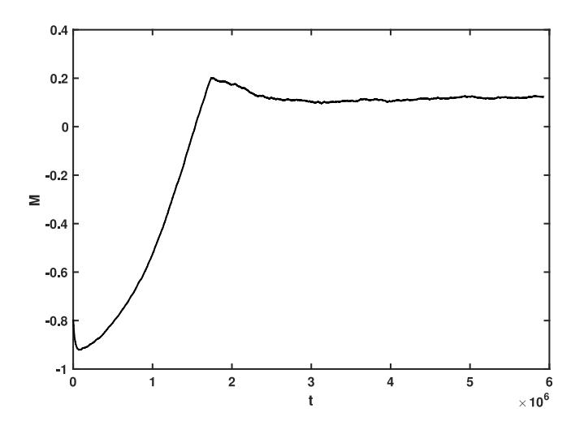
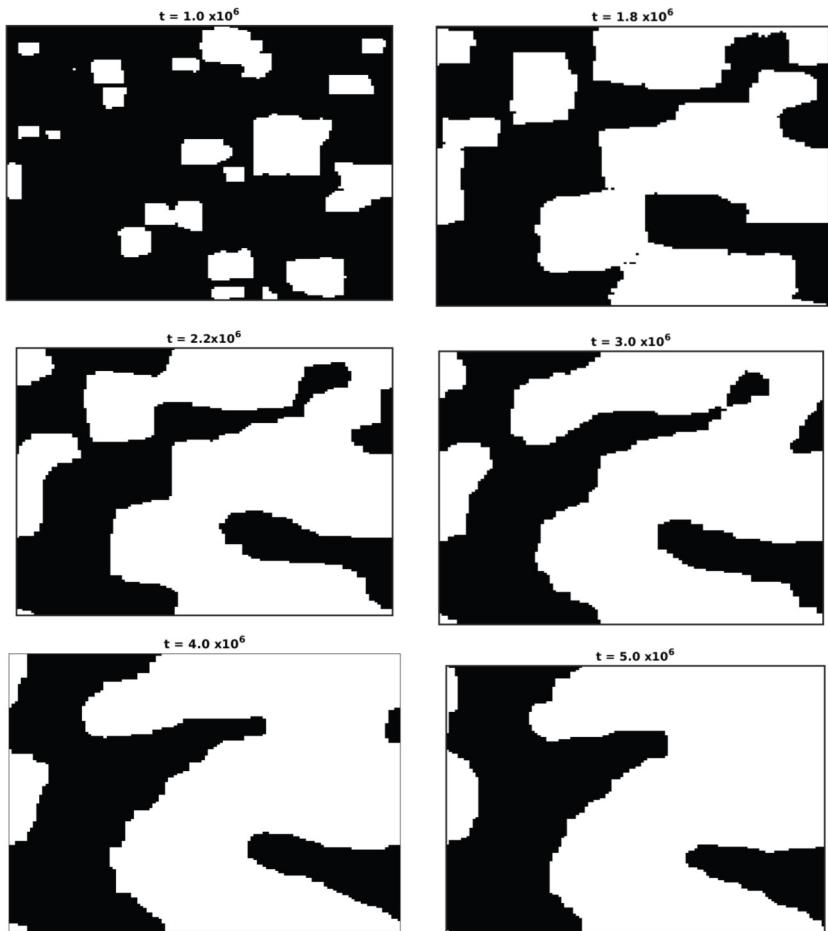
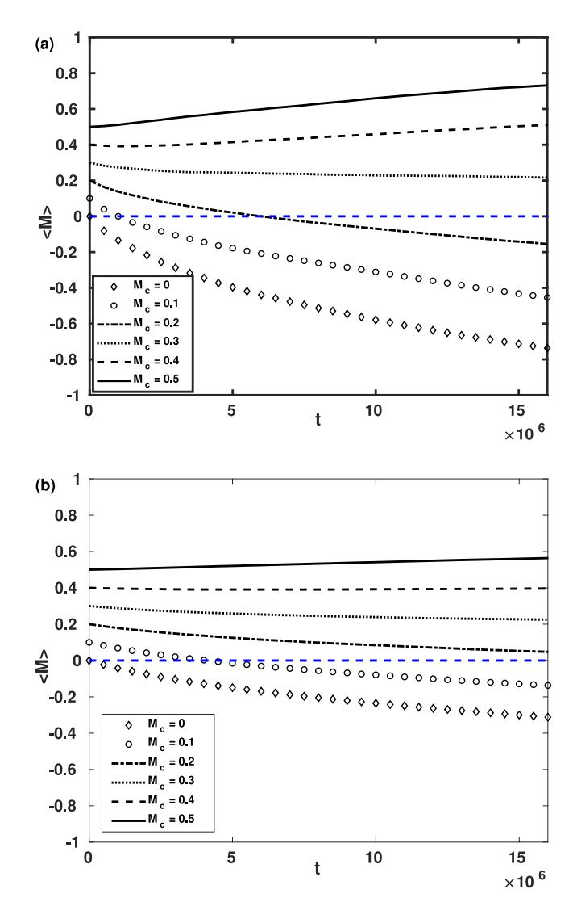
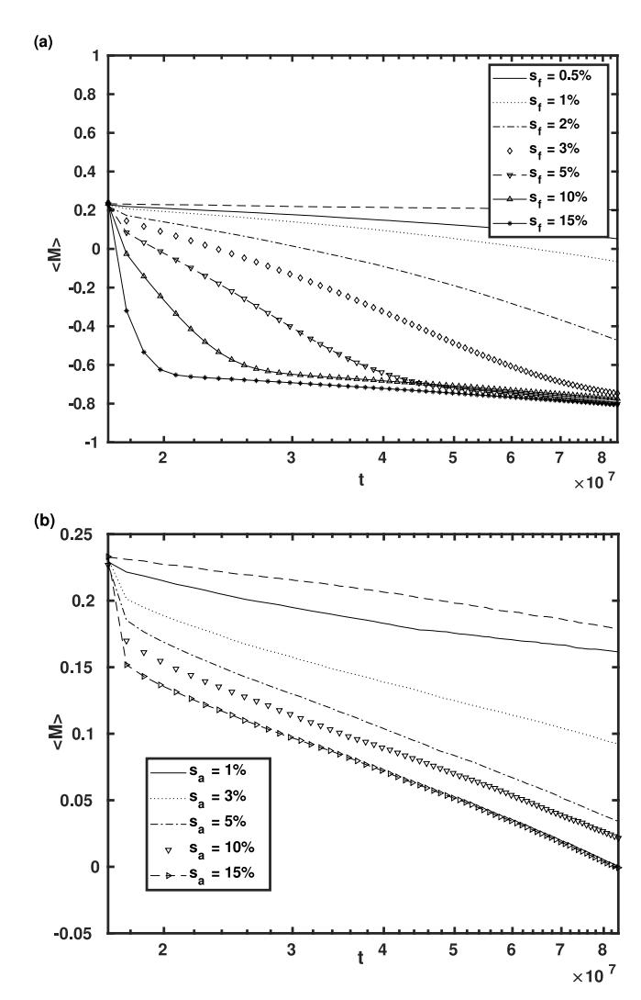
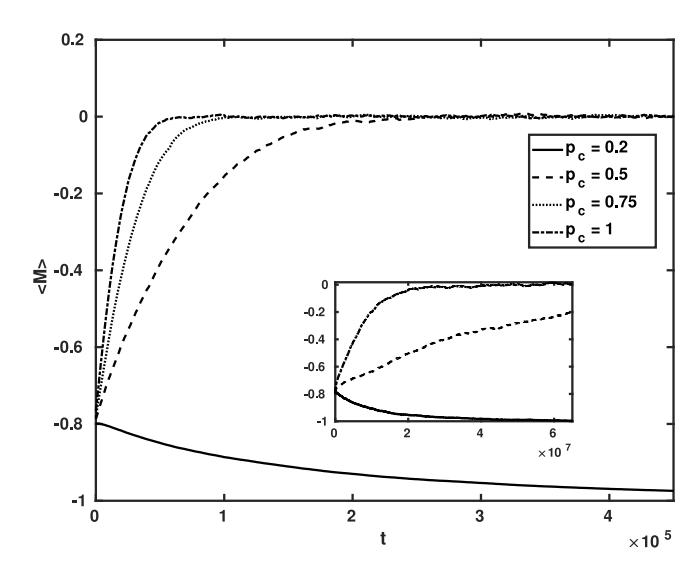
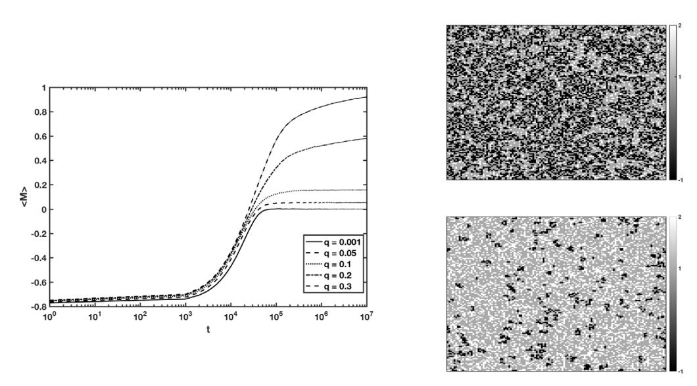
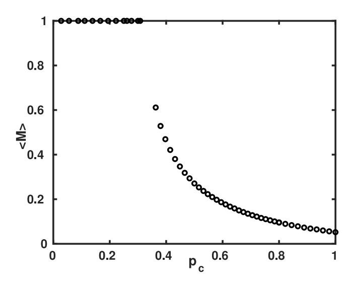
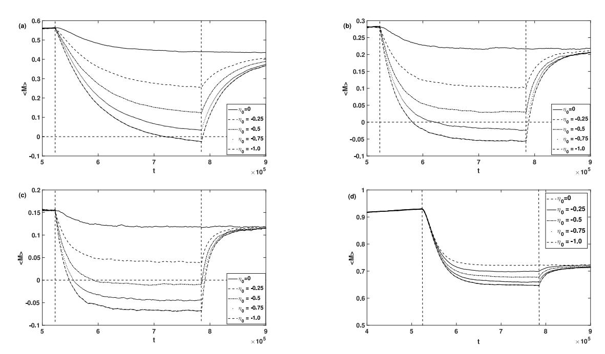

# Modeling the nonlinear effects of opinion kinematics in elections: A simple Ising model with random field based study

Mukesh Tiwari [a](#page-0-0),[∗](#page-0-1) , Xiguang Yang [b](#page-0-2) , Surajit Sen [b](#page-0-2)

a *Dhirubhai Ambani Institute of Information and Communication Technology (DA-IICT), Gandhinagar, Gujarat, India*

b *Department of Physics, State University of New York, Buffalo, NY 14260-1500, USA*

#### a r t i c l e i n f o

#### *Article history:*

Received 15 January 2021

Received in revised form 21 May 2021

Available online 21 July 2021

#### *Keywords:*

Sociophysics

Opinion dynamics

Elections

Random field Ising model

#### a b s t r a c t

Inspired by partisan competitions and contentious elections in democratic countries, we numerically explore the effect of campaign strategies and related factors on the opinion of an electorate. The nature of the electorate is modeled through agents with different behaviors, such as, being conformist, contrarian or inflexible. The agents are assumed to take discrete opinion values that depend on both internal and external influences. The inhomogeneity of external influence on individuals is modeled as a random field. Two types of electorates have been considered. In an electorate with only conformist agents short-duration high impact campaigns are highly effective. These are, however, also sensitive to perturbations at the local level modeled as inflexibles and/or absentees. In electorates with both conformist and contrarian agents and varying level of dominance due to local factors, short-term campaigns are effective only in the case of fragile dominance of a single party. Strong local dominance is relatively difficult to influence and long term campaigns with strategies aimed to impact local level politics are seen to be more effective.

© 2021 Elsevier B.V. All rights reserved.

# **1. Introduction**

Statistical physics inspired models that describe collective phenomena arising from the interaction between the constituents has been an active area of interest in disciplines outside physics, such as in social science [\[1](#page-9-0)–[4\]](#page-9-1). In the field of social science, a fundamental question that these models attempt to study and explore is that of opinion dynamics. The dynamics of opinion change can be typically modeled, as local interactions, over a 2D square lattice or large networks. The nodes of the network, or the cells in the lattice are agents whose values or attributes determine their opinion. In the simplest case, each agent has two choices which are representative of binary opinions. Some of the well-studied social interaction rules, that lead to the change in the values and reflect shaping of opinions include the voter model [\[5–](#page-9-2)[8\]](#page-9-3), in which each agent acquires the opinion of a randomly selected neighbor, majority vote model [\[9–](#page-9-4)[12](#page-9-5)] where the agent takes the opinion of the local majority and the Sznajd model [\[13](#page-9-6)] which studies the influence of a group on individual's opinion. Besides a diverse set of rules, the opinions can also be continuous [\[14,](#page-9-7)[15](#page-9-8)], or both discrete and continuous [[16\]](#page-9-9). Social impact and the role of individual's attitude in the formation of the net opinion is however a complex phenomena [[17–](#page-9-10)[20\]](#page-9-11).

In democracies, elections present a platform for people to express their opinions and hence can be considered as one of the largest experiments on the emergence of consensus (partial) and opinion formation. Elections by themselves are, however, complex processes. Recent works on elections have indeed explored through simple statistical physics models

∗ Corresponding author.

*E-mail address:* [mukesh\\_tiwari@daiict.ac.in](mailto:mukesh_tiwari@daiict.ac.in) (M. Tiwari).

the role of these complex interactions [\[21–](#page-9-12)[23](#page-9-13)]. In addition to the social structure and the interaction rules, individual preference, their intrinsic nature and the available information also play important roles in the formation of voter's choice [[24](#page-9-14)]. It is not surprising that these factors also influence the strategies of political parties.

Individual traits determine how much an individual may be influenced or can influence others. The process of opinion formation and the distribution of opinions, therefore, depend on the type of traits, such as inflexibles, or those who do not change their opinion easily [[25–](#page-9-15)[31\]](#page-9-16), contrarians [\[32–](#page-9-17)[36](#page-9-18)], whose opinion is against the local majority, influential leader or those with higher influencing ability [[37](#page-10-0)] etc.

Political environments and the opinions surrounding them are charged and fluctuating. Political parties through their campaigns, aim to take advantage of this and use media as one of the platforms to disseminate information and their position on various topics. Media therefore acquires an important position and its role and significance in opinion formation has been investigated within various models [\[38–](#page-10-1)[45](#page-10-2)].

Advances made in modes of digital communications have also made social media platforms an important channel for campaigns and communication. The structure of the information diffusion networks results in rapid dissemination of news and information. Controlling and regulating materials being posted on these platforms is not simple, resulting in spread of misinformation and fake news at an alarming rate [\[46,](#page-10-3)[47](#page-10-4)]. While the level of influence on an individual's opinion is unclear, they do affect their process of decision making [\[48\]](#page-10-5).

Given the diversity that exists within an electorate, and the complex competition between the different factors that affect decision making, it becomes important to understand their role within different social structures. Moreover, election results are mostly spot measurement of an unsettled many body system. Strategies and their timings may induce modest shift in the opinions which can change the tipping point or introduce instability [\[49](#page-10-6)–[51](#page-10-7)], thereby changing the political outcome.

With all this in the background, in this paper we study the influence of campaign strategies on different types of electorates. Our studies have been motivated by some common observations in campaign strategies, their effect on prevailing voter sentiments and the corresponding influence on regional electoral outcomes in some recent elections in democratic countries. These strategies include, extensive and aggressive use of social media, aggressive campaigning, government response in the presence of extreme background events such as COVID, issues of ethnic equality and to national security threats that may evoke a strong emotional response from the voters etc. Given the prevailing state and nature of the electorate we attempt to understand how the different factors influence the voter's choice.

The rest of the paper is laid out as follows. In Section [2](#page-1-0) we present the model and the interpretation of the different parameters that are used. In Section [3](#page-2-0) we present results of our numerical simulation. First we consider a system consisting of only conformist agents in the presence of random field. Here, we also explore the role of inflexibles and the absentees on a quasi-stationary state that results after the removal of field. We then analyze a mixed model with conformist and contrarian agents. Allowing for different levels of dominance of conformists we examine the efficacy of campaigns. Conclusions are presented at the end.

#### **2. Model**

We model a system where every agent has two choices (two party system). Their opinions represented as discrete values ±1 in this paper symbolize their support for a party. We adopt a 2D Ising spin system approach, in which the agents are modeled on a *L* × *L* lattice. Each cell in the lattice, may be assumed to be an individual or an agent, and the dynamics of opinion formation is mathematically represented as:

*H* = −∑ ⟨*i*,*j*⟩ *Jijsisj* − ∑ *i* (*hi*(*t*) + *Fi*)*si* = −∑ ⟨*i*,*j*⟩ *Jijsisj* − ∑ *i* η*i*(*t*)*si*, (1)

*Jij* is the strength of interaction of an individual with its neighbors, assumed to be limited to the nearest neighbors and same (*Jij* = *J*) for all individuals. It captures how an agent reacts to the average opinion in its surroundings. Low temperature is assumed and the effect of high temperature or noisy system, which may strongly influence the observations, has not been included in this study. An agent's decision making therefore follows a local majority rule and it adjusts its opinion on the basis of the majority opinion of its neighbors. Positive values of *J* relate to the conformist attitude of the agent, whereas, negative values, relate to the contrarian behavior. The term η*i* = *hi*(*t*) + *Fi* is a measure of internal or external factors that do not depend on the neighbors, but rather have a direct influence on the choice exercised by the individual. For example, *Fi* may be the individual's preference for a particular political party due to sharing of similar ideology, beliefs/interests or due to the effects of a pandemic such as the current COVID-19 in which we find ourselves. A strong preference would result in non-flexibility in the opinion or it being largely independent of the influence of the neighbors. The term *hi*(*t*) captures the external effects, such as, campaigns by political parties or otherwise and other external factors, such as, debates on social, economic and nationalist issues that may not directly be a part of the mainstream political campaign but in many cases can have a significant impact on the final result. As news cycle in general is short-lived, and also, the spread of information on social media, which is one of the main channels of information-dissemination, occurs rapidly, *hi*(*t*) is assumed to be of short-duration. Since, due to the difference in the intrinsic nature, individuals will respond differently to these external factors we model it as a random field [[52](#page-10-8)[,53\]](#page-10-9).

**Fig. 1.** Evolution of the opinion in the presence of a short duration field. The random field is removed once the net opinion reaches a cut-off value. The parameters are *J* = 1 and *kT* = 0.5. Initially 90% of the agents, randomly selected, have opinion value −1 and η0 = 1.5. The size of the lattice is 128 × 128.

Specifically, we consider η*i*(*t*) = η*i*θ(*t*−*t* ′ ), where the step function θ is used to model the limited duration of the influence of external effects and η*i* is assumed to be uniformly distributed between 0 and η0.

With the above mentioned assumptions Eq. [\(1\)](#page-1-1) models the collective opinion that results due to the interplay between the local neighborhood effect, personal beliefs or affiliations and the sensitivity to other external influences. It should however be noted, that these effects are not only difficult to quantify, they are also complex functions of individual attributes, characteristics, the underlying social structure which may itself be time dependent.

We would also like to point out that, while standard opinion dynamics studies the state of interest in the steady state, in the context of elections it should be the one that emerges as a result of the perturbation to the steady state. The steady state, in fact, may also be a transient state which lasts for sufficient time and comes out of extensive campaigns, discussions and debates and presence of polarizing issues.

#### **3. Results**

We present results using Monte Carlo (MC) simulations with periodic boundary conditions. Simulations have been performed on lattice of size 128 × 128, unless mentioned otherwise, using the Metropolis algorithm. In Section [3.1](#page-2-1) we first examine the response of a system with only conformist agents to external influence. We then discuss the effect of perturbations on the consensus observed. In Section [3.2](#page-5-0) we consider a modified model with both conformist and contrarian agents. Different levels of consensus due to local effects, and in the absence of external campaigns, is obtained by including inflexibles in the model. Finally, the effectiveness of the campaigns by a party is examined for different levels of local dominance of the other party.

#### *3.1. Conformist agents*

We initiate the study from the situation in which the agents are of only conformist type. This system at low temperatures and in the absence of external influence would always result in complete consensus. To examine the role of external influence in this model, we initially start the system close to its ground state and apply a random field in the direction opposite to it. As mentioned in the previous section, this field is applied only for a short duration. Specifically, the field is applied till the net opinion *M* = *N* ∑ *i si* (*N* = *L* × *L*), acquires a cut-off value, *Mc* . Beyond this, the external influence is turned off and the system is allowed to evolve only under the internal influence. Here, the value of *Mc* may be assumed to signify the support or the level of dominance of a party.

In [Fig.](#page-2-2) [1,](#page-2-2) for *Mc* equals 0.2, it can be observed that, when the field is applied, the value of the net opinion increases due to the positive bias. However, on the removal of the field the net opinion does not keep on moving along its original trajectory, but rather, is seen to change only marginally from the cut-off value over a long period of time.

[Fig.](#page-3-0) [2](#page-3-0) shows the corresponding time evolution of the agents' opinions. Application of the quenched random field results in the creation of opinion domains. Subsequently, smaller domains are seen to merge with the larger domains around them and in the process take their opinion. This results in the creation of large domains with the same opinion state. Since we apply a strong field (η0 = 1.5 in [Fig.](#page-3-0) [2](#page-3-0)) the time scale of this change is small. Removal of the field (for *t* > 2.0 × 106 ) leads to evolution of the domains at a time scale which is slower than the first part. We note in passing that our model

**Fig. 2.** Time evolution of the opinions. The values of the parameters and the initial conditions are the same as in [Fig.](#page-2-2) [1.](#page-2-2) The size of the lattice is 128 × 128.

is broadly similar to the Random Field Ising Model (RFIM) [\[54–](#page-10-10)[61](#page-10-11)] except that the role of the time dependent field and the rapidly changing magnetization due to the same constitute the main focus of this work which is different from the RFIM problem.

The situation shown in [Figs.](#page-2-2) [1](#page-2-2) and [2](#page-3-0) represent a particular case. The stability of these domains depend on the state of the system when the field is removed and in some instances the quasi-stationary domains are not as long-lived as in the other cases. In [Fig.](#page-4-0) [3,](#page-4-0) we therefore look at the average behavior (⟨*M*⟩) for different cutoff values of *M* (*Mc* ). We indeed observe, that the net opinion changes slowly over the first few time decades. However, even for positive cut-off value, the system might ultimately approach an overall negative majority state. The important aspect here is that the interplay between external influence having different effect on different agents and the local majority rule leads to the formation of opinion clusters that change slowly in time. In situations in which the external bias is strong they can tilt the balance of opinions. We also conjecture that this effect is similar to the role of prejudice studied extensively by Galam et al. [[49](#page-10-6)].

# *3.1.1. Effect of perturbations*

Assuming that these opinion domains are the prevalent state of the system, we ask the question how susceptible they are to perturbations. We show in [Fig.](#page-5-1) [4](#page-5-1) two possible perturbations: flipped and pinned ([Fig.](#page-5-1) [4](#page-5-1)(a)) and absent opinions [\(Fig.](#page-5-1) [4](#page-5-1)(b)). While the effectiveness of the perturbations will depend on the value of *Mc* , we choose the value as 0.3. As is observed in [Fig.](#page-4-0) [3\(](#page-4-0)a), for this cut-off value, ⟨*M*⟩ remains almost constant for significant time after the field is removed. It allows us to clearly examine the effect of introducing perturbations in the system. For simplicity, the perturbation is only introduced in the largest domain. It is also ensured that these perturbations do not drop ⟨*M*⟩ below zero. In the first case, the opinion of a small percentage of randomly selected agents in the largest domain are flipped *permanently*. This is tantamount to them not only changing allegiance but also propagating their ideas to their neighbors, playing the role of minority inflexibles. This creates a local polarizing effect and the domain's stability is affected even when a small fraction of such agents are present. The location of the inflexible agents act as centers propagating the opposite opinion. With

**Fig. 3.** Average behavior of the opinion after the quenched field is removed for (a) 128 × 128 and (b) 256 × 256 sized lattice. The different cutoff values of net opinion *Mc* are 0, 0.1, 0.2, 0.3 , 0.4 and 0.5, respectively. The ensemble average here is over 100 realizations. The values of the parameters and the initial conditions are the same as in [Fig.](#page-2-2) [1](#page-2-2).

**Table 1** Key parameters in the model with only conformist agents.

regard to the time-dependent properties of the system, this behavior ensues because of the energetic interplay between the domain walls of the two regions. The attempt of the second domain to influence, is energetically supported by the inflexibles introduced within the first domain. Increasing the number of inflexibles accelerates the process. In the second situation, a percentage of randomly selected agents (*sa*) in the largest domain do not participate. We change their opinion value to 0. This creates a weaker local majority around the absentee agents allowing the second domain to slowly take over the larger domain. This process is, however, significantly slower than the one due to the introduction of inflexibles. The different parameters used in this section and their interpretation is also provided in [Table](#page-4-1) [1](#page-4-1).

**Fig. 4.** Average behavior of the opinion when (a) the representation of a percentage of the opinions in the largest domain (*sf* ) is flipped and pinned (b) the representation of a percentage of the opinions in the largest domain (*sa*) is absent. The dashed line in both figures show the change in net opinion if the system was allowed to evolve freely. *L* = 256 and the ensemble average is over 100 runs, *Mc* = 0.3 and the values of the parameters and the initial conditions are the same as in [Fig.](#page-2-2) [1.](#page-2-2)

#### *3.2. Conformist and contrarian agents*

Any electorate, in general, is a composite system, consisting of many heterogeneous components or individuals interacting with each other. The assumption of the previous sections in which all agents were only of conformist type is rather stringent. In this section, we consider a mixed model by including the possibility of the opinion values of the agents to be opposite that of the local majority, i.e., an agent can also be a contrarian.

The contrarian effect is incorporated in the model by introducing the notion of strong and weak local majority of the opinions. If the local majority is strong, then the agent will always behave as a conformist, whereas, if the local majority is weak, the agent will not necessarily conform with the local majority opinion. We assume that the condition for strong local majority is | ∑ *sj* | > 2, where the sum is over the opinion values of all the nearest neighbors of the agent. With this assumption, strong local majority in the Ising spin system with opinion values ±1 is the special case when all neighbors share the same opinion. When the local majority is weak, we define a probability *pc* , such that, the agent will be a contrarian with probability *pc* .

Even though the contrarian dynamics is activated only in the case of a weak local majority, as shown in [Fig.](#page-6-0) [5,](#page-6-0) two different steady state behaviors are possible in the absence of any external campaigns. Starting from the initial state in which most of the agents have opinion value of −1, we observe that for small values of *pc* the outcome is complete consensus, while larger values of *pc* results in ⟨*M*⟩ ∼ 0. As the contrarian effect becomes stronger the agents are unable

**Fig. 5.** Average opinion for different *pc* values: 0.2 (solid line), 0.5 (dashed line), 0.75 (dotted line) and 1 (dashed dotted line). The inset shows the average opinion for *pc* values 0.256 (solid line), 0.26 (dashed line) and 0.267 (dashed − dotted line). The ensemble average is over 100 realizations and the values of other parameters and the initial conditions are the same as in [Fig.](#page-2-2) [1](#page-2-2).

**Table 2**

Parameters in the model with both contrarian and conformist agents and varying level of consensus.

to come to any consensus and the opinions are randomly distributed. The parameter *pc* , therefore, acts locally as a social conformity parameter, whose different values can result in one of the two possible states of the system dynamics.

# *3.2.1. Dynamics with different levels of dominance*

Demographically and culturally varying regions often have different levels of dominance of a single party. In regions with strong local dominance of a single party there is a larger level of consensus (|⟨*M*⟩| ≫ 0), whereas, regions with weak local dominance have lesser possibility of consensus (|⟨*M*⟩| ≈ 0). Different levels of dominance of a party are incorporated in the model by including inflexible agents with a higher level of influence, or, a higher opinion value in favor of that party. These inflexible agents can be thought to represent a variety of possible factors, such as, strong local issues or events, demographic dividends-related factors, locally influential leaders etc., that rally the local opinion around them. These agents, therefore, act to create a strong local majority or a conformist dominance in their neighborhood. Assuming a larger opinion weight (a value of 2 is assumed here), makes it more probable for strong local majority condition to be satisfied for all agents in the neighborhood of an inflexible agent. We denote by *q* the fraction of inflexible agents. All other rules remain unchanged. Also, since our interest is in the effect induced by the inflexibles, we do not include their opinion values in the calculation of ⟨*M*⟩.

The two parameters in the model, *q* and *pc* create opposite effects as their values increase, resulting in higher similarity and dissimilarity of opinions, respectively (see also [Table](#page-6-1) [2](#page-6-1)). [Figs.](#page-7-0) [6](#page-7-0) and [7](#page-7-1) show the result of the interplay between the two parameters. In [Fig.](#page-7-0) [6](#page-7-0) we show the evolution of ⟨*M*⟩ for different *q* values in the extreme case of *pc* = 1. Smaller values of *q* results in a weak level of consensus, whereas, as the number of inflexibles increases they create a local binding of the conformist opinion leading to the emergence of strong consensus. These two different situations can also be observed in the distribution of opinions of the agents in [Fig.](#page-7-0) [6](#page-7-0) (right). As the fraction of inflexible agents increases (*q* = 0.3 in [Fig.](#page-7-0) [6](#page-7-0)), we obtain a more homogeneous distribution of opinions in the steady state, while smaller values result in largely a random distribution of opinions. In [Fig.](#page-7-1) [7,](#page-7-1) we show the role of contrarians in the presence of small number of inflexibles. In the absence of contrarian agents, a complete consensus along the opinion of the inflexibles emerge. However, complete consensus is no longer observed as the contrarian behavior increases. Beyond a point, ⟨*M*⟩ experiences a rapid decline and takes values close to 0 in the limit *pc* → 1. The rapid change in ⟨*M*⟩ observed here is present for values of *q* for which ⟨*M*⟩ is less than 1 in the limit *pc* → 1. The level of consensus obtained, however, also depends on the value of *q*.

Campaign strategies and their effectiveness would depend on the level of local dominance of a party. In [Fig.](#page-8-0) [8](#page-8-0), we examine the influence of campaigns in the model. The campaign effect is modeled as a random field applied over a

**Fig. 6.** (Left) Average behavior of the opinion for different values of the fraction of inflexibles *q*. The ensemble average is over 100 realizations, *pc* = 1 and the values of other parameters and the initial conditions are the same as in [Fig.](#page-2-2) [1](#page-2-2). (Right) The state of the system for *q* = 0.1 (top) and *q* = 0.3 (bottom).

**Fig. 7.** Change in the steady state value of average opinion ⟨*M*⟩ as a function of social conformity parameter *pc* . The average is over 100 realizations, *q* = 0.05 and the values of the other parameters and the initial conditions are the same as in [Fig.](#page-2-2) [1](#page-2-2).

limited time. Apart from directly influencing the individuals we also assume that the campaigns would weaken the local dominance. While the campaign runs, we allow 10% of the inflexible agents to change their state from +2 to −2. A small perturbation is introduced here, since in normal circumstances we do not expect such effects to be strong. Inflexible agents on changing their state, remain inflexible, so that they create a similar but opposite effect as the inflexibles with positive opinion value. As can be observed in [Figs.](#page-8-0) [8\(](#page-8-0)a)–(c) campaigns are more effective when the total number of inflexibles is small and the contrarian effect is strong. If the number of inflexibles are large or there is a strong local dominance of a party, a strong contrarian effect alone is not sufficient to support the effectiveness of the campaigns ([Figs.](#page-8-0) [8](#page-8-0) (d)). A much stronger effect, such as the presence of extreme events, like mass unrest, drastic and catastrophic events (COVID management, economic collapse) etc., would evoke a more emotional response from the electorate. Such situations can lead to the weakening of even a strong dominance. In the model, this would imply a larger fraction of inflexibles changing their state, that either weakens their local influence, or, creates an opposite local influence which occurs for instance when locally influential leaders change their allegiance. This also forms a part of the long term strategies of political parties, when to reduce the local dominance they attempt to lure strong leaders from the rival party with more centrist views into their fold. Aggressive campaigning is more effective in such situations.

**Fig. 8.** Effect of campaigns for *q* = 0.1 and *pc* equals (a) 0.5, (b) 0.75 and (c) 1. In (d) *q* = 0.4, and *pc* = 1. The vertical dashed lines show the duration for which the field is applied. η0 is the maximum value of the random field. Approximately 10% of the inflexible agents are allowed to change their state when the field is applied. For η0 = 0 no external field is applied, but the inflexible agents are allowed to change their state during this time duration. *M* is averaged over 100 realizations and the values of other parameters and the initial conditions are the same as in [Fig.](#page-2-2) [1](#page-2-2).

#### **4. Conclusion**

In this paper, through models of opinion dynamics, we have qualitatively studied the effect of campaign and strategies on the opinion of an electorate. The different scenarios considered here are inspired by what is observed in real populations as they face competitive regional elections. Two main factors that can play a role in shaping of opinions, local and external influence have been considered. At the local level, the prevailing situation is modeled through the nearest neighbor interaction of agents of different types: conformist, contrarian or inflexible. External factors such as campaigns which can have different levels of influence on individuals and are effective over a limited time are modeled as a short duration quenched random field.

In the first model, an electorate with only conformist agents is considered. Varying levels of external influence on individuals result in the formation of opinion clusters that persists even after the removal of external influence. The stability of the prevalent state is examined by introducing perturbations in the largest opinion cluster. Two possible perturbations, modeled as inflexible and absentee agents are considered and both result in a shift of the opinion. The time-scale at which the shift occurs is dependent both on the strength as well as the nature of the perturbation.

In the second model, a mixed system consisting of both conformist and contrarian agents is analyzed. The contrarian behavior is in relation to the local majority. In the absence of any external campaigns two opinion states are possible: complete consensus or random distribution of opinions. Different levels of local dominance of a party is modeled by including inflexible agents with a higher opinion weight. These inflexible agents represent more general situations at the local level. The effectiveness of campaigns apart from maneuvering individual opinion also depend on how successfully strategies can effect the dominance of a party. The threshold for bringing in the change is lower when the dominance is not large and there is less social conformity or large *pc* . For such electorates, late stage rigorous campaigns and introduction of influential figures can be a part of effective campaign strategy. Regions with strong local dominance are, however, difficult to be influenced by aggressive campaigns alone. A much stronger impulse, such as the ones in the presence of extreme events, is usually needed to change the prevalent state in such electorates.

While real social systems in general are complex and difficult to analyze, we believe that the simple nature of the model considered here would allow a better understanding of the competition between the different mechanisms and strategies that influence decision making within an electorate.

# **CRediT authorship contribution statement**

**Mukesh Tiwari:** Conceptualization, Methodology, Software, Investigation, Writing – original draft, Writing – review & editing. **Xiguang Yang:** Software, Investigation. **Surajit Sen:** Conceptualization, Methodology, Writing – original draft, Writing – review & editing.

# **Declaration of competing interest**

The authors declare that they have no known competing financial interests or personal relationships that could have appeared to influence the work reported in this paper.

## **Acknowledgment**

The authors would like to thank Prof. Jacob Neiheisel for pointing out the relevance of this work to partisan competition.

#### **References**

[1] M. Lewenstein, A. Nowak, B. Latané, Statistical mechanics of social impact, Phys. Rev. A 45 (1992) 763–776, [http://dx.doi.org/10.1103/PhysRevA.](http://dx.doi.org/10.1103/PhysRevA.45.763) [45.763](http://dx.doi.org/10.1103/PhysRevA.45.763). [2] C. Castellano, S. Fortunato, V. Loreto, Statistical physics of social dynamics, Rev. Modern Phys. 81 (2009) 591–646, [http://dx.doi.org/10.1103/](http://dx.doi.org/10.1103/RevModPhys.81.591) [RevModPhys.81.591](http://dx.doi.org/10.1103/RevModPhys.81.591). [3] [S. Galam, Sociophysics: A Physicist's Modeling of Psycho-Political Phenomena, Springer, New York, 2012.](http://refhub.elsevier.com/S0378-4371(21)00560-4/sb3) [4] [P. Sen, B.K. Chakrabarti, Sociophysics: An Introduction, OUP Oxford, 2013.](http://refhub.elsevier.com/S0378-4371(21)00560-4/sb4) [5] P. Clifford, A. Sudbury, A model for spatial conflict, Biometrika 60 (3) (1973) 581–588, [http://dx.doi.org/10.1093/biomet/60.3.581.](http://dx.doi.org/10.1093/biomet/60.3.581) [6] R.A. Holley, T.M. Liggett, Ergodic theorems for weakly interacting infinite systems and the voter model, Ann. Probab. 3 (4) (1975) 643–663, <http://dx.doi.org/10.1214/aop/1176996306>. [7] S. Redner, Reality-inspired voter models: A mini-review, C. R. Phys. 20 (4) (2019) 275–292, <http://dx.doi.org/10.1016/j.crhy.2019.05.004>. [8] C. Castellano, M.A. Muñoz, R. Pastor-Satorras, Nonlinear *q*-voter model, Phys. Rev. E 80 (2009) 041129, [http://dx.doi.org/10.1103/PhysRevE.80.](http://dx.doi.org/10.1103/PhysRevE.80.041129) [041129.](http://dx.doi.org/10.1103/PhysRevE.80.041129) [9] C. Tsallis, A majority rule model — New finite size scaling, J. Magn. Magn. Mater. 31–34 (1983) 1259–1260, [http://dx.doi.org/10.1016/0304-](http://dx.doi.org/10.1016/0304-8853(83)90889-2) [8853\(83\)90889-2.](http://dx.doi.org/10.1016/0304-8853(83)90889-2) [10] S. Galam, Application of statistical physics to politics, Physica A 274 (1999) 132–139, [http://dx.doi.org/10.1016/S0378-4371\(99\)00320-9.](http://dx.doi.org/10.1016/S0378-4371(99)00320-9) [11] P.L. Krapivsky, S. Redner, Dynamics of majority rule in two-state interacting spin systems, Phys. Rev. Lett. 90 (2003) 238701, [http://dx.doi.org/](http://dx.doi.org/10.1103/PhysRevLett.90.238701) [10.1103/PhysRevLett.90.238701.](http://dx.doi.org/10.1103/PhysRevLett.90.238701) [12] S. Galam, Sociophysics: A review of Galam models, Internat. J. Modern Phys. C 19 (03) (2008) 409–440, [http://dx.doi.org/10.1142/](http://dx.doi.org/10.1142/S0129183108012297) [S0129183108012297.](http://dx.doi.org/10.1142/S0129183108012297) [13] K. Sznajd-Weron, J. Sznajd, Opinion evolution in closed community, Internat. J. Modern Phys. C 11 (06) (2000) 1157–1165, [http://dx.doi.org/](http://dx.doi.org/10.1142/S0129183100000936) [10.1142/S0129183100000936](http://dx.doi.org/10.1142/S0129183100000936). [14] G. Deffuant, D. Neau, F. Amblard, G. Weisbuch, Mixing beliefs among interacting agents, Adv. Complex Syst. 3 (01n04) (2000) 87–98, <http://dx.doi.org/10.1142/S0219525900000078>. [15] [R. Hegselmann, U. Krause, Opinion dynamics and bounded confidence models, analysis, and simulation, J. Artif. Soc. Soc. Simul. 5 \(3\) \(2002\).](http://refhub.elsevier.com/S0378-4371(21)00560-4/sb15) [16] A.C. Martins, Continuous opinions and discrete actions in opinion dynamics problems, Internat. J. Modern Phys. C 19 (04) (2008) 617–624, <http://dx.doi.org/10.1142/S0129183108012339>. [17] S. Moscovici, et al., Toward a theory of conversion behavior, Adv. Exp. Soc. Psychol. 13 (1980) 209–239, [http://dx.doi.org/10.1016/S0065-](http://dx.doi.org/10.1016/S0065-2601(08)60133-1) [2601\(08\)60133-1.](http://dx.doi.org/10.1016/S0065-2601(08)60133-1) [18] B. Latané, The psychology of social impact, Am. Psychol. 36 (4) (1981) 343, <http://dx.doi.org/10.1037/0003-066X.36.4.343>. [19] B. Latané, S. Wolf, The social impact of majorities and minorities, Psychol. Rev. 88 (5) (1981) 438, <http://dx.doi.org/10.1037/0033-295X.88.5.438>. [20] A. Nowak, J. Szamrej, B. Latané, From private attitude to public opinion: A dynamic theory of social impact, Psychol. Rev. 97 (3) (1990) 362, [http://dx.doi.org/10.1037/0033-295X.97.3.362.](http://dx.doi.org/10.1037/0033-295X.97.3.362) [21] A.T. Bernardes, D. Stauffer, J. Kertész, Election results and the Sznajd model on Barabasi network, Eur. Phys. J. B 25 (1) (2002) 123–127, <http://dx.doi.org/10.1140/e10051-002-0013-y>. [22] S. Fortunato, C. Castellano, Scaling and universality in proportional elections, Phys. Rev. Lett. 99 (13) (2007) 138701, [http://dx.doi.org/10.1103/](http://dx.doi.org/10.1103/PhysRevLett.99.138701) [PhysRevLett.99.138701.](http://dx.doi.org/10.1103/PhysRevLett.99.138701) [23] L. Araripe, R. Costa Filho, Role of parties in the vote distribution of proportional elections, Physica A 388 (19) (2009) 4167–4170, [http:](http://dx.doi.org/10.1016/j.physa.2009.06.023) [//dx.doi.org/10.1016/j.physa.2009.06.023.](http://dx.doi.org/10.1016/j.physa.2009.06.023) [24] M. Galesic, D.L. Stein, Statistical physics models of belief dynamics: Theory and empirical tests, Physica A 519 (2019) 275–294, [http:](http://dx.doi.org/10.1016/j.physa.2018.12.011) [//dx.doi.org/10.1016/j.physa.2018.12.011.](http://dx.doi.org/10.1016/j.physa.2018.12.011) [25] S. Galam, Minority opinion spreading in random geometry, Eur. Phys. J. B 25 (4) (2002) 403–406, [http://dx.doi.org/10.1140/epjb/e20020045.](http://dx.doi.org/10.1140/epjb/e20020045) [26] M. Mobilia, Does a single zealot affect an infinite group of voters? Phys. Rev. Lett. 91 (2003) 028701, [http://dx.doi.org/10.1103/PhysRevLett.91.](http://dx.doi.org/10.1103/PhysRevLett.91.028701) [028701.](http://dx.doi.org/10.1103/PhysRevLett.91.028701) [27] S. Galam, F. Jacobs, The role of inflexible minorities in the breaking of democratic opinion dynamics, Physica A 381 (2007) 366–376, <http://dx.doi.org/10.1016/j.physa.2007.03.034>. [28] J. Xie, S. Sreenivasan, G. Korniss, W. Zhang, C. Lim, B.K. Szymanski, Social consensus through the influence of committed minorities, Phys. Rev. E 84 (1) (2011) 011130, [http://dx.doi.org/10.1103/physreve.84.011130.](http://dx.doi.org/10.1103/physreve.84.011130) [29] S. Biswas, P. Sen, Model of binary opinion dynamics: Coarsening and effect of disorder, Phys. Rev. E 80 (2009) 027101, [http://dx.doi.org/10.](http://dx.doi.org/10.1103/PhysRevE.80.027101) [1103/PhysRevE.80.027101](http://dx.doi.org/10.1103/PhysRevE.80.027101). [30] M. Mobilia, Nonlinear q-voter model with inflexible zealots, Phys. Rev. E 92 (1) (2015) 012803, <http://dx.doi.org/10.1103/PhysRevE.92.012803>. [31] A. Mellor, M. Mobilia, R.K.P. Zia, Heterogeneous out-of-equilibrium nonlinear *q*-voter model with zealotry, Phys. Rev. E 95 (2017) 012104, <http://dx.doi.org/10.1103/PhysRevE.95.012104>. [32] S. Galam, Contrarian deterministic effects on opinion dynamics:''the hung elections scenario'', Physica A 333 (2004) 453–460, [http://dx.doi.org/](http://dx.doi.org/10.1016/j.physa.2003.10.041) [10.1016/j.physa.2003.10.041](http://dx.doi.org/10.1016/j.physa.2003.10.041). [33] S.D. Yi, S.K. Baek, C.-P. Zhu, B.J. Kim, Phase transition in a coevolving network of conformist and contrarian voters, Phys. Rev. E 87 (2013) 012806, [http://dx.doi.org/10.1103/PhysRevE.87.012806.](http://dx.doi.org/10.1103/PhysRevE.87.012806) [34] N. Crokidakis, V.H. Blanco, C. Anteneodo, Impact of contrarians and intransigents in a kinetic model of opinion dynamics, Phys. Rev. E 89 (2014) 013310, [http://dx.doi.org/10.1103/PhysRevE.89.013310.](http://dx.doi.org/10.1103/PhysRevE.89.013310) [35] A.R. Vieira, C. Anteneodo, N. Crokidakis, Consequences of nonconformist behaviors in a continuous opinion model, J. Stat. Mech. Theory Exp. 2016 (2) (2016) 023204, <http://dx.doi.org/10.1088/1742-5468/2016/02/023204>. [36] J.P. Gambaro, N. Crokidakis, The influence of contrarians in the dynamics of opinion formation, Physica A 486 (2017) 465–472, [http:](http://dx.doi.org/10.1016/j.physa.2017.05.040) [//dx.doi.org/10.1016/j.physa.2017.05.040.](http://dx.doi.org/10.1016/j.physa.2017.05.040)

- [37] A.L. Vilela, H.E. Stanley, Effect of strong opinions on the dynamics of the majority-vote model, Sci. Rep. 8 (1) (2018) 1–8, [http://dx.doi.org/10.](http://dx.doi.org/10.1038/s41598-018-26919-y) [1038/s41598-018-26919-y](http://dx.doi.org/10.1038/s41598-018-26919-y). [38] N. Crokidakis, Effects of mass media on opinion spreading in the Sznajd sociophysics model, Physica A 391 (4) (2012) 1729–1734, [http:](http://dx.doi.org/10.1016/j.physa.2011.11.038) [//dx.doi.org/10.1016/j.physa.2011.11.038.](http://dx.doi.org/10.1016/j.physa.2011.11.038) [39] N. Crokidakis, Role of noise and agents' convictions on opinion spreading in a three-state voter-like model, J. Stat. Mech. Theory Exp. 2013
- (07) (2013) P07008, <http://dx.doi.org/10.1088/1742-5468/2013/07/p07008>. [40] F. Colaiori, C. Castellano, Interplay between media and social influence in the collective behavior of opinion dynamics, Phys. Rev. E 92 (4) (2015) 042815, [http://dx.doi.org/10.1103/PhysRevE.92.042815.](http://dx.doi.org/10.1103/PhysRevE.92.042815) [41] F. Colaiori, C. Castellano, Interplay between media and social influence in the collective behavior of opinion dynamics, Phys. Rev. E 92 (2015) 042815, [http://dx.doi.org/10.1103/PhysRevE.92.042815.](http://dx.doi.org/10.1103/PhysRevE.92.042815) [42] A. Sîrbu, V. Loreto, V.D. Servedio, F. Tria, Opinion dynamics: models, extensions and external effects, in: Participatory Sensing, Opinions and Collective Awareness, Springer, 2017, pp. 363–401, [http://dx.doi.org/10.1007/978-3-319-25658-0\\_17.](http://dx.doi.org/10.1007/978-3-319-25658-0_17) [43] S. Pinto, F. Albanese, C.O. Dorso, P. Balenzuela, Quantifying time-dependent Media Agenda and public opinion by topic modeling, Physica A 524 (2019) 614–624, [http://dx.doi.org/10.1016/j.physa.2019.04.108.](http://dx.doi.org/10.1016/j.physa.2019.04.108) [44] F. Freitas, A.R. Vieira, C. Anteneodo, Imperfect bifurcations in opinion dynamics under external fields, J. Stat. Mech. Theory Exp. 2020 (2) (2020) 024002, [http://dx.doi.org/10.1088/1742-5468/ab6848.](http://dx.doi.org/10.1088/1742-5468/ab6848) [45] J. Civitarese, External fields, independence, and disorder in *q*-voter models, Phys. Rev. E 103 (2021) 012303, [http://dx.doi.org/10.1103/PhysRevE.](http://dx.doi.org/10.1103/PhysRevE.103.012303) [103.012303.](http://dx.doi.org/10.1103/PhysRevE.103.012303) [46] C.A. Davis, O. Varol, E. Ferrara, A. Flammini, F. Menczer, Botornot: A system to evaluate social bots, in: Proceedings of the 25th International Conference Companion on World Wide Web, 2016, pp. 273–274. [47] S. Vosoughi, D. Roy, S. Aral, The spread of true and false news online, Science 359 (6380) (2018) 1146–1151, [http://dx.doi.org/10.1126/science.](http://dx.doi.org/10.1126/science.aap9559) [aap9559.](http://dx.doi.org/10.1126/science.aap9559) [48] P.T. Metaxas, E. Mustafaraj, Social media and the elections, Science 338 (6106) (2012) 472–473, [http://dx.doi.org/10.1126/science.1230456.](http://dx.doi.org/10.1126/science.1230456) [49] S. Galam, The trump phenomenon: An explanation from sociophysics, Internat. J. Modern Phys. B 31 (10) (2017) 1742015, [http://dx.doi.org/](http://dx.doi.org/10.1142/S0217979217420152) [10.1142/S0217979217420152](http://dx.doi.org/10.1142/S0217979217420152). [50] A.F. Siegenfeld, Y. Bar-Yam, Negative representation and instability in democratic elections, Nat. Phys. 16 (2) (2020) 186–190, [http://dx.doi.org/](http://dx.doi.org/10.1038/s41567-019-0739-6) [10.1038/s41567-019-0739-6](http://dx.doi.org/10.1038/s41567-019-0739-6). [51] D. Sabin-Miller, D.M. Abrams, When pull turns to shove: A continuous-time model for opinion dynamics, Phys. Rev. Res. 2 (2020) 043001, <http://dx.doi.org/10.1103/PhysRevResearch.2.043001>. [52] S. Galam, S. Moscovici, Towards a theory of collective phenomena: Consensus and attitude changes in groups, Eur. J. Soc. Psychol. 21 (1) (1991) 49–74, <http://dx.doi.org/10.1002/ejsp.2420210105>. [53] S. Galam, Rational group decision making: A random field ising model at T = 0, Physica A 238 (1) (1997) 66–80, [http://dx.doi.org/10.1016/S0378-](http://dx.doi.org/10.1016/S0378-4371(96)00456-6) [4371\(96\)00456-6.](http://dx.doi.org/10.1016/S0378-4371(96)00456-6) [54] Y. Imry, S.-k. Ma, Random-field instability of the ordered state of continuous symmetry, Phys. Rev. Lett. 35 (21) (1975) 1399, [http:](http://dx.doi.org/10.1103/PhysRevLett.35.1399) [//dx.doi.org/10.1103/PhysRevLett.35.1399](http://dx.doi.org/10.1103/PhysRevLett.35.1399). [55] D.S. Fisher, P. Le Doussal, C. Monthus, Nonequilibrium dynamics of random field ising spin chains: Exact results via real space renormalization group, Phys. Rev. E 64 (2001) 066107, <http://dx.doi.org/10.1103/PhysRevE.64.066107>. [56] S. Sinha, P.K. Mandal, Dynamical properties of random-field ising model, Phys. Rev. E 87 (2) (2013) 022121, [http://dx.doi.org/10.1103/PhysRevE.](http://dx.doi.org/10.1103/PhysRevE.87.022121) [87.022121.](http://dx.doi.org/10.1103/PhysRevE.87.022121) [57] N.G. Fytas, V. Martín-Mayor, Universality in the three-dimensional random-field Ising model, Phys. Rev. Lett. 110 (2013) 227201, [http:](http://dx.doi.org/10.1103/PhysRevLett.110.227201) [//dx.doi.org/10.1103/PhysRevLett.110.227201.](http://dx.doi.org/10.1103/PhysRevLett.110.227201) [58] N.G. Fytas, V. Martín-Mayor, Efficient numerical methods for the random-field Ising model: Finite-size scaling, reweighting extrapolation, and computation of response functions, Phys. Rev. E 93 (2016) 063308, [http://dx.doi.org/10.1103/PhysRevE.93.063308.](http://dx.doi.org/10.1103/PhysRevE.93.063308) [59] N.G. Fytas, V. Martín-Mayor, M. Picco, N. Sourlas, Restoration of dimensional reduction in the random-field Ising model at five dimensions, Phys. Rev. E 95 (2017) 042117, [http://dx.doi.org/10.1103/PhysRevE.95.042117.](http://dx.doi.org/10.1103/PhysRevE.95.042117) [60] N.G. Fytas, V. Martín-Mayor, M. Picco, N. Sourlas, Review of recent developments in the random-field Ising model, J. Stat. Phys. 172 (2) (2018) 665–672, <http://dx.doi.org/10.1007/s10955-018-1955-7>. [61] N.G. Fytas, V. Martín-Mayor, G. Parisi, M. Picco, N. Sourlas, Evidence for supersymmetry in the random-field Ising model at *D* = 5, Phys. Rev. Lett. 122 (2019) 240603, [http://dx.doi.org/10.1103/PhysRevLett.122.240603.](http://dx.doi.org/10.1103/PhysRevLett.122.240603)